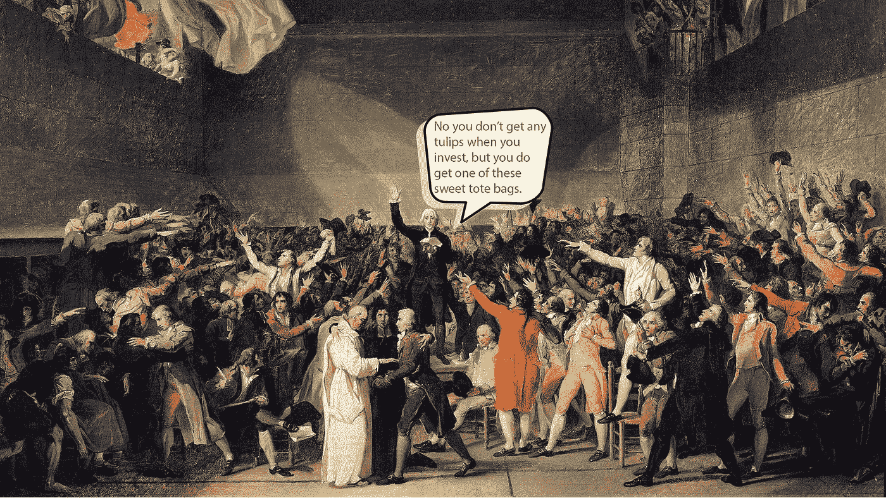
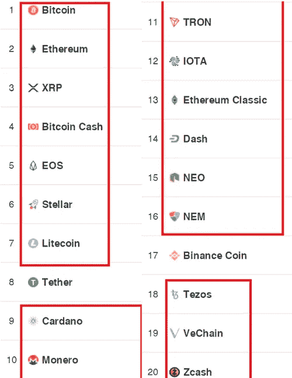
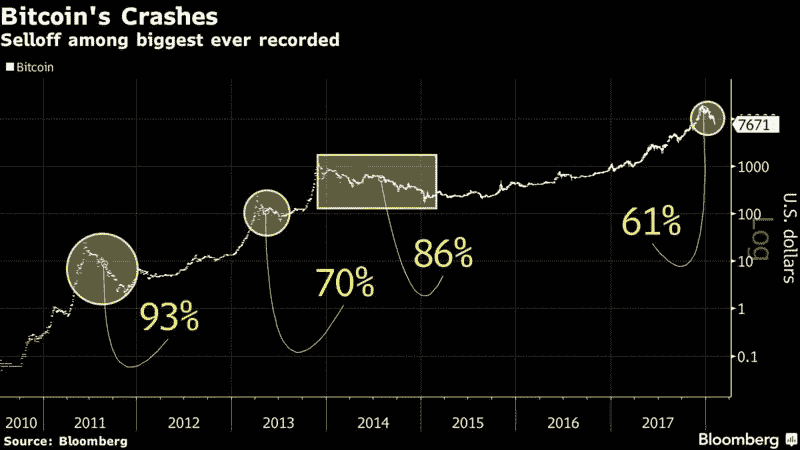
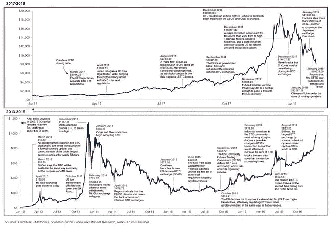
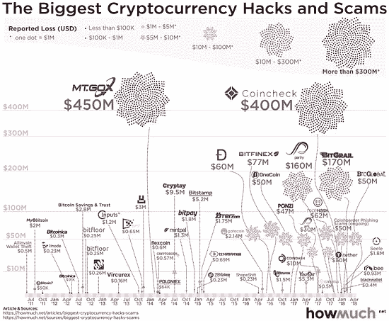
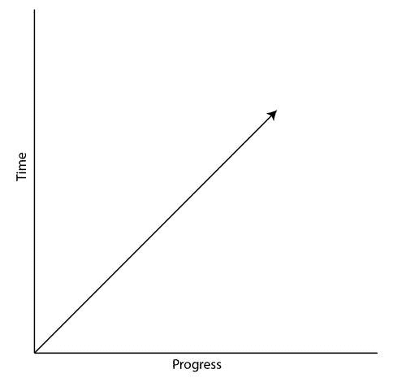
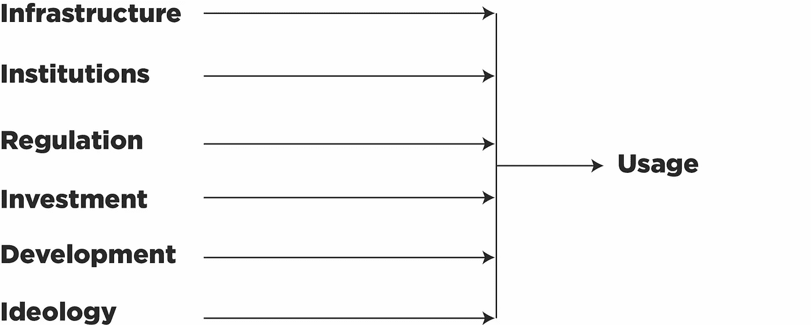

# 加密叙述和采用之路

> 原文：<https://medium.com/hackernoon/crypto-narratives-and-the-road-to-adoption-27df1371b7dd>

**可以关注我**[**@ flattoutcrypto**](http://twitter.com/flatoutcrypto)**和上******。****

****2015 年 2 月 1 日。亚利桑那州格伦代尔。**西雅图海鹰队排名第二，在比赛还剩 26 秒时在新英格兰一码线上进球。他们将在几分钟内举起超级碗。**

**关注的媒体正在对他们谴责新英格兰爱国者王朝结束的文章进行最后的润色。汤姆·布拉迪完蛋了。比尔·贝利奇克已经连续输掉了三次超级碗。海鹰是新的动力，当然的继承人变成了国王。故事已经设定好了。**

**然后。**

****

**马尔科姆·巴特勒，一个未选秀的新秀，做出了赢得比赛的拦截。汤姆·布拉迪被评为最有价值球员。爱国者队赢得了他们的第四次超级碗，两年后又赢得了第五次，巩固了他们作为最伟大的 NFL 王朝之一的地位。转眼间，原有的故事被撕毁，新的故事被疯狂地创造出来，这一切都要归功于两只手从空中捡起一个球这样无关紧要的事情。**

# **TL；博士；医生**

*   **受作者和传播者的利益驱动，叙事是不可靠的**
*   **由于分散的社区、空间中的噪音和新生的性质，加密是一个特别难以拥有真正的总体长期叙事的空间**
*   **我更喜欢从整体上来看这个空间的发展，我认为真正的使用还需要 2-3 年的时间**
*   **这一进步可以归结为几个领域，如基础设施、投资、发展、监管、机构支持和意识形态**
*   **没有必要的基础设施和发展，我们不能指望 DApps 成为主流；当前吸引大量日活跃用户的失败与其说是 DApps 自身的反映，不如说是生态系统的状态**
*   **尽管进展似乎是有把握的，但我们应该注意它可能失败或被拉拢的所有方式**
*   **在短期内，我不期望有很大的变化，并期待在 alt 上的过度投机会回来**
*   **从长远来看，我预计大部分协议将会消失，剩下[比特币](https://hackernoon.com/tagged/bitcoin) + 1/2 其他。然后，DApps 将根据受欢迎程度而上升或下降(因为将会有真实的使用情况),并在前 20 名中占据越来越多的位置**

# **叙事和密码**

**这篇文章的灵感来自 Nathaniel Whittemore 对当前许多有争议的叙述的精彩讨论和对不同叙述的大量讨论。我们现在有一个关于市场叙事的[指数](https://tokeneconomy.co/market-narratives-are-marketing-in)，这凸显了最近这个话题花费了多少时间和思想。**

****

**Whittemore 注意到“与协议战争相比，丰厚的金钱概念在这个时候更有优势”，这是我完全同意的。这确实是目前大多数人似乎支持的，至少是 Crypto Twitter 上少数敢于发声的风投/参与投资者。**

**然而，就在不久前，乔尔·莫内格罗的“[肥胖协议](http://www.usv.com/blog/fat-protocols)”论文还是叙述性的。然而，该公司的股票却大幅快速下跌。为什么？有什么变化？**

**我的简短回答是，除了价格波动和技术各个阶段的普遍幻灭之外，可能没什么变化。**

**我的长回答？问什么改变了是一个错误的问题。**

**第一个问题是叙事本身的性质，一个有严重缺陷的人类结构。即使是历史叙事，也仅仅是对一个关于现实的故事的建构，而不是对现实的直接再现。这是一种充满作者和文化意识形态视角的重构。这是一个基于已经发生的事情的故事，不同于前瞻性的故事。**

**叙事作品的创作者寻求合理化趋势，使它们符合他们自己的世界观或传播他们的信仰。因此，叙事是高度主观的。想一想体育记者改变观点的微妙之处。一个球扫过一厘米宽的地方，球队就成了失败者，组织混乱，精神脆弱。在另一个方向一厘米，他们是英雄，完美，离合器。**

> **历史叙事是对现实故事的建构，而不是对现实的直接再现**
> 
> **《叙事方法论》评介**

**金融市场类似于体育运动，到处都是专家，他们的工作就是向你解释正在发生的事情和原因。有时有明显的原因，一条新闻或销售下滑。但太多时候，人们会创造一个理由来解释标准方差或玩弄短期趋势，但这个理由很快就过时了。**

**此外，crypto 还存在几个使叙述变得困难的具体问题:**

1.  **这是一个新兴行业，几乎没有可用的历史来作为未来结论的基础，我们仍处于许多主题(包括开发和价格)的发现模式，这意味着…**
2.  **叙述通常在许多人听说之前就已经过时了，因为一切都还在形成中，这导致…**
3.  **噪音很多——很少有真正的专家既懂技术又懂投资，每个人都有既得利益，大多数人都没有能力判断谁是可靠的来源，市场是一个 24/7 的全球行业，与相关人员和公司的接触和互动无与伦比。这种噪音被放大了…**
4.  **一个很少相互联系的支离破碎的社区(就动机和兴趣、交流媒介、他们来自的世界和语言差异而言)。我在 Twitter、Reddit 和 Telegram 上关注的社区不仅关注不同的领域，甚至当它们报道相同的新闻时也会产生非常不同的观点。这些只是说英语的社区——韩国、中国、日本的叙述有多大不同？很少有人跨越所有这些社区。这一切意味着…**
5.  **一回到①；这是一个新的领域，许多故事还没有时间去检验。许多人都在谈论加密是下一个互联网(一场至今已有 30 多年的革命，其间经历了数次迭代),而我们却忽略了仅仅基于几周或几个月的行动的叙述？**

**我倾向于忽略很多可能过于内省的练习，而是更喜欢关注 crypto 作为一个整体是如何发展的。虽然获取价值的途径很重要，但我认为，通过观察主流采用的途径以及我所认为的该领域不可阻挡的本质，可能更容易理解如何创造这种价值。**

# **密码学的进展**

**对启蒙运动的经典解释是，17 世纪和 18 世纪的思想家看到了人类的线性和持续的进步，其中知识和光明向前传播。虽然进展有时会放缓，但从未停止。人类不断前进，即使有时知识和创新不得不隐藏在落后当局的黑暗中(例如在中世纪)。这是我在许多方面对加密的看法。尽管有挑战和贫瘠的时期，它一直在前进。**

**加密技术实际上只存在了十年。人们很容易把它分成不同的部分:比特币的诞生、用于犯罪活动、以太坊和智能合约的推出、DApp 和 ICO 融资模式的兴起、机构资金和企业的进入。**

**相反，我认为整个第一个十年(可能还有两到三年)是同一时期的一部分。**

**有失败的交换，黑客攻击，不变性很快就变成了可变性。政府反对它，监管它，禁止它。有企业说它没用，他们不需要它，它不会有任何影响。一直有骗局。这么多骗局。没有足够多的人将加密资产用于他们的目的，有太多的人将它用于邪恶的手段，没有足够多的成品 dapp，没有足够多的好 dapp，没有足够多的好设计，不够多，不够多，不够多。**

**对于最近关注比特币或加密资产的人来说，这些图表应该是熟悉的:**

************

**然而，这是我所看到的:**

****

**在不到十年的时间里所取得的进步不应该被低估，累积起来将使我们更接近主流应用。我相信这种进步可以归结为六个主要方面，如下所述，我们需要达到最低的复杂程度才能实现真正的使用。这些类别大多并行进行。我们正处于不同的发展阶段，在一个领域取得成功会使其他领域变得更容易。**

**一个警告——比特币应该被认为是一个独立的类别，因为不是下面所有的都适用。**

****

****1。基础设施****

**任何城市的基本要求都是交通便利。没有通往城市的道路或河流，没有人会去参观。**

**加密资产在很长一段时间里都是孤立的。在早期，没有交易所可以购买比特币，没有办法让你的硬币进入系统。然后是交换，但它们很难使用，而且明显不可信。后来，它们变得更容易使用了，但仍不断遭到黑客攻击。然后，像比特币基地这样的人最终让普通人很容易购买密码(目的只是持有)，从许多方面来说，这是至关重要的第一步，因为如果没有它，许多人会觉得与它脱节——这可能是一个独立的世界。**

**购买 crypto 在整个系统的发展中提供了既得利益，但这还不够——需要有更简单的方法来让只想使用 DApps 的用户加入进来。去中心化用户体验的每一个方面都必须与互联网相匹配，从接纳新用户开始。除此之外，我们还能指望如何将人们转化为 DApps 呢？没有人会去比特币基地购买 ETH，然后将该 ETH 转移到他们的分类帐或 MetaMask 帐户，然后登录该帐户，然后使用 DApp(通常需要一台 PC，这是人们不使用或不想使用的东西)。另外，正如[乔伊·克鲁格指出的](/@joeykrug/fees-fees-and-fees-8939c2b5ecae)，你一直在支付高额费用。**

**此外，获得是不够的，我们还需要安全和权力；除此之外，现在还有钱包(如何衡量 Ledger 或 Trezor 在产生自信存储方面的影响？)支付处理器和咨询服务。**

**所有这些仍未完成——尽管基础设施无疑有所改善，但还没有到位。**

****2。投资****

**监管、企业采用和基础设施都带来了投资。这可以从风投和其他投资者涌入的资金(我不包括 ico 中的散户投资)以及最近传统交易平台如 [SIX](https://www.ft.com/content/37476874-806c-11e8-bc55-50daf11b720d) 和 [ICE](http://fortune.com/longform/nyse-owner-bitcoin-exchange-startup/) 对 crypto 的关注中看出。crypto first 基金的兴起也将使资金持续流入该领域，以开发基础设施和项目。**

**一个相反的观点是，比特币的推出不需要资金支持，也不需要随后的使用量增加。投资可能仅仅是成功的副产品而不是推动力吗？也许吧。然而，更多的投资可以为发展和基础设施提供更多的资源。即使比特币可以在没有投资的情况下生存，更广泛的加密资产基础也需要投资。同样，我们正在建立 DApps，它需要与资金充足、非常好的集中化产品竞争。**

****3。开发****

**上述投资(连同捐赠给 ICOs 的资金)为许多项目提供了资金。我们需要基本的基础设施来让人们进入加密的世界，但我们需要生态系统的发展来让用户真正使用正在创建的分散网络。把它想象成允许人们定居的道路和河流，以及他们在那里建造的房屋和企业之间的区别。**

**在任何协议可以声称是新的互联网之前，它必须首先建立所有允许互联网工作的不同组件。我们需要分散的存储、消息传递、治理、协议、身份和处理。Web3 堆栈的这些组件将产生新的可能性，实现以前不可能实现的新方法。项目将建立在彼此的基础上。我们首先需要扩展。**

**此外，最重要的元素之一，用户界面，受到的关注相对较少。我们需要可用的移动浏览器，我们需要一种像任何应用程序一样方便用户使用的方式。这里的一个问题可能是谷歌和苹果的看门人允许他们的商店中基于加密支付的应用程序。像 Status 这样的 DApp 浏览器目前可以在 iOS 和 Android 上免费获得，但如果它开始威胁到他们的金蛋，那将成为一个更大的问题。**

**比特币基地有一个真正的机会锁定市场与他们的更名 Toshi 浏览器。有很多关于脸书收购比特币基地进行买卖交易的讨论。然而，脸书控制着一个至关重要的主用户界面，这难道不是一个更加不祥的前景吗？尤其是如果你考虑到他们可以很容易地将其集成到 WhatsApp 和脸书。这可能是他们获得微信提供的那种体验的途径。**

**DApps 目前几乎没人用，应该不奇怪；方便其他 DApps 运行所需的组件还没有出现。鉴于这个领域的狂热性质，进展可能看起来很慢，但人们很容易忘记，许多开发者是在过去 24 个月才进入这个领域的。然而，由于我们的建设方式，我认为 DApps 将(在两三年内)开始获得越来越大的份额，而流向协议的份额将会减少。**

**最后的想法；作为附加在它们上面的通常毫无意义的标记的结果，我们也可能会看到各种相互竞争的去中心化技术的分裂。这可能会减缓进展。**

****4。机构支持****

**企业采用导致更多的资源投入到研发中。技能基础开始出现，对开发人员的需求上升，这创造了满足需求的自然供给。我会接受这样的观点，即机构支持不是必要的，或者可能是副作用而不是推动力。然而，我很满意它大大加快了接受的过程。**

**尽管仍有许多组织反对比特币，但许多组织现在正在以某种方式试用和使用 DLT。企业以太坊联盟在不到 18 个月的时间里从 30 个成员发展到 500+ 成员。还有许多其他行业团体。数十家银行和金融服务机构已经试用了区块链的解决方案，从安盛到联合国等组织也是如此。**

**虽然这听起来很多，但大部分仍然是讨论机构和小规模试点。实际的企业使用仍然处于不存在的边缘。**

****5。法规****

**监管是一把双刃剑。虽然它可能是负面的，但许多禁止加密的国家要么努力执行他们的规定，要么最终废除或缓和最初严厉的声明。我相信:**

*   **监管使这个空间合法化，因为它意味着加密资产已经上升到需要监管的重要程度；它们太重要了，不能丢下不管**
*   **它提供了清晰度，允许更多的用户和组织进行投资和投机，从而导致更多的资金流向基础设施和发展**

**我们开始看到许多政府的澄清，但是还有很多问题需要回答。**

****6。意识形态****

**在写这篇文章时，我创建了一个过去十年发展的时间表。人们很难不注意到，与今天熙熙攘攘的空间相比，到 2014 年左右的时间线看起来有点缺乏活动。然而，这一时期是最重要的阶段。正如我们作为新生儿最脆弱一样，这也是比特币最有可能失败的时期。社区很小，机会很大，大规模采用的道路很长。**

**随着比特币存活下来的每个月，整个空间都获得了合法性。比特币是评判该行业的旗手，它的生存本身就证明了去中心化货币的弹性，这是一个远比智能合约之类的概念更难打动世界的概念。**

**这一早期阶段对于我们今天所处的位置是必要的，在那里主流利益已经形成。许多人现在相信加密资产的想法，即使他们可能并不完全理解为什么。更多的人认为它们是不太可能消失的“东西”。**

**尽管最近价格波动剧烈，但在我看来，宣布比特币死亡的声音明显减少了。这是因为人们变得更加小心翼翼，唯恐自己错了吗？或者，人们的心态可能正在发生变化，比特币不仅仅被用于非法交易，它或许还是一种价值储存手段，或者可以对冲央行政策和国家衰落的风险？**

**意识形态很难衡量进步，也不能同等适用。比特币有一个极其强大的意识形态核心，这使得它如此抗拒。例如，对于采用智能合约协议来说，这一点不太重要，因为智能合约协议的目标是使令牌元素最终对用户不可见。对于比特币，持有(或交易)BTC 是核心要素。**

# **完美风暴**

**虽然看起来我似乎很消极，但我认为我们正接近一个最低限度的可生存生态系统，这是一个时间问题，而不是是否的问题。我认为，在许多情况下，随着我们达到资源和发展的临界点，从“不太可能”到“可能”的转变将会很快。**

**除了 crypto 内部的发展，我认为还有许多外部事件会导致更大的采用机会。这些挑战包括长达 10 年的资产繁荣、日益加剧的不平等、生活成本超过工资涨幅、多个国家艰难应对严重通胀、经济放缓、通缩性财政政策，以及迫使社会加速归零的高度集权平台的扩散。当乔丹·库珀发表了一篇名为[追逐完美风暴](https://jordancooper.blog/2018/08/03/chasing-a-perfect-storm/)的文章时，我已经在写这篇文章了，这篇文章涵盖了类似的主题，值得一读。我已经讲了足够长的时间，无数的外部因素可能会导致分散式网络的接受度上升，这些因素也足够长，可以单独写一篇文章。**

# **扩大的包围(*呻吟*)**

****

**我可能提出了不可阻挡的进步的想法，但启蒙思想家们也相信人类的持续进步。在接下来的几个世纪里，随着大屠杀和原子弹的投放，人类的“进步”让科学得出了一个令人震惊的结论。加密永远不会对世界产生如此可怕的影响，但关键是我们不应该假设进步或积极的结果。**

**我们可能会落入许多陷阱。通过集中力量进行拉拢，就像互联网一样。不平等加剧的原因。被发达国家垄断，是另一个用来镇压欠发达国家的工具。一个不变的账本，让政府前所未有地接触到你的每一笔交易。极权政府用来进一步控制公民的工具。**

**更有可能的是，它只是一个永远无法让用户相信为什么它比他们目前的集中产品更好的东西，至少不符合一些理想主义和膨胀的原始愿景。我们在和互联网竞争，互联网太棒了。分散用户体验的每个方面都必须与之匹配。除此之外，我们还能指望如何将人们转化为 DApps？我们目前离这个标准还很远。**

**然而，我相信，我们可能还需要两到三年的时间，才能将许多正在努力实现的愿景变为现实。考虑到这个空间的飞速发展，两三年听起来是很长的一段时间(从 DAO hack 到 Mt Gox 才两年多一点，还不到五年！)，但它会像亚利桑那州从天而降的球一样很快过去。**

**我毫不怀疑它会发生。但我是 100%的加密专家，所以这并不奇怪。毕竟这是我的叙述。**

# **短期和长期投资**

**由于大多数秘密叙述的全部意义在于确定人们将如何使用他们的钱，所以我应该提出我会怎么做，即使这种做法过于简单。**

****短期****

**许多人最近宣布低价竞标的死亡，一些人用几周的价格行动来证实他们的信念，即持有 BTC 在财务上更好。我甚至看到一些人自豪地转发他们去年 10 月的评论，称崩盘即将来临。我认为错过了数千%的潜在收益，所以你只能放弃 70%而不是 80 %- 90%并不是最有说服力的论点。**

**“低价竞标的永恒冬天”是我不相信的一种说法，因为这意味着加密资产的估值将突然摆脱贪婪、投机和操纵。我对这种变化如此之快表示怀疑。如上所述，我认为在两到三年的时间里，当有适当的使用来衡量，这将开始结束，但我预计它将在可预见的未来继续。**

**因此，要么消极地持有 BTC，要么积极地驾驭短期趋势。这些趋势不应与叙述相混淆，因为短期趋势是 1-4 周的爆发，例如，从去年开始我就想到了:**

*   **中国硬币热潮**
*   **供应链硬币热潮**
*   **隐私硬币热潮**
*   **全 ICOs 泵动臂**
*   **令人困惑的——甚至对加密来说——所有高供应低价硬币繁荣**

**将此与发现相对低估的替代币结合起来，将利润循环到比特币中，然后将交错利润转移到菲亚特，或者接受比特币不可避免地不时出现的大幅下跌。**

****长期****

**稍微往前看，目前大部分投资都投入到协议中，剩下的投入到 DApps 中。我认为协议受投资者欢迎的一个原因是，它们提供了一个更直接、更具可比性的愿景——dapp 虽然还很遥远，但协议已经发挥作用，或者即将成为具有相互比较指标的实时 mainnets。**

**我认为随着越来越多的 DApps 上线并集中在一两个平台上，现实将是大多数平台将永远是空的。这将导致许多协议的估值直线下降，鉴于许多智能合约平台什么都不提供，我会对拥有许多智能合约平台持谨慎态度。鉴于前 19 名中有 17 名(忽略比特币)，当我们在下一次崩盘期间回顾 2017-18 年牛市前 20 名时，将会有一些大输家。**

**相反，虽然协议目前占据了前 20 名，但我认为第一批真正成功的 DApps 将飙升至巨大的估值，以类似于脸书的 Farmville 的方式起飞(或许游戏将是第一个成为主流的)，因此识别早期赢家将是关键。这很可能是一个甚至还不存在的项目。**

**我认为，你可以期待资本流向作为价值储存手段的 BTC，同时也可以期待新的产业和可能性因我们正在创造的所有技术而涌现(尽管这可能不是以象征性价格的形式)。虽然我不认为它必须是比特币或其他，但我将永远持有至少 30%的 BTC——尽管如果我现在必须选择持有 10 年的项目，那将上升到 100%。**

**我还预计会有一场远离代币的运动——尽管是局部的。我不知道这可能会采取什么形式，但我认为会出现一个更好的替代方案，以更好地协调项目、团队和投资者。对于许多项目和投资者来说，代币是一个非常糟糕的解决方案。**

**因此，如果要我猜的话，我预计协议的表现将开始低于市场平均水平，DApps 的一部分将开始优于市场平均水平(许多 DApps 将会消亡)，BTC 将成为一个独立的类别。**

**这是不是就像雨后春笋般冒出来的一些更优雅的叙事一样干净？不，不是的。但密码也不是。最终，我们仍处于起点——谁知道接下来会出现什么样的新故事。**

**非常感谢[玛雅·泽哈维](https://twitter.com/mayazi)和[纳撒尼尔·惠特莫尔](https://twitter.com/nlw)对本文的建议和评论。**

# **进一步阅读**

**上面提到的纳撒尼尔·惠特莫尔的叙事作品:**

*   **[哪种叙事将主导下一轮牛市？](https://www.tokendaily.co/blog/which-narrative-will-dominate-the-next-bull-market)**
*   **[市场叙事是营销](https://tokeneconomy.co/market-narratives-are-marketing-introducing-the-crypto-narrative-index-deeeb49bc909)**

**其他以叙事为中心的作品:**

*   **乔尔·莫内格罗的《脂肪协议》**
*   **[捕获加密值(第 3/3 部分):强化协议& dApps](/@duncanchiah/capturing-crypto-value-part-3-3-fattening-the-protocols-dapps-9a7307b8ca35) 作者邓肯·基亚**
*   **[看好比特币的理由](/@vijayboyapati/the-bullish-case-for-bitcoin-6ecc8bdecc1)作者 [Vijay Boyapati](/@vijayboyapati?source=post_header_lockup)**

**在 Web3 堆栈上:**

*   **凯尔·萨马尼**
*   **[web 3 基金会](https://github.com/w3f/Web3-wiki/wiki)**
*   **特伦特·麦戈纳希**
*   **[Stephan Tual](https://blog.stephantual.com/web-3-0-revisited-part-one-across-chains-and-across-protocols-4282b01054c5)**