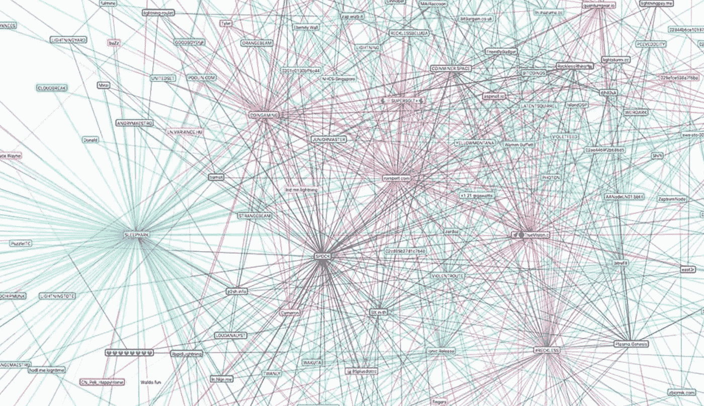

# 加密网络效果

> 原文：<https://medium.com/hackernoon/crypto-network-effects-37962671998a>

[Visualization](https://lnmainnet.gaben.win/) of bitcoin’s Lightning Network

加密货币通常根据[网络](https://hackernoon.com/tagged/network)效应来估值。网络效应是当一个网络的价值随着其节点数量的增加而增加时出现的突发属性。因此，一些[比特币的估值](http://uk.businessinsider.com/bitcoin-price-movement-explained-by-one-equation-fundstrat-tom-lee-metcalf-law-network-effect-2017-10)是基于比特币网络及其用户。[梅特卡夫定律](https://en.wikipedia.org/wiki/Metcalfe's_law)——认为网络的价值与节点数量的平方成正比——越来越多地被用于模拟比特币的价值[。*一些比特币的倡导者——所谓的比特币最大主义者——甚至声称，比特币强大的网络效应最终将导致](https://hackernoon.com/are-bitcoin-bubbles-predictable-6aa5b830f41a)[超级比特币化](https://nakamotoinstitute.org/mempool/hyperbitcoinization/)——比特币引发的法定货币去货币化。现在，先不说比特币会赢，还是替代币会接管，重要的是要认识到不同的协议会产生不同的网络效应。

为了理解[加密](https://hackernoon.com/tagged/crypto)网络效应的本质，我们需要区分加密协议和它们的本地加密货币执行的不同功能。密码协议可以大致分为实用协议和储值协议。以太坊(Ethereum)等智能合约平台可以归入公用协议，而比特币可以被描述为储值协议。每组加密协议在不同的维度上最大化。智能合约平台针对不同的功能进行优化，如图灵完整性或丰富状态，而不是价值存储协议，后者需要最大限度地抵抗审查和判断，分散化和安全性。鉴于加密协议可能最大化不同的功能，不同的网络效应将最有可能出现。

虽然以太坊目前的市值似乎表明，它具有与比特币类似的强大网络效应，但一些趋势表明，公用协议存在不同的动态。例如，在智能合约平台的情况下，无摩擦链间互操作性的趋势可能会最小化此类平台的网络效应。虽然以太坊的支持者经常辩称，开发者和用户被锁定在网络中，因为它能够开发智能合同、分布式应用(Dapps)或分散式自治组织(Dao)，但链之间的互操作性最有可能大幅降低到其他网络或区块链的转换成本。换句话说，用户很可能不会与区块链本身进行交互，而是与能够在多个链上进行交易和操作的前端工具进行交互。最终，协议原生令牌可能不再相关，因为它们可以通过智能合约或可互操作的网络跨不同的链传输。反过来，多种协议的无摩擦和可互操作的特性可能会大大降低网络的价值。在公用事业协议的情况下，用户不需要“hodl”硬币，这将转化为这些公用事业加密资产的更高[速度](/john-pfeffer/doubts-about-the-long-term-viability-of-utility-cryptoassets-db04350b1f55)和更低价值。相反，用户只会“hodl”占主导地位的价值存储加密货币，这反过来可以创造“[数字现金](/@pierre_rochard/digital-gold-digital-cash-network-effects-8fba72493311)网络效应。

相反，储值协议的网络效应是由不同的动力驱动的。尽管建立在公用事业网络上的应用程序很可能对底层协议漠不关心，并且用户将能够在链之间无摩擦地切换，但非独占的价值存储协议将展现出强大的网络效应。如果我们将比特币比作黄金，那么很明显，储值协议的总潜在市场比智能合约平台或其他公用协议的市场大几个数量级，也更有价值。一些分析师将黄金市场作为模拟比特币价值的代理，他们得出了[对比特币价格的估计](/john-pfeffer/an-institutional-investors-take-on-cryptoassets-690421158904)，每枚比特币的价格从 26 万美元到 80 万美元不等。将占主导地位的非主权价值储存协议的市场与金条和外汇储备的总价值进行比较，表明潜在估值在 4.7 至 14.6 万亿美元之间。

金融中使用的反身性概念抓住了投资者预期和价格之间的自我强化反馈回路。越多的市场参与者“hodl”比特币，它就变得越有价值，这增加了需求、散列率和网络安全，并反过来吸引更多的“hodlers”和开发者。换句话说，比特币用得越多，流动性就越强。这种[流动性](https://nakamotoinstitute.org/mempool/the-coming-demise-of-altcoins/)反馈循环催生了比特币的存在，强化了比特币的网络效应，并促进了一种单一主导加密货币相对于所有其他竞争加密货币的成功。与黄金相比，很可能只有一种储值协议。拥有多个储值协议(市值更小、流动性更差)不会提供更多效用。此外，储值协议也将表现出很强的路径依赖性。因此，比特币是迄今为止最大的协议，并且已经运行了近九年，几乎没有出现故障，这一事实进一步强化了它已经拥有的强大网络效应。除了自反性和路径依赖性质，比特币还表现出强烈的“林迪效应”，这意味着技术系统的未来预期寿命与其当前年龄成正比，因此每增加一个生存周期就意味着更长的剩余预期寿命。

比特币拥有所有的特征，如抵制审查、稀缺性、安全性和硬编码的不可改变的货币政策，这使它成为一种更高级的价值储存手段——它也没有黄金的物理限制(如提取、运输和储存成本)。然而，人们经常认为比特币可能会被技术更先进、功能更强大的替代币取代。这种观点基于比特币和科技公司的类比，后者经常受到后来者的干扰。然而，这种类比歪曲了比特币的本质。相反，比特币必须与互联网相提并论。互联网是信息的协议，而比特币可以被描述为价值的协议。我们没有多个相互竞争的互联网协议，但有一个协议是构建互联网基础设施和应用的基础。类似地，鉴于其强大的网络效应和长期的安全记录，比特币协议可能会成为主导的非主权储值协议，这将为第二层应用提供基础，这可能使比特币也与智能合约或支付轨道相关。无论比特币是否会赢得最终的价值存储协议——鉴于比特币是领先的加密货币，比特币似乎有可能成为占主导地位的非主权价值存储协议——与公用事业协议的分散市场不同，价值存储用例似乎是一个赢家通吃的市场。

**在最近发表的一篇研究论文中，我们开发了一个广义梅特卡夫定律，可用于推导比特币的基本面估值:*[*【https://arxiv.org/abs/1803.05663】*](https://arxiv.org/abs/1803.05663)

感谢[皮埃尔·罗查德](/@pierre_rochard)