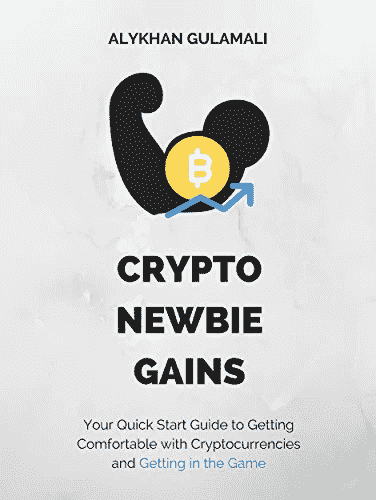
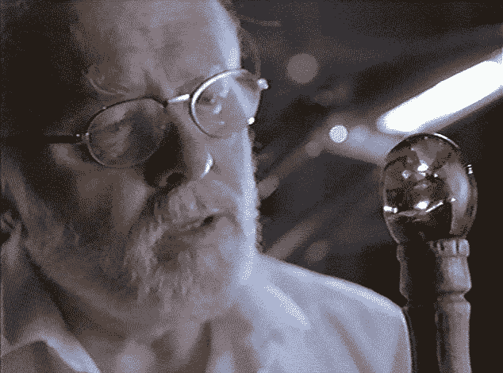
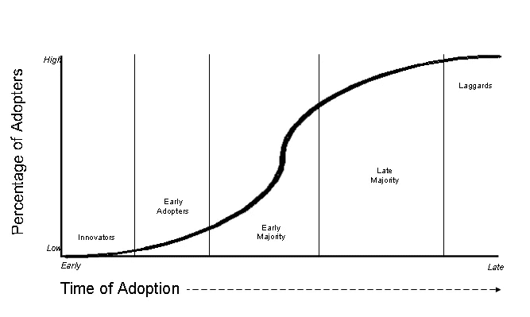
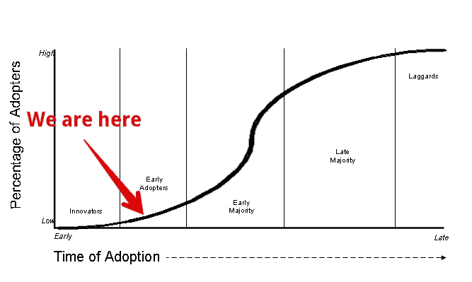
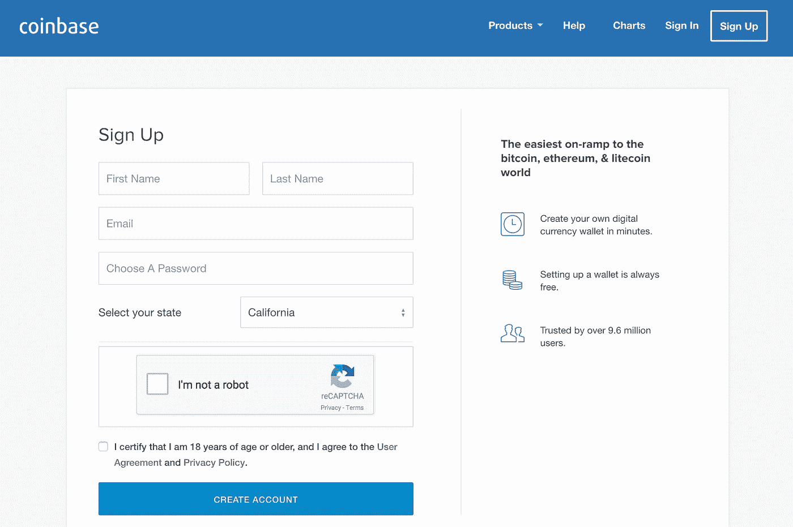

# 加密新手收益:快速入门指南，让你熟悉加密货币并进入游戏

> 原文：<https://medium.com/hackernoon/crypto-newbie-gains-your-quick-start-guide-to-getting-comfortable-with-cryptocurrencies-and-41808de9c56e>

几个月前，我自助出版了这本书，但我想让尽可能多的人读到它，所以我也在 Medium 上出版了这本书。

## 你对加密货币感兴趣，但又紧张得不敢投资它们吗？

如果缺乏基本的理解是阻碍你的原因，那么这本书就是给你的。

*Crypto 新手收益*是让你熟悉加密货币并进入游戏的快速入门指南。

**现在投资加密货币还为时不晚。**尽管有各种传言和炒作，但事实是大多数人实际上并不拥有任何加密货币。如果你在他们之前进入，那么你可以实现更大的收益。

在这本书里，你会学到:

1.什么是区块链技术是一种易于理解的方式(完整的电影参考和易于理解的类比)

2.比特币等加密货币如何优于今天使用的“原始”法定货币系统

3.为什么你不应该等到完全理解加密货币后再进入游戏

4.你有多想考虑投资加密货币

5.如何从今天开始，在几分钟内购买你的第一批加密货币“股票”

花些时间阅读这篇简短的入门文章，然后决定是否要采取行动。但是不要等待。赚大钱的机会不会永远存在。事实上，它一天比一天小。

感谢阅读，并愿密码新手收益与你同在。

AlyG

# **免责声明和法律声明**

本书和附带材料中提供的信息仅供参考。不应将其视为法律或财务建议。您应该咨询律师或其他专业人士，以确定什么最适合您的个人需求。

作者对使用此内容可能获得的任何结果不做任何保证或其他承诺。在没有咨询自己的财务顾问、进行自己的研究和尽职调查之前，任何人都不应做出任何投资决定。

在法律允许的最大范围内，如果任何信息、评论、分析、意见、建议和/或推荐被证明是不准确、不完整或不可靠的，或导致任何投资或其他损失，作者概不负责。

# **奉献**

这本书献给区块链领域的影响者和思想领袖，他们教育了我，激励我采取行动，开始我自己的加密货币之旅。附录中的推荐资源部分列出了其中的许多资源。

# 目录

[一个密码新手的自白](#f41d)

第一章:区块链…就像在课堂上传递纸条一样

[第二章:为什么比特币如此具有革命性？](#47c2)

[第三章:为什么你不应该等到了解加密货币后再进入](#54bb)

第四章:如何进入密码游戏

[结论](#20d8)

[推荐资源](#f359)

# 一个密码新手的自白

[返回页首](#1790)

重要的事情先来。我不是加密货币专家。

事实上，我正相反。我是个密码新手。和大多数人一样，几年前我第一次听说比特币，并认为它只是一种时尚。直到今年早些时候，我才开始更多地了解它，并认真对待它。

我写这本书的原因是我喜欢写我感兴趣的东西。对我来说这是一种娱乐。换句话说，为我写这本书就像是你在看你最喜欢的网飞秀。我知道这听起来很荒谬，但事实就是如此。

那么，为什么有兴趣呢？

嗯，我总是对金钱和技术感兴趣。加密货币结合了这两者，同时也创造了我们一生中最令人兴奋的赚钱机会之一。在过去的几个月里，我阅读了文章和书籍，听了播客采访，观看了 YouTube 上关于比特币、加密货币和区块链技术的视频。我学得越多，就越对这项技术及其作为众多问题的长期解决方案的潜力着迷。

在我开始之前，让我声明一些明显的免责声明。

这不是投资建议。我以前说过，现在我再说一遍:我不是密码专家。也就是说，有些人说最好的学习方法是教学。所以，我写这本书的目的是分享我所知道的和我正在做的事情。我的希望是，因为我和你一样都是新手，这些信息可能会更容易理解。

当然，我鼓励你像我一样研究这个领域最聪明的人，并得出你自己的结论。与此同时，我不希望你等太久才开始尝试，因为如果你这样做，你可能会错过我们有生之年看到的最大投资收益。如果你愿意，附录中有一个资源列表，你可以在那里向专家学习，进行你自己的尽职调查，并验证我所写的一切。

> “一手许愿，一手拉屎，看哪个先灌满。”——斯蒂芬·金，*《黑暗之塔》*(对瑟曼·鱼人来说也是坏圣诞老人)

学习和执行之间总是有一个平衡。

但如果说我最近学到了什么的话，那就是学习就像手里的许愿，执行就像手里的拉屎。这可能不是你当时能做的最舒服或最想做的事情，但它会弄脏你的手。如果你想在现实生活中取得成就，那么你就必须亲自动手去执行。

这本书将分为四个主要部分。在第一部分，我将讨论使加密货币成为可能的魔法，这就是众所周知的区块链技术。在第二部分，我将讨论为什么比特币是一件大事。在第三部分，我将讨论迅速崛起的加密货币的投资机会。在最后一节，我将讨论执行。

这本书很短，打算一口气读完。我希望你能在 15-20 分钟内获得决定是否参与的信息，而不是陷入太多的细节中，并被所有这些的复杂性所吓倒。如果你不知所措，那么你可能会推迟执行，或者更糟，完全放弃，我认为这是你在这个阶段能做的最糟糕的事情。

愿新人收获与你同在，

Alykhan " Crypto Newb " Gulamali 又名 AlyG

# 第一章:区块链…就像在课堂上传纸条一样

[返回页首](#1790)

大多数新手将比特币视为一种耸人听闻的投资，在极短的时间内价值爆炸，但除此之外对其了解不多。

那么，比特币是什么？

简而言之，它是一种数字货币。但这并不公平。如今，网上转账有很多不同的方式。那么，你如何区分比特币和贝宝(PayPal)之类的东西呢？贝宝也是一种数字货币。

**要了解比特币，首先要了解其背后的技术:区块链技术。**

但是在你理解区块链之前，你必须理解加密。加密的想法非常简单。基本上，它在编码一些东西，比如一条信息。

> “在最基本的层面上，金钱不是价值。金钱代表价值的抽象；这是一种交流价值的方式。这是一种语言。因此，货币与语言一样古老，因为交流价值的能力与语言和货币一样古老。在许多方面，它具有使其成为语言结构的特征。这是一种交流方式。”——安德里亚斯·m·安东诺普洛斯，*货币互联网*

还记得你上小学的时候，孩子们会在课堂上互相传纸条吗？假设约翰给马克递了一张纸条。便条通常会说一些不成熟和不恰当的话，比如“吉尔有虱子”纸条被传了出去，约翰和马克都取笑吉尔。如果约翰经常这样做，他就在玩一个危险的游戏，因为老师史密斯太太可能会看见他传递纸条并没收它。

一天，事情发生了，史密斯太太发现约翰在纸条上取笑吉尔。他有麻烦了。在此之后，约翰变得更聪明，并决定加密他的笔记。他和马克编了他们自己的代码语言，只有他们理解，并用他们的代码语言写笔记。这样，如果史密斯太太发现了纸条，她就不会知道他们说了什么。这是加密。这个密码允许约翰和马克交换信息而不被其他人知道。

几年过去了，约翰现在已经上高中了。他更成熟了一点，不再相信虱子，但他仍然用代码写笔记。一天，他决定用一张纸币来换钱。纸条上的信息是这样写的:“我，约翰，给你，马克，100 美元。签名，约翰。”

然后，约翰决定，他希望交易是匿名的，所以这笔钱不能追溯到他。现在，信息是这样写的，“我，A，给你，B，100 美元。署名，a。”

然后，John 希望交易得到验证，因此他将消息写在一张纸的顶部，并张贴在自助餐厅的公共公告栏上，以便每个人都可以看到。

与此同时，班上的其他一些孩子已经学会了约翰的代码。所以，他们可以看着这张纸条，确认 A 确实给了 B 100 美元。这是区块链的开始。

之后，马克想把他新的 100 美元中的 50 美元转给乔。所以，他在自助餐厅的公共账本上又贴了一行，在第一行下面。“我，B，给你，C，50 美元。另一方面，其他孩子可以看到 100 美元从 A 转到 B，50 美元从 B 转到 C，因此，他们知道 B 有 50 美元，C 有 50 美元。区块链成长了。

随着越来越多的交易发生，John 决定保护这些交易。因此，每一笔交易过账后，他都指示一群孩子验证自助餐厅里不断增长的分类账，将所有的钱追溯到最开始。在足够多的孩子确认了每一笔交易后，它就被认为是完整的和不可逆转的。成功！

每当这个“链条”被确认时，它就被当作真理接受。最终，这个链条变得如此之长，以至于如果一个坏孩子试图偷这笔钱，他需要从头开始删除整个账本，并重写一个欺诈版本。这本身并不容易做到，但 John 增加了另一层安全措施，这使得事情变得更加困难。

所有的“好孩子”都需要在分类账上签字，并在每笔新交易中公布他们自己的副本。孩子们可以来来去去，所以他们每个人都有不同长度的验证链的不同部分，这取决于他们已经存在了多长时间。但是它们中的每一个都可以很容易地追溯到“主链”

就是这个主链被接受为真理的来源。因此，对于一个坏孩子来说，要破解它，他必须窃取所有的副本，并制作新的主链，超过现有的主链(正在继续增长)。即使坏孩子有一小群人在这方面工作，他也不会成功，因为有一大群好孩子在合法的链上工作，他们也领先于黑客大军。随着人力和工时的增加，好孩子总是赢家。保安！

这就是区块链的工作原理。之所以称之为区块链，是因为每一个验证步骤就像链条中的一环，每一环都会强化链条，直至牢不可破。

当我第一次知道区块链是如何工作的时候，它让我想起了《侏罗纪公园》中卡在树液里的蚊子。每一层树液都将蚊子越陷越深，直到它被保存得如此完好，以至于数百万年后人类能够从蚊子身上提取恐龙 DNA。

那么，这一切与比特币有什么关系呢？

**比特币只是区块链技术的一种应用。**

更确切地说，是货币应用程序。交易中使用了加密技术，因此被称为加密货币。比特币的转移就像两个人在公共账本上交换期票，只是信息是用计算机代码而不是高中男生代码编写的，并且是以数字方式转移而不是用纸张。不是班上的其他孩子来验证分类账，而是由被称为矿工的人来验证。

这些矿工分布在世界各地，他们不断在自己的电脑上运行验证比特币交易的代码。只要优秀矿工累积的 CPU 能力压倒任何黑客企图，比特币就是安全的。至于约翰，那个开始这一切的家伙？嗯，你可以叫他中本聪，神秘的比特币创造者，几乎可以肯定他现在身价数十亿。

# 第二章:为什么比特币如此具有革命性？

[返回页首](#1790)

**比特币比我们今天使用的法定货币更好吗？**

首先，这是全球性的。

世界上的任何人都可以以对等的方式与世界上的任何人进行交易，而无需通过中间人(如银行、国家政府等)。).这意味着货币超越了地理界限。今天，由于政府强制实行传统货币，阿拉巴马州的比利·鲍勃很难与印度的帕特尔先生进行交易。

比特币不仅让这项交易成为可能，还让比利·鲍勃(Billy Bob)不必通过他的美国银行将资金转移到帕特尔的印度银行，并让所有这些中间人参与进来。相反，这是一个简单的点对点交易。

因为它正在被矿工验证，所以它也是非常安全的。

你可能会想，如果矿工们联合起来决定操纵交易会怎么样？他们不能有效地形成自己的中央集权吗？没有。他们无法做到这一点，因为比特币代码是开源的，这意味着就像任何人都可以用比特币进行交易一样，任何人都可以成为矿工，获得原始源代码，并为自己进行验证。就像在学校食堂，只要好人比黑幕多，就有保障了。

另一方面，政府可以相互勾结，操纵交易，只需要少数可疑的人一起合作。

开源代码的另一个好处是任何人都可以迭代和改进它。

这就是为什么不止一种加密货币的原因。比特币只是第一个。

如果你是一个博客作者，你可能听说过 WordPress，另一个开源编码项目。大约七年前，我开始使用 WordPress。那时候，它有点笨重。功能是有限的，但它正在迅速改善。开发人员不断增加新的功能，称为插件。现在，WordPress 平台已经变得非常好，非常受欢迎，它占据了互联网的 25%以上。这就是开源代码的力量。

所以，全球系统是好的。一个分散的、开源的、全球性的系统甚至更好。

但即使是在一个国家内的交易，你也可以认为比特币更优越。今天，我们有一个中央集权的当局(政府)，操纵货币的供应，最终影响货币的价值。

假设约翰和马克现在是成年人，约翰有一台电视机，他想以 100 美元的价格卖给马克。他们都住在美国，所以这看起来很简单。但是，如果突然之间，政府印了一吨钞票，而 100 美元现在只值 50 美元，那该怎么办呢？约翰有一个问题。他认为这台电视值一定的价钱，但马克希望以一半的价钱买下它。

如果约翰和马克简单地使用一个不能被操纵的测量单位(因为稀缺性)来商定他们之间的数量，并以安全的方式进行交易，那么整个过程会更有效率。比特币和其他加密货币之所以能够实现这一点，是因为它们是去中心化的，在固定数量上运行，并通过区块链得到保护。

如你所见，货币只是区块链技术的一种应用。

您可以使用相同的技术来创建合同法、投票系统等。

还记得 2000 年布什和戈尔的美国总统选举吗？当时他们通过手动投票系统解决了所有这些问题，因为手动投票系统采用了悬挂式、悬挂式、飞行式或其他任何名称。这个过程不仅效率低下，而且还容易受到欺诈，因为它是由人以集中的方式运行的。

很难相信我们今天还在使用如此原始的系统。现在，想象一下，如果我们有一个分散的投票系统，由计算机运行，并被编程为 100%准确和诚实。像这样的系统不会这么容易被破坏。

我们看到的比特币只是一个开始。

法定货币解决了其前身黄金固有的问题(比如难以储存和运输)。比特币和其他加密货币现在解决了法定货币存在的问题。你看，这不仅仅是一种时尚。这是货币进化的下一个自然阶段。

通过使用区块链技术，许多其他货币和应用程序将出现，解决社会中的其他问题。区块链有可能通过使许多行业更加高效和安全地运营来彻底改变这些行业(以一种好的方式)。这将创造巨大的经济价值。

就影响而言，它可能和互联网一样大。当然，在互联网繁荣时期有很多骗局(区块链也会有骗局)，但也有一些合法公司出现。其中一些(谷歌、亚马逊等。)是当今商界最大、最有影响力的公司之一。如果你在这些公司还处于婴儿期的时候投资了它们，当每个人都认为互联网只是一种时尚的时候，会怎么样呢？

我甚至不需要回答这个问题，因为你知道。

如果你错过了那艘船，你现在有第二次机会与加密。

# 第 3 章:为什么你不应该等到了解加密货币后再进入

[返回页首](#1790)

**如你所见，区块链和加密货币本质上非常复杂。**

我承认，这不是我能轻易理解的事情(尽管它变得越来越清晰)。对我来说，好消息是我不愿意在进入游戏之前就去理解它。而我还是不愿意等更深入了解了再继续玩。

这是我给你的建议。

我不愿意等待的原因是，我不想错过早期采用者的收益。新工艺和新技术的采用是分阶段进行的。首先，你有早期采用者。然后，越来越多的人开始看到新流程或技术的合法性，并开始采用它，直到最终，每个人都采用它，它成为主流。这是互联网发生的事情，也是加密货币将会发生的事情。

看看下面的罗杰斯创新采用曲线:

对于你们这些非书呆子，让我来翻译一下。随着新事物的采用，在开始时会有非常缓慢的增长，但随后会加速，在稳定下来之前几乎垂直上升。被采用的事物的价值紧密遵循这种模式。当主流进入时，它迅速增长，但是在早期采用者进入之后。这就是早期采用者能够实现最大收益的原因。

截至 2017 年 12 月撰写本文时，我们正处于这一点:

极早期的采用者已经进来了。

这些人在 2013 年左右购买了比特币。你可能听说过一些比特币极端早期采用者，如比特币的创造者中本聪(因此也是最早的采用者)和文克莱沃斯双胞胎，如果你知道脸书的历史，他们指责马克·扎克伯格窃取了他们的社交网络创意。Winklevii 可能错过了社交网络的收益，但他们没有错过加密的收益，因为据报道，他们持有的比特币现在价值超过 10 亿美元。

现在，每个人和他们的妈妈都在谈论比特币，甚至是那些从未对金融或投资表现出任何兴趣的人。事实上，“比特币”刚刚超过“唐纳德·特朗普”，成为互联网上搜索次数最多的物品。正因为如此，你可能会认为它已经成为主流。

那么，你错过机会了吗？

一点也不。你可能错过了怪物，大爆炸，浪潮。但是还有很多好的冲浪机会。我们仍然处于早期采用阶段。事实是人们喜欢谈论，但大多数人仍然是旁观者。

尽管有这么多传言，但我认识的人中只有很少一部分人真的买过比特币。这样做的原因是，它是新的和令人生畏的。人们害怕是因为他们不理解它。我明白了。正如我提到的，我甚至没有像我希望的那样理解它。但我知道的足够多，能够理解它将对社会产生的影响。随着影响的增长，价值也会增长。

因此，就像我不需要知道股票市场如何运作的本质就愿意投资于它一样，我也不需要了解大量的加密货币就愿意购买一些。我只需要知道这是一种新的更好的做事方式。因为这是一种新的更好的做事方式，它被普遍采用只是时间问题。这是让我有信心价值会增加的原因。

**这个世界一直有并将永远采用新的更好的技术和系统。**

拿购物来说。过去，你必须去肉店买肉。然后，你不得不去一个农民那里买蔬菜。然后，你不得不去鞋匠那里买鞋，如果你有时间，去裁缝那里买衣服。那时的人们一定花了整整 8 个小时购物。我讨厌购物，所以我会很痛苦。这一体系效率低下，创新时机尚未成熟。

然后，事情发生了。

杂货店出现了，在一个地方提供你需要的所有类型的食物和饮料。百货商店出现了，提供你所有的服装需求。然后，在过去几十年的某个时候，沃尔玛和塔吉特出现了，他们提供一站式商店的一切。现在，这甚至更好，因为我们有亚马逊，它提供所有这些东西，而你实际上不必去任何地方…而且它比任何人都更便宜、更好。

如果世界自然地向更好的东西转移，就像它一直以来所做的那样，那么比特币和其他合法的区块链应用程序只会被更广泛地采用，因此价值也会增加。如果你在上世纪 90 年代亚马逊的股票刚上市时就买了，你就发财了。比特币就像是货币的亚马逊，但它有更大的经济潜力，因为货币不仅仅包含购物。

所有货币的总价值约为 150 万亿美元。截至目前，所有加密货币的总价值约为 3000 亿美元。如果人类做他们一直在做的事情，并采用新的更好的技术和系统，那么 150 万亿美元的货币最终可能被比特币等加密货币取代。这是 500 倍的增长，这就是为什么一些专家认为比特币仍然可以从今天的水平上涨 100 倍或更多。

因此，尽管最大的收益可能已经实现，如果你记住这个观点，你可以看到巨大的收益可能还在后面。

毕竟，地球上几乎每个人都还在用自己的货币进行交易。但这种情况正在改变。如果一个主要国家的货币贬值，会发生什么？那些人会转向哪里？加密货币似乎是一个不错的选择。

2017 年 11 月 30 日，“四大”会计巨头普华永道宣布，他们将开始接受比特币作为支付方式。目前，没有多少零售商或在线商店接受加密货币作为支付方式，但有些人接受，甚至是像 overstock.com 这样的几家知名公司。在撰写本文时，这还没有发生，但当世界上最大的零售商亚马逊开始接受加密货币时(这是一个时间问题，而不是如果)，会发生什么？价格会发生什么变化？

# 第 4 章:如何进入密码游戏

[返回页首](#1790)

好了，关于加密货币的底层技术和巨大机遇，我已经说得够多了。

**现在是执行的时候了。**

就像我前面提到的，如果你不愿意运用你已经获得的知识，学习对你没有任何好处。你可以读这本书，读 100 本其他的书，并在接下来的 18 个月里尽你所能学习关于加密货币的一切。但是如果你什么都不买，那么你永远也不会从中获益。

我的方法是同时执行和学习。

我在 2017 年 5 月开始了解比特币，当时我偶然发现了彼得·萨丁顿的 bitesize 比特币 YouTube 频道。当时的价格要低得多，彼得正在敦促他的追随者上车，“确保他们在飞往月球的宇宙飞船上的座位。”我花了将近六个月的时间才最终呕吐出来。

我在 2017 年 10 月购买了我的第一部分比特币，我唯一的遗憾是没有早点购买。但是，俗话说，“迟做总比不做好。”而且，我很高兴地发现，实际上一点也不晚。我们仍然处于早期采用阶段。

所以，不要等了。立即执行。我要告诉你怎么做。

想要分一杯羹，最快捷、最简单的方法就是在 Coinbase.com 开一个账户。

比特币基地是一个允许你买卖加密货币的在线交易所。还有其他的，但是比特币基地是最受数百万用户欢迎的。我还听说这是最简单、最容易使用的(实际上我没有研究过其他的，因为我想尽可能快地执行)。

比特币基地是一家美国公司。它适用于美国和其他 30 多个国家的客户。如果你生活在一个不受比特币基地支持的国家，那么你需要找到一个类似的服务来使用。

以下是开始的方法:

1.去 Coinbase.com 然后点击注册。

2.输入您的姓名和电子邮件地址

3.创建密码

4.选择您的州

然后，你需要验证你的电子邮件地址和身份(用你的地址和电话号码)。

一旦你的比特币基地账户获得批准，你需要将一个银行账户或借记卡与你的账户关联，这样你就可以购买和出售加密货币。你还必须通过识别几笔小额样本存款来验证你的银行账户。如果你已经建立了一个 PayPal 帐户或任何其他类型的在线帐户，这是一个非常相似的过程。

在你设置了一个被认可的支付方式后，你就可以开始购买加密货币的部分或“份额”了。一旦你购买了一些加密货币，它们就会出现在投资组合视图中，就像股票或共同基金会出现在在线经纪账户中一样，这样你就可以看到你有多少加密货币和美元。

目前，只有三种加密货币可以在比特币基地交易:比特币、以太坊和莱特币。如果你想买其他的，那么你需要通过不同的交易所。就我个人而言，目前我很乐意将我的曝光限制在这三个。他们是目前最大和最有信誉的，因为我才刚刚开始，我不想冒太大的风险。

这里有一个链接，可以让您开立自己的比特币基地账户。

澄清一下，是的，这是一个推荐链接，这意味着**如果你通过这个链接开了一个比特币基地账户并存入 100 美元，你将获得额外的 10 美元，我也将获得额外的 10 美元。**所以，这对我们双方都是双赢的。

现在，在你发脾气指责我写这本书只是为了赚快钱之前，让我提醒你，如果你不想的话，你可以不使用比特币基地或者这个链接。如果你决定使用比特币基地，你可以直接去 Coinbase.com 注册，无需推荐。我都不会知道。

然而，我真诚地希望，如果你从这本书中获得了一些价值，并决定通过比特币基地投资加密货币，那么你会使用我的链接。好吧，这就是我要说的。现在让我们来总结一下。

# 结论

[返回页首](#1790)

到目前为止，您已经了解了什么是区块链技术，它的一些潜在应用，投资比特币等加密货币的巨大机会，以及如何立即开始。现在，我将留给大家一些结束语。

也许你已经阅读了所有这些，你 99%相信比特币和加密货币是合法的。但是……你还是在犹豫要不要投资。

我明白。

听着，这个世界上没有什么是确定的。几十年前主导市场的一些最大的公司已经被赶下台，它们购买更新更好的东西。看看网飞对百视达做了什么，谷歌对雅虎做了什么，亚马逊对几乎所有零售商做了什么。

比特币不是绝对可靠的。

就像比特币暴露了传统货币的一些弱点，并威胁要超越它们一样，它也不是完美的。比特币存在弱点，可能会被更新的加密货币暴露出来。

例如，比特币的一个主要问题是其交易时间太慢。这为比特币在日常生活中被用作一种常见的支付方式设置了障碍。已经有其他的加密硬币解决了这个问题。例如，比特币的分支比特币现金和莱特币是两种交易时间更快的加密货币。

就我个人而言，我不会把所有的加密蛋都放在比特币篮子里。我还投资了以太坊和莱特币，因为我相信它们和比特币一样有潜力，如果不是更多的话。

没有人确切知道未来会发生什么，即使你像我一样有 99%的把握，1%的不确定性也足以让很多人望而却步。

没有人喜欢赔钱。事实上，我们都讨厌赔钱。比起赚钱，我们更讨厌赔钱。这是人之常情。相信我，我和人类一样厌恶风险。我当然不愿意现在将我一生的积蓄投入加密货币，尽管我相信存在巨大的上升空间，因为即使是我也有一丝恐惧、怀疑和不确定性。

事实上，在这一点上，我不愿意把我一生的积蓄的 10%甚至 5%投入到如此不确定和不稳定的东西中。我们看看几年后会发生什么。但是…我现在愿意投入 3%吗？也许吧。2%?大概吧。1%?绝对的。所以，这是我给你的建议。如果你不确定，不要投入 10%或 20%的资金。放入 1%。放进去 0.5%。放入你觉得舒服的最小量，这样你就有一些曝光率和一些上升空间。

撰写本文时(2018 年 2 月)，比特币约为 8k 美元。

我知道至少有几个非常聪明、消息灵通的专家认为 3 年后会涨到 100 万美元。增长了 100 多倍。

再说一次，谁能说他们是对的呢？但是考虑一下这个:为什么不把你 1%的储蓄投入比特币，看看会发生什么？最坏的情况是，它为零。损失 1%的存款会对你的生活产生任何负面影响吗？我表示怀疑。但是想想好的一面。几年后涨 100 倍怎么办？在我看来，如今将少量资金投入比特币有巨大的好处，没有真正的坏处。

我是这样想的:如果我能够在早期采用阶段获得足够的比特币，如果它上涨 100 倍，它可以显著改善我的生活，那么这就是我所需要的。靠，彼得，我跟你说过的那个优步，已经用他的比特币收益买了一辆兰博基尼。如果我说我从未想过在几年内用比特币还清抵押贷款，那我是在撒谎。我相信你们很多人都有类似的想法。

但是投入 0 美元就赚不到钱了。所以，从 10 美元、20 美元或 100 美元开始。舒服一点，继续教育自己，如果觉得更有信心了，那就多投资。如果没有，就不要。

**这里有最后一个想法:比特币不可能不被发明。**

区块链技术将继续存在。就像詹姆斯·弗兰科在《菠萝快车》里说的:

> “猴子从瓶子里出来了，伙计。潘多拉不会回到盒子里。他只出来。”

很明智，朋友。非常明智。

有些人可能会将加密货币视为潘多拉魔盒，但我更愿意将其视为瓶中精灵。如果你有一个装着精灵的瓶子，你真的想把它放回去吗？

我希望我能从 crypto 中赚很多钱，我也希望你能。真的。但不管赚不赚钱，我还是对未来充满期待。我们今天生活的世界确实是另一番景象。我相信加密仅仅是我们许多人在有生之年将会看到的一些神奇事物的开始。

现在，你已经读过了。你有两个选择。

你可以放下这本书，决定等一等。

或者，你可以带着你所学的，进入游戏，继续学习更多，如果你喜欢你所学的，更多地参与游戏。我不会告诉你该做什么或评判你。除非你告诉我，否则我根本不知道你选择了什么。到最后，你做你的，我做我的。

[再一次，这是我开通比特币基地账户的推荐链接。](https://www.coinbase.com/join/59eb9a5d13d80000e939b2de)

祝您好运，感谢您的阅读，并愿加密收益与您同在。

AlyG

# 推荐资源

[返回页首](#1790)

以下是对我理解区块链和加密货币帮助最大的资源。

我强烈建议您探索这些内容，并关注这些出版物的作者。你会看到，他们不仅对加密货币非常有经验和知识，而且在区块链时代之前的其他努力中也有金融成功的记录。

**纸张:**

[*比特币:一个点对点的电子现金系统*作者中本聪](https://bitcoin.org/bitcoin.pdf)

**文章:**

[*比特币的基础知识和你需要知道的关于“叉子”的一切*詹姆斯·阿尔图彻](https://jamesaltucher.com/2017/08/bitcoin-forks/)

**书籍:**

[*钱的互联网*作者安德里亚斯·m·安东诺普洛斯](https://www.amazon.com/Internet-Money-Andreas-M-Antonopoulos/dp/1537000454)

[*《互联网货币》第二卷*作者安德烈亚斯·m·安东诺普洛斯](https://www.amazon.com/Internet-Money-Andreas-M-Antonopoulos/dp/194791006X/)

**播客:**

错误的加密播客 ep。47:詹姆斯·阿尔图切访问坏密码

蒂姆·菲利斯秀 ep。244:沉默的加密货币大师——尼克·萨伯

**YouTube 频道:**

[分散电视](https://www.youtube.com/channel/UCueLJ4vLHTwMpYILmdBjRlg)

[bitesize 比特币](https://www.youtube.com/channel/UCnePINazJJpbn9FWaq_skQA)

**在 Twitter 上关注的人:**

[查理·李(@SatoshiLite)](https://twitter.com/SatoshiLite)

约翰·麦卡菲(@officialmcafee)

[Naval Ravikant (@naval)](https://twitter.com/naval)

[尼克·萨博(@尼克·萨博 4)](https://twitter.com/NickSzabo4)

[彼得·萨丁顿(@bitesizebitcoin)](https://twitter.com/bitesizebitcoin)

# 最后的行动呼吁

[返回页首](#1790)

当你注册比特币基地并购买你的第一笔 100 美元的加密货币时，可以免费获得 10 美元。

比特币基地是世界上最流行的买卖加密货币的方式:

买卖比特币、以太币和莱特币

超过 1000 万客户

有担保和保险

单击下面的链接开始:

[点击此处免费获得您的第一笔 10 美元加密货币。](https://www.coinbase.com/join/59eb9a5d13d80000e939b2de)

# 谢谢你

[回到顶端](#1790)

我只想对您花时间阅读这本书表示感谢。正如我提到的，我鼓励你通过研究我推荐的一些资源来了解更多关于区块链和加密货币的知识。

我最关心的事情是你得到结果，所以我很乐意回答你的问题，听听你的成功。请随时通过电子邮件 alyg@alyg.blog 联系我。

再次感谢，祝你好运！

阿里汗

# 请回顾

[回到顶端](#1790)

我希望你喜欢这本书！如果你看过，请在该书的亚马逊页面上发表诚实的评论。花几分钟时间做这件事将帮助其他人做出购买决定，并帮助我改进我的工作。我真的很感激，我保证会看每一篇评论。

感谢您的支持！

阿里汗