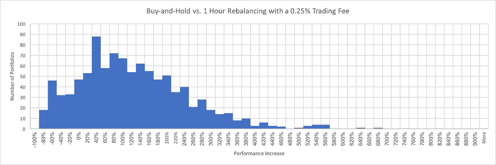
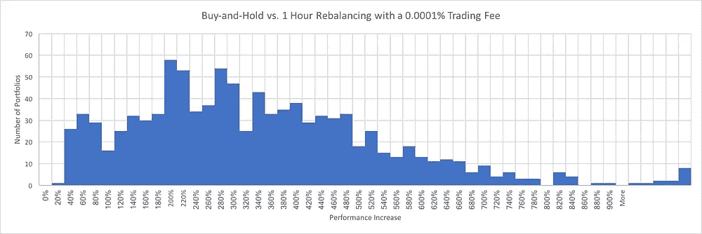

# 加密投资组合再平衡:交易费用分析

> 原文：<https://medium.com/hackernoon/crypto-portfolio-rebalancing-a-trading-fee-analysis-eb9a34f692ac>

随着 Shrimpy 继续成长并扩展其加密领域的产品功能，我们最常问的问题之一是——对我来说，最佳的再平衡策略是什么？鉴于各种交易所和交易平台收取的交易费用各不相同，在决定主要在哪个交易所或交易平台进行交易时，自动再平衡策略的投资组合表现可能会有所不同。

这项研究将进一步研究交易费用及其对投资组合表现的影响。不要忘记阅读我们最近的研究，该研究评估了基于阈值的再平衡 [**这里**](https://blog.shrimpy.io/blog/the-best-threshold-for-cryptocurrency-rebalancing-strategies) 。

 [## 阈值再平衡——加密货币投资组合管理的演变

### 在 Shrimpy 应用程序中，阈值再平衡是一种策略，用户可以实施它来控制风险…

blog.shrimpy.io](https://blog.shrimpy.io/blog/threshold-rebalancing-the-evolution-of-cryptocurrency-portfolio-management) 

# 分析

## 来源

这项研究的数据由 [CoinAPI](https://coinapi.io/) 提供。使用他们的[rest API](https://docs.coinapi.io/#order-book)，我们能够在每个再平衡时间间隔编译 Bittrex 上可用的 20 个最佳买价和 20 个最佳卖价。我们的数据从 2017 年 3 月 15 日开始，一直持续到 2018 年 10 月 20 日。

CoinAPI 是一项从无数交易所收集数据的服务。像 Shrimpy 这样的应用程序可以使用这些数据来构建精确的回溯测试、市场分析和综合研究。

## 交易

*   费用—所有交易都包括相关费用(0.0001%、0.05%、0.10%、0.15%、0.20%、0.25%)

## 再平衡期

*   重新平衡周期— 1 小时、1 天、1 周和 1 个月

[**了解有关加密货币再平衡的更多信息。**](https://blog.shrimpy.io/blog/portfolio-rebalancing-for-cryptocurrency)

## 投资组合规模

*   初始投资组合价值—5，000 美元
*   资产数量—每个投资组合 10 项资产

[**了解有关投资组合中资产数量如何影响业绩的更多信息。**](https://blog.shrimpy.io/blog/crypto-users-who-diversify-perform-better)

## 资产选择

*   投资组合构建—从 Bittrex 上 3–15–17 和 10–20–18 之间的可用资产中随机选择

[**了解如何建立强大的投资组合。**](https://blog.shrimpy.io/blog/10-tips-for-creating-a-killer-cryptocurrency-portfolio)

## 回溯测试

*   回溯测试次数—每个交易费和再平衡期对 1，000 次回溯测试

阅读更多关于回溯测试的内容，或者自己运行。

# 结果

每次回溯测试的表现是通过获取最终的再平衡值并将其与最终的买入并持有值进行比较来确定的。这是通过以下等式实现的:(Rf — Hf) / Hf，其中 Rf 是最终再平衡值，Hf 是最终买入并持有值。

## 1 个月重新平衡

在检查的所有重新平衡期内，随着费用的增加，1 个月的重新平衡期经历的性能漂移最小。从概念上考虑不同再平衡期之间的比较，有理由认为每月再平衡受费用的影响较小，因为每月再平衡执行的交易比较短的再平衡期少得多。随着资产价格的漂移，它们经常振荡或改变方向，因此资产的价格很少总是上升或下降。月度再平衡不会捕捉到一个月中发生的所有波动。然而，这些方向变化将通过更频繁的再平衡来观察，从而导致更高的交易量和费用。此外，结果是，在所研究的所有再平衡期内，每月再平衡从交易费用下降中获益最少。

This table illustrates the median performance of 1,000 backtests which were run with each of the trading fees depicted above. The median final value is the value of the median portfolio after the backtest is complete. Each backtest is allocated $5,000 at the start, so a final value of $70,311.19 which was achieved for buy-and-hold suggests a median performance increase of 1,306%. The median percent increase over buy-and-hold is how much better the median final value performed than the median buy-and-hold value.

## 1 周重新平衡

与每月一次的重新平衡相比，一周的重新平衡期表现出约 30%的性能提升。类似于每月重新平衡在降低费用时不会导致大的性能提升，每周重新平衡仅观察到约 5–6%的性能提升。虽然每一个百分比都很重要，但接下来的回溯测试(着眼于每日和每小时的重新平衡)将展示更深刻的性能变化。

This table illustrates the median performance of 1,000 backtests which were run with each of the trading fees depicted above. The median final value is the value of the median portfolio after the backtest is complete. Each backtest is allocated $5,000 at the start, so a final value of $75,248.87 which was achieved for buy-and-hold suggests a median performance increase of 1,405%. The median percent increase over buy-and-hold is how much better the median final value performed than the median buy-and-hold value.

## 1 天重新平衡

考虑到所有检查的交易费用，每日再平衡成为表现最好的再平衡期。与每日再平衡相比，唯一显示出明显改善的费用是 0.0001%的交易费。与每月的再平衡相比，每日的再平衡在所有研究的交易费用上有超过 60%的差异。此外，我们可以看到 0.25%的交易费和 0.0001%的手续费之间有 20%的性能差异。如此大范围的业绩结果说明了降低利用每日再平衡策略的投资组合的费用的重要性。

This table illustrates the median performance of 1,000 backtests which were run with each of the trading fees depicted above. The median final value is the value of the median portfolio after the backtest is complete. Each backtest is allocated $5,000 at the start, so a final value of $70,894.79 which was achieved for buy-and-hold suggests a median performance increase of 1,318%. The median percent increase over buy-and-hold is how much better the median final value performed than the median buy-and-hold value.

## 1 小时重新平衡

每小时的重新平衡产生了最广泛的性能结果。当使用 0.25%的交易费时，性能提升了 94.28%，每小时重新平衡的结果低于每日重新平衡和每周重新平衡。然而，随着交易费用的降低，每小时重新平衡的性能迅速提高。这种上升一直持续到交易费用接近 0 时，每小时再平衡的表现超过所有其他检查的再平衡期。

这些结果强调，如果每小时执行一次再平衡周期，就应该注意降低交易费用。由于测试的最高和最低费用之间有大约 100%的业绩差异，交易费用对该投资组合策略的成功至关重要。

This table illustrates the median performance of 1,000 backtests which were run with each of the trading fees depicted above. The median final value is the value of the median portfolio after the backtest is complete. Each backtest is allocated $5,000 at the start, so a final value of $70,506.36 which was achieved for buy-and-hold suggests a median performance increase of 1,310%. The median percent increase over buy-and-hold is how much better the median final value performed than the median buy-and-hold value.

# 结论

在一个图表中比较所有的结果，我们可以得到一个有趣的画面，交易费用如何影响每个再平衡频率的性能。从图中，我们可以看到，当我们接近一个没有交易费的场景时，最优策略是每小时重新平衡。

从这些结果中，我们可以得出结论，交易费用可以对投资组合的底线表现产生很大的影响。在没有交易费用的完美世界中，每小时的再平衡被证明是最佳策略，

然而，我们还观察到，在有交易费用的现实生活场景中，每日再平衡策略显示出最一致的投资组合回报。即使是小时再平衡，交易费用也必须低至 0.05%，才能与每日再平衡策略的回报相匹配。

从这个分析中，我们可以得出结论，交易费用可能会对各种再平衡策略的绩效产生很大影响。加密空间的不成熟和易变的本质为管理和执行再平衡投资组合策略提供了独特的机会。

免责声明:回溯测试检查过去的表现，并不保证未来的表现。

# 用 SHRIMPY 重新平衡

Shrimpy 是一个免费的应用程序，可以自动执行再平衡策略。我们用于资产分配、回溯测试和指数化市场的专用工具是业内最强大的。无论您是一家[机构](https://institutional.shrimpy.io/)还是个人，我们的解决方案旨在解决密码领域投资组合管理面临的最紧迫问题。

点击[这里](https://www.shrimpy.io/)，立即报名。

如果您仍然不确定，请尝试演示，看看我们提供的一切！

[**Shrimpy 演示**](https://www.shrimpy.io/demo)

别忘了查看一下 [Shrimpy 网站](https://www.shrimpy.io/)，在 [Twitter](https://twitter.com/ShrimpyApp) 和[脸书](https://www.facebook.com/ShrimpyApp)上关注我们的更新，并在[Telegram](https://t.me/ShrimpyGroup)&[Discord](https://discord.gg/gXyy95y)上向我们令人惊叹的活跃社区提问。

留下你的评论，让我们知道你的平衡经验！

捕虾队

*原载于*[*blog . shrimpy . io*](https://blog.shrimpy.io/blog/crypto-portfolio-rebalancing-a-trading-fee-analysis)*。*