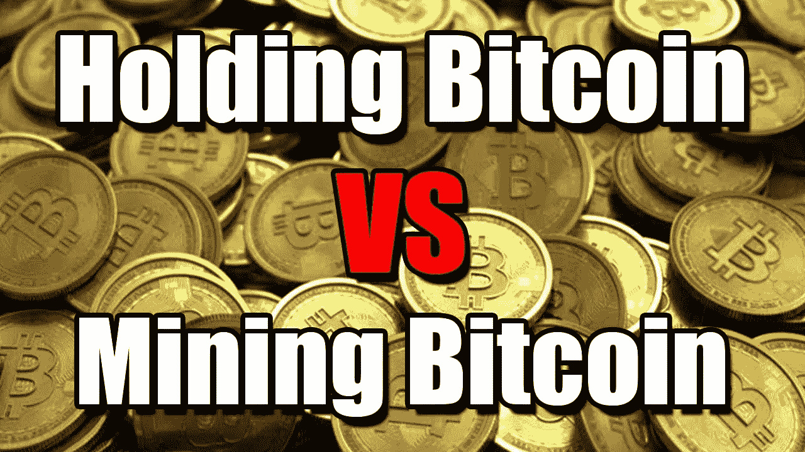
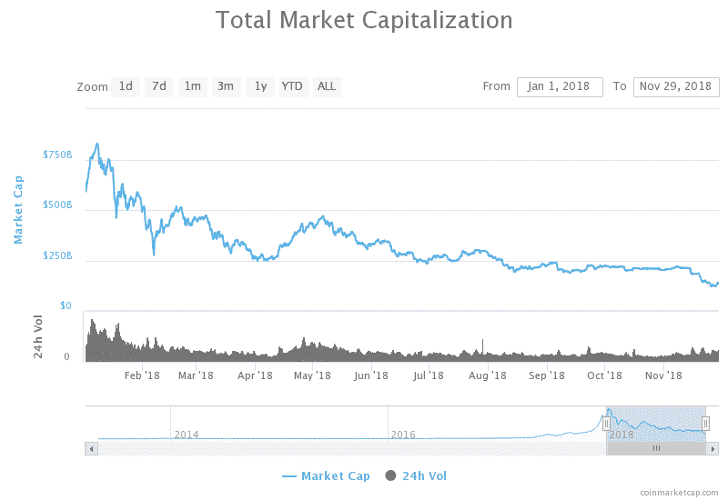
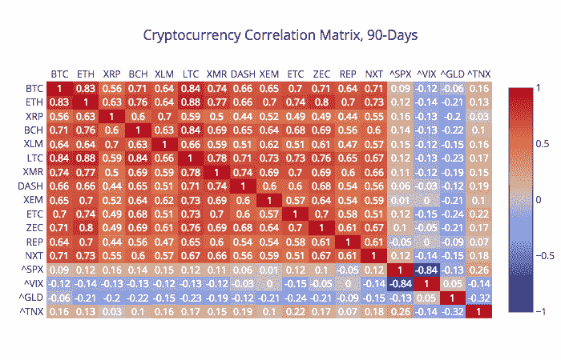
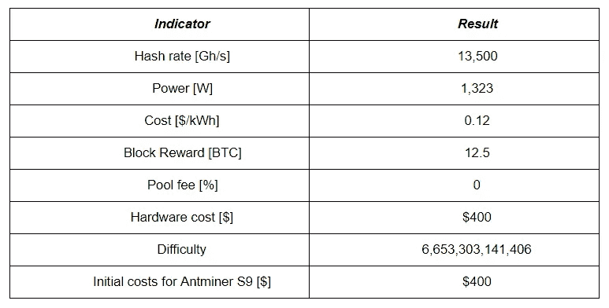
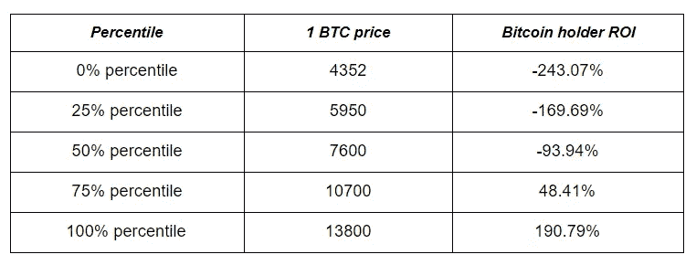
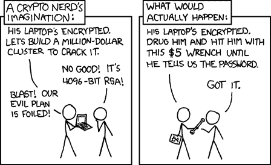

# 加密盈利能力分析:控股与采矿

> 原文：<https://medium.com/hackernoon/crypto-profitability-analysis-holding-vs-mining-c562e0959f1f>

当前的市场状况迫使世界各地的私营矿商认真考虑其业务的潜在价值。原因是:比特币的价格和大规模的监管限制实际上使他们为微薄的收入甚至盈亏平衡而战。另一方面，许多行业专家都注意到了整个加密货币市场，特别是比特币的增长潜力，这为所有相关活动带来了光明的未来。

[https://coinmarketcap.com/charts/](https://coinmarketcap.com/charts/)

我们将一起考虑在当前条件下采矿的盈利能力，以及采矿和投机比特币的收益率，并考虑到未来一年的趋势。这个想法是为了最终发现矿商是否必须关心市场和他们的总体地位。上面提到的机会会带来想要的收益吗？让我们深入了解一下。

# 市场是熊市，但迹象看起来是积极的

[比特币挖掘](https://www.investopedia.com/terms/b/bitcoin-mining.asp)过程实质上是在一个区块链中生成新的区块，并记录在该区块链中发生的交易。当一个矿工或一群矿工设法找到一个新的区块时，他们会因所做的工作获得奖励——一定数量的各自区块链的加密货币，在这种情况下是 BTC。

决定加密开采盈利能力的外部关键因素是加密市场的情绪，而这恰好是由比特币引领的。2017 年 12 月，由于[持续的实力、日益增长的兴趣和广泛的媒体报道，比特币的价格超过了](https://www.forbes.com/sites/cbovaird/2017/09/01/why-bitcoin-prices-have-risen-more-than-400-this-year/#31bb8c536f68)[2 万美元大关](https://finance.yahoo.com/quote/BTC-USD/chart?p=BTC-USD#eyJpbnRlcnZhbCI6IndlZWsiLCJwZXJpb2RpY2l0eSI6MSwiY2FuZGxlV2lkdGgiOjIuNjI4NTA0NjcyODk3MTk2LCJ2b2x1bWVVbmRlcmxheSI6dHJ1ZSwiYWRqIjp0cnVlLCJjcm9zc2hhaXIiOnRydWUsImNoYXJ0VHlwZSI6ImxpbmUiLCJleHRlbmRlZCI6ZmFsc2UsIm1hcmtldFNlc3Npb25zIjp7fSwiYWdncmVnYXRpb25UeXBlIjoib2hsYyIsImNoYXJ0U2NhbGUiOiJsaW5lYXIiLCJzdHVkaWVzIjp7InZvbCB1bmRyIjp7InR5cGUiOiJ2b2wgdW5kciIsImlucHV0cyI6eyJpZCI6InZvbCB1bmRyIiwiZGlzcGxheSI6InZvbCB1bmRyIn0sIm91dHB1dHMiOnsiVXAgVm9sdW1lIjoiIzAwYjA2MSIsIkRvd24gVm9sdW1lIjoiI0ZGMzMzQSJ9LCJwYW5lbCI6ImNoYXJ0IiwicGFyYW1ldGVycyI6eyJ3aWR0aEZhY3RvciI6MC40NSwiY2hhcnROYW1lIjoiY2hhcnQifX19LCJwYW5lbHMiOnsiY2hhcnQiOnsicGVyY2VudCI6MSwiZGlzcGxheSI6IkJUQy1VU0QiLCJjaGFydE5hbWUiOiJjaGFydCIsInRvcCI6MH19LCJzZXRTcGFuIjp7ImJhc2UiOiJhbGwiLCJtdWx0aXBsaWVyIjoxfSwibGluZVdpZHRoIjoyLCJzdHJpcGVkQmFja2dyb3VkIjp0cnVlLCJldmVudHMiOnRydWUsImNvbG9yIjoiIzAwODFmMiIsImV2ZW50TWFwIjp7ImNvcnBvcmF0ZSI6eyJkaXZzIjp0cnVlLCJzcGxpdHMiOnRydWV9LCJ0ZWNobmljYWwiOnt9LCJzaWdEZXYiOnt9fSwiY3VzdG9tUmFuZ2UiOm51bGwsInN5bWJvbHMiOlt7InN5bWJvbCI6IkJUQy1VU0QiLCJzeW1ib2xPYmplY3QiOnsic3ltYm9sIjoiQlRDLVVTRCJ9LCJwZXJpb2RpY2l0eSI6MSwiaW50ZXJ2YWwiOiJ3ZWVrIiwic2V0U3BhbiI6eyJiYXNlIjoiYWxsIiwibXVsdGlwbGllciI6MX19XX0%3D)。社区[对比特币的增长做出了积极的预测](https://www.forbes.com/sites/forbestechcouncil/2017/11/27/five-reasons-bitcoin-will-be-your-best-high-growth-investment-for-2018/#23f66ea447e8)，提升了人们对挖掘过程和广泛技术认可可能性的兴趣。

然而，在 2018 年初，发生了一件(不完全如此)意想不到的事情——比特币的价值大幅下跌。到 2 月初，一个 BTC 的价值还不到 7000 美元。由于加密货币[与比特币](https://www.sifrdata.com/cryptocurrency-correlation-matrix/)的巨大相关性，整个市场在 2018 年上半年遭受了 [65%的下跌](https://www.coindesk.com/price/)，这反过来严重警告了潜在和当前的投资者。据称，加密货币目前(或已经)在广泛的市场动态中整体下跌，通常被称为熊市趋势，甚至被称为“[加密冬天](/outlier-ventures-io/are-we-in-a-crypto-winter-back-to-the-future-ii-cf02f5afe754)”

[https://www.sifrdata.com/cryptocurrency-correlation-matrix/](https://www.sifrdata.com/cryptocurrency-correlation-matrix/)

环境也发生了变化。 [Twitter 和脸书已经禁止了加密货币广告](https://www.theverge.com/2018/3/26/17164426/crypto-twitter-ban-bitcoin-cryptocurrency-ads)(T8 归因于 ICO 炒作)。这个空间突然从无政府状态转变为一个规范和制度化的环境。区块链的法律地位仍然因国家而异。此外，[世界各地的监管机构](https://www.marketwatch.com/story/heres-how-the-us-and-the-world-are-regulating-bitcoin-and-cryptocurrency-2017-12-18)已经开始应对虚拟货币带来的挑战，这些虚拟货币大多绕过受监管的银行、金融公司、交易所和中央清算所。

比特币似乎已经在 4000 美元以下找到了底部，我们可能已经看到市场在复苏，特别是在考虑了行业专家的意见之后。他们预测价格差异从 7700 美元到难以想象的 15 万美元，未来 BTC 价格不会下降。除此之外，SEC 关于 2019 年 2 月推出比特币 ETF 的决定被视为增长的积极迹象。 [ETF](https://www.investopedia.com/investing/bitcoin-etfs-explained/) 是一种追踪特定资产或一组资产表现的投资工具。这将吸引大量投资者，因为 ETF 允许投资者在不实际拥有标的资产的情况下分散投资。因此，所有者不必担心加密货币投资者所需的复杂存储和安全程序。这个“隐秘的冬天”似乎已经开始解冻，因为我们正开始走向“隐秘的春天”

# 采矿还有利可图吗？

显而易见，所有市场参与者都对 BTC 的价格上涨感到兴奋，但矿商也受到许多其他因素的影响:

*   电费
*   功率消耗
*   硬件的可用性和价格
*   提供服务的[难度](https://en.m.bitcoinwiki.org/index.php?title=Difficulty_in_Mining&mobileaction=toggle_view_mobile)(用于显示找到[哈希](https://www.investopedia.com/terms/h/hash.asp)的难度的值)。
*   BTC 价格

[Source](https://en.m.bitcoinwiki.org/index.php?title=Difficulty_in_Mining&mobileaction=toggle_view_mobile)

因此，采矿成本既取决于地理等外部因素，也取决于与采矿硬件选择有关的内在因素。对所有这些因素进行分析和量化后，我们可以确定采矿的收入和成本，并得出下一年该流程盈利能力的结论。

***关键假设:*** 考虑到日益增长的 [BTC 散列率](https://www.blockchain.com/charts/hash-rate)和所需 PC 知识的复杂性，在 CPU 或显卡上的挖掘正逐渐失去其相关性。有效的比特币挖掘仍然只有在高性能的专用集成电路上才有可能——[ASIC](https://en.bitcoin.it/wiki/ASIC)(专用集成电路)。作为目前可用的最强大的，ASICs 和 [Antminer S9](https://www.asicminervalue.com/miners/bitmain/antminer-s9-13-5th) 是这次评估的基础。

Antminer S9 的技术特征:

鉴于采矿盈利能力在很大程度上依赖于整个加密市场的动态，在本次计算中，我们假设比特币的价格在预测期内绝对不变，按照 Bitfinex 过去七天的汇率，其价格为 4352 美元。其他技术规格也固定在当前水平。因此，为了使这种分析更加面向今天，我们开始计算在当前价格和成本下采矿的当前盈利能力，以便在不受市场变化或逆转效应影响的情况下估算盈利能力。

机会的效率是通过总投资回报(ROI)来评估的。ROI 衡量投资相对于初始成本的利润。为了计算投资回报率，投资的收益(或回报)除以投资的成本。

计算过程如下:

*矿业投资回报率=利润/成本* 100% =(收入-成本)/成本* 100%*

*收益=((哈希率*时间*区块奖励)/(2 *难度))*比特币价格*

*成本=(电力*电费)+初始硬件成本*

***结果:*** 这些计算得出的结果是 **-** $972.28 的绝对年回报率，即一年期的投资回报率为-243.07%。事实上，基于 BTC 的当前价格，矿商的回报目前是负数。为了让矿商再次达到收支平衡，在使用我们的等式时，价格将不得不增加到每 BTC 9640 美元。

# 案例研究:比特币挖矿与持有回报的比较

这个案例研究的想法是从投资回报率的角度来定义什么更有利可图——连续开采比特币一年，或者购买 1 BTC 并在出售前的相同时间内持有。

比特币持有者投资回报率的计算将是当前和预测的明年 BTC 价格之间的比率。比特币持有的投资回报率公式如下:

*投资回报率比特币持有者= (X 百分位 BTC 价格-现价)/现价*

看看 BTC 的价格历史，如果我们取过去 15 个月的中值[价格，我们大约有 7600 美元。在这段时间内，我们可以使用平均高低月来解释数据的不规则性。无论如何，这都不是一个完美的预测，但过去的经验表明，BTC 市场的涨跌几乎没有明显的逻辑。](https://www.statista.com/statistics/326707/bitcoin-price-index/)

最终结果应该以[百分位数](https://marketbusinessnews.com/financial-glossary/percentile-definition-meaning/)的形式呈现——一个 100%的数字，表示所有分布值等于或低于它的百分比。

最后，下表列出了一年期 BTC·霍尔德按百分位排列的投资回报率:

现在让我们将这些结果与矿工获得的回报进行比较。首先，我们假设 BTC 价格将在今年年底逐渐上升到共识中值(7600 美元)。之后，我们需要取当前价格和 1 年后价格的平均值(以估计预期矿工收益):

*明年平均 BTC 价格=(分析师预测价格中值+当前价格)/ 2*

在矿工的投资回报率计算中严格按照相同的投入实施这个价格，我们发现最终回报等于-168.49%。

***结果:*** 根据预测的 BTC/美元价格，很明显，如果预测价格保持不变，采矿在不久的将来将无利可图。除非 BTC 价格大幅上涨，否则单个矿商无法在市场上维持下去。即便如此，难度也会随之增加，采矿回报也会相应减少。另一方面，如果你今天购买 1 BTC，并在下一年持有，你将获得大约 75%的投资回报率。

# 你应该把你的比特币放在哪里？

当谈到存储你的比特币(和其他加密货币)时，用户应该考虑几个关键选项:

*   **冷藏** —这个选项通常需要使用 USB 钱包，如 [Ledger Nano S](https://www.ledger.com/products/ledger-nano-s) 或 [Trezor](https://trezor.io/) 来离线存储你的加密货币。如果你打算长期持有你的加密货币，没有兴趣花掉它们，宁愿把它们放在抽屉里忘记它们，这个选项是很好的。使用冷藏库的主要缺点是你的货币不容易交易，因为你必须把它们“送到”交易所。如果你丢失了你的闪存盘(和你的记忆短语)，你就失去了你的钱，这需要一点专业知识来设置它。尽管现在有了一步一步的指导，但这仍然比注册银行账户需要更多的时间和精力。
*   **储存在交易所**——对于那些每天交易或者没有太多交易的人来说，有时把你的密码放在交易所更容易，这样它就可以随时交易。通常情况下，像[币安](https://www.binance.com/en)或 [Bitfinex](https://www.bitfinex.com/) 这样的交易所具有非常高的安全性，你只需要记住用户名/密码就可以登录(或者你可以激活双因素登录)。这是最不推荐的选择，因为有时[交换会被黑客攻击](https://blockonomi.com/mt-gox-hack/)并且加密无法恢复。
*   **使用加密银行** —“加密银行”结合了两个世界的优点，因为你的资金很容易获得(就像在交易所一样)，但它们也被锁在冷库里以确保安全。 [BitSafe](http://bitsafe.io/) 是一个加密银行选项，其背后的理论与法定银行相同:你可以轻松地在你的账户之间(或向朋友)转账，向商家付款，在交易所交易，以及通过用户友好的应用程序或在线进行更多交易。它与普通银行的不同之处在于，它基于加密货币，而不是简单地显示你的账户余额而不进行验证，他们使用[账户偿付能力](/bitsafe/proof-of-solvency-for-user-balances-e3b7fab9ffac)将你的账户与区块链上的实际(可验证的)比特币联系起来。如果你不想随身携带手机，BitSafe 将提供信用卡/借记卡，这意味着你可以在任何接受该卡的地方使用加密货币。

[https://xkcd.com/](https://xkcd.com/)

不管你把硬币存放在哪里，重要的是你知道如何获取它们，并且你了解每种服务的利弊。通常情况下，安全性和便利性之间的权衡是非常值得的，就像 BitSafe 的情况一样，但如果你要储存大量的钱，那么总是建议使用冷藏钱包。

# 结论

总之，密码市场仍然提供了各种赚钱的机会。尽管 BTC 矿业现在低于盈利门槛，但假设基于过去历史的市场预期仍然成立，个体采矿者不应指望明年的投资回报率为正。相反，经典的买入并持有策略可以让比特币投资者在此期间获得约 75%的收益。这使得实施变得容易，并且不需要处理额外的技术和能量问题。

## 关于作者:

基里尔·希洛夫——geek forge . io 和 Howtotoken.com 的创始人。采访全球 10，000 名顶尖专家，他们揭示了通往技术奇点的道路上最大的问题。加入我的**# 10k QA challenge:**[geek forge 公式](https://formula.geekforge.io/)。