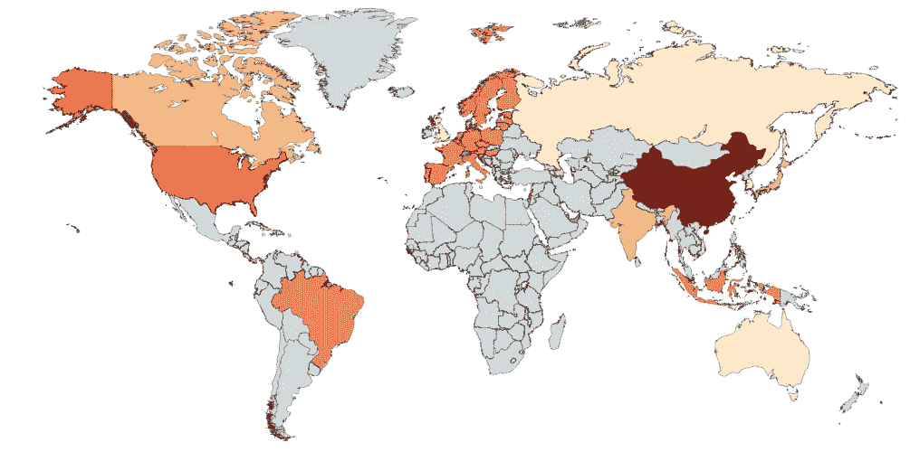

# 加密监管数据库:管理 ICO 监管风险的经济有效的方法？

> 原文：<https://medium.com/hackernoon/crypto-regulatory-databases-a-cost-effective-way-to-manage-ico-regulatory-risks-e277d632f88a>

[Crypto Regulatory Databases](http://www.cryptordb.com/) — a cost-effective way of managing regulatory risks?

*根据我们的经验，有限的前期资金和在众多司法管辖区确定大量法规的困难，使得合规性对于加密业务来说尤其具有挑战性。不合规会危及加密项目，并对其创始人和团队产生严重影响。*

*知道如何优先考虑大量的监管问题，结合对各国正在采取的政策方针的整体理解，是关键。*

*受世界银行“做生意容易”排名的启发，Lupercal 是第一批开创加密货币监管综合数据库***的公司之一。我们的**

**这篇文章解释了为什么使用监管数据库是中小型加密企业、早期 ICO 项目监管风险管理的最佳方法，并能保持对快速监管发展的了解。**

***背景***

*加密货币行业正在经历一个非凡的增长期。许多加密货币的价格处于历史高点，越来越多的实体正在寻求举办首次硬币发行或代币生成活动(本文中我们统称为 ICO)。*

*ICO 的繁荣吸引了世界各地监管者的注意——包括最近来自美国证券交易委员会的警告信息。*

## *加密货币行业的监管*

*对于所有加密货币业务来说，遵守监管正成为越来越重要的考虑因素，因为监管调查即将到来的风险越来越大。*

*不合规可能会带来严重的处罚，在极端情况下，可能会终结加密业务。*

*到目前为止，大多数注意力都集中在 ICO 上，但监管对所有类型的加密业务都有重大影响:后 ICO 项目、加密货币交易所和希望在现有业务中采用加密货币的实体。尽管早期的 crypto 认为自己在法律之外，但不遵守任何法规并不是商业上可行的选择。*

****调控对市场的影响****

*监管继续对市场产生极其重大的影响，最近韩国在 1 月 11 日提出禁止加密交易所的提案后迅速出现的恐慌性抛售就突显了这一点。成功的 ico 对优化其加密市场平台有着敏锐的理解——跟上监管变化是做到这一点的关键。*

## ***密码业务的监管问题***

*加密业务通常是国际性的。通常，随着业务的增长，他们的国际影响力也在增长——他们可能会从韩国开始，随着收入的增长，逐渐扩大供应链，包括中国和马来西亚，或者销售到日本和新加坡。这意味着，随着业务的发展，他们可以优先考虑需要哪些监管建议。*

*加密业务的国际性质并没有给他们这种奢侈。他们经常不得不同时考虑所有司法管辖区的法律(可能在获得任何收入之前)。这可能极其复杂，而且可能非常昂贵。*

## ***为什么这么难？***

*业内众所周知，美国针对 ico 的证券法可能存在问题。而且中国对密码监管的方式通常会使其难以操作。反洗钱法规是需要考虑的重要因素。*

*但这只是监管冰山一角。英国证券法有哪些考虑因素？还是欧盟？还是香港？还是澳洲？*

*如果代币不是证券，是否适用其他金融/公司法法规？*

*有保护知识产权的选择吗？*

*什么样的消费者法律考虑可以发挥作用？*

*一个国家政府的总体方针是什么——这种政策方针可能会影响未来的法规。*

*一个国家的答案在另一个国家可能完全不同。不遵守某些法规的风险可能会大不相同。更糟糕的是，大多数国家尚未就如何将现有监管应用于加密货币发布公开指导。*

## *答案— [监管数据库](http://www.cryptordb.com/)*

*成功管理监管风险的关键是知识和优先顺序。*

*对于较小的项目，聘请专业顾问来解决所有潜在的监管问题可能成本高昂，而且可能没有必要。但是遗漏了特定的问题会对项目的未来产生重大的影响。*

*监管数据库(如 Lupercal 的 [CryptoRDB](http://www.cryptordb.com/) )提供了密码业务/ico 所需的工具来帮助识别:*

*   *关键监管考虑事项的清单；*
*   *概述可能出现的监管问题；*
*   *哪些司法管辖区更容易和更难执行加密项目(以及应避免哪些司法管辖区)；*
*   *政府(长期)和监管者(短期)的政策方针。*

*因此，监管数据库为您提供了所需的工具，帮助您确定何时需要建议，以经济高效的方式内部监督某些监管问题，或者向更了解需要什么的顾问咨询。*

## *查看我们的 [Lupercal Capital 的 CryptoRDB](http://www.cryptordb.com/)——世界领先的加密货币监管数据库。*

## *立即订阅，享受重大折扣。*

****或者，前往***[***LupercalCapital.com***](http://lupercalcapital.com)***了解更多有关我们量身定制的 crypto/ICO 咨询&项目管理服务的信息。****