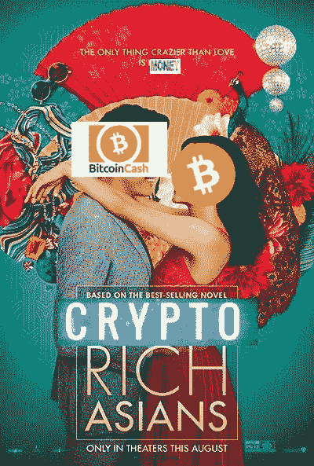

# 富有的亚洲人

> 原文：<https://medium.com/hackernoon/crypto-rich-asians-5d019f4e014a>

## 🌟检查我们的电影演员

> 富有的亚洲人在读什么？

[疯狂富有的亚洲人](https://globalcoinresearch.us17.list-manage.com/track/click?u=859b0d423a7f7baa4cdb46f26&id=3a9e773ae8&e=e8de32e54d)是一部新上映的电影。亚洲人。人。正在谈论。对于那些可能没有意识到它对亚裔(美国人)社区的重要性的人来说，这是自《喜福会》以来美国第一部全亚裔主流电影。但是，唉,$$主题在那里，但是 Crypto 主题不见了。为什么这些家伙不能让电影*更有共鸣呢？*

这是我版本的亚洲加密富豪

[推文](http://twitter.com/share?url=https%3A%2F%2Fmailchi.mp%2Fcab9824ac133%2Fsouth-korea-to-arrest-hts-coin-execs-china-to-use-blockchain-for-credit-system-okex-coin-ceo-resigns-333305&text=Crypto+Rich+Asians+via+%40Globalcoinrsrch&count=none)

如果我们有一部亚洲秘密富豪电影，演员反映了真实世界的亚洲秘密富豪，故事和情节将会非常有趣。这些是我想在屏幕上看到的人。这些人没有特定的排名，因为一旦你的净资产超过 10 亿美元，你还有多少钱真的重要吗？我确信很多 Crypto 的人不同意我的观点。\_(ツ)_/

*   来自的吴和 Micree Zhang-----------------------------------------------------《比特大陆》预计将在 400-500 亿美元范围内进行首次公开募股，而和 Micree 将从中获得最大收益。该公司并没有放弃太多的股权，因为他们直到公司成立 4 年后才筹集到 A 轮融资。
*   币安- CZ 的赵昌鹏有一个叫何毅的联合创始人，负责营销和业务，但他可能拥有币安的大部分股份。无论市场是涨是跌，币安永远有生意，CZ 永远赢。
*   INBlock 的李笑来承认他从他的 EOS 投资中获得了 200 倍的收益，我们认为他可能做得很好**。**EOS:**我们花了 150 万美元购买了 5%的股份，估值为 3000 万美元。现在它价值 60 亿美元，是 200 倍。光是这个项目就可能让我成为 2017 年世界上最好的天使投资人，因为它发展得太快了”**
*   **洪——Neo 创始人，从中国早期的加密开始就在那里工作**
*   **贾斯汀·孙——鉴于创的代币市值为 15 亿美元，加上贾斯汀·孙的商业头脑，我们认为创不会很快消失**
*   **莱特币-查理·李。现在他卖掉了他所有的莱特币，他意识到这不是一个正确的决定**
*   **沈波— [分不实合伙人，](https://globalcoinresearch.us17.list-manage.com/track/click?u=859b0d423a7f7baa4cdb46f26&id=f3f27bc12d&e=e8de32e54d)Vitalik 担任基金顾问**
*   **还有更多…我可能错过了太多。肯定会有续集的。**
*   **你认为谁应该上榜？**

# **[现在就订阅](https://globalcoinresearch.substack.com/subscribe?)**

**🌟**周三至周五亚洲要闻****

**币安·LCX，币安和列支敦士登加密资产交易所的合资企业，是一个法定到加密交易所的**发布。[http://bit.ly/2vSS7mH](https://globalcoinresearch.us17.list-manage.com/track/click?u=859b0d423a7f7baa4cdb46f26&id=7bf5a23bda&e=e8de32e54d)****

**截至 2018 年 8 月 7 日，中国与加密货币相关的法律案件有 274 起。最近，中国法院在没有直接讨论比特币交易平台是否非法的情况下做出了裁决。[http://bit.ly/2vPU3N4](https://globalcoinresearch.us17.list-manage.com/track/click?u=859b0d423a7f7baa4cdb46f26&id=727ec469e1&e=e8de32e54d)**

**中国江苏国际集团如何从中国投资者那里获得 10 亿美元的信贷额度，帮助歌手阿肯在非洲上市，随后又推出了 Akoin。【http://bit.ly/2OKH6uC 号**

**一系列新的推文引发了人们对**币安将与 XRP 展开大动作的猜测。**[http://bit.ly/2OKlEpO](https://globalcoinresearch.us17.list-manage.com/track/click?u=859b0d423a7f7baa4cdb46f26&id=cbbfa9788c&e=e8de32e54d)**

**💰交易和风险**

****SFOX 是一家面向高交易量交易商和机构投资者的加密货币交易商，已在由 Tribe Capital 和 Social Capital 牵头的 A 轮融资**中筹集了 2270 万美元。[http://bit.ly/2MxagQE](https://globalcoinresearch.us17.list-manage.com/track/click?u=859b0d423a7f7baa4cdb46f26&id=5f084aa498&e=e8de32e54d)**

**交易所火币对符合美国标准的安全令牌交易平台 OpenFinance Network 进行了重大投资。[http://bit.ly/2ONqiUa](https://globalcoinresearch.us17.list-manage.com/track/click?u=859b0d423a7f7baa4cdb46f26&id=278c2a543f&e=e8de32e54d)**

**Krungsri Finnovate 是 Krungsri(泰国 Ayudhya 银行)**的风险投资基金，致力于投资日本的 SBI AI &区块链基金，**这是自成立以来的第四笔交易。[http://bit.ly/2vVqkSE](https://globalcoinresearch.us17.list-manage.com/track/click?u=859b0d423a7f7baa4cdb46f26&id=4b6d349460&e=e8de32e54d)**

**Dymon Asia Ventures 为其首笔 5000 万美元的专注于金融科技的基金做了最后的收尾工作。[http://bit.ly/2OHnpnF](https://globalcoinresearch.us17.list-manage.com/track/click?u=859b0d423a7f7baa4cdb46f26&id=93362d3f83&e=e8de32e54d)**

**中美投资公司正瞄准今年推出的超过 40 亿美元的新基金。GGV 在 SEC 注册了一只 18 亿美元的基金。[https://tcrn.ch/2vUfoVt](https://globalcoinresearch.us17.list-manage.com/track/click?u=859b0d423a7f7baa4cdb46f26&id=5188f507df&e=e8de32e54d)**

**日本社交消息应用程序 LINE 宣布成立 1000 万美元的区块链风险基金。http://bit.ly/2vZN8kv**

**💰硬币和代币新闻**

**由 ICON Foundation 赞助的全球加速器计划**ICX 站正式启动。[http://bit.ly/2MEJtSJ](https://globalcoinresearch.us17.list-manage.com/track/click?u=859b0d423a7f7baa4cdb46f26&id=3a415f83f5&e=e8de32e54d)****

**[**Tron**](https://globalcoinresearch.us17.list-manage.com/track/click?u=859b0d423a7f7baa4cdb46f26&id=0614f9497c&e=e8de32e54d) **获得**[**blockchain.org**](http://blockchain.org/)**域名。****

**exec 说，Ripple“肯定”想用其位于区块链的支付技术瞄准中国。[https://cnb.cx/2L1OQXd](https://globalcoinresearch.us17.list-manage.com/track/click?u=859b0d423a7f7baa4cdb46f26&id=07e33db6d5&e=e8de32e54d)**

**💸交换新闻**

**中国交易所火币网及其合作伙伴正在五个地区推出加密货币交易所:菲律宾、俄罗斯、台湾、印度尼西亚和加拿大。[http://bit.ly/2vRWfUd](https://globalcoinresearch.us17.list-manage.com/track/click?u=859b0d423a7f7baa4cdb46f26&id=f43049c1a3&e=e8de32e54d)**

****火币推出全新 HADAX 2.0** 包括火币自动挂牌平台、火币区块链项目展示中心、HADAX 公众投票平台。[http://bit.ly/2KZ39f3](https://globalcoinresearch.us17.list-manage.com/track/click?u=859b0d423a7f7baa4cdb46f26&id=d8752b4b43&e=e8de32e54d)**

**🎌监管新闻**

***中国媒体* **上海市政府与阿里巴巴和蚂蚁金服**签署战略合作协议，以创新和制造业升级提升该地区，包括区块链计划。[谷歌翻译](https://globalcoinresearch.us17.list-manage.com/track/click?u=859b0d423a7f7baa4cdb46f26&id=a0d7c0256a&e=e8de32e54d)**

**作为该国国内市场正规化的一部分，泰国监管机构迄今已批准七家商业实体开展加密货币业务。【http://bit.ly/2MAZwAL 号**

**在过去的两个月里，**南韩本地加密市场的投资者不断表达他们对加密监管格局的巨大变化的乐观态度。**[http://bit.ly/2MAAqSG](https://globalcoinresearch.us17.list-manage.com/track/click?u=859b0d423a7f7baa4cdb46f26&id=4fba11a298&e=e8de32e54d)**

****韩国的加密货币交易所谴责该国政府将其排除在风险企业分类之外**。[http://bit.ly/2vUcj7L](https://globalcoinresearch.us17.list-manage.com/track/click?u=859b0d423a7f7baa4cdb46f26&id=299eeb001f&e=e8de32e54d)**

**💼商业新闻**

****中国零售商 JD.com 推出新的区块链技术平台**，帮助企业客户构建、托管和使用他们自己的区块链运营管理应用。[http://bit.ly/2vRYl6x](https://globalcoinresearch.us17.list-manage.com/track/click?u=859b0d423a7f7baa4cdb46f26&id=50fdb35e16&e=e8de32e54d)**

**国家支持的中国银行和金融服务公司中国银联(ChinaUnionPay)已经达成合作，探索区块链的支付业务。[http://bit.ly/2MAfNGb](https://globalcoinresearch.us17.list-manage.com/track/click?u=859b0d423a7f7baa4cdb46f26&id=ae8a86671c&e=e8de32e54d)**

**CoinDrop，**一项帮助任何人轻松接收加密货币“空投”的服务。[http://bit.ly/2MxNrMx](https://globalcoinresearch.us17.list-manage.com/track/click?u=859b0d423a7f7baa4cdb46f26&id=343314f408&e=e8de32e54d)T21****

****中国矿工被流放到俄罗斯、吉尔吉斯斯坦、蒙古、**任何有廉价电力的地方。[http://bit.ly/2vUlO74](https://globalcoinresearch.us17.list-manage.com/track/click?u=859b0d423a7f7baa4cdb46f26&id=b451021f86&e=e8de32e54d)**

****美国种子加速器 Y Combinator 任命百度前 CEO 首席运营官·齐鲁为首席执行官**。http://bit.ly/2MEKNoF**

**中国游戏正在迅速侵蚀韩国市场。**这发生在中国阻止新的韩国游戏在中国发行的时候。**[http://bit.ly/2MAMkM8](https://globalcoinresearch.us17.list-manage.com/track/click?u=859b0d423a7f7baa4cdb46f26&id=c743e0ee42&e=e8de32e54d)**

**🌹🌹🌹到目前为止，你们觉得我们的[全球硬币播客](https://globalcoinresearch.us17.list-manage.com/track/click?u=859b0d423a7f7baa4cdb46f26&id=20cf00da03&e=e8de32e54d)怎么样？关于亚洲，你想读些什么或了解更多？**

**查看我们过去 7 周的文章，分别是[东南亚加密货币发展](https://globalcoinresearch.us17.list-manage.com/track/click?u=859b0d423a7f7baa4cdb46f26&id=b957283150&e=e8de32e54d)、[亚洲加密基金/投资者指南](https://globalcoinresearch.us17.list-manage.com/track/click?u=859b0d423a7f7baa4cdb46f26&id=2605e438e9&e=e8de32e54d)、【Techcrunch Zug 的亚洲加密心得、 [Cryptokitties](https://globalcoinresearch.us17.list-manage.com/track/click?u=859b0d423a7f7baa4cdb46f26&id=686bbc8474&e=e8de32e54d) 、[币安](https://globalcoinresearch.us17.list-manage.com/track/click?u=859b0d423a7f7baa4cdb46f26&id=d6cad07b6c&e=e8de32e54d)、[比特大陆](https://globalcoinresearch.us17.list-manage.com/track/click?u=859b0d423a7f7baa4cdb46f26&id=488a793302&e=e8de32e54d)和[中国加密获奖者](https://globalcoinresearch.us17.list-manage.com/track/click?u=859b0d423a7f7baa4cdb46f26&id=e6063e17e7&e=e8de32e54d)**

# **[订阅](https://globalcoinresearch.us17.list-manage.com/subscribe?u=859b0d423a7f7baa4cdb46f26&id=3419cb7d6e)**