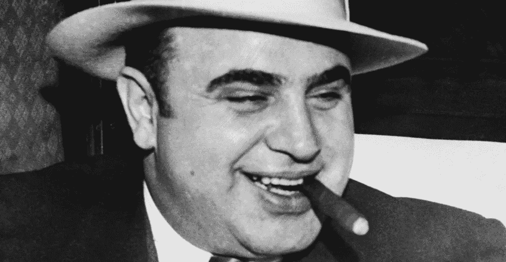

# 加密和可怕的，可怕的，不好的，非常阴谋论令牌列表网站

> 原文：<https://medium.com/hackernoon/crypto-token-listing-sites-are-an-upsell-scheme-48bce663551b>

在过去的一年里，我在推出 benjaCoin 和建议代币销售之间经历了很多。亮点包括一家匿名代币推广机构要价六位数，一个全新的播客提供 20 分钟的广告，要价 15，000 美元，第四级交易所要价 40 万美元的代币上市费。

*呀呀*。

我知道这些计划中的许多将会褪色。我已经看到一些趋势循环往复，我相信市场会处理好其中的大部分，但是**有一个计划似乎不会消失:代币上市网站。**

## 最重要的是:令牌列表网站很重要。

像现有加密货币和代币的 [CoinMarketCap](https://hackernoon.com/tagged/cryptomarketcap) 一样，代币列表网站提供一套关于即将到来或正在进行的代币销售的标准[信息](https://hackernoon.com/tagged/information)。这些网站应该为尽职调查的个人提供一个可靠的起点。

随着代币销售市场的持续增长，对这种资源的需求越来越重要。一些[估计](https://www.coindesk.com/ico-tracker/)2018 年的 ICO 融资已经超过了市场在 2017 年*全年*的融资。随着所有这些新代币销售的出现，能够对它们进行研究是至关重要的。

输入列出站点的令牌。

作为一名令牌顾问，我让我的团队编制了一份由几十个令牌列表站点(TLS)组成的列表，由我们维护并与合作伙伴共享。**在过去的几个月里，我们做出了一些重要的观察，值得分享，因为我们相信代币购买者通常不知道表面之下发生了什么。这是相当虚假的新闻**

## 第一:有付费和免费代币上市网站。

一些顶级域名投入大量时间和金钱来获得一个好域名，致力于搜索引擎优化和内容监管。因此，他们觉得他们应该赚钱，并为他们的努力得到回报。

很难说这一点，但是大多数 TLS 并不区分付费和免费列表。当代币购买者到达 TLS 并看到“特色 ico”或“热门代币销售”时，他们会认为这是基于市场活动或新闻等因素。这种情况很少发生。这几乎总是因为代币销售运营商付费在那里展示。这是一个巨大的问题。

CoinMarketCap 被广泛认为是一种值得信赖的资源，它以一种清晰的方式产生收入，明确区分了付费和免费内容。我们迫切需要令牌列表网站的完整性。由于这些计划，真实资本面临风险，这种情况不能再继续下去了。

快速切线:我不认为我们是唯一认为这些网站有问题的人。在跟踪 TLS 的时候，我们注意到 Wordpress 托管的网站似乎比其他网站消失得更频繁。有可能 Wordpress 认为这违反了他们的 ToS。也有可能只是巧合。值得注意。

## 但是免费令牌列表网站也不是圣人。

我们曾有合作伙伴提交到免费列表网站，却发现他们用来注册的电子邮件已被出售，现在他们被淹没在新的代币出售公告中。

同样，这些免费的 TLS 中的一些是上述代币营销机构的潜在客户工具，渴望以 437，000.00 美元的低价和代币销售额的一定比例帮助您进行销售。*唉。*

## 有时候免费网站并不是真的免费。进入最大的计划:向上销售。

一些非常坏的行为者建立了免费的令牌列表网站，并执行他们预期的功能:他们接受关于一个项目的信息，建立一个登录页面，并使其可供公众消费。

困难在于:许多免费代币列表网站也以“研究机构”自居，并对代币销售进行评级。每个代币在第一次通过时都被评为 1 或 2 分(满分为 5 分),这并不奇怪。只有在项目所有者伸出手来之后，真相才会被揭露:上市网站将会更仔细地查看销售情况——这是要收费的。*那是一些暴徒的东西。*我们看到费用在 0.5 ETH 到 10 BTC 之间。不管怎样，那都不酷。

## 我们认识到需要一个高质量的令牌列表网站，所以我们推出了自己的。我们绝不会索取或接受任何形式的列表、广告或促销费用。句号。遇见 [TokenList.xyz](http://tokenlist.xyz) 。

该网站现在是准系统，因为我们分享我们的使命，并要求令牌发行者提交他们的项目信息。你可以在这里提交:[http://www.tokenlist.xyz/submit-a-sale/](http://www.tokenlist.xyz/submit-a-sale/)。

如果你愿意支持我们的努力，请在 [Twitter @TokenListXYZ](https://twitter.com/tokenlistxyz) 上关注我们。我们不会向您发送垃圾邮件。*承诺*。

*我的名字是***。我是商品广告网络* [*Benja*](http://benja.co) *的首席执行官，代币顾问，也是初创公司 foundry*[*Chapin Labs*](http://chapinlabs.com)*的负责人，该公司帮助推出了* [*着色加密*](http://coloringcrypto.com) *播客和* [*代币列表。xyz*](http://tokenlist.xyz) *，代币列表网站**

**