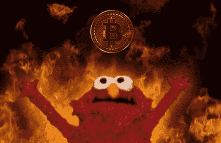
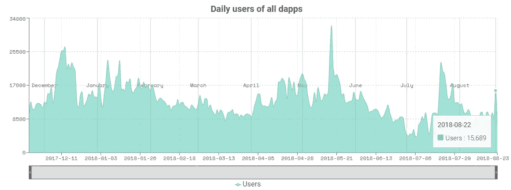
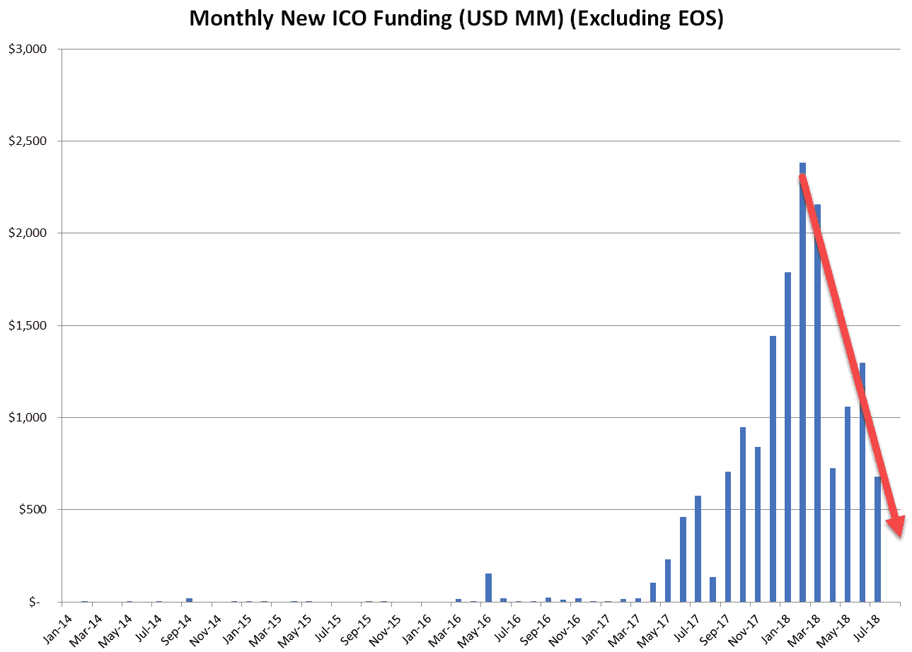
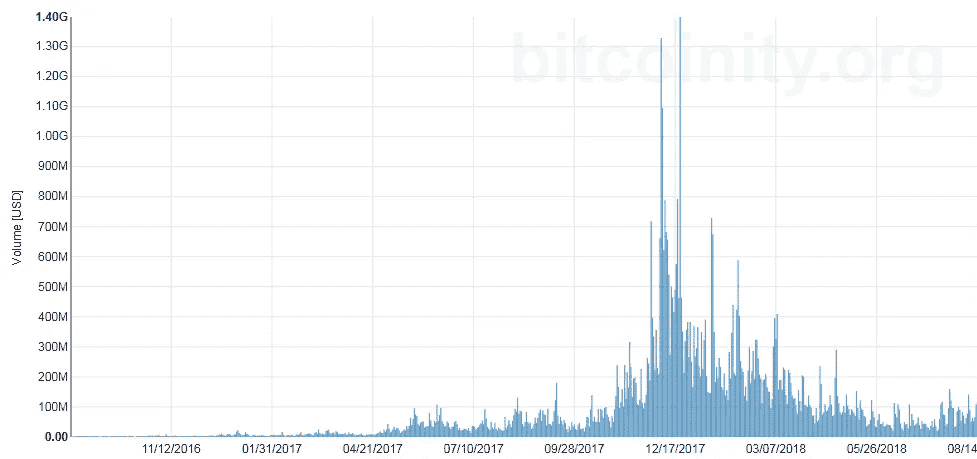
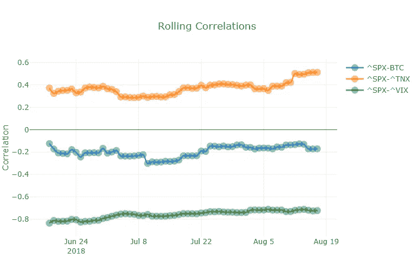
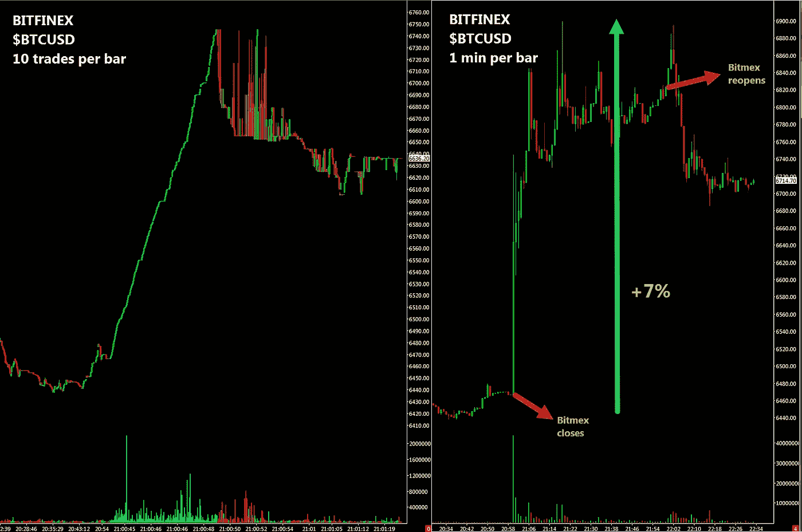
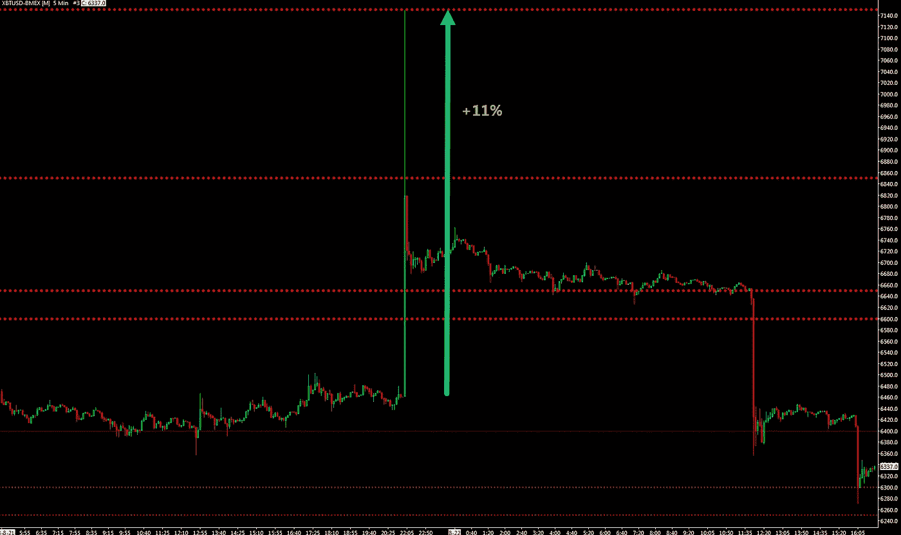
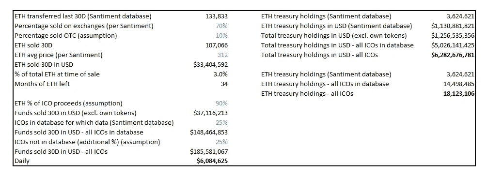

# 加密:交易者的天堂，投资者的地狱

> 原文：<https://medium.com/hackernoon/crypto-traders-paradise-investors-hell-6fbdef0694cb>

加密货币给早期投资者和精明的交易者带来了巨大的回报。以比特币为例。所有在 2017 年之前投资的人，回报率都超过了 550%。另一方面，交易者从比特币的巨大波动性中受益匪浅:比特币一天的波动性几乎相当于标准普尔 500 指数大约 23 个交易日的波动性。对交易者来说，波动带来机会。

在这篇文章中，我将关注加密投资者黯淡前景背后的原因，至少在短期内。

# 部分:

*   估价
*   使用
*   ICO 的消亡
*   跳水保护队
*   零售需求
*   制度需求
*   比特币交易所交易基金
*   自然卖家:矿商、交易所和 ico
*   还剩下什么？

# 估价

大多数加密货币无法通过传统方法([贴现现金流](https://www.investopedia.com/terms/d/dcf.asp))进行估值，因为它们 [**缺乏关联现金流**](https://twitter.com/Crypto_Macro/status/998623557251936256) 。评估加密货币的模型需要大量的**组合输入**。

就拿[这个](https://docs.google.com/spreadsheets/d/1ng4vv3TUE0DoB12diyc8nRfZuAN13k3aRR30gmuKM2Y/edit#gid=1912132017)由 [*伯恩斯克*](/@cburniske) 提出的荒诞假设模型来说吧。在这里，作者试图借用货币经济学中的[交换方程式](https://en.wikipedia.org/wiki/Equation_of_exchange)来对代币进行估价。估值需要为代币的**速度**(即代币一年内转手的次数)以及采用曲线得出一个假想值。在这个模型中，改变时间*假设*采用从 10%到 90%从 15 年到 30 年降低了令牌的价值从 0.12 美元到 0 美元。读者可以在本文中找到关于这种估值方法的更多细节。

简而言之，从基本面投资者的角度来看，整个资产类别可能会变为零。估值没有下限。

# 使用

除了投机，加密货币几乎没有任何用途。以 ETH 为例。以太坊的主要用途是 DApps 和 ico。然而，DApps 几乎没有任何用户:在 2018 年 8 月 22 日，共有 **15，689 名用户**(更多数据可在[本网站](https://dappradar.com/)获得)。在撰写本文的时候，著名的预测市场占卜者在过去的 24 小时内已经有了惊人的 **52 个用户**。奥格代币 [$REP](https://www.tradingview.com/symbols/REPUSD/) 的市值目前为 [$2 亿](https://coinmarketcap.com/)——只有 52 个用户。

与此同时，ICOs 筹集的资金数量急剧下降。此外，2018 年 ICO 投资基本上停止了产生法定流入，因为投资者开始将先前存在的加密持股回收到新的 ICO 中。那还剩下什么？投机！使用没有下限。

(读者可以使用 [Coindesk 的 ICO 追踪器](https://www.coindesk.com/ico-tracker/)查看 ICO 数字——尽管他们的数字错误地列出了 2018 年 6 月进行的猛犸 EOS ICO 或 [Icodata.io](https://www.icodata.io/stats/2018) )

# ICO 的消亡

在 2017 年的[这篇文章](https://hackernoon.com/all-you-need-to-know-about-cryptocurrencies-an-overview-for-the-savvy-investor-bdc035b14982)中，我详细介绍了大多数令牌是如何有缺陷的，以及**ico 是如何推高加密价格的**。

> 想象一下佩达·布洛克(双关语)，一位寻求融资的精明企业家。想象一下，佩达不是通过发行股权(股票)或偿还资金的法律承诺(贷款、债券)来筹集资金，而是通过分发没有法律支持的漂亮纸片来表示他计划偿还。现在想象一下，佩达实际上是通过发放漂亮的纸币来获得资金，而这些纸币甚至没有承诺偿还。此外，想象一下，佩达实际上是匿名的，他甚至不必公开自己的身份来筹集资金。这种情况正在一些 ico 中发生。 [**庞氏骗局**](https://en.wikipedia.org/wiki/Ponzi_scheme) 比比皆是。 [OneCoin](https://en.wikipedia.org/wiki/OneCoin) 是最著名的被揭露的庞氏骗局。Bitconnect 是一种加密货币，提供[保证的 149%年化回报](https://bitconnect.co/bitcoin-information/19/investing-in-bitconnect-lending)(假设每日再投资)加上由“波动性交易机器人”产生的可变回报，在我看来，这是当今时代最引人注目的庞氏骗局。

最终，经济赶上了炒作，大多数 ICO 价格从 1 月份的高点下跌了 80%-90%。美国证券交易委员会(SEC)一路推波助澜，宣传 ICO 代币在大多数情况下是未注册证券。

[超过一半的 ico 在代币销售的四个月内死亡](https://ethereumworldnews.com/icos-die-four-months-2018/)。读者可以在[Deadcoins.com](https://deadcoins.com/)上找到大量死亡 ico 的细节。

> “我接受我所看到的数字，80%的 ico 是骗子，10%缺乏实质内容，在筹集资金后不久就失败了。剩下的 10%中的大部分也可能会失败。”

普通的 ICO 投资者既顽固又无知。大多数人甚至没有阅读白皮书或提供文档，也不知道他们的代币没有给他们提供任何权利，尽管他们相信他们正在获得项目成功的参与权。

这是一个由复杂的 LinkedIn 虚假个人资料网络推广的 ICO 骗局的绝佳例子:

或者更好:毒枭巴勃罗·埃斯科巴的兄弟推出了自己的加密货币，名为[减肥比特币](http://dlvr.it/QLxr7B)，作为比特币的替代品。这个骗局正在[发生](https://www.dietbitcoin.org/en/index.php)。就等着它撞上某个交易所，然后看着它归零。还不信服？那么 [Viola.ai](https://www.viola.ai/) ，“你一生的人工智能爱情顾问”……因为我们当然都想把我们的约会历史永久保存在区块链里。

这个很搞笑，来自中国，发生在此时此刻:

# 跳水保护队

Crypto 没有“[暴跌保护团队](https://en.wikipedia.org/wiki/Working_Group_on_Financial_Markets)”，这通常被解释为购买以稳定或支撑市场的一方或多方，一个**白衣骑士**和救世主。如果情况变得极其危险，包括美元在内的美国资产可以指望美联储和美国财政部。如果商品变得太便宜，商品可以依靠企业/工业需求(实物商品的消费者)。股票可以指望公司的财政部在股票变得太便宜时回购股票——他们是最终的合法内幕交易者，因为他们在完全了解现金流和管道的情况下购买股票，因此可以更好地评估他们的股票何时变得太便宜，他们宁愿将其兑换成现金。crypto 可以依靠谁？矿工？交流？ **Cryptosphere 鲸鱼在结构上倾向于卖出加密货币，而不是买入**。

# 零售需求

零售需求和价格一起暴跌。大范围的损失是原因。普通散户投资者会根据推荐和口碑投资流行的资产。FOMO。

基本观众是铁杆自由主义者和所谓的“[奥地利派](https://en.wikipedia.org/wiki/Austrian_School)”。在我看来，这部分需求几乎已经被充分利用了。剩下的是普通人，他们不再对密码感兴趣。

> “我想，当我上船时，我以为我们是在‘坚持到底’，”赫尔曼说。“但我认为‘那个人’已经抓住了机会，并有了退出策略。”

crypto 的口碑是“我在短短几个月内损失了超过 60%的投资”。以下民意调查来自 2018 年 7 月——自那以来，crypto 市值又下降了 25%。

在高净值个人方面，情况类似。据我所知，目前询问比特币的私人银行客户不超过 2%。去年 12 月，这一比例在 50%-70%之间。

比特币交易量的大幅下降令人瞩目。下图显示了以美元计量的比特币基地 BTC/美元交易量([来源](https://data.bitcoinity.org/markets/volume/2y/USD/coinbase?r=day&t=b&vu=curr))。

散户投资者忘记痛苦应该需要时间。他们会回来的！

# 制度需求

聪明的资金通常投资于便宜的或者趋势上升的资产(T3)。加密货币像刀子一样一直在下跌。那么，为什么机构投资者会购买 crypto 呢？如果密码很便宜。然而，正如已经提到的，机构投资者实际上无法对加密货币进行估值，因此他们无法确定加密货币何时便宜。此外，这些资产[不产生现金流](https://twitter.com/Crypto_Macro/status/998623557251936256)。

那么，机构投资者为什么会购买 crypto 呢？还有最后一种可能性:多样化投资组合。加密货币一直与风险资产不相关。这可能会增加一些需求。然而，有一件事对多样化来说比没有相关性好得多:[负相关性](https://www.investopedia.com/ask/answers/041315/how-are-negative-correlations-used-risk-management.asp)。主权债券提供了比加密更好的多样化——并提供定期现金流！

# 比特币交易所交易基金

比特币 ETF 被许多人视为加密货币价格的最终救世主，这将带来机构投资者的大量涌入。我在本文的[中详细介绍了这个主题。](https://hackernoon.com/cboebitcoinetf-53992ec38a70)

SEC 最近[否决了 9 家比特币交易所交易基金](https://twitter.com/Crypto_Macro/status/1032477593117880320)的提案。一只 ETF 仍在讨论中:CBOE 提出的 VanEck SolidX 比特币信托基金。市场正在等待 SEC 批准或拒绝这一 ETF 提案的决定。根据 SEC 的规定，当市场没有明显抵制操纵时，ETF 的上市交易所必须与“相当规模”的受监管市场签订监督共享协议(以阻止操纵)。

鉴于 SEC 认为比特币市场没有明显的抗操纵能力，ETF 批准与否的关键变量就变成了 ETF 的交易所与之签署监控共享协议的比特币市场的规模。它们是否属于“重要尺寸”？

在上述文章中，我介绍了 Bitmex，一个在塞舌尔注册的完全不受监管的香港比特币衍生品平台，如何在比特币/美元交易量中占有 **40%的市场份额。此外，我还展示了信托公司选择的交易对手如何根据所采用的计算方法，拥有介于 3%和 15%之间的[市场份额。](https://docs.google.com/spreadsheets/d/1TOvPs4-3xIj7sPzETJMQu4vaHmnL-UtID8v9jnI9PUw/edit?usp=sharing)**

为了强调 Bitmex 的重要性，它在 8 月 21 日因[定期维护](https://twitter.com/BitMEXdotcom)而脱离电网一小时。在 Bitmex 关闭的那一分钟，比特币的价格受到了至少一个大型市场参与者的推动，导致了+7%的闪电突破。雪上加霜的是，在 Bitmex 重新开盘时，Bitmex 的 XBTUSD 又上涨了+4%，总计上涨了+11%。几个小时后，#BitmexMaintenance 的举动完全逆转。

不管 CBOE/瓦内克方面参与 CBOE 申请的那些人可能会表达怎样的乐观态度，一只 ETF 在短期内获得批准的概率应该接近零。虽然我永远不会对游说的力量感到惊讶。

ETF 最终会被批准——只不过时间会比预期的长。

# 自然卖家

**矿商、交易所和 ico**需要出售他们的硬币来为他们的运营提供资金。这些市场参与者代表了天然的卖家。

## 矿工和交易所

按照目前的价格，五大工作证明硬币(BTC、瑞士联邦理工学院、ZEC、BCH、LTC)每天创造大约[**2200 万美元的硬币**](https://t.co/jw9TVbkg5B) ，每年 80 亿美元。比特币占其中的 56%，以太网占 30%。鉴于目前低迷的价格，可以有把握地假设几乎所有的房子都被卖掉了。

一家专业比特币中国矿商一年资本支出贬值的盈亏平衡目前估计为 8700 美元，而其**不包括折旧的盈亏平衡将为 4700 美元**(基于 0.06 美元/千瓦时的电费和 720 美元的 Antminer S9)。请注意，盈亏平衡将随着[开采难度](https://bitcoinwisdom.com/bitcoin/difficulty)、设备和人员成本而变化(上下波动)，并且比实物商品更加灵活(实物商品的开采难度不会随着产能过剩而向下调整)。

应该注意的是**盈亏平衡对比特币的影响不如对大宗商品**的影响大。对于大宗商品来说，价格跌破盈亏平衡点会导致矿商停止生产，从而导致供应减少、库存减少，并最终导致价格反弹。这与[商品的繁荣&萧条周期](https://www.wsj.com/articles/heeding-boom-bust-lessons-1444600493)有关。比特币不一样。对于比特币来说，价格跌破盈亏平衡点会导致矿商停止生产，这导致哈希能力减弱，从而导致难度降低，并且[供应保持不变](https://www.bitcoinmining.com/what-is-the-bitcoin-block-reward/)。因此，对于商品来说，盈亏平衡确实起到了软地板的作用(软！——价格确实跌破盈亏平衡点)，但对于比特币来说，这个底线要容易渗透得多。

在交易所方面，Bitmex 每天赚取约 325 BTC 的费用，按当前价格计算为 200 万美元。假设平均交易费用为 0.30%(做市商+接受者)，在 Coinmarketcap 上市的交易所(不包括 Bitmex、美国期货、交易挖掘交易所)每天收取 4600 万美元的币费(计算[此处](https://docs.google.com/spreadsheets/d/1QvUZPuVqkLm5c-5ZBWuIn_VWyFqfkQT5kRU9iIp6TN0/edit?usp=sharing))。因此，交易所每天总共收到 4800 万美元的硬币。他们每天销售的百分比是多少？让我们假设 50%:那就是**每天 2400 万美元**。

这将使来自矿商和交易所的每日抛售压力达到 4600 万美元，或每年 170 亿美元。这还不包括 ico。是否有超过 170 亿美元的新菲亚特进入 crypto，以对抗自然卖家？想想看，这些外流资金相当于 T21 当前市值的惊人的 8%。不平衡是显而易见的。

## ICOs

ico 类似于初创公司，它们在前期获得了开发产品所需的所有资金(通常更多)——只是没有向投资者提供任何股权。这些资金大部分是以 BTC 和瑞士联邦理工学院的形式获得的——大部分是后者。

ico 通常以加密形式储存代币销售收入。ico 从事的是开发产品的业务，而不是用他们所持有的加密货币的价值进行投机。鉴于他们的大部分负债都是以法定货币计价的，他们应该在筹集资金后不久就出售相当比例的加密资产，以匹配他们的负债。这叫做**资产负债管理**。它代表公司财务 102。ico 应该雇佣一名财务主管或资产经理来对冲其加密风险，并保持其资产的美元价值。大部分没了。

一旦市场崩盘开始，一些 ico 就开始抛售所持美国国债。我**预计大多数 ico 最终会出售大部分代币销售收入**。

尤其是 ETH 可能面临相当大的风险。现在是 275 美元，随着 ico 之间潜在的**底部竞争**的发展，它可能会很容易地继续下跌。他们都处在一个微妙的囚徒困境中:考虑到从一月份的高点下跌了 80%,每个人通过合作和囤积他们剩余的财富都会变得更好。然而，集体同意举行几乎是不可能的——考虑到行动需要，更是如此。还记得 2017 年的 ICO 市场已经处于泡沫模式，ETH 的价格为 200 美元。

根据 [Santiment 的数据库](https://app.santiment.net/ethereum-spent)，**以太坊钱包知名的 ico**(占其数据库的 25%)有 330 万 ETH 的可见余额，按当前价格计算为 9 亿美元。ETH 135K 是在过去 30 天内转出的。资金转出并不一定意味着支出，可能已经转移到同样由 ico 控制的地址。假设这些基金的 70%在交易所出售([来源](/d2-capital/imminent-firesale-of-eth-held-by-icos-278a6cf914))，另外 10%在场外出售，这将导致这些 ico 每月出售 ETH 107K。这大约是他们总余额的 3%。此外，假设这些资金足以满足每月的资本需求，并假设价格稳定，这将为 ICOs 提供大约**三年的时间来开发自我可持续的产品**。那是足够的时间。

ICOs 带来的抛售压力如何？假设 a) 90%的代币销售收入以 ETH 的形式存在，b)过去 30 天的平均售价为 312 美元，c)数据库中没有相关数据的 ICO 销售了类似数量的代币(数据库中只有 25%的 ICO 的数据，因此基线数字需要乘以 4)，以及 d) ICO 总量增加了 25%(santi ment 的数据库不包括所有 ICO)，这导致来自 ICO 的**600 万美元的每日销售压力—一个零头**

有趣的是，在[最近的一篇文章](/d2-capital/imminent-firesale-of-eth-held-by-icos-278a6cf914) Santiment 称，以太坊钱包知名的 ico 在 2018 年的平均月销售额为 ETH 312K，即最近**的销售大幅放缓**。使用 ETH 312K 而不是 ETH 135K 重新进行之前的计算，结果是 a)ico 只剩下 **15 个月**来开发自我可持续的产品，b)**ico 每天面临 1400 万美元的销售压力**。

使用上述假设，当前 ETH ICO 国债持有量为 1800 万 ETH(占流通供应量的 18%)，当前 ICO 国债持有总量为 60 亿美元(按当前价格)。这给 ICOs 留下了很大的提升销售速度的空间。

ico 将如何处置剩余的 BTC 联邦政府债券？[有些暂时持稳](https://twitter.com/koeppelmann/status/1029483380742795264)。一些大投资方，如 Vitalik Buterin 和 Consensys 都表达了担忧，并试图以自己独特的方式捍卫价格。与此同时，最近**[新闻文章](https://www.bloomberg.com/news/articles/2018-08-13/ether-tumbles-as-concern-increases-that-icos-are-cashing-out?utm_content=bufferee53b&utm_medium=social&utm_source=twitter.com&utm_campaign=buffer)、[推特](https://twitter.com/cryptomanran/status/1027081923376689152)和私人渠道中关于 ico 套现的讨论越来越多。**

**(自然卖家抛售压力分析严重依赖于其**假设**。其中许多都极具争议。读者可以下载这个[电子表格](https://docs.google.com/spreadsheets/d/1pDmBH_xKXOaz93J4CWJh89C8LaUSgvGxOmL1GUAF3qI/edit?usp=sharing)，并根据自己的假设进行修改。)**

# **还剩下什么？**

**剩下的是一种资产类别，其**抛售压力显著且持续，买入压力暂时减弱，多头在一段时间内不应有望飙升**(是的，这是看跌)。估价和使用没有底限的资产类别。特别是比特币，它是一种非常不稳定的资产，价格可以从 1000 美元涨到 10000 美元，然后又回到 1000 美元。交易者的天堂。赌徒的乐土。投资者的地狱。**

**我看好比特币、一些精选协议代币、一些特定的区块链应用以及将成为主流的安全代币的长期前景。我把看涨分析留到另一个场合。**

# **在你走之前…**

**如果你喜欢读这篇文章，请考虑通过点击拍手按钮来表达你的支持——越多越好，这增加了可见度。可以通过以下链接分享文章:[脸书](https://www.facebook.com/sharer/sharer.php?u=https://medium.com/@alexkruger/crypto-traders-paradise-investors-hell-6fbdef0694cb) | [推特](https://twitter.com/home?status=Bitcoin%20is%20a%20wildly%20volatile%20asset%20that%20can%20go%20from%20$1,000%20to%20$10,000%20and%20back%20to%20$1,000.%20Traders%E2%80%99%20paradise.%20Gamblers%E2%80%99%20promised%20land.%20Investors%E2%80%99%20hell.%20https%3A//medium.com/%40alexkruger/crypto-traders-paradise-investors-hell-6fbdef0694cb)|[Reddit](http://reddit.com/submit?url=https%3A%2F%2Fmedium.com%2F%40alexkruger%2Fcrypto-traders-paradise-investors-hell-6fbdef0694cb&title=Crypto%3A%20Traders%E2%80%99%20Paradise%2C%20Investors%E2%80%99%20Hell)|[LinkedIn](https://www.linkedin.com/shareArticle?mini=true&url=https%3A//medium.com/%40alexkruger/crypto-traders-paradise-investors-hell-6fbdef0694cb&title=Crypto%3A%20Traders%E2%80%99%20Paradise,%20Investors%E2%80%99%20Hell&summary=This%20article%20focuses%20on%20the%20reasons%20behind%20a%20grim%20outlook%20for%20crypto%20investors%3A%20valuations,%20usage,%20ICOs,%20subdued%20demand,%20the%20bitcoin%20ETF,%20and%20natural%20sellers.&source=)|[Whatsapp](https://api.whatsapp.com/send?text=https://medium.com/@alexkruger/crypto-traders-paradise-investors-hell-6fbdef0694cb)|[电报](https://telegram.me/share/url?url=https://hackernoon.com/crypto-traders-paradise-investors-hell-6fbdef0694cb&text=Crypto:%20Traders%E2%80%99%20Paradise,%20Investors%E2%80%99%20Hell) | [微博](http://service.weibo.com/share/share.php?url=https://hackernoon.com/crypto-traders-paradise-investors-hell-6fbdef0694cb&title=%7Btext%7D) | [邮箱](mailto:?subject=https://medium.com/@alexkruger/crypto-traders-paradise-investors-hell-6fbdef0694cb)。你也可以在 Twitter 上关注我，保持联系。谢谢你。**