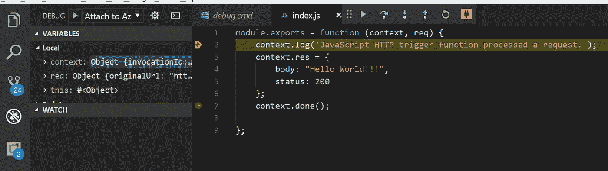

# 具有 GDAX 和 Azure 功能的加密交易应用程序—第 1 部分

> 原文：<https://medium.com/hackernoon/crypto-trading-app-with-gdax-and-azure-functions-part-1-2f86bfeac697>


在本文中，我们将回顾如何设置能够系统执行[加密货币](https://hackernoon.com/tagged/cryptocurrency)交易的应用程序的基础知识。

在开始之前有几点，这将不包括 algo 交易模型，并且实现假设您可以访问 Azure cloud 实例，并且理解 JavaScript 和。Net 或其他一些面向对象的编程语言。

我们的最终目标是能够使用 azure 功能来执行和管理 GDAX 加密货币交易所的交易。代码会有点多余，因为我们正在创建利用 [NodeJS](https://hackernoon.com/tagged/nodejs) 包装现有 GDAX API 的函数。这样做的原因是为了利用 Azure 函数的强大功能，这些功能非常适合与非本地 JavaScript 编码的企业软件挂钩。例如，如果我们有一个机构客户在使用前台交易系统。我们希望扩展这个平台，以在 GDAX 中执行交易，或者如果我们有其他一些基于云的系统，需要能够自动进行加密外汇交易。此外，我们可以利用 Azure Functions 的强大功能，它允许我们托管单个功能或代码块，这些功能或代码块在执行时只会产生托管费用，因此没有必要托管一些会消耗您的托管预算的始终在线的服务或虚拟机。

**先决条件和安装**提前为所有这些安装道歉，它们是必需的。

*注意——如果你只想在本地测试，而不想在 azure 中部署，你可以使用本地 azure 函数，不需要 github 帐户或 Azure 帐户/环境。

1.  Github——确保你有一个活动的 github 帐户，在这个例子中，我们将使用一个涉及到同步到 github 项目的部署方法。
2.  Azure 环境——确保你有一个活跃的 Azure 环境。
3.  安装[。网芯 2.0](https://www.microsoft.com/net/core)
4.  安装[vs code](https://en.wikipedia.org/wiki/Visual_Studio_Code)——这是一个相对较新的源代码编辑器，它是轻量级的，免费的，尽管它是微软的产品，但它可以很好地与非微软技术一起工作。
5.  Install [NodeJS](https://nodejs.org/en/download/) —这用于生成服务器端 JavaScript 环境，这是一个架构矛盾，但我们需要它来支持 GDAX API 和其他 Azure 工具。总的来说，接受新的技术概念是一个好主意，所以如果您还不熟悉 Node，我建议您尝试一下。我们还将使用节点 NPM 安装其他项目。
6.  安装 [Azure Functions 核心工具](https://www.npmjs.com/package/azure-functions-core-tools) —这可以用来本地调试 Azure 函数。在我们的例子中，因为我们将运行一个 JavaScript Azure 函数，所以本地调试是查看函数内部工作情况的好方法。
7.  安装 [Azure CLI](https://docs.microsoft.com/en-us/cli/azure/?view=azure-cli-latest)
8.  安装 [Postman](https://www.getpostman.com/) — App 调用我们的功能。
9.  安装最新的 [GDAX API](https://www.npmjs.com/package/gdax)

**Hello World—Azure 函数的本地调试**好了，让我们设置一个返回“Hello World”的本地 Azure 函数

你基本上想导航到你的本地目录，它应该类似于`C:\Users\Joe\AppData\Local\Azure.Functions.Cli\1.0.0`并添加一个文件夹`TestFunctions`，然后再添加一个子文件夹到那个`HelloWorld`。

接下来添加一个文件`function.json`，并将下面的 JSON 代码放入其中:

```
{ "disabled": false, "bindings": [ { "authLevel": "function", "type": "httpTrigger", "direction": "in", "name": "req" }, { "type": "http", "direction": "out", "name": "res" } ] }
```

然后添加一个文件`index.js`
然后添加这段 JavaScript 代码到里面:

```
module.exports = function (context, req) { context.log('JavaScript HTTP trigger function processed a request.'); context.res = { body: "Hello World!!!", status: 200 }; context.done(); };
```

在父目录`TestFunctions`中添加一个文件`debug.cmd`并添加一行命令:

```
"C:\Users\Joe\AppData\Local\Azure.Functions.Cli\1.0.0\func.exe" host start --debug vscode
```

现在，在同一个目录中添加一个文件`host.json`,并添加开括号和闭括号

```
{}
```

现在，Azure Functions CLI 可以在本地托管一个 JavaScript 函数。在 test functions 下运行 debug.cmd 命令文件来启动您的新函数，然后您会看到这个非常酷的 ASCII 艺术和 Azure CLI 在 localhost 上启动该函数。


现在打开 Postman 使用地址`http://localhost:7071/api/HelloWorld`设置一个 POST 调用并按回车键，在响应消息中你会看到“Hello World”


好，让我们再做一次，但现在让我们调试。打开 VS 代码打开文件`index.js`点击调试/开始调试，然后在上下文对象的第 2 行和第 7 行添加一个断点，再次用 postman 调用函数。您将看到在 VS 代码中输入了断点，现在您有了一个合适的调试环境。到目前为止做得很好！



**将 GDAX API 整合到你的 Azure 函数中**
好了，让我们设置一个本地 Azure 函数，从 GDAX 获取 GDAX 帐户信息。您可以将下面的代码复制粘贴到一个`index.js`文件中，并将其放在我们之前创建的`TestFunctions`文件夹下的子文件夹`GetAccounts`中。

```
const Gdax = require('gdax'); const publicClient = new Gdax.PublicClient(); module.exports = function (context, req) { context.log('JavaScript HTTP trigger function processed a request.'); var tempErr = ""; try { var gdaxURI = process.env["GdaxURI"]; var b64secret = process.env["b64secret"]; var passphrase = process.env["passphrase"]; var ApiKey = process.env["ApiKey"]; var authedClient = new Gdax.AuthenticatedClient( ApiKey, b64secret, passphrase, gdaxURI); var callback = function(err, response, data) { try { context.res = { body: response.body, status: response.statusCode }; context.done(); } catch(err) { tempErr = err.message; context.res = { status: 400, body: tempErr }; context.done(); } }; authedClient.getAccounts(callback); } catch(err) { tempErr = err.message; context.res = { status: 400, body: tempErr }; context.done(); } };
```

您将需要在 TestFunctions 根目录下创建一个`local.settings.json`文件，并在这里添加您的密码短语、APIKey 和 b64 代码，并确保使用 GDAX 的沙盒 url。要获取 API 密钥详细信息，请登录 GDAX sandobx URL 并生成新的 API 密钥。

```
{ "IsEncrypted": false, "Values": { "AzureWebJobsStorage": "", "GdaxURI" : "https://api-public.sandbox.gdax.com", "b64secret" : "abc64", "passphrase" : "aaaa", "APIKey" : "" } }
```

现在打开 Postman 使用地址`http://localhost:7071/api/GetAccounts`设置一个 POST 调用并按回车键，在响应消息中您会看到类似如下的帐户信息:

```
[ { "id": "71452118-efc7-4cc4-8780-a5e22d4baa53", "currency": "BTC", "balance": "0.0000000000000000", "available": "0.0000000000000000", "hold": "0.0000000000000000", "profile_id": "75da88c5-05bf-4f54-bc85-5c775bd68254" }, { "id": "e316cb9a-0808-4fd7-8914-97829c1925de", "currency": "USD", "balance": "80.2301373066930000", "available": "79.2266348066930000", "hold": "1.0035025000000000", "profile_id": "75da88c5-05bf-4f54-bc85-5c775bd68254" } ]
```

干得好！现在您有了一个本地 GDAX 函数，它可以认证到 GDAX 并在 GDAX API 上命中函数。在第 2 部分，我们将介绍如何将订单功能部署到 Azure，并从用 c#编写的自动化交易应用程序中调用它。

**Autera 的技术团队可以轻松承担任何加密货币、区块链和交易开发，请立即联系我们。**

[一键联系](mailto:info@auterasolutions.com?Subject=BI%20Consulting)

*原载于 2018 年 3 月 7 日*[*blog.auterasolutions.com*](http://blog.auterasolutions.com/crypto-trading-app-with-gdax-and-azure-functions-part-1/)*。*