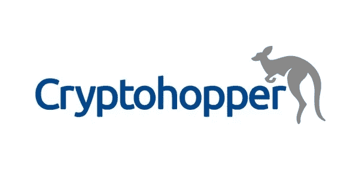
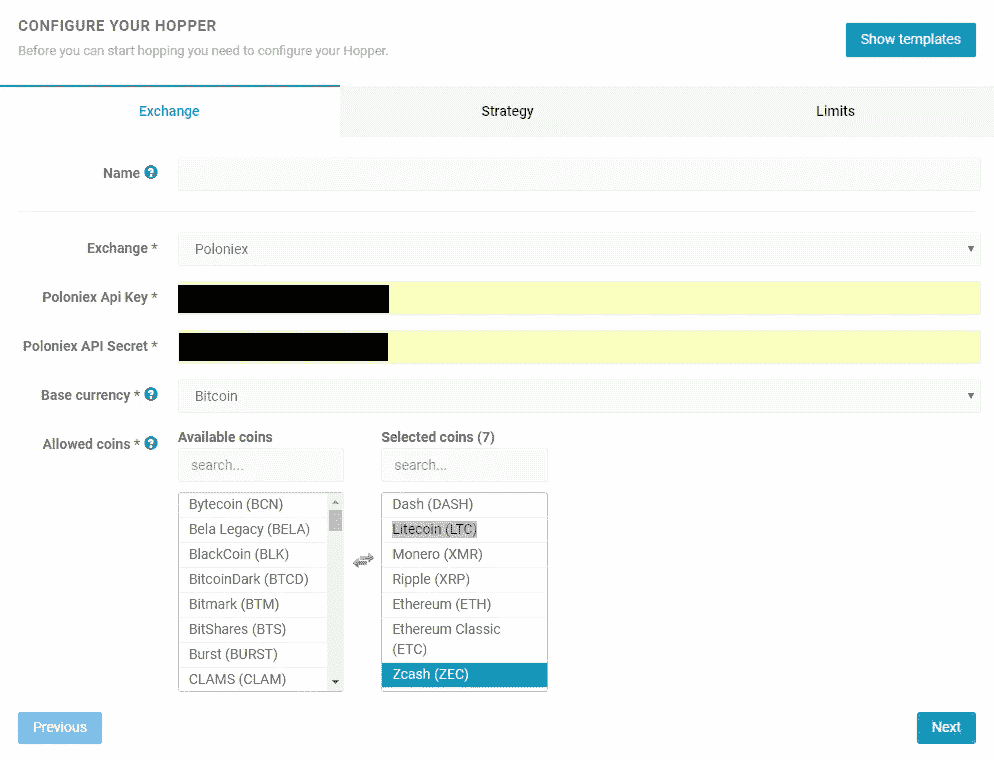
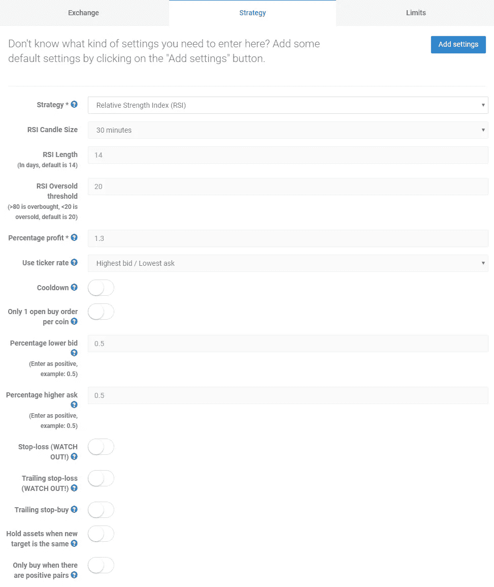
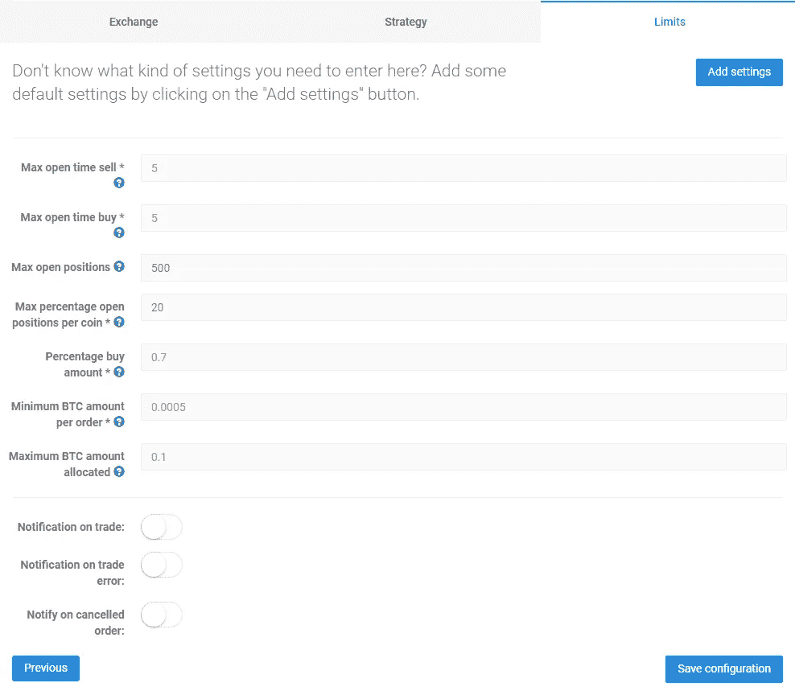
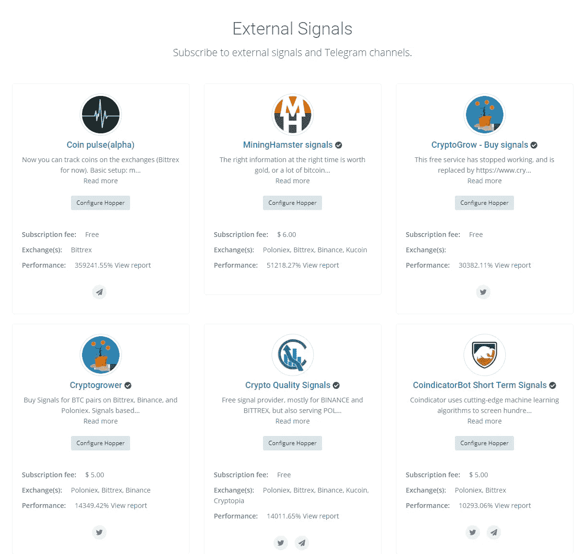
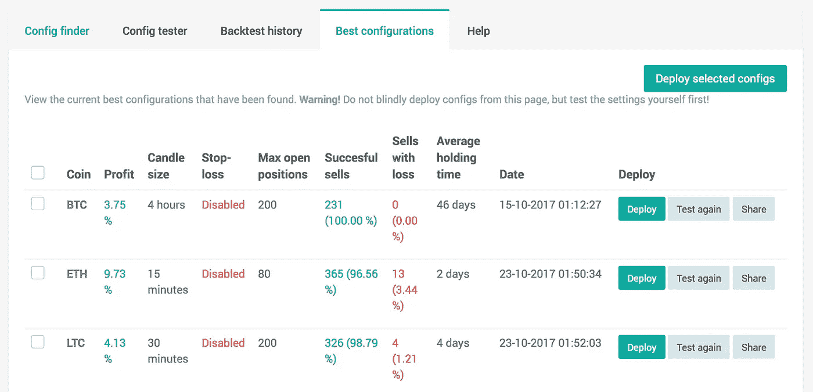

# 加密交易机器人 Cryptohopper 及其工作原理简介

> 原文：<https://medium.com/hackernoon/crypto-trading-bots-an-introduction-to-cryptohopper-and-how-it-works-77223ebfbfd7>

对加密交易机器人感到好奇，但从未有机会使用？这将是一系列帖子中的第一个指南，这些帖子强调了最受欢迎的 [crypto](https://hackernoon.com/tagged/crypto) 交易工具的好处，并向您展示了如何开始使用这些工具。

# 什么是隐漏斗？

[Cryptohopper](https://www.cryptohopper.com/?atid=1178) 是一个基于云的交易机器人，可以让你在多个交易所配置策略和自动化交易。像这样使用基于云的[工具](https://hackernoon.com/tagged/tool)的主要好处是极其简单的设置过程和你的加密交易机器人 100%的正常运行时间。与一些自托管的机器人相比，这是一个巨大的优势，因为你不需要担心稳定的互联网连接或你的计算机被破坏。

# 我如何开始与 Cryptohopper 交易？

在[创建账户](https://www.cryptohopper.com/?atid=1178)并第一次登录后，点击“配置向导”按钮并输入你的交易专用 API 密钥即可开始。Cryptohopper 只需要访问来为你做交易，确保你**为你的每个 API 密匙禁用撤回许可**。

***第一步:选择您的交易所&输入您的 API 密钥***

***第二步:选择&配置您的交易策略***

***第三步:为你的策略输入你的风险管理限额***

# Cryptohopper 支持哪些交易所？

*   币安
*   比特雷克斯
*   GDAX
*   波洛涅克斯
*   库科恩
*   北海巨妖
*   Bitfinex
*   隐视

# 用 Cryptohopper 可以优化哪些交易策略？

*   相对强度指数
*   固定利率
*   布林线容易
*   布林线上涨
*   多个 TA 因素
*   外部信号

每种策略都有许多配置选项，让你完全按照自己的需要进行交易。我们建议您阅读文档，并对您的策略进行大量回溯测试，以确保它在实时交易时会如预期那样运行。

# 什么是外部信号？

Cryptohopper 是唯一一个允许你订阅和交易来自加密交易团体和市场专家的外部交易信号的加密交易机器人。市场上的每一个信号都会给你一份过去表现的报告，让你点击一下就可以创建一个漏斗。

# 什么是回溯测试工具？

回溯测试是根据历史价格数据模拟交易策略的过程，以确定其盈利能力并衡量其风险。这是非常有用的，因为它会让你更好地了解它在真实交易条件下的表现，而不是盲目地去了解它。回溯测试还能让你洞察到，要让交易策略比买入并持有资产表现得更好，需要做哪些调整。

使用 Cryptohopper 创建回溯测试非常简单，只需点击“回溯测试”选项卡并选择您之前配置的 hopper 即可开始。一旦测试运行完毕，它会给你一份报告，详细说明一个策略的利润、交易次数和平均持有时间。

# Cryptohopper 值多少钱？

与许多其他加密交易机器人不同的是， [Cryptohopper](https://www.cryptohopper.com/?atid=1178) 提供免费试用和订阅模式，允许用户在没有巨额前期费用的情况下开始交易。他们的订阅价格分为三个等级，从每月*19 美元*到*99 美元*。每升级一级，交易机器人就可以管理更多的未平仓头寸。以下是定价选项的完整表格:

Cryptohopper 是新手和专家交易者实现交易策略自动化的完美工具..无论是熊市还是牛市，他们的交易仪表板和内置回溯测试器都能让你轻松优化策略，实现盈利。我们建议你在交易前对你的交易策略进行大量的回溯测试。

# 额外资源

*   [隐蛛常见问题解答](https://www.cryptohopper.com/?atid=1178#faq)
*   [Cryptohopper 教程](https://www.cryptohopper.com/tutorials/?atid=1178)
*   [Cryptohopper 文档](https://www.cryptohopper.com/documentation/?atid=1178)
*   [隐料斗支架](https://cryptohopper.freshdesk.com/support/home/?atid=1178)

如果你喜欢这个指南，并且正在寻找其他加密交易工具，请查看我们的[加密交易者终极资源列表](https://www.cryptotrader.tax/trading/the-ultimate-resource-list-for-crypto-traders-investors/)。

*原载于 2018 年 5 月 12 日*[*www . cryptotrader . tax*](https://www.cryptotrader.tax/trading/crypto-trading-bots-an-introduction-to-cryptohopper-how-it-works/)*。*

[https://upscri.be/hackernoon/](https://upscri.be/hackernoon/)