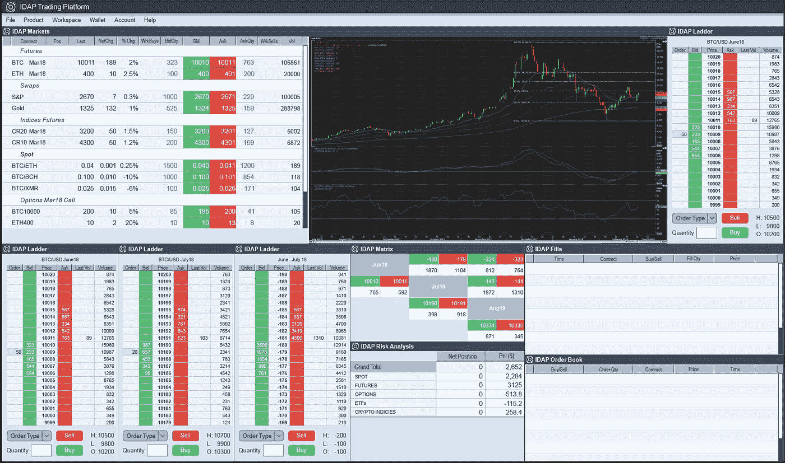

# 加密交易界面:改头换面的时候到了

> 原文：<https://medium.com/hackernoon/crypto-trading-interfaces-time-for-a-makeover-8020fac03ed3>

系统的复杂性和访问所述系统的接口所提供的功能是密切相关的。像马里奥或戴夫这样的复古游戏在整个游戏过程中最多有 4 到 5 种招式；如今，RPG 使用控制器，通过一系列基本、高级和特殊动作，以及针对角色和游戏世界设置的各种定制功能，来帮助导航各自的“游戏世界”。

与游戏不同，随着交易从交易大厅转移到电子交易交易所，交易平台也发生了变化。在传统市场中，向[技术](https://hackernoon.com/tagged/technology)转变塑造了交易方式和敏感度，这种转变以交易界面这种最有形的形式表现出来。今天，交易者利用多显示器设置来从事半自动交易策略，以执行可变金融工具的高度定制的订单。这种转变不是一夜之间发生的；就市场和参与者的需求而言，它经历了几十年的演变。

与传统市场相比，[加密交易](https://hackernoon.com/tagged/crypto-trading)仍处于起步阶段。因此，它的优势是能够利用已经建立的和非常成熟的传统市场的优点。事后看来，传统市场必须学习的东西，加密市场可以从传统交易系统中借鉴。加密货币的交易工具正在向更加多样化的方向转变，尽管目前断断续续。几家交易所已经推出了精选加密货币的期货合约、期权和掉期，许多交易所正在准备在未来几个月推出 ETF 和价差等产品。在缺乏一个统一的生态系统，在一个地方为加密提供不同类型的金融工具的情况下，市场需求很自然会及时产生一个参与者，该参与者将作为一站式解决方案提供多种不同的加密产品。这就对加密交易平台的现状提出了质疑。

交易界面像任何其他平台界面一样，应该体现界面设计的核心原则:*结构、简单、可见、反馈、宽容和重用。*随着各种加密产品的推出，无缝交易这些产品所需的功能也将增加，而当前的交易所接口不具备处理即将到来的过渡的能力。迫切需要改变加密交易平台的界面设计方法。

## 交易桌面应用程序

一个基于“点击式”梯形交易界面的桌面应用程序最适合衍生品加密交易市场。桌面交易应用程序的特点:

*   桌面应用程序安装在系统上，因此与浏览器内设置相比，在访问交易所时提供了更多的安全性。
*   *虽然看起来引入了一定程度的复杂性，简单的原则被违反了，但有经验的交易者从增加的功能和带来的自由中受益。*
*   *桌面应用程序提供阶梯交易，报价和要价整齐地显示在价格走势上。可以添加更多的度量，如最佳买价和卖价、最后交易的价格和数量、每个价格的总交易量、当天的高和低市场点以及市场订单的深度，以便在交易时具有高度的意识。*
*   *桌面应用的多显示器设置是可行的，允许高度定制和灵活安排各种数据指标，以保持可视化的健全性。*
*   *在交易工作区的外观和功能方面，非常高程度的控制成为可能，交易者能够定制屏幕上显示和实现的内容以及不显示的内容。*
*   *只需点击鼠标即可执行订单(提交、修改和取消),从而实现快速准确的交易，尤其是在波动的市场中。*
*   *与 web 和移动应用相比，桌面应用的延迟更低，这进一步支持了快速准确的订单执行。*
*   *最重要的是，高级控制和可视化&分析工具可以实现交易的半自动化，从而实施稳健的策略。此外，这是可以实现的，而不需要任何编码背景，因为功能可以通过易于学习的拖放机制来实现。*
*   对于新用户来说，桌面应用程序可能显得势不可挡，但从长远来看，对整体交易体验更好。内置的模拟器可以指导和帮助新手掌握交易的艺术，不仅有效地提升了技能，也提升了一般的市场意识。

目前的加密交易界面的改造将使加密交易对所有类型和风格的交易者来说更加容易使用和包容。此外，传统交易商和机构投资者将被吸引加入加密领域，因为多样化的工具可以使用强大、高性能和高度可定制的界面进行交易。

IDAP Desktop App ( Ref. - [www.idap.io](http://www.idap.io) )

如上所述，桌面交易应用程序 [idap.io](http://www.idap.io) 正在推向市场，这与加密领域的需求是一致的。随着它的推出，我们希望提高良好交易界面的标准。

## 保持更新:

[网站](https://www.idap.io) | [电报](https://t.me/idap_io)|[Reddit](https://www.reddit.com/r/idap_io/)|[Twitter](https://twitter.com/idap_io)|[脸书](https://www.facebook.com/idapio.exchange/) | [Instagram](https://www.instagram.com/idap.io) | [比特币会谈](https://bitcointalk.org/index.php?topic=3431151)