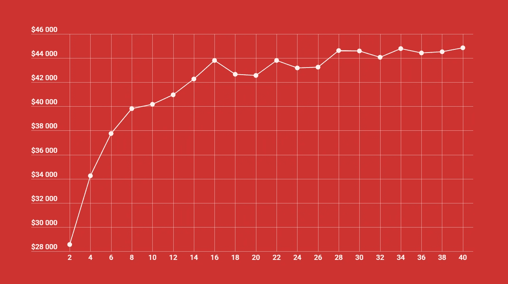
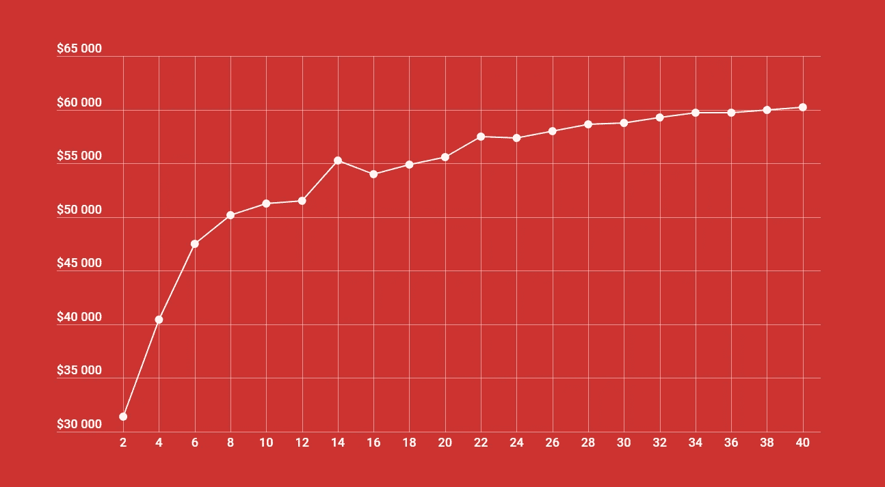
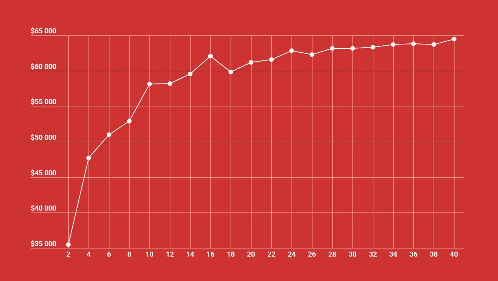
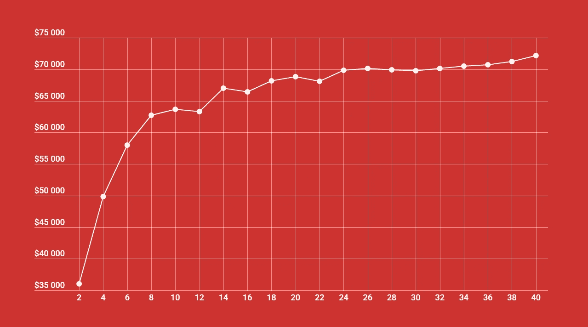
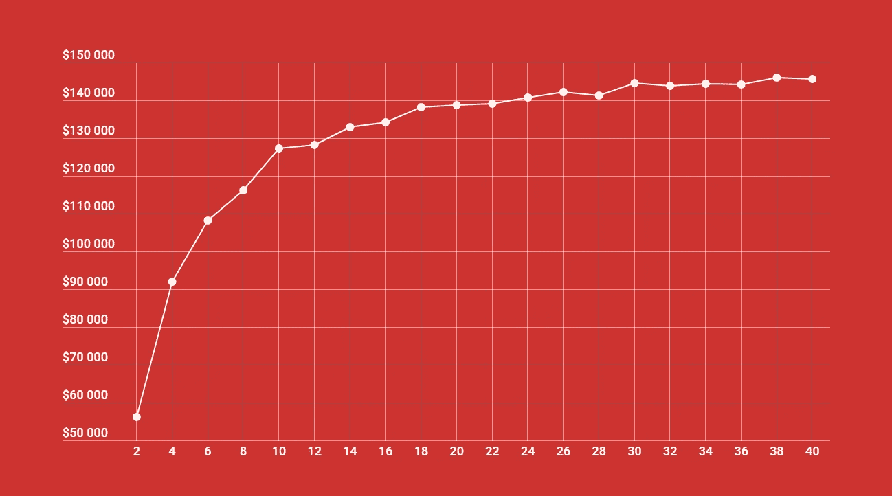
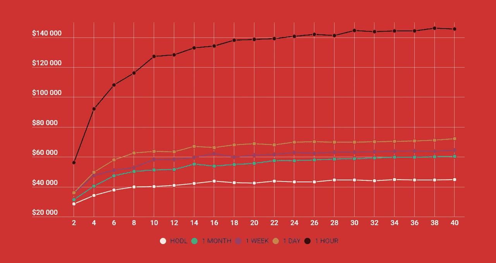

# 多样化的加密用户表现更好

> 原文：<https://medium.com/hackernoon/crypto-users-who-diversify-perform-better-new-research-ebf775d348dd>

We ran over 100,000 backtests for our latest research. This research helps answer the questions of 1) how many cryptocurrencies you should HODL or rebalance and 2) how often to rebalance for best performance.

在过去一年半的时间里，我们的团队已经成为加密市场投资组合管理领域公认的全球领导者。 ***Shrimpy*** *的交易额超过 3.5 亿美元，吸引了成千上万名加密货币交易员的注意。*

如果你还没有， [**注册一个免费的 Shrimpy 帐户**](https://www.shrimpy.io/signup) 和 [**加入我们的电报组**](https://t.me/shrimpygroup) 来了解最新的研究。我们还建议阅读我们上一篇讨论投资组合多样性、再平衡和绩效之间关系的文章。

 [## 投资组合多样性:技术分析

### 多元化给投资组合增加了多少价值？

hackernoon.com](https://hackernoon.com/portfolio-diversity-a-technical-analysis-c2c49f4d3a77) 

***看完这篇文章的人都被激怒了。***

他们并没有因为你所期望的原因而被激怒。毕竟，为了得出这个数据，我们进行了超过 25，000 次[回溯测试](https://www.shrimpy.io/backtest)。他们被激怒了，因为研究只停留在 10 个资产组合上。他们要求我们进一步研究包括更多的密码！你应该多元化到什么程度？

工程师并不总是想实际。有时他们只是想知道某样东西在断裂前能走多远。他们想让我们破解数据。

> 所以，我们努力了。

# 设置

这一次，我们没有停留在 10 个，而是在每个投资组合中增加到 40 个资产(我们对加密货币的首选通用术语)。那就是十万[回测](https://www.shrimpy.io/backtest)。这些回溯测试的结果按策略类型进行了细分。我们还将图表转换为简单的线形图，显示投资组合中的资产数量与一年期末投资组合的中值之间的关系。每个回溯测试的初始投资设定为 5000 美元。

有关回溯测试设置的其他信息可在此处找到:

 [## 再平衡与 HODL:技术分析

### 这项研究的目的是描绘一幅公平的画面，说明再平衡作为一种策略如何符合霍德林。为了…

medium.com](/@ShrimpyApp/rebalance-vs-hodl-a-technical-analysis-6f341b0db9cd) 

## HODL

This graph shows the results of a $5,000 initial investment that used the HODL strategy for one year. Each data point on the graph is 1,000 backtests which were run by randomly selecting the number of assets on the x-axis.

该图显示，一年后，霍德林接近了 45k 美元左右的渐近线。当资产数量增加到 16 个以上时，价值上的差异就很小了。

## 1 个月重新平衡

This graph shows the results of a $5,000 initial investment that used 1 month rebalances for one year. Each data point on the graph is 1,000 backtests which were run by randomly selecting the number of assets on the x-axis.

该图显示，一个月的再平衡在一年后有一个大约 60k 美元的明显渐近线。当资产的数量增加到 22 个以上时，价值上的差异就很小了。

## 1 周重新平衡

This graph shows the results of a $5,000 initial investment that used 1 week rebalances for one year. Each data point on the graph is 1,000 backtests which were run by randomly selecting the number of assets on the x-axis.

该图显示，一周的再平衡在一年后有大约 65k 美元的明显渐近线。当资产的数量增加到 16 个以上时，价值上的差异就很小了。

## 1 天重新平衡

This graph shows the results of a $5,000 initial investment that used 1 day rebalances for one year. Each data point on the graph is 1,000 backtests which were run by randomly selecting the number of assets on the x-axis.

该图显示，1 天的再平衡在一年后有一个大约 73k 美元的明显渐近线。当资产的数量增加到 14 个以上时，价值上的差异就很小了。

## 1 小时重新平衡

This graph shows the results of a $5,000 initial investment that used 1 hour rebalances for one year. Each data point on the graph is 1,000 backtests which were run by randomly selecting the number of assets on the x-axis.

该图显示，1 小时的重新平衡在一年后有一个大约 145，000 美元的明显渐近线。当资产数量增加到 18 个以上时，价值上的差异就很小了。

## 综合结果

This graph shows the results of a $5,000 initial investment that used the strategies as discussed above. Each data point on the graph is 1,000 backtests which were run by randomly selecting the number of assets on the x-axis.

该图比较了再平衡期及其在过去一年中的表现。我们可以看到，1 小时重新平衡的回报率明显高于其他时期。然而，不管策略如何，该数据表明，在过去一年中，14 至 22 项资产的投资组合具有最高的单位资产业绩潜力。超过这个范围，增加更多的资产不会带来价值的大幅增加，尽管它确实会带来一些好处。低于这个范围的资产导致投资组合价值急剧下降。

# 结论

在过去的一年中，投资组合的中值通常会随着密码数量的增加而增加。与资产数量较多的投资组合相比，资产数量较少的投资组合通常从增加额外资产中获益更多。

一些人表达的一个担忧是，可能会出现拐点。在这一点上，向投资组合中增加更多资产会降低中值。这些结果似乎没有显示出任何这样的拐点。

> 在过去的一年里，持有更多资产的投资组合的表现往往优于那些持有较少资产的投资组合。

# 用 Shrimpy 重新平衡

在过去的一年里，我们已经看到，重新平衡多样化的投资组合可以显著提高业绩。Shrimpy 网站可以帮助自动化整个过程。快速选择资产，即时分配投资组合，并在一致的时间段内重新平衡。Shrimpy 是管理投资组合最简单的方法。最棒的是，它现在完全免费使用！

点击[这里](https://www.shrimpy.io/)报名。

如果您仍然不确定，请尝试演示，看看我们提供的一切！

 [## Shrimpy 演示

### Shrimpy 是管理您的加密组合的最简单的方法。试试我们的演示，看看我们能提供什么！

www.shrimpy.io/demo](https://www.shrimpy.io/demo) 

# 附加阅读

[***投资组合再平衡为加密货币***](https://hackernoon.com/portfolio-rebalancing-for-cryptocurrency-7a129a968ff4)

[***重新平衡加密组合的简单回溯测试***](https://hackernoon.com/the-simple-backtest-for-rebalancing-a-portfolio-3289bc8ee618)

[***投资组合多样性:技术分析***](https://hackernoon.com/portfolio-diversity-a-technical-analysis-c2c49f4d3a77)

[***再平衡 vs HODL:技术分析***](/@ShrimpyApp/rebalance-vs-hodl-a-technical-analysis-6f341b0db9cd)

别忘了查看一下 [Shrimpy 网站](https://www.shrimpy.io/)，在 [Twitter](https://twitter.com/ShrimpyApp) 和[脸书](https://www.facebook.com/ShrimpyApp)上关注我们的更新，并在[Telegram](https://t.me/ShrimpyGroup)&[Discord](https://discord.gg/gXyy95y)上向我们令人惊叹的、活跃的社区提问。

留下你的评论，让我们知道你的平衡经验！

捕虾队