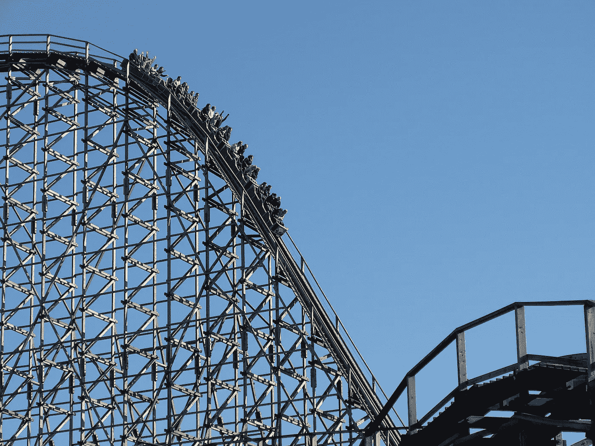
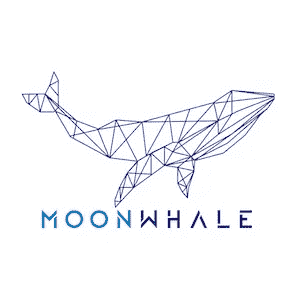

# 加密波动——交易者的天堂，投资者的噩梦

> 原文：<https://medium.com/hackernoon/crypto-volatility-a-traders-paradise-but-an-investor-s-nightmare-a3702f41d806>

Photo by Angie from Pexels

# **波动性**

交易者的天堂，投资者的噩梦。本质上，波动性可以分解为两件事——衡量人类情绪(FOMO 买入和恐慌性卖出)和缺乏流动性。

**人类情感** :
我们都知道人类是善变的生物。我当然是其中之一。看着某样东西变绿会诱使 FOMO 人购买。看着东西不断下跌会导致我们恐慌性抛售。这是滚雪球效应。去年 12 月至今年 1 月，散户投资者纯粹从 FOMO 大举买入。类似于 2017 年 6 月大部分 altcoins(当时)打印他们的 ATHs。

情绪是市场的主要驱动力。这是一个不断的推拉，来自那些早期进入并出售利润的人，以及那些后来进入并购买早期采用者的包的人。经济学第三定律:供给和需求。

**缺乏流动性**:这基本上意味着，100 万美元可以导致低市值硬币的大幅飙升。10 亿美元可以改变比特币(加密市场的市场指标)的市场情绪。相比之下，股票市场需要数十亿美元才能让它移动几个百分点。

**为什么交易者喜欢波动？**
尤其是以波动性著称的加密货币。有了正确的设置和 TA 技能，交易者可以通过杠杆摆动交易替代币或比特币轻松赚钱。他们只需要三样东西:宏观趋势(牛市或熊市)，主要支撑和阻力，以及带有适当风险管理的大概率设置(止损，R:R)。交易者玩短线游戏。

**为什么投资者讨厌波动？**
纯投资者只关心一件事——资产往上走，盈利。那么，当这种资产持续下跌时会发生什么？想法，预测进入脑海-“我是否削减我的损失，我是否坚持，但这个人说坚持，那个人说它会下跌。”同样，如果资产持续上涨，我们会有这样的想法:“月亮！这将永远持续下去。现在不可能下降了。”波动性会引发更多的波动，直到达到临界点。投资者在玩长线游戏。

## **那么有什么方法可以解决这个问题呢？**

不幸的是，作为投资者来对抗波动并不容易。难度的高低取决于你的参赛作品。你的入口越低，游戏越容易。

**【1】——HODL 穿越波动**
没错没错，主词 HODL。如上所述，波动是情绪的一种度量。我们经常听到有人说“不要带着情绪交易”等等。的确，对波动性的一个强有力的防御是 HODL，忽略它。每天看图表会影响你的决定，特别是对于不了解技术分析和市场运作的新投资者。坚持你的信念，这是你投资的首要原因(而不是“我想赚钱”的原因)，并着眼于长期！这里的长期是指年。通过在波动中持有(并坚持),你消除了过度交易和情绪交易。

**【2】—技术分析**
“TA 在 Crypto 不工作”。非常正确，但我们必须理解为什么会这样。记得我提过为什么交易者喜欢波动吗？这些“交易者”可能是鲸鱼和操纵者。他们有机器人、技术顾问专家和 FUD 机器来推动市场。他们会比霍德林赚更多的钱(当然，他们也持有一些长期股票)。此外，这里的每个人都是投资者，长期持有比特币，但价格一直在下跌，这不是很有趣吗？那么谁在卖呢？当然是商人。交易员如何确定卖出的“最佳价格”？当然是通过技术分析！通过确保你在正确的价格进场，你消除了波动带来的情绪，这使得 HODL 变得更容易

理解 TA 如何工作并在加密市场中应用其理论是至关重要的。希望在我在这个小组的一个月里，我能够分享我的交易/投资哲学，告诉我如何确定我的进场点，为我们的长期游戏做好准备。

> [*“做一个懒惰的投资者——买了就忘。换频道。把节目关掉。*](https://www.ft.com/content/90d1289e-daa9-11e7-a039-c64b1c09b482)*~理查德·塞勒。*

*陈述解释[1]。就是这么简单，但是为了不发疯，我们需要确定一个好的进场。*

*祝大家愉快！希望这有所帮助。注意安全！！*

*— — — — — — — — — — — — — — — — — — — — — — — — — — — — — — —*

*在 [Medium](/@iliyazaki) 上关注我，以获得我即将发表的文章的即时更新，在这些文章中，我讨论了围绕加密货币、一般投资和技术分析的主题。*

* [## 这本书改变了我管理加密组合的方式

### 声明:本文分享的观点是基于我个人对加密货币领域的理解。他们…

hackernoon.com](https://hackernoon.com/the-book-that-changed-how-i-manage-my-crypto-portfolio-dc41471d29d1) 

也请在其他社交媒体平台上关注我:
[Twitter](https://twitter.com/IZCrypto)
[Youtube](https://www.youtube.com/channel/UCrq04Mv5pAhKCilZROQ2jjg?)

— — — — — — — — — — — — — — — — — — — — — — — — — — — — — — —

Iliya Zaki 是 Moonwhale Ventures 的营销和社区经理。

Moonwhale Ventures 是一家咨询公司，为[区块链](https://hackernoon.com/tagged/blockchain)在公司、中小企业或上市公司中的应用提供咨询，以提高价值链的效率，并通过 ICCO STO(令牌化)为业务扩张提供新的创新融资方式。

*   更多信息请访问我们的网站—【http://moonwhale.io/ 
*   在我们的各种社交媒体平台上关注我们。—
    [insta gram](https://www.instagram.com/moonwhalebv/)
    [Twitter](https://twitter.com/MoonwhaleBV)
    [LinkedIn](https://www.linkedin.com/company/moonwhalebv)
*   加入我们的电报全球集团—[**https://t.me/moonwhaler**](https://t.me/moonwhaler)

*