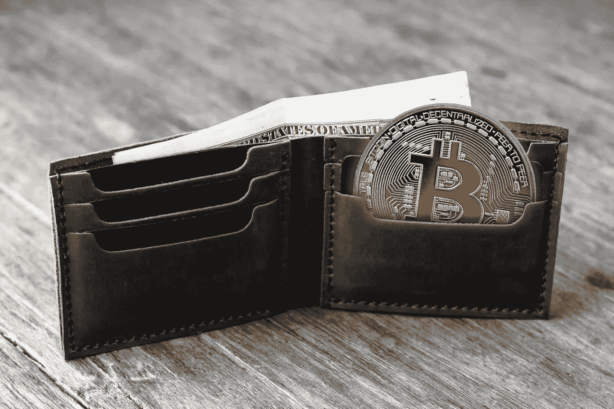
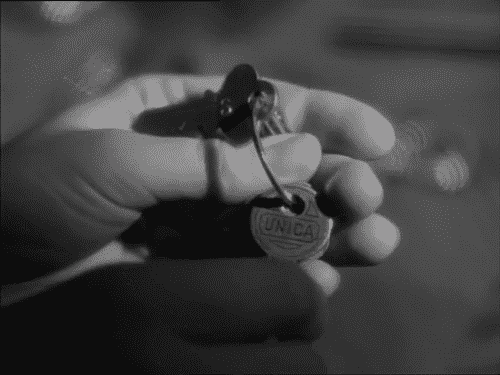
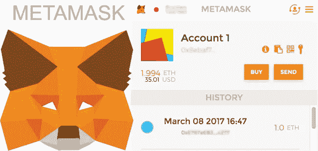
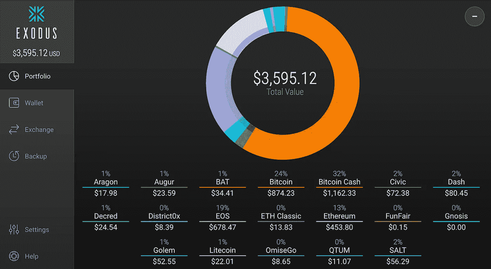
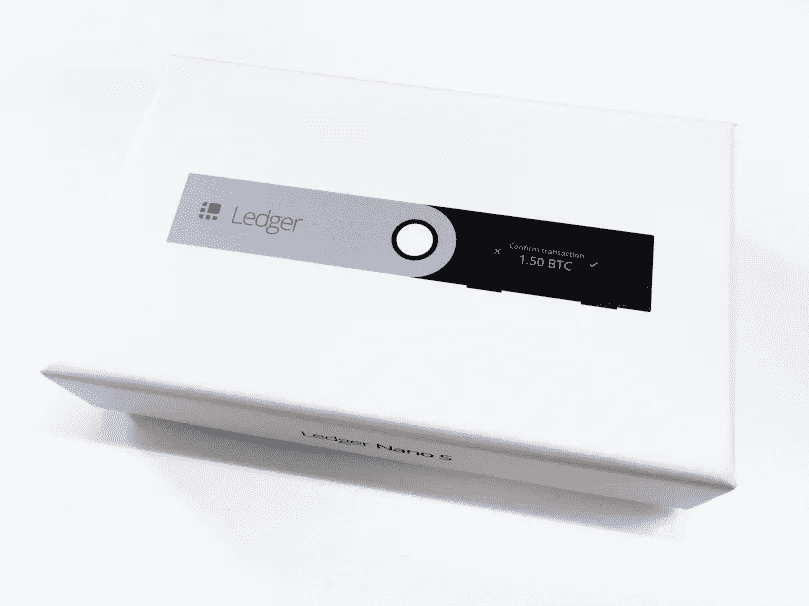

# 加密钱包与地址

> 原文：<https://medium.com/hackernoon/crypto-wallet-vs-address-54f7fb980bd3>

## 信不信由你，这是有区别的！

如果你尝试过存储任何类型的加密货币，无论是比特币、莱特币、以太币、NEO 还是 ERC 20 代币，你都有可能必须处理一个地址。不，等等——一个钱包。不，等等…一个钱包地址。啊？这可能会令人困惑，但钱包和地址是有区别的。在本文中，我将深入探讨它们是什么以及它们之间的区别，而不会涉及任何技术细节。

# 什么是地址？

地址是随机字母和数字字符的组合。把它想象成类似于美国斯普林菲尔德 123 号假街这样的物理地址。你想发多少地址都可以。就像拥有不同的物理地址；例如，你也可以拥有 124 Fake Street。事实上，在中本聪的[原始比特币白皮书](https://bitcoin.org/bitcoin.pdf)中，他/她/他们建议每笔比特币交易都使用一个新地址。与物理地址不同，**拥有一个是免费的**——它不像土地一样需要购买。

## 私钥

想象一下你在 123 号大街的家。你拥有那个家。除了你之外，没有人可以自由地进入其中(想象你在这种情况下是单身，不管是好是坏)。那是因为你有一把打开家门的钥匙，一旦你进入家门，你就可以随心所欲地从里面拿出东西。理想情况下，没有钥匙的陌生人不应该能够进入你的家，拿走东西。

用一个加密货币地址(包括比特币、莱特币、以太币、NEO 以及基本上所有其他的币)，也是同样的思路。与其称之为密钥，不如称之为**私钥**——强调你需要保持它的私密性。你用私人钥匙打开你的地址，然后你就可以进去把硬币送出去了。

就像你的房子钥匙一样，你可以复制它。一把物理钥匙可以在锁匠那里复制，一把加密货币的私人钥匙可以在你的电脑上复制粘贴。此外，就像家里的钥匙一样，你可能会不小心丢失你的私人钥匙。这两种情况都不可取——任何拥有你私钥的人都可以访问你的加密货币地址，将你的硬币发送到另一个地址，就像任何拥有你家钥匙的人都可以打开你的前门，偷走你的电视一样。

所以，如果我没有说清楚——保管好你的私钥。不要把它给任何人。如果你想了解更多关于恶意行为者窃取密钥或访问加密货币地址的方式，以及如何保护自己免受其害，请看看我的深入文章: [0 to Pro Crypto Trader](https://hackernoon.com/0-to-pro-crypto-trader-your-ultimate-guide-to-bitcoin-and-altcoin-investing-e3d7b3840125) 。

# 钱包

还记得我在前面提到的中本聪实际上建议每笔交易使用不同的地址吗？听起来是不是很头疼？

## 这就是钱包的由来。

默认情况下，钱包附带一个地址。这就是为什么它有时会让人们感到困惑——一开始我也感到困惑。但是，虽然钱包有地址，但它不等于地址。它可以是整个地址集合。之所以称之为钱包，是因为人们把它想象成一个真实的钱包，每个地址就是钱包里的一张信用卡。但我认为这种类比并不完全准确。

相反，我认为钱包更像是一个钥匙圈。它保存每个私钥的副本和每个私钥对应的地址。这样，你只需要打开你的钱包，就可以访问钱包里的所有地址。这就像钱包是一座大厦，一旦你进去了，你就可以进入任何你想进入的房间。

钱包可以在您的浏览器、计算机或物理设备上。下面是我为每种钱包推荐的一些例子。最终，我会推荐一个物理设备，因为我个人认为它比其他选择具有更好的安全性。

## 浏览器钱包

我认为唯一真正可用的浏览器钱包只适用于以太坊和以太坊代币。 [**MetaMask**](https://metamask.io/) 是一个免费的 Chrome 扩展，可以自动将你的钱包和地址连接到网站。使用密码登录后，您就可以访问 MetaMask 中存储的所有地址。元掩码处理本地存储您的私钥，因此您不需要像使用从 [MyEtherWallet](https://www.myetherwallet.com/) 生成的地址那样粘贴您的私钥。您也可以导入地址，只要您能提供私钥。这样，下次打开 MetaMask 钱包时，您就可以从导入的地址发送邮件。

## 桌面钱包

桌面钱包提供了最强大的加密货币选择。 [**Exodus**](https://exodus.io) 钱包就是一个例子。使用密码登录钱包后，您可以立即访问包括比特币、比特币现金、莱特币和以太坊在内的各种加密货币。私钥由 Exodus 加密并存储在本地。登录钱包后，您将能够发送加密货币，而无需担心自己处理私钥。

## 硬件钱包

[**账本 Nano S**](https://www.ledgerwallet.com/r/37b9) 就是硬件钱包的一个例子。这是我使用的一个钱包，我推荐给任何持有大量加密货币的人。就我个人而言，我建议每当有人说他们的加密货币价值超过 1000 美元时就购买它——大约 100 美元的成本，这大约是你投资组合总价值的 10%。与桌面钱包类似，Nano Ledger S 支持多种加密货币。