# 密码资产分类及密码部门历史发展分析

> 原文：<https://medium.com/hackernoon/cryptoasset-classification-and-in-depth-analysis-of-crypto-sectors-historical-growth-675b0af8660b>

# **摘要**

本文对加密资产类别进行了全面的分类，并描述了不同[加密](https://hackernoon.com/tagged/crypto)行业的历史市值趋势。我们的分析将帮助您更好地了解[区块链](https://hackernoon.com/tagged/blockchain)市场的总体发展，并为您提供进一步研究的工具。所提出的三级分类模型可用于识别最有吸引力的加密资产部门，使个人的加密组合多样化，基于历史趋势预测宏观发展等。

尽管存在几种加密资产分类(最著名的是 Fundstrat 和 Multicoin Capital 的分类)，但它们未能充分认识到加密空间的复杂性。据我们所知，目前还没有公开的对加密部门增长的深入分析。本文是填补这些研究空白的首次尝试。

我们的加密资产分类将区块链项目分为以下三个高级类别:

1.  储值/货币/支付方式
2.  区块链基础设施
3.  基于区块链的服务

二级和三级加密资产类别提供了更精细的分组，反映了区块链应用领域的巨大差异:

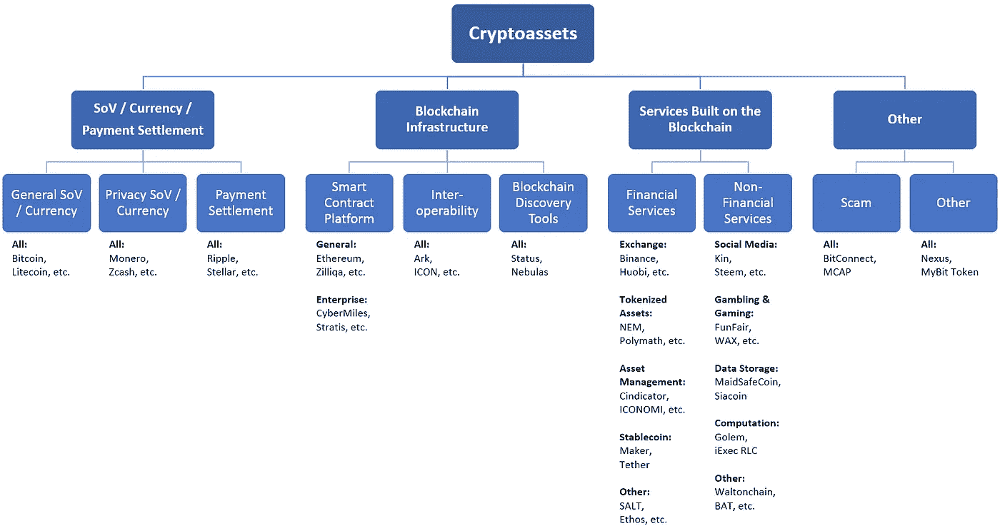

Figure 1\. Three-Level Cryptoasset Categorisation

我们对市值趋势的分析显示，加密资产行业的增长率差异显著。最大的加密资产(比特币和以太坊)在观察期内的市值增长方面均表现不佳(分别为+84%和+76%)，而较小的市值项目增长更强劲(+167%)。在我们的加密资产分类的第二个层次上，表现最好的是:非以太坊通用智能合约平台(+602%)和企业智能合约平台(+285%)。以隐私为重点的加密资产表现不佳，市值仅增长了 30%。在第三个分类级别，赌博和游戏子类别是增长的领导者(+423%)，而令牌化资产(+7%)是明显的输家。关于其他 cryptoasset 类别性能的详细信息，请参见“调查结果”部分。

你可能已经观察到我们描述的趋势，一些发展对专家来说似乎是显而易见的。然而，这篇文章甚至对训练有素的专家也有价值，因为它给出了不同加密资产类别增长率的准确数字，并允许您轻松地对它们进行基准测试。

> 订阅我们的酒吧，获取关于加密的最新分析:[加密数据科学](https://medium.com/crypto-data-science)。

# **分析**

目前存在几种加密资产分类，但是这些分类没有正确反映加密领域的复杂性，加密领域包含区块链技术的非常不同的应用。现有的分类要么过于抽象，缺乏必要的详细程度，要么包含极其细化的子类别，无法将其组织成更大的有意义的组。例如，Tom Lee (Fundstrat)将加密资产分为商品、隐私、平台、交易所和稳定账户——根据交易方式对加密资产进行分类。Multicoin Capital group 的普通合伙人基于其估值模型的加密资产。产生的类别是:货币(价值存储)、安全令牌(代表真实世界的资产)和实用令牌(工作令牌)。Jake Ryan (Tradecraft Capital)认识到需要一种比上述方法更精细的方法，并提出了以下分类:核心/储备、货币、平台、公用事业令牌、安全令牌、商品、应用硬币和稳定硬币。我们会争论杰克创建的确切类别(例如，我们特别怀疑包含比特币和以太坊的核心/储备组)；然而，我们的观点是，我们需要一种完全不同的方法来对加密资产进行分类。我们需要理解加密资产的巨大功能差异，同时能够谈论有意义的高级加密资产类别。为了确保我们提供所需的细节和抽象级别，我们创建了三级分类模型。

加密资产分类是一项重要的智力追求，但就其本身而言，除了作为进一步分析的工具之外，它对投资者没有什么价值。在本文中，我们使用这一新工具，并对历史趋势进行了深入分析，强调了哪些加密资产(子)类别增长最快，以及它们如何进行基准测试。据我们所知，这样的分析从未发表过，至少在我们提供的详细程度上没有。

## **先决条件**

在本节中，我们提供了不同的 cryptoasset 类型的描述，我们将在本文中进一步使用这些类型，这些类型对于我们所有的读者来说可能不是直观清晰的。如果你足够熟悉不同类型的加密资产及其独特的品质，你可以直接跳到方法论。

**储值(SoV)**——一种(加密)资产的功能，可以在以后保存、检索和交换，并且在检索时可以预见是有用的。更一般地说，它是一种在未来保持购买力的资产。贵金属(尤其是黄金)是典型的储值资产。

**货币/支付方式—** 旨在作为交换媒介的资产，即作为一种可交易的实体，用于避免纯易货系统的不便(用商品或服务交换其他商品或服务)。

**智能合同平台** —提供在区块链网络上创建和执行智能合同的方法(软件和硬件)，无需任何中央机构。智能合同是以自动执行的计算机代码编写条款和条件的合同。

**区块链互操作性**——一种大幅改善不同区块链之间信息共享的功能或服务。

**区块链发现工具** —搜索和浏览工具，帮助您找到区块链应用程序(dApps)、智能合同、数据和区块链本身。

**令牌化资产** —已经有价值的链外资产部分的数字合同(例如，房地产或公司股权)

**稳定货币** —与稳定资产挂钩的加密货币(如法定货币)。

## **方法论**

这一分析基于 2015 年 7 月至 2018 年 7 月的历史市值(MC)数据。目前，在 Coinmarketcap.com 上市的 1.6K 加密资产中，排名前 25 位的加密资产占总 MC 的 90%，而排名后 1000 位的加密资产占不到 1%。因此，我们决定仅将分析重点放在主要的加密资产上。我们将“重大”定义为从 2015 年开始的任何一天出现在累积 MC 前 95%的列表。通过这种方式，我们可以只关注那些得到加密投资者广泛认可的区块链项目，同时过滤掉所有次要的长尾加密资产。

149 个加密资产满足上述标准。为了准备数据，我们首先根据公开可用的信息，尽可能细致地对所有 149 项加密资产进行分类。当加密资产表现出混合属性(例如，价值存储和智能合约平台)时，我们根据其主要价值主张对其进行分类。在下一步中，我们分析了初始类别，并构建了具有不同质量的加密资产集群。分类的最终结果是我们的三级层次结构。

为了比较不同加密资产类别的性能，我们将我们的数据索引到 2017 年 9 月。为什么我们决定索引我们的数据？当我们第一次构建类似于 Coinmarketcap.com 的 MC 支配图(cryptoasset 的 MC 支配的每日变化，见下文)时，我们很快意识到在查看该图时识别和评估模式是非常具有挑战性的。我们可以很容易地识别主流加密资产(如比特币或以太坊)的 MC 开发模式；然而，在我们提供的加密分类的详细程度上，这项任务变得非常困难并且容易出错。因此，当我们索引数据时，我们为所有加密类设置了一个公共基础，然后可以看到这些类在给定时间点的表现。这也使我们能够轻松地比较所有的加密类，确定赢家，并确切地看到多少百分比的 MC 增长，他们优于其余的。

当我们为我们的指数选择基期时，我们希望它相对较新，能够代表稳定的市场——无论是从整体 MC 还是比特币/替代比特币的主导地位来看。由于这个原因，我们避开了 2017 年 12 月-2018 年 1 月的动荡时期，选择 2017 年 9 月底作为我们的基期。在此期间，加密市场处于上升趋势，这种上升是稳定和可持续的，不同于 2017 年 12 月的爆炸式(非理性)增长。到去年 9 月，Altcoins 已经在加密市场上建立了强大的地位，并取得了稳定的 MC 份额(比特币的统治地位稳定在 48%左右)。所有这些都让我们有信心选择 2017 年 9 月底作为我们分析的基期。

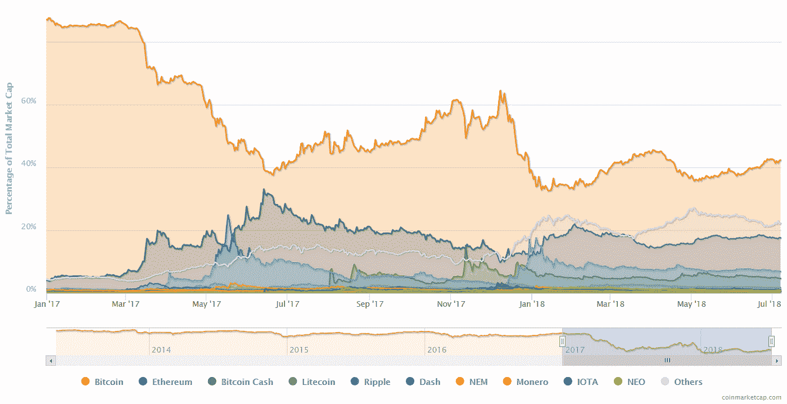

Figure 2\. Market Cap Dominance of Selected Cryptoassets (coinmarketcap.com)

## **限制**

我们希望我们的许多读者在解释我们的分析结果时会从投资机会的角度来考虑。由于我们关注 MC 数据而不是加密资产价格来确定趋势，当您考虑投资回报时，以下限制适用。

MC 增长不等于涨价。尽管 MC 的变化大致反映了加密资产价格的变化，但代币发行模式也会影响价格。例如，比特币很可能正在失去 MC 优势，但由于新代币发行或通胀水平非常低(目前每年约 4%)，价格可能比其他具有高通胀水平但 MC 不断增加的硬币上涨得更快。在对特定加密资产做出投资决策时，必须考虑这一点。

区块链项目的数量是以不同方式影响加密资产部门的 MC 和单个项目价格的另一个变量。一个行业的 MC 可能会由于越来越多的新区块链项目进入该行业而扩大，而不是由于旧项目的估价增加。如果新项目争夺相同的市场和投资者，那么它们的总行业 MC 可能会增长，而在单个项目层面，MC 可能会萎缩。

# **调查结果**

## **密码资产类别**

下面你可以看到我们的三级加密资产分类。我们避免对类别进行冗长的描述，因为在我们看来，这些是不言自明的。如果您不确定类别的定义，请参考上面的先决条件部分。您可以在方法部分找到我们如何处理加密资产分组的详细信息。

Figure 3\. Three-Level Cryptoasset Categorisation

## **加密资产类别的当前状态**

为了直观显示加密资产类别的当前状态，我们计算了市场份额，并统计了加密资产分类每个级别的区块链项目数量(截至 2018 年 7 月 7 日)。

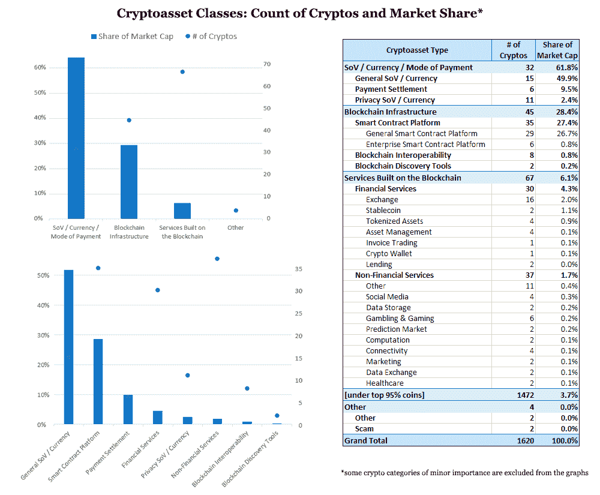

Figure 4\. Current State of The Cryptoasset Categories

不出意外的话，SoV /货币/支付方式类别目前以 62% MC 占据市场主导地位，而区块链基础设施项目占 28% MC。就不同项目的总数而言，基于区块链的服务是最大的类别，但目前仅占整体 MC 的 6%。

虽然查看加密资产类别的当前状态很有帮助，但这是一幅静态图像，无法说明加密类别的相对重要性随着时间的推移而发生的快速变化。下一节将深入探讨这些历史发展。

## **历史发展**

为了分析 MC 增长趋势，我们将数据索引至 2017 年 9 月 24 日(方法中概述了日期选择背后的基本原理)。除非另有说明，以下文本描述中的增长数字将 2018 年 7 月 7 日与 2017 年 9 月 24 日进行比较。

主要加密资产(如方法中所定义)的 MC 增长率为+106%。与比特币最大化主义者的直觉相反，世界上第一种加密货币在 MC 增长方面明显表现不佳。比特币在给定时间段内仅增长了+84%。以太坊的增长甚至更弱:+76%。如果我们从数据中排除比特币和以太坊，那么我们看到整体市值增长了+167%。

当我们查看提议的加密资产分类的高级别时，我们注意到类别 SoV /货币/支付模式增长了+94%，区块链基础设施增长了+134%，区块链上的服务增长了+133%。

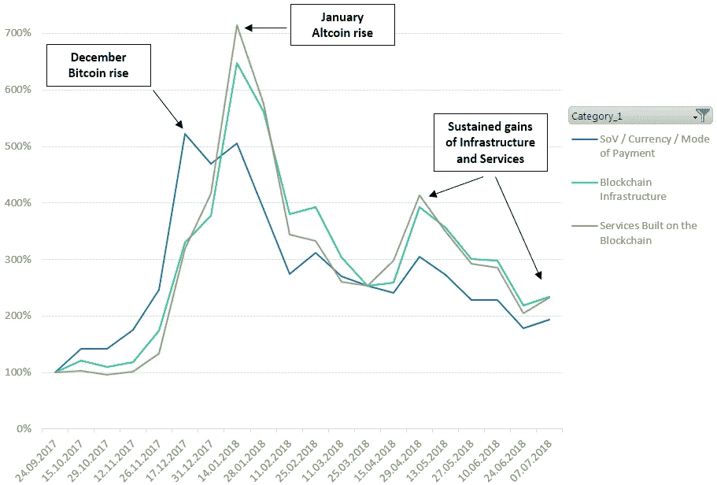

Figure 5\. Market Cap Growth: 1st Level of Cryptoasset Categorization

现在让我们看看同样的数据，但这次不包括比特币(及其硬分叉)以及以太坊(和以太坊经典)。非以太坊区块链基础设施类别表现最强(+495%)，而不包括比特币的支付类别的 SoV /货币/模式增长不太令人印象深刻，但仍高于原始比率(+129%)。因此以太坊的替代品在观察期内明显优于原始产品，而功能类似于比特币的加密资产表现不那么令人印象深刻，但仍优于世界上第一种加密货币。

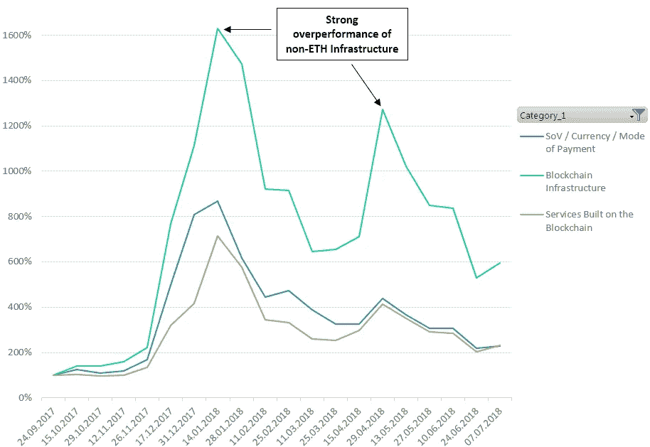

Figure 6\. Market Cap Growth: 1st Level of Cryptoasset Categorization (excl. Bitcoin and Ethereum)

在加密资产分类的第二个级别，我们看到了一个异常值——MC 增长+530%的区块链发现工具。然而，这组加密资产在 2017 年 9 月的起始基数相对较小，因此我们排除了离群值，并查看了剩余的类别。

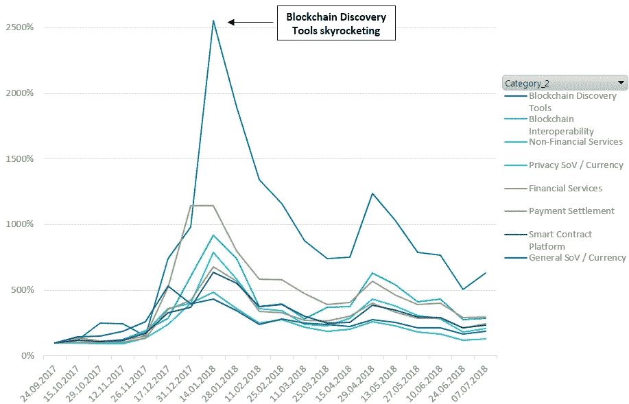

Figure 7\. Market Cap Growth: 2nd Level of Cryptoasset Categorization

其余表现最佳的是:支付结算(+198%)和区块链互操作性(+189%)类别。其次是金融服务(+145%)、智能合约平台(+132%)和非金融服务(+108%)。自 2018 年 1 月以来，一般主权财富基金/货币类别的表现一直严重不佳；然而，在过去的一个月中，该类别加强了其相对地位，但在观察期结束时仍表现不佳，仅增长了+86%。在这场 MC 主导权竞赛中，明显的输家是隐私 SoV /货币集团。以隐私为重点的加密资产失去了他们的地位，截至 2018 年 7 月，增长率仅为+30%。

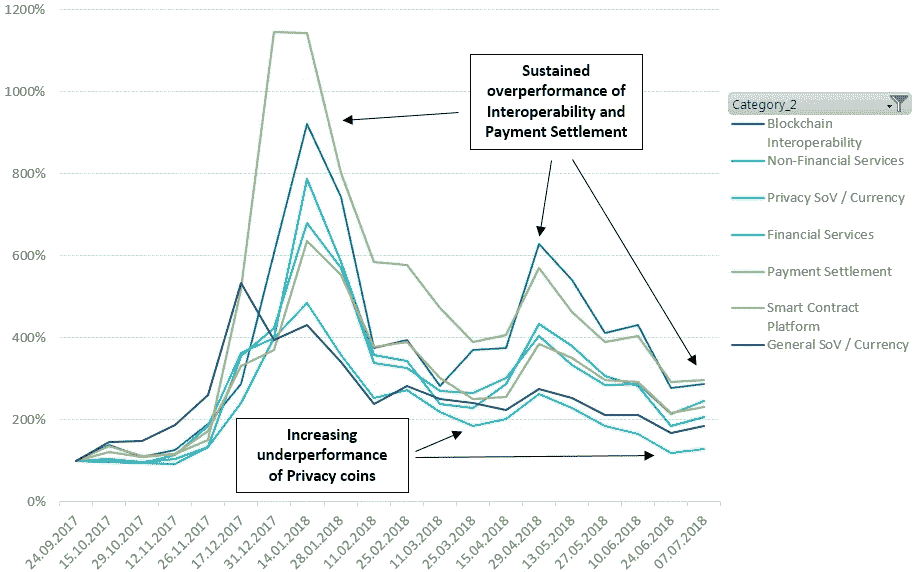

Figure 8\. Market Cap Growth: 2nd Level of Cryptoasset Categorization (excl. Blockchain Discovery Tools)

当我们深入研究智能合约平台类别时，我们注意到企业子类别的增长非常强劲(+285%)，而通用智能合约平台仅略高于整体市场增长(+130%)。

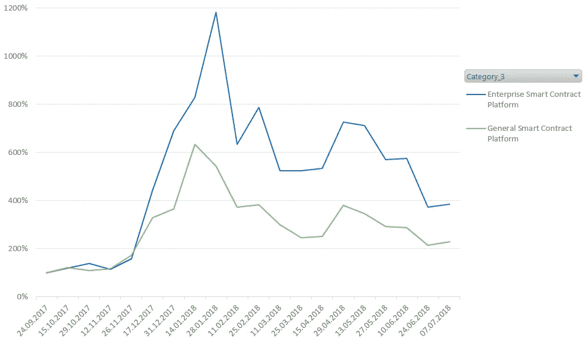

Figure 9\. Market Cap Growth: 3rd Level of Cryptoasset Categorization — Smart Contract Platforms

然而，当我们排除以太坊和以太坊经典时，一般子类别以惊人的+602% MC 增长跑赢了。这与我们之前对一级类别的观察一致，也再次凸显了以太坊的竞争对手在过去几个月中获得的优势。

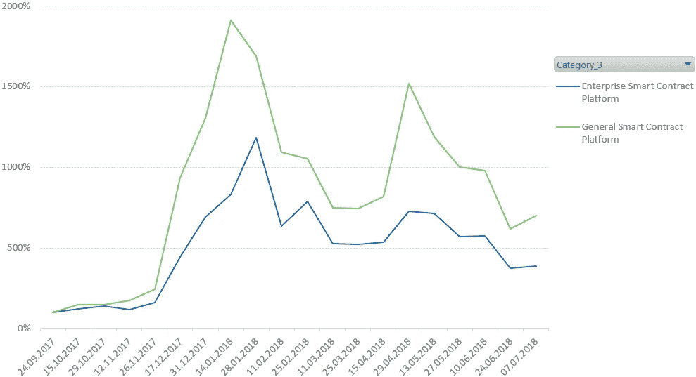

Figure 10\. Market Cap Growth: 3rd Level of Cryptoasset Categorization — Smart Contract Platforms (excl. Ethereum)

金融服务集团的子类别增长速度非常不同。Stablecoins 的 MC 整体增长最快(+571%)，大多数增长发生在 12 月和 2 月之间。从 2018 年 2 月到今天，Stablecoins 不仅价格保持稳定(理应如此)，而且 MC 也保持稳定。发票交易子类别在 12 月和 1 月实现了暴涨，但未能保持增长，最终整体增长+156%。Exchange Services 的 MC 增长了+204%，而 Crypto Wallets 子类别增长了+136%，资产管理增长了+90%。令牌化资产明显表现不佳，增长率仅为+7%。

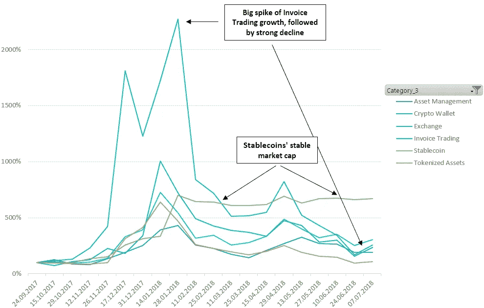

Figure 11\. Market Cap Growth: 3rd Level of Cryptoasset Categorization — Financial Services

对非金融服务的进一步研究揭示了连通性子类别的爆炸性增长。这是迄今为止增长最快的非金融服务部门(+1，386%)。然而，由于连通性在 2017 年 9 月至 11 月处于萌芽阶段，我们将其作为异常值排除在外。

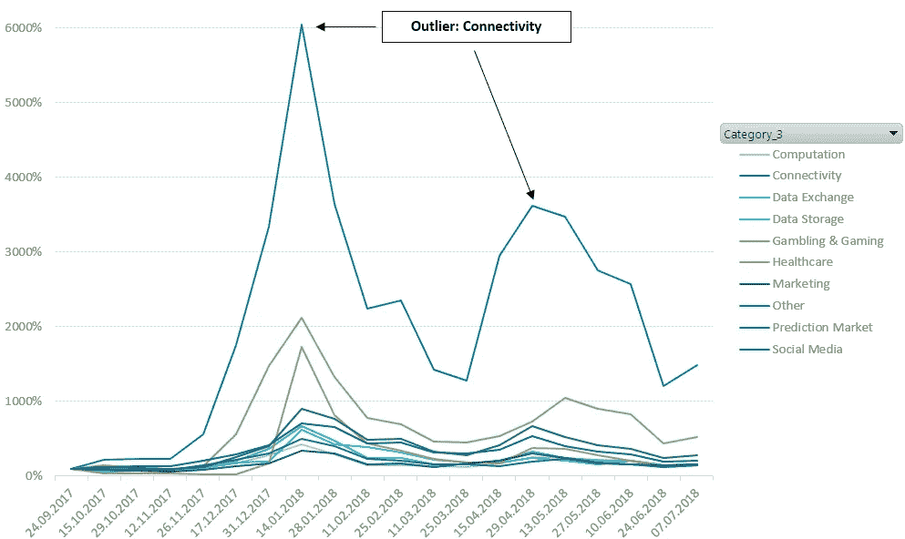

Figure 12\. Market Cap Growth: 3rd Level of Cryptoasset Categorization — Non-Financial Services

在其余的非金融服务中，赌博和博彩业增长最为强劲(+423%)。社交媒体子类别的表现优于市场(+181%)，而其他非金融服务——该群体高度分散，包括劳动力市场、供应链管理、认证服务等项目。—MC 适度增长+110%。弱势公司的增长率在+43%到+54%的狭窄范围内:营销、预测市场、数据存储、计算、数据交换、医疗保健。有趣的是，医疗保健在 1 月份享受了强劲的 MC 增长，但这种增长在月底突然终止。总体而言，医疗保健子类别表现不佳，最终增幅低于平均水平+49%。

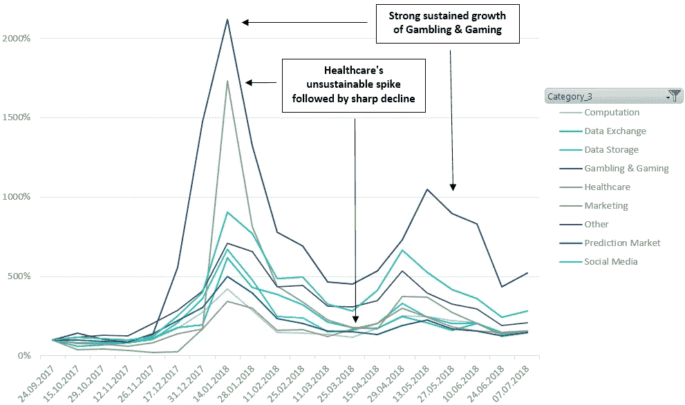

Figure 13\. Market Cap Growth: 3rd Level of Cryptoasset Categorization — Non-Financial Services (excl. Connectivity)

当我们将数据索引到更近的日期(2018 年 3 月 25 日)时，除了极少数例外，相对趋势保持相似。这些例外是:资产管理是金融服务中增长最快的子类别(+32%)，计算(+25%)在非金融服务中。总体而言，从 2018 年 3 月 25 日到 7 月 7 日，主要加密资产的 MC 下降了 19%。

# **结论**

为了了解区块链市场的发展，我们需要对加密资产进行全面的分类。这种分类降低了高度分散的加密空间的复杂性，并允许人们看到市场上的发展，而不仅仅是对单个加密资产的短期投机。我们的三级分类模型认识到了加密资产的巨大功能差异，并提供了所需的细节和抽象级别。它可以作为加密投资者或区块链研究人员的工具，以识别最有吸引力的加密资产部门，使个人的加密投资组合多样化，根据历史趋势预测宏观发展等。

我们的分析显示，加密资产行业的增长率差异显著。最大的加密资产(比特币和以太坊)在观察期内的 MC 增长方面表现不佳(分别增长+84%和+76%)，而较小的 cap 项目增长尤为强劲(+167%)。高级加密类别 SoV /货币/支付模式增长了+94%，而区块链基础设施的 MC 增长了+134%，基于区块链的服务增长了+133%。在第二级分类上，表现最好的是非以太坊通用智能合约平台(+602%)、企业智能合约平台(+285%)、支付结算(+198%)和区块链互操作性(+189%)。以隐私为重点的加密资产表现最差，增长率只有+30%。第三级子类别赌博和游戏增长最强劲(+423%)，而交易所(+204%)和社交媒体(+181%)子类别也跑赢大盘。其他子类别，包括预测市场、数据存储、计算、医疗保健，特别是令牌化资产，以低于平均水平的增长率令投资者失望。

一旦您确定了增长最快、最具吸引力的加密资产行业，您就迈出了做出明智投资决策的第一步。下一步，你应该评估所选行业的长期前景，选择具体的区块链项目，进行尽职调查，同时关注代币发行模式和竞争格局。或者，盲目投资属于具有积极长期前景的有吸引力的加密资产部门的所有主要加密资产可能会产生不错的结果，尽管不是一流的结果。

订阅我们的酒吧，获取关于加密的最新分析:[加密数据科学](https://medium.com/crypto-data-science)。

*本文信息并非投资/金融/交易建议。在做出任何投资决定之前，请做好自己的尽职调查。我们不建议您购买、出售或持有任何加密资产。*