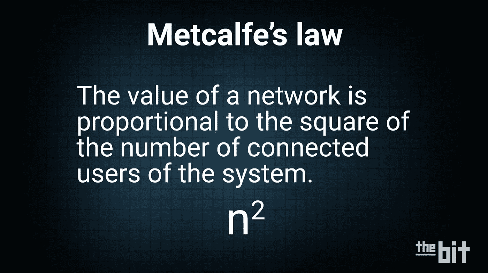
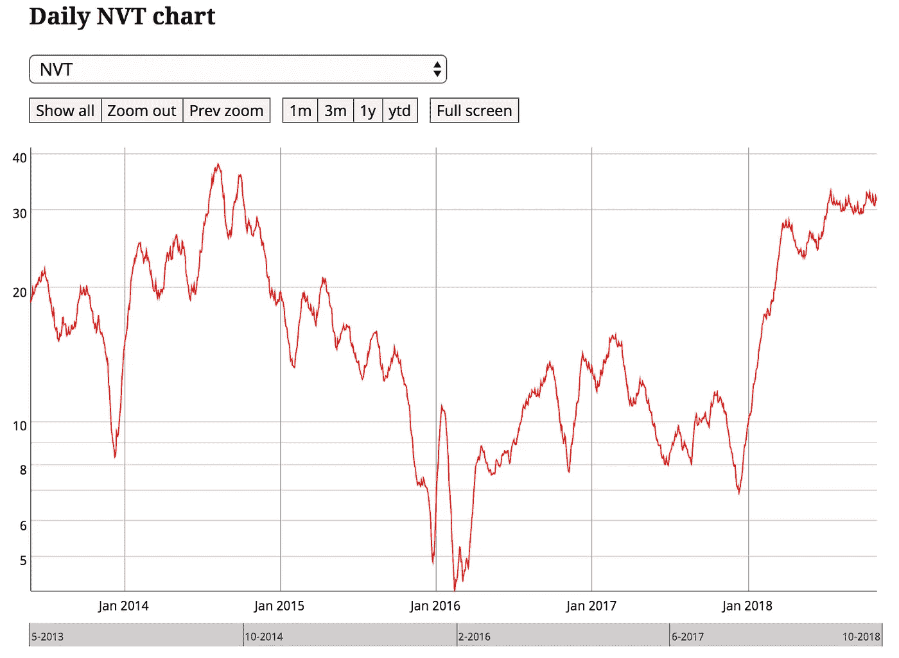
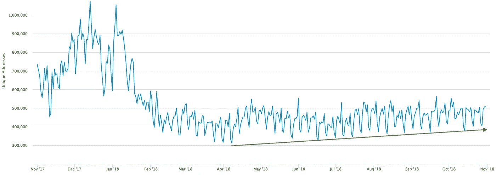
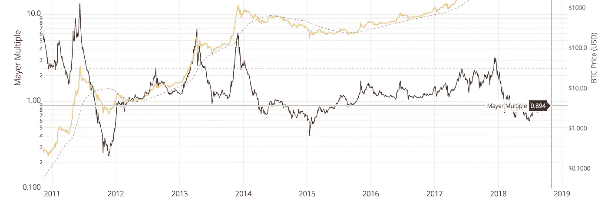
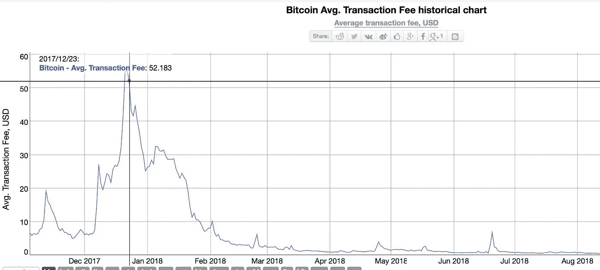
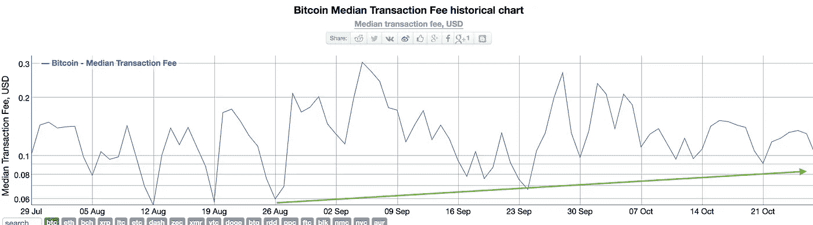

# 加密资产基本面分析—需要关注的 7 个指标和比率

> 原文：<https://medium.com/hackernoon/cryptoasset-fundamental-analysis-7-indicators-ratios-to-watch-e905da4b6c5>

作为加密投资者社区的一员，我可以说已经有很多关于投资者应该如何对加密资产进行基本面分析的讨论。我们在互联网上看到很多关于技术分析的讨论，从脸书集团到 Reddit 再到#CryptoTwitter。 [Chris Burniske](/@cburniske) 出了一本很棒的书，“[Cryptoassets:The Innovative Investors Guide to bit coin and Beyond](https://www.amazon.com/Cryptoassets-Innovative-Investors-Bitcoin-Beyond/dp/B07848GCYN/ref=sr_1_2)”，这是我第一次听到“crypto assets”这个词而不是加密货币来描述使用区块链和其他分布式账本技术的资产。在他的书中，他为如何进行基本面分析提供了一个很好的案例。

对我来说，我做的大部分基本面分析都围绕着网络活动。这些加密资产大多是逻辑或物理网络。一些区块链，它们是运行相同开源代码的分散节点的集合。这些节点相互通信以同步保存所有相同的信息，从而所有节点以相同的顺序记录相同的数据。这些是物理网络。其他加密资产是运行协议的令牌。它们的用户联网在一起，提供某种协议或服务。它们运行在以太坊或 EOS 等区块链平台上，但代币本身不是区块链。这些加密资产仍然是网络，尽管它们是逻辑网络。

无论加密资产是逻辑网络还是物理网络，加密资产的主要价值都源于网络。加密社区的大多数人都认同加密资产通过网络效应获取价值的事实。一个**网络效应**是在经济学和商业中描述的积极的**效应**,即一个额外的商品或服务用户对该产品对其他人的价值的影响。如果加密资产存在网络效应，那么梅特卡夫定律将在如何评估这些资产的价值方面发挥作用。

## 梅特卡夫定律

如果我们要利用网络活动是理解加密资产衍生价值的关键这一事实，那么我们需要理解[梅特卡夫定律](https://en.wikipedia.org/wiki/Metcalfe%27s_law)。它指出，网络的价值与连接用户数量的平方成正比。简单地说，随着越来越多的人使用加密资产，由于网络效应，其价值就越高。随着用户数量的线性增长，网络的价值呈几何级增长。例如，粗略地说，如果一个网络的连接用户数量增加一倍，那么这个网络的价值就会增加 4。这就是为什么理解网络活动至关重要，以便我们可以采取基本方法来评估加密资产。非线性增长能力是理解加密资产价值的关键。

## 7 用于基本面分析的指标和比率

在我的公司，我们使用基本面分析作为我们投资方法的三个方面之一。我们使用以下 3 个指标和 4 个比率。

3 个指标:

*   **唯一地址**(每日)
*   **成交金额**(每日)
*   **采矿成本**(每日)

每个指示器显示一个趋势— *上升*、*下降*或*保持*。如果它们在上涨，那就是看涨。如果它们在下跌，那就是看跌。如果他们持有，那就是中立。

4 个比率:

*   **NVT 比率** —看涨是< 15 &看跌是> 25
*   **MVRV 比率** —低估为< 1.5，高估为> 3.5
*   **梅耶尔倍数** —看涨是< 1.0，看跌是> 2.4
*   **矿业市盈率** —看涨是< 1.2，看跌是> 3.2

这些比率中的每一个都有两个阈值，上阈值和下阈值。其他人可能会使用不同的阈值，但我们发现这些因素最适合我们的决策。让我们更深入地探讨一下每一个问题。

## 网络价值与交易(NVT)比率—加密的市盈率

要了解加密资产的基本估值，最基本的比率之一是网络价值与交易的比率。该比率将网络价值(在 equites 空间中被认为是市值)除以网络交易。我们希望了解整个网络的价值之间的关系，以及它与网络活动的关系。这个比率通常被称为“加密的市盈率”，因为它是确定基本价值的最基本指标之一。如果加密资产具有非常高的网络价值(即市值)和低网络活跃度，那么它将具有高 NVT 比率。如果加密资产具有中等网络价值和高网络活跃度，那么它将具有较低的 NVT 比率。后者可能表明存在价值，因为我们再次分析网络活动，并始终考虑梅特卡夫定律和网络效应。

From: Coin Metrics / coinmetrics.io

## 网络唯一地址(每日)指示器

唯一地址是一个重要的基本指标，因为它显示了在任何给定的一天有多少人在使用网络。我们要观察这个指标来看趋势。如果趋势上升，网络使用率上升，那么我们可以预期网络的价值会上升。相反，如果我们看到唯一地址减少，那么使用率就会下降，我们可以预期网络的价值也会下降。如果我们回顾一下梅特卡夫定律的定义，我们会发现用户数量在决定一个网络的价值方面起着重要的作用。我们没有试图给每一个用户数量赋予一个确切的网络价值，而是使用趋势——那天使用网络的人是多了还是少了？

From Blockchain.info

## 网络交易值(每日)指示器

分析每天使用的唯一地址只能让您了解网络活动的一半情况。如果您想要评估价值，那么您还需要查看在特定时间段内移动了多少价值。网络交易价值指标为您提供了网络交易价值是上升、下降还是稳定的趋势。如果每日价值上升，那么网络的整体价值也应该上升。反之，如果价值下降，那么网络价值也在下降。该指标用于标记趋势；它不习惯任何评估指标或流程。通过网络转移的价值越多，网络就越有价值。

## 市场价值与实现价值比率

MVRV 比率是 NVT 比率的一个更加专业化的版本。它是一个网络的市场价值(市值)与其实现价值之间的比率。实现价值是对市值的计算，其中硬币和价格基于每枚硬币上次在区块链交易时的 BTC 市场价格。这消除了损失的硬币，并建立了一个基于累积成本的价格，帮助投资者看到基于过去交易的真实价格支持水平。丢失的硬币扭曲了平均计算，MVRV 比率试图纠正这种扭曲。这个比率是由 Castle Island Ventures 的 Nic Carter 创建的，并在文章“[比特币市值与实现价值(MVRV)比率](https://blog.goodaudience.com/bitcoin-market-value-to-realized-value-mvrv-ratio-3ebc914dbaee)”中进行了概述。这个比率之所以有效，是因为它通过排除一些边缘情况，让用户更好地了解网络的价值。

## 迈耶倍数比

迈耶倍数是继 NVT 比率之后更为成熟的比率之一。它是以第一批比特币投资者和分析师之一的 T2·特雷西·迈耶的名字命名的。它是一种统计估计，使用 200 天移动平均线显示价格水平与其历史交易模式的关系有多普遍。简而言之，迈耶倍数:

*   Mayer 倍数=价格/ 200 DMA (200 天移动平均线)

例如，今天的迈耶倍数(MM)是 0.89(6373.85 美元/7142.22 美元)。你可以在这个推特账户 [@TIPMayerMultiple](https://twitter.com/tipmayermultple?lang=en) 轻松查看每日梅耶尔倍数。如果 MM < 1.0，它是看涨的，如果 MM > 2.4，它是看跌的。该帐户还每天用新值对数据进行回溯测试，以显示该指标对当前投资和 1 年投资层的正确百分比。今天，MM 为 0.89，一年后有 77%的时间比今天的价格高。这个比率是有价值的，因为它预测一年后的价值比不预测更常见。

*From: WooBull Charts*

## 价格与采矿成本盈亏平衡比率

价格与开采盈亏比比较了加密资产的价格与开采成本。这个比例只对被开采的硬币有效，对代币或预开采的硬币无效。大多数时候，这个比率被用于储备加密资产之一，比特币或以太网。

例如，如果比特币交易价格为 6400 美元，采矿盈亏平衡价格为 7000 美元，则市盈率为 0.91 (6400/7000)。如果比率为< 1.2 then the ratio is bullish and if the ratio is > 3.2，则比率看跌。

这个比例有价值的原因是双重的。第一，采矿系统是一个封闭的动态系统，总是寻求达到平衡。如果采矿成本高于价格，那么一些矿工会因为无利可图而放弃采矿。他们会等到数字对我有意义。如果价格远远高于开采成本，那么就会有看到高盈利潜力的新矿商加入进来。这些新的矿工，将迫使算法增加复杂性，使其更难和更昂贵的挖掘。这就是[工作证明](https://en.wikipedia.org/wiki/Proof-of-work_system)共识机制的症结所在。第二，使用这个比率是因为，当回溯测试时，它是有效的。[fund strat](https://cryptoiscoming.com/bitcoin-price-vs-cost-of-mining/)所做的研究工作显示，当观察一年后比特币的价格时，它是正确的。这个比例以及价格和开采成本之间的关系引起了激烈的争论。有些人不相信这两者之间有关系。

## 采矿成本指标

在高峰时期，我们在比特币网络上支付每笔结算交易超过 50 美元。你可以看到采矿成本指标在一月中旬下降。很容易看到交易费用大幅下降，这是因为网络活动正在崩溃。随着网络活动的减少，我们可以预期网络的价值也会崩溃。对于比特币网络来说，这是一个悲观的指标。

现在，你会在下图中注意到，趋势在 2018 年 8 月开始上升。似乎有更多的需求和更多的网络活动，而且趋势似乎在上升。这是比特币的一个看涨指标。

如你所见，采矿成本是一个重要的指标，当你全面了解市场情况时，它是你需要考虑的众多因素中的一个。

## 结论

在 Tradecraft，我们在基本面分析的核心框架中使用这 3 个指标和 4 个比率。现在，加密资产是如此相关，以至于我们正在使用比特币网络来确定整个加密市场的宏观视图。这些指标目前并未用于评估每项加密资产。这在未来可能会改变，但现在它正在为一个普遍的观点而工作。

以下是 2018 年第四季度 Tradecraft 加密基础框架(TCF)的概述:

使用这些指标，我相信加密市场已经触底，他们正在显示价值。我想更深入地了解每日交易量和每日交易量，看看它们是否代表需要纳入投资策略的风险。总的来说，目前密码市场的基本面看起来不错。

上等的

*免责声明:以上仅代表一种观点，仅供参考。它无意成为投资建议。请自己做作业。*

[***杰克·瑞恩***](/@jake_ryan) ***是 Tradecraft Capital 的 GP，创业顾问，天使投资人&投资方面的作家。如果你喜欢这篇文章，请“鼓掌”帮助别人找到它！欲知详情，敬请关注*** [***【脸书】***](https://www.facebook.com/tradecraftcapital)*[***碎碎念***](https://twitter.com/TradecraftJake) ***。****

*# crypto #加密货币#比特币#投资# howto #区块链#估值#加密估值#基本面分析#tradecraft*