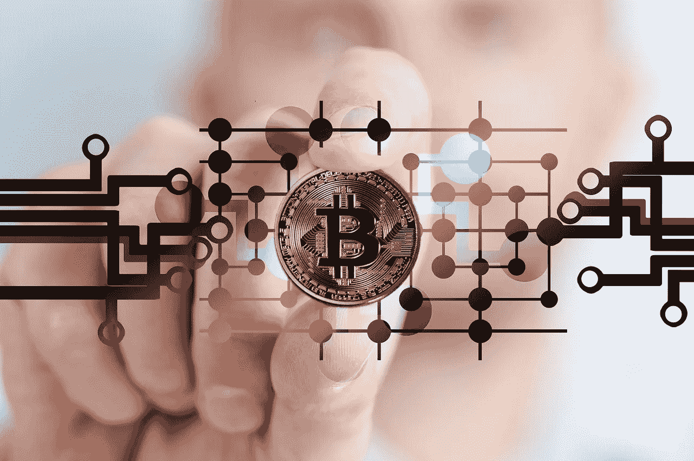

# 加密货币比它们的直接价值更大

> 原文：<https://medium.com/hackernoon/cryptocurrencies-are-bigger-than-their-immediate-value-c8270ec452c2>

## 随着加密货币价格保持在低端，它们的真实价值是什么？

我们都听说过密码市场会有巨大收益的预测。“他们今年将涨到 20 万美元！”或者“我们已经看到了加密熊市的终结！”

诸如此类的声明来了又去，然而加密货币仍远低于所有人的预期。实际上，这里的关键词是“假设”许多爱好者出于给自己的加密货币注入活力的需要，已经将他们希望发生的事情投射到市场上。

绝对没有证据表明任何乐观的预测会成为现实。然而，许多早期采用者仍然抱有希望。

## 加密货币比其当前价值更大

我们这些与外汇有任何联系的人看到了交易者如何处理法定货币和当前加密市场的某些相似之处。然而，这种范式正开始消退。诚然，这让价格低于预期，但也让加密货币过渡到一个更成熟的状态。

加密货币生态系统更多的是一种与货币不同的关系。从本质上讲，这是一种解放，解放了每个人与货币体系的关系。这些系统已经存在了几个世纪，很可能几千年。

可行的加密交易所的出现，与许多金融科技银行解决方案的目标更加接近，显然正在融合。

像 Ternion T1、expanded T2 比特币基地 T3 这样的混合交易所，以及其他交易所正在成为一个渴望成熟的行业的下一个阶段。这类平台是当前日内交易量增长的背后原因，这远比价格波动更重要。

那么价格会回升吗？我不这么认为，这对我来说很好。