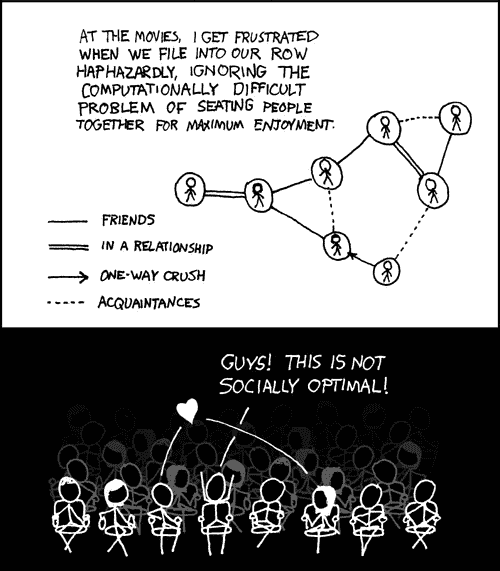

# 加密货币、配对和帕累托最优淘金

> 原文：<https://medium.com/hackernoon/cryptocurrencies-matchmaking-and-pareto-optimal-gold-digging-5f4c6cb825fd>

AXE 算法像我们希望 eHarmony 那样匹配对等点。

帕累托效率的结果是每个人都尽可能地富裕，而不会伤害到另一个人。虽然帕累托最优不一定保证系统是理想的，但非帕累托最优系统肯定是不太理想的。毕竟，如果可以做出一种安排，使得即使一个人也能受益，而其他人不会遭受损失——为什么没有实施这种制度呢？

This cartoon taken form [XKCD](https://xkcd.com/173/)

[AXE](http://AXE.eco/) 的目标是激励分散网状网络中的无信任带宽交换。

在 AXE 中，中继节点为他们的传输费用出价，以便将请求者与期望的终端节点连接起来。然后，请求者可以选择接受提供最低费用的中继对等点(或者直接连接，如果可能)来建立所需的连接。带宽是递增交换的，这样，如果新的请求者接受更高的出价来建立连接，中继可以立即丢弃连接。这样做，AXE 创造了帕累托最优的结果，因为它为中继对等点支付诚实的最低成本，他们愿意在给定的时间传输数据。

同时，请求节点也根据其带宽需求的紧急程度，与中继节点保持最佳匹配。请求对等体可以等待具有较低速率的新中继对等体变得可用，从而有效地权衡延迟考虑和带宽价格考虑。请求静态文档的个人有更多的时间来寻找并建立与终端对等方的关系，而请求连接到网飞服务器的人可能愿意为更低的延迟支付更多的费用。

AXE 因此为匹配请求者和中继对等点创建了一个[防策略](http://www.cs.cmu.edu/~sandholm/cs15-892F13/algorithmic-game-theory.pdf)机制。诚实面对一个动态带宽市场上不断变化的经济偏好是值得的。

我正在用[时代](https://era.eco/#step1)构建去中心化网络的防审查基础设施。想了解更多关于加密激励的信息吗？查看我的文章[加密经济学和机制设计:人类与加密货币互动的 5 种不同方式](https://hackernoon.com/cryptoeconomics-and-mechanism-design-85508310e931)。

*如果你喜欢这篇文章，如果你为它鼓掌，分享它，并在* [*推特*](https://twitter.com/ambercazzell) *上与我联系，这将意味着很多！*