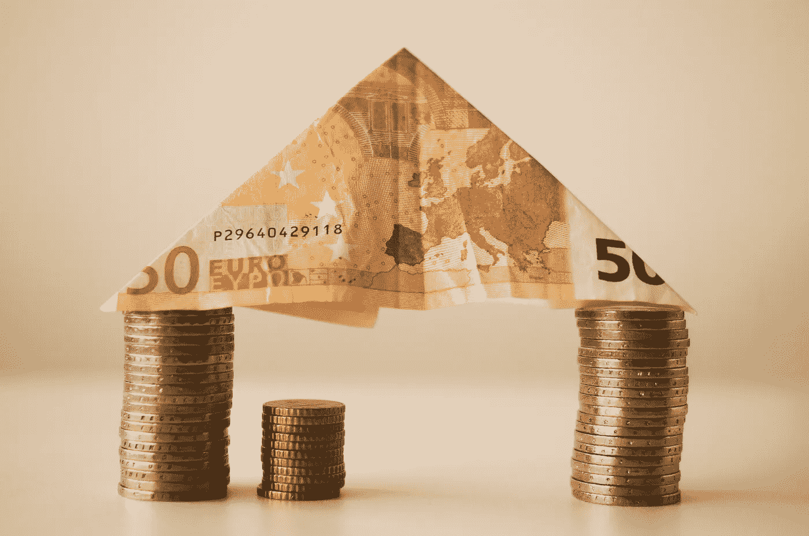
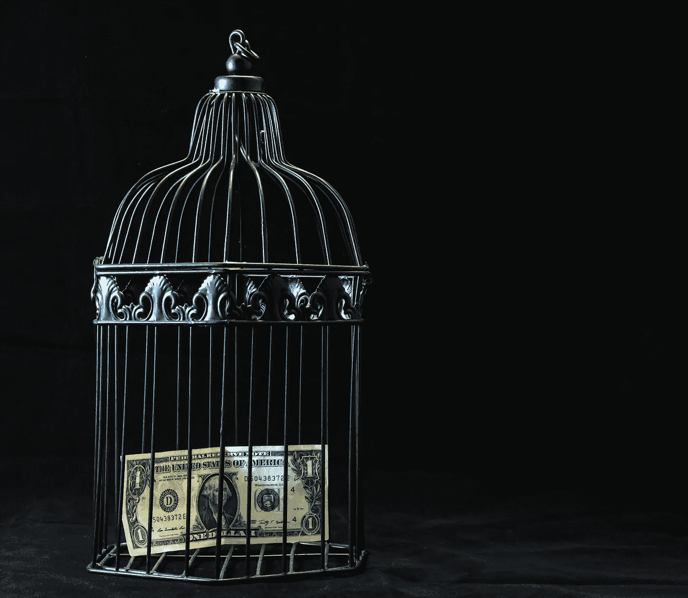

# 加密货币:我们真的应该称之为货币吗？

> 原文：<https://medium.com/hackernoon/cryptocurrencies-should-we-really-call-them-currencies-44a2f0ae5bc7>

## “所有的钱都是信仰的问题”——亚当·斯密。

# 加密货币实际上代表什么？

自从我开始在[区块链](https://hackernoon.com/tagged/blockchain)领域工作以来，我试图让自己的头脑围绕加密货币/硬币/代币，并理解它们是哪种资产。不同的人对它们有不同的称呼，有些人区分硬币和代币，而大多数人似乎都将它们归为加密货币。尽管我不是金融专家，但我是法学毕业生。这意味着我喜欢定义。我喜欢争论。在这篇课文中，两者都会有很多。

因为我们生活在一个数字化的时代，我谈论的是数字化意义上的纯粹数字化的东西，我将使用人们信任的数字百科全书中的一个定义，唯一的维基百科:

*一种* [*加密货币*](https://hackernoon.com/tagged/cryptocurrency) *(或称加密货币)是一种* [*数字资产*](https://en.wikipedia.org/wiki/Digital_asset) *被设计作为一种* [***交易媒介***](https://en.wikipedia.org/wiki/Medium_of_exchange) *使用***加密技术来保护其交易、控制额外单位的创建以及验证转账**

*总的来说我同意这个定义。但是，当然会有‘但是’。我想着重谈谈“交易媒介”这一方面。多年来，它采取了各种形式。现在让我们看看它们，看看它们与 crypto 有什么关系。*

# ***贝壳、硬币、钞票&什么不是***

*想交换东西是人性的基础。我们都听说过物物交换系统。一个人，比方说彼得，想要面粉。不幸的是，他不是磨坊主，但他有奶牛和鸡蛋可以提供。另一个人，姑且叫他约翰，是个磨坊主，想把面粉卖给彼得。我们在小学学过，现在彼得会用 x 数量的山羊或鸡蛋来换面粉。尽管这听起来很棒很浪漫，但没有证据表明它真的发生过。第一个问题是，约翰可能不想要鸡蛋或山羊，第二，即使他想要，他可能在彼得无法提供的不同时刻想要它们。*

**

*但是皮特仍然想要面粉，他想要好的。这就是“交换媒介”重新出现的原因。考古学家发现，大约公元前 1200 年，中国人使用贝壳作为交换手段。200 年后，贝壳被作为货币的金属所取代，这就像……贝壳。公元前 600 年，第一枚硬币实际上是由吕底亚国王在今天的土耳其铸造的，由银金矿(金银的混合物)制成。多年来，不同地区的人们使用不同的硬币。在 7 世纪到 11 世纪之间，纸币被引入中国。有些人说，它们的产生是因为当时制造硬币的铜短缺，有些人说是因为硬币本身运输不便。商人不想带着硬币到处走，所以他们会把它们交给一个信任的人，他们会给一个证明，证明他在那里得到了这笔钱。然后，他可以使用票据进行交易，因为它们提供了一个承诺，即在出示票据时，持有人将收到到期应付的款项。*

*1871 年，西联汇款公司允许通过电报向海外汇款，因此转账以电报的形式出现，20 世纪 50 年代，随着信用卡的流行，转账以塑料的形式出现。20 世纪 90 年代，当 PayPal 允许通过电子邮件支付货款时，我们就有了电子邮件货币。事实上，PayPal 有一个更宏伟的愿景——他们想创造一种新的互联网货币来取代美元。2009 年，多亏了中本聪，随着比特币的诞生，我们有了加密货币。PayPal 前总裁萨克斯·首席运营官表示“*,但比特币等加密货币正在实现最初的愿景。他们以一种分散的方式来做这件事(用一个叫做区块链的分散数据库)，而 PayPal 试图以一种集中的方式来做这件事。**

**

*正如我们所看到的，几个世纪以来，人们一直相信各种东西的价值，如贝壳、金属、纸张。现在是加密货币形式的计算机代码。*

# ***我们可以用加密壳来交换什么？***

*这是真的，媒介在进化——从外壳到加密。但现在另一个问题来了:我们能用它来交换什么？因为这是我们努力的方向。用我们拥有的东西(硬币、贝壳、密码)交换我们想要的东西的能力。显然，不是所有的东西都可以用钱买到，但是用密码可以买到什么呢？*

*让我们从连我妈妈都能叫出名字的加密货币开始:比特币。起初，它是丝绸之路使用者最喜欢的货币，让我们委婉地说，他们不用它来买面包和黄油。但后来它传播得更远了，你可以用比特币购买披萨，几年后你甚至可以用比特币支付出租车费用。但就在圣诞节前，交易成本将飙升至 60 美元，因此它停止履行这一职能。*

*而其他的 **1400 加密货币**呢？考虑到其市值，第二大加密技术——以太——被用作以太坊平台上的一种支付方式，让你可以创建智能合同并制作自己的令牌。这些**代币可以代表各种资产**(你可以在[trivial.co](http://trivial.co)上查看有多少不同的代币)。这些代币通常也被称为加密货币。你能用它们做什么？嗯，主要是为创业公司创建的平台上的服务付费。你看到模式了吗？嗯，是的，这些是交易媒介代币，可以在尚未开发的平台上用作支付手段(这是我最喜欢的关于这个主题的文章，作者是[以太坊创始人本人](https://vitalik.ca/general/2017/10/17/moe.html) [)。让我们试着把它翻译到现实世界中。每家公司都可以有自己的货币，这意味着如果我想去我住的街道上的餐馆，一旦我选择了一家餐馆，我就需要在交易所购买他们的硬币。或者，如果我想去超市，如果每个品牌都有自己的加密货币，我就需要买几个来买东西(哦，对了，](https://vitalik.ca/general/2017/10/17/moe.html).)[香蕉币](https://bananacoin.io/)是最近发明的)。*

**

*我们不是发明了一种货币，这样我们就可以在美国的任何地方用同样的美元支付了吗？或者我们不是同意引入欧元以便在法国、德国和其他 17 个国家使用吗？*

# ***名字里有什么？***

*我发现令人着迷的是，我们仍然称之为加密硬币，因为这是我们已经使用了 3000 年的语言，我们试图用一种古老的语言来理解新世界。我们还试图通过应用我们已经使用的概念和名称来加密资产，即使它们并不完全符合它们的定义。这就是为什么我们试图找到加密资产和我们所知道的真实世界之间的相似之处。我们正试图给它起一个我们知道的名字。我在问这是否可能。*

*当一个新的密码诞生时(通过 ICO ),许多监管机构怀疑代币/硬币应该被视为代表公司的股权。当它们流通时，社区通常称之为加密货币和硬币。而商品和期货交易监管机构 CFTC 将比特币和其他加密技术归类为商品。因此，就在圣诞节前推出比特币期货的芝加哥商业交易所将比特币列入股票指数类别，与标准普尔、道琼斯和纳斯达克期货并列。鉴于 IRS(美国国税局，美国税务办公室)将 crypto 定性为[财产](https://www.irs.gov/newsroom/irs-virtual-currency-guidance)。看起来，定义密码不仅对我来说很困惑。*

**

*名字里有什么？为什么这如此重要？有人会说这只是律师的谈话。但问题是，即使作为一个社区，我们知道加密实际上并不符合货币的定义，当“外部”的人听到加密货币时，他们开始把它们当作…货币。这意味着我们与世界沟通不畅。或许这意味着我们找不到更好的词来形容它。但是请注意，如果我们找不到一个好的定义，其他人可能会。我们可能不喜欢它。*

***附言**
为什么它对我个人如此重要？因为我们正在[琐碎的](https://trivial.co)建立一个以太坊区块链浏览器，用户可以在那里获得关于他们的账户和不同硬币/代币/加密货币的信息。我想知道如何谈论它。*

***关于我:**联合创始人&Trivial.co[CEO](http://trivial.co/):以太坊区块链浏览器，你可以在这里查看任何人的代币和交易。获得学位的欧洲律师曾短暂涉足企业界，后来进入初创企业领域，探索数字健康领域，现在又来到了区块链。*