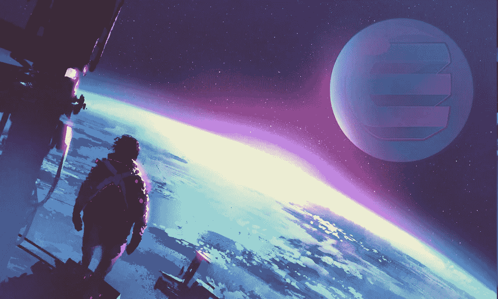

# 释放加密货币:游戏开发和金恩

> 原文：<https://medium.com/hackernoon/cryptocurrencies-unleashed-game-development-enjin-84245d6128dd>

首先，我想感谢你们每一个人帮助我在 Medium 上拥有 3000 多名粉丝。这是我在开始这段旅程时从未想过会发生的事情，我很感激我们一起踏上了太空的进步之路。

我想以这个里程碑为契机，推出一个名为 ***“释放加密货币”的新系列。*** 在这个系列中，我将讨论未来的项目、重要的项目里程碑发布等等。

我将以 ***“游戏开发&【金恩】*** 作为对 [**【金恩】**](https://enjincoin.io/) 的颂歌，在 [**以太坊的**](https://www.ethnews.com/glossary/mainnet) 上推出他们的**智能合约**。在这篇文章中，我将关注**金恩平台**(作为一个整体)将会给游戏开发者和发行商带来的功能和好处。

# 概观

**金恩平台** *“为社区、内容创作者、游戏服务器和游戏发行商提供了一个简单的解决方案，将虚拟商品和真实价值融入到他们的游戏和社区中。金恩已经开发/将开发一个强大的框架，包括开源软件开发包(SDK)、钱包、游戏插件、虚拟物品管理应用和支付网关平台”。*

我已经在我的*“加密货币的真实世界应用”*系列中介绍了**金恩**，讨论了**视频游戏虚拟商品**(从游戏玩家的角度)将如何被区块链和加密货币的引入所彻底改变，你可以在这里找到。

不幸的是，目前的以太坊标准( **ERC-20** 和 **ERC-721** )已经限制了平台的功能和效率，因为这些标准要求为每个可替换或不可替换的令牌/集合部署**单独的合同**。金恩的 CTO 提出了一个新的标准( **ERC-1155** ) ，它是一个在**单一部署契约**中用于多个项目/令牌定义的标准接口，使其大大更加灵活和高效。如果你想了解更多关于 **ERC-1155** 的事情，你应该看看我的博客文章，标题是*“一个撼动以太坊的提议”*，[这里](https://hackernoon.com/a-proposal-to-shake-up-ethereum-a-new-standard-on-the-horizon-d2dfa88507a6)。

**ERC-1155** 是**金恩平台**的**基石**，是他们**智能合约**使用的标准。使用它作为主干已经为游戏开发者和发行商释放了大量的功能和利益，我将在下面讨论。

# 金恩的平台功能和优势是什么？

除了解决当今游戏玩家面临的许多问题，**金恩平台**还为游戏开发商和发行商带来了许多好处。随着他们的**智能合约**(以及不久的将来的 Unity SDK & UI 工具)的推出，开发者将能够用加密货币**支持他们的视频游戏虚拟商品，而不需要任何区块链知识**。他们将能够利用**金恩平台**创造**复杂的代币设计**和**经济**通过**极其用户友好的插件&游戏界面**。您可以在下面找到发布时可用的功能列表:

*   **保留价值** —创造者有能力铸造由 **ERC-20** 代币支持的物品，这立即使物品**变得有价值**。例如，每个**猛犸坐骑**可以由 500 个 ENJ 支撑**。**
*   **物品熔化** —物品可以被销毁(或**熔化**)以恢复其保留价值。例如，如果一个游戏玩家决定融化他的**彩色剑**(由 10，000 ENJ 支持)，这将导致她收到 10，000 ENJ(如果没有费用的话)，作为从她手中移除(并销毁)它的回报。
*   **增强的安全性** —双方之间的交易可以使用**内置的托管系统**安全地**完成**。此外，物品可以**绑定**给特定的所有者，并且只能与某些**白名单中的方**交易。例如，创作者可以利用这一点来监管二级市场，只将可以出售/购买商品的经批准的市场列入白名单。
*   **高级佣金模式** —创建者可以选择在交易发生时收取**费用**。此外，他们可以选择在物品融化时收取费用。不管平台交易/融化发生在哪里，这些费用都是适用的，因为它们是智能合约本身的一部分。
*   **受控物品经济学** —创造者能够**控制其物品的铸造性质**。例如，他们可以铸造 10 把并且只能铸造 10 把**彩色剑**，因此当一把被熔化时，它会减少总数同时增加它们的价值。
*   **独特的融资模式**——由于在铸造物品时有如此多的选择，游戏创作者可以找到新的独特的方式**为他们的项目**融资。例如，创作者可以创造稀有的不可替代的项目，这些项目具有很高的收藏价值，用于资助他们的游戏预售(见下面的加密战争)。

# 利用金恩的项目

鉴于**金恩平台**的**功能**和**易用性**，项目已经准备好并准备好利用其功能就不足为奇了。其中包括:

## **密码之战**

**WoC** 这些将是第一枚***ERC-1155 代币*** *，以及第一枚* ***加密货币，以另一种加密货币*** *、金恩币为后盾。《加密之战》的角色预售将于 7 月 28 日开始，预售完成后，将提供一系列只能通过点对点市场获得的英雄和皮肤。*

你可以在这里找到更多关于 **WoC** 、[的信息，以及他们下面的揭示预告片。](https://warofcrypto.io/)

War of Crypto Trailer

## **九命竞技场**

Touchhour 已经宣布在他们即将推出的游戏《九命竞技场中采用**金恩平台**。这是一款“*竞技在线 RPG，还将推出一款独特的 iOS 和 Android 配套应用，为玩家提供一个创新的可命令的电子鸡式助手，帮助他们收集和制作资源。为 PC、Xbox One 和 PlayStation 4 设计，其配套应用针对 iOS 和 Android，9Lives Arena 利用金恩开发的最新技术将所有角色放在区块链上”。*

你可以在这里找到更多关于 **9Lives Arena** 、[的信息，以及他们下面的揭示预告片。](https://www.9livesarena.com/)

9Lives Arena Trailer

# 结论

**金恩平台**为游戏开发商和发行商释放了大量的利益，毫不奇怪项目已经采用了它——比如*“行动胜于语言”*、*“证据就在布丁里”*等等。

我想以一个与这个主题相关的精彩视频来结束我的演讲，我强烈建议大家观看。

# 这个帖子值得多少掌声？跟着来怎么样？

如果你喜欢这篇文章，请随意👏**拍手**👏很多次(你知道你想！)，给我的博客一个👣**跟随**👣**和**🤲**分享**🤲和朋友在一起。有一个限制👏50 次鼓掌👏你可以给每个职位，所以我劝你不要试图超过这个限度…你可能会打破中等！

# 说到这个…

如果你仍然关注我，请留下评论，让我知道你还想看到我写些什么。你可以找到我的社交媒体的链接，并在下面注册我的时事通讯。

[ermos.crypto+medium@gmail.com](mailto:ermos.crypto+medium@gmail.com)

也可以捐款到以下地址以示支持:
**ETH/ENJ**:[0x4c 7195 e 074 cf 0 ab 6 f 77 BDB 7 c 97 FD 2567066 bb 712](https://goo.gl/H8xSTn)

免责声明:这篇博文中的所有信息和数据仅供参考。我的观点是我自己的。我不提供个人投资建议，也不是合格的特许投资顾问。*我对任何信息的准确性、完整性、适用性或有效性不做任何陈述。我将不对任何错误，遗漏，或任何损失，或因其展示或使用引起的损害负责。所有信息均按原样提供，不提供任何担保，也不授予任何权利。*