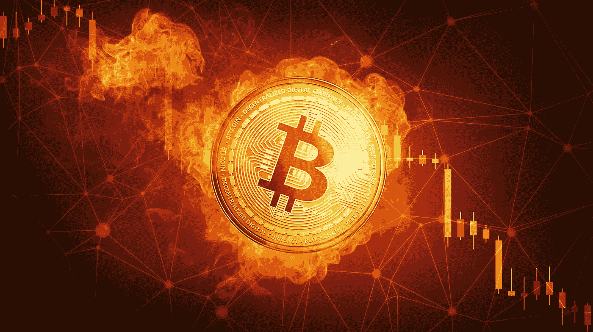

# 加密货币:散户投资者应该知道的(第一部分)

> 原文：<https://medium.com/hackernoon/cryptocurrencies-what-retail-investors-should-know-part-1-f81738d5b8>

Image Credit : [https://www.colourbox.com/image/golden-bitcoin-coin-falling-in-fire-flame-image-30672576](https://www.colourbox.com/image/golden-bitcoin-coin-falling-in-fire-flame-image-30672576)

*免责声明:本文分享的观点基于我个人对加密货币领域的理解，以及我与几位区块链开发者和风投的对话。它们不是财务建议，也不应被视为当前市场环境的具体证据。*

散户投资者进行的每一次尽职调查都存在一个巨大的缺陷。大多数散户投资者缺乏代码和编程知识，因此几乎不可能评估加密货币的发展。散户投资者随后会转向 Youtube、社交媒体和/或朋友，寻求暗示和澄清。主流媒体对比特币的持续报道也助长了投资加密货币是快速致富的误解。主流媒体主要关注比特币自诞生以来的巨大增长，而不是[区块链](https://hackernoon.com/tagged/blockchain)的革命性特征。不幸的是，这导致了 2017 年 12 月巨大的、不可持续的价格爆炸的滚雪球效应。

这篇文章完美地概括了散户投资者投资加密货币的当前阶段:

 [## 一种新的资产类别的诞生:加密资产。第一部分:散户爱魔豆

### 这篇文章反映了我个人对当前加密市场的看法。

medium.com](/@etiennebr/the-birth-of-a-new-asset-class-crypto-assets-part-i-retail-investors-love-magic-beans-155cee654ba1) 

— — — — — — — — — — — — — — — — — — — — — — — — — — — — — — —

***免责声明:*** *本文讨论的几点，希望能给散户做尽职调查时带来不一样的视角。它来自于我自己对密码领域的理解，我自己与区块链开发者以及机构、风投和天使投资人的对话。*

— — — — — — — — — — — — — — — — — — — — — — — — — — — — — — —

# 第一点——区块链技术的拥护者

Credit: [https://hackernoon.com/the-flippening-ethereum-vs-bitcoin-2ac80a953ebb](https://hackernoon.com/the-flippening-ethereum-vs-bitcoin-2ac80a953ebb)

据我交谈过的几位开发人员说，在以太坊的平台上运行和启动智能合约并不需要像 Vitalik Buterin 这样的天才。任何有一定编程背景的人都可以。

出于这个原因，我称**开发者为区块链技术的冠军**，因为他们几乎独自负责引领这个行业前进。

现实情况是，与其他区块链企业相比，以太坊的平台在可用性、稳定性和安全性方面都处于非常高的水平。

**这是什么意思？**
从经济角度来看，其他区块链协议被大幅高估。他们只是还没有准备好商业化。

**类似于为什么同一家公司有高端产品和低端产品之类的东西。与低端产品相比，制造高端产品所需的专业知识差距很大。**

布特林被广泛认为是加密货币领域的天才，他为我们带来了整个去中心化应用的概念，可以说，在加密行业，世界上没有人能与他的地位相提并论。Vitalik Buterin 之于以太坊，相当于 Elon Musk 之于 Space X，或者 Lionel Messi 之于巴塞罗那足球俱乐部。当然，这些公司/实体凭借其自身的权利很棒，并将继续生存下去，但有了这些名义上的领导人，它们只是更特别了一点。

为什么这很重要？

Image Credit: [http://cryptopost.com/ethereum-vs-bitcoin-double-bottom-formation/](http://cryptopost.com/ethereum-vs-bitcoin-double-bottom-formation/)

大多数区块链开发者一致投资的硬币只有两种:**比特币**和**以太坊**。这告诉你什么？尽管在各自的区块链项目中工作，支持区块链技术发展的家伙们一致认为，比特币和以太坊是加密领域的领导者，具有很高的技术增长和现实世界的应用潜力。

为了对项目有一个全面的了解，我们必须能够倾听这些后端开发人员的意见，因为他们只需查看他们的代码和更新频率，就知道加密货币要取得长期成功需要什么。区块链技术和智能合同协议非常安全，但如果发现一个漏洞，就会受到损害。从另一个角度来看，这些开发商有责任确保你的投资能够获利。所以，要问的问题是“这家公司的开发商好到能让我从投资中赚钱吗？”

— — — — — — — — — — — — — — — — — — — — — — — — — — — — — —

# 第二点——区块链协议的高进入成本

我从来没有注意到这一点，直到有人指出——除了以太坊，其他平台上没有多少 ico。唯一的原因是其他区块链平台的高进入成本。依我拙见，这里有两个主要因素在起作用:

**经济学**

自 2018 年初以来，我们已经看到加密货币的价值下降。资金一直在大量撤离市场。想象一下你发给 ico 的 BTC 和 ETH 发生了什么——它们已经失去了价值，这基本上意味着，ico 拥有的资金少于他们原本计划的资金，除非他们设法将所有筹集的资金兑现为菲亚特。

与 NEO 或其他平台相比，我被告知以太坊在成本和可用性方面无与伦比。成本的差异显然是巨大的。因此，如果一家公司希望将智能合同集成到他们的业务中，他们不会选择更便宜的替代方案吗？

考虑到区块链技术仍处于初级阶段，目前对真实用例的需求相对匮乏。

**技术**

 [## 如何用不到 20 分钟的时间在以太坊上做一个 ICO？

### 恭喜你，你终于找到了。这正是你在网上寻找的。

medium.com](/bitfwd/how-to-do-an-ico-on-ethereum-in-less-than-20-minutes-a0062219374)  [## 为什么比特币 app 很难，以太坊 app 更容易吗？

### Fred Ehrsam、Vitalik Buterin 和 Chris Dixon 最近在 a16z 播客的一集中讨论了以太坊。

medium.com](/@bedeho/why-bitcoin-apps-are-hard-and-are-ethereum-apps-easier-7bbeccab4136) 

显然，在以太坊上运行 ICO 很容易，因为它比在 NEO 上运行更便宜、更快、更简单。我不会在技术方面停留太久，因为我知识不够丰富，也不能很好地表达我的想法来进一步阐述..

**升级到比特币和以太坊**

我想谈的下一件事是——除了以太坊之外，其他所有平台都声称(或希望)比以太坊更好，更快，更便宜，解决可扩展性问题。但是，如果以太坊已经在努力变得更快、更便宜并解决可扩展性问题呢？进入[卡斯珀](https://blockgeeks.com/guides/ethereum-casper/)。

而比特币的等价物是[闪电网](https://lightning.network/)。

我交谈过的大多数开发人员都同意，当 Lightning Network 和 Casper 分别成功集成到比特币和以太坊中时，这将解决这两个实体这些年来遇到的所有重大问题。闪电网络将使比特币比莱特币更具吸引力，Casper 有可能将以太坊变成领先的区块链平台。

说了这么多，朋友们，加密货币市场仍然相对年轻，需要时间来完全成熟。话虽如此，很可能有一天，一家加密公司在地位和受欢迎程度上可以与比特币和以太坊匹敌。但是现在，前 2 名的加密资产是不可比拟的。

11 月和 12 月是投资界的反常现象，使得大多数加密资产比实际价格更高。称之为市场操纵或卡特尔，但或许今天的市场刚刚从 2017 年末的繁荣中复苏，正在接近其“公允价值”。

市场确实被操纵了……但这就是交易和投资的运作方式。操纵市场的是那些每年被支付数十万美元来操纵市场的人。我们只是鲨鱼、鲸鱼、巨齿鲨和其他怪物的汪洋大海中的小鱼。

— — — — — — — — — — — — — — — — — — — — — — — — — — — — — —

# 第 3 点 COINMARKETCAP 之外的区块链协议

## 以太坊真正的竞争对手

以太坊真正的竞争对手存在于 CoinMarketCap 之外，被摩根大通(混蛋 xD)称为 [Hyperledger](https://www.hyperledger.org/) 、 [IBM Bluemix 区块链](https://www.ibm.com/blockchain/solutions)、 [R3](https://www.r3.com/) 、 [Quorum](https://www.jpmorgan.com/global/Quorum) 等等。

Hyperledger 等公司直接瞄准商业和企业客户。只要看看 Hyperledger 的成员和参与实体:[https://www.hyperledger.org/members](https://www.hyperledger.org/members)。

我想分享的是 R3 和 Ubin 项目，这是新加坡创建数字新加坡的尝试—[http://www . MAS . gov . SG/Singapore-Financial-Centre/Smart-Financial-Centre/Project-Ubin . aspx](http://www.mas.gov.sg/Singapore-Financial-Centre/Smart-Financial-Centre/Project-Ubin.aspx)

 [## R3 已经推出了它的开源区块链平台

### 区块链联盟 R3 已经推出了其开源区块链平台，称为 Corda Enterprise…

www.businessinsider.com](http://www.businessinsider.com/r3-launches-corda-open-source-blockchain-platform-2018-7/?IR=T) 

想象一下新加坡的整个货币在区块链，那将是不可思议的！但是，这会增加比特币的价值吗？可能性极小，因为他们使用的 Corda 平台未在 Coinmarketcap 中列出。R3 的价值可能会增加，但它不会影响加密市场一点。从这种合作中获利的唯一方式就是投资 R3。然而，特别是 R3，目前看起来不太好。

 [## 消息人士称，区块链公司 R3 正在耗尽资金

### R3，一家筹集了 1.07 亿美元将区块链服务引入金融领域的初创公司，正在苦苦挣扎，可能会倒闭…

fortune.com](http://fortune.com/2018/06/07/blockchain-firm-r3-is-running-out-of-money-sources-say/) 

只有真正的开发商、机构和合格的投资者才知道 Hyperledger、IBM、R3 等公司，并通过私下销售和场外交易购买对它们进行投资。富人正在投资区块链技术，但他们投资的是 CoinMarketCap 上的硬币吗？

Dapps 开发的重要性在加密货币中非常重要，这就是为什么以太坊在比特币之后排名第二，因为它们明显无缝集成。

— — — — — — — — — — — — — — — — — — — — — — — — — — — — — —

# 第 4 点——风险资本家、机构、私人投资者及其投资方式

一段时间以来，我们一直听到新闻或谣言说，大资金的人来拯救我们。这些人能够推动市场，拥有资金(说白了)四处挥霍。了解他们如何思考是很重要的。是的，他们的存在是为了赚钱，但他们如何计划赚钱是重要的。

**风险投资家基础知识**

据我所知，他们的首要目标是保持长期投资的稳定性。首先也是最重要的，他们的钱是帮助一家初创公司或公司长期成功的合同，然后是利润。因此，他们非常厌恶风险(比散户投资者更厌恶)，不寻求短期内的高收益。

阅读这篇文章，了解风投如何看待回报:

 [## 让我了解风投真相的会议

### 我最近会见了一位知名的以色列初创企业投资者。不知怎么的，话题从我寻找种子的话题转了过来…

techcrunch.com](https://techcrunch.com/2017/06/01/the-meeting-that-showed-me-the-truth-about-vcs/) 

我相信每个人都听过上面这句话，90%的创业公司都失败了。风险投资家和其他大型投资者对这一点太了解了，这意味着他们在投资时有高度的选择性，并能接触到在评估潜在项目方面有多年经验的人。

 [## 风险投资家是如何做决策的？

### 解密风险投资的黑匣子:风险资本家如何对他们的投资和投资组合作出决定…

medium.com](/vcdium/venture-capital-decision-making-c3258bc1b09c)  [## 我在风险资本世界的夏天

### 从一个年轻风险投资家的角度来看经验教训和建议

medium.com](/daphni-chronicles/my-summer-in-the-venture-capital-world-41cff627f197)  [## 在筹集风险资本之前你需要知道什么

### 以及风险投资公司如何运作

hackernoon.com](https://hackernoon.com/what-you-need-to-know-before-raising-venture-capital-c561deabd6c0) 

这对加密货币这种因波动性而臭名昭著的资产意味着什么？一个很好的猜测是:要么他们没有根据 Coinmarketcap 来衡量他们的利润，要么他们考虑的是更长远的投资。

**无波动的加密投资**

我们可以说，“但比特币肯定会在未来 5 年内上涨！”。但正如任何聪明的经济学家和投资者都会说的，“我们永远不会知道市场明天会做什么。”这些风投拥有数百万投资者的资金，他们会尽可能避免在如此动荡的市场中暴露自己的资金。然后他们做什么？*看上面第 2 点*。他们已经找到了一种投资加密货币的方法，而不会让他们的钱暴露在波动中。

 [## 区块链对加密货币之外的行业的 8 大好处

### 6 min 阅读企业家投稿人发表的观点均为本人观点。听说过比特币和加密货币…

www.entrepreneur.com](https://www.entrepreneur.com/article/306420) 

**散户永远处于劣势**

风险资本家、天使投资者和私人机构都有自己的意识形态。首先，他们和我们一样都在寻找赚钱的方法。然而，需要注意的是，天使投资者可以获得的资源与散户投资者完全不同。这可能是一个广泛的经验，以前的成功，财富或关系。

散户投资者只限于我们的个人电脑，我们寻找投资信息的首选方法是通过搜索引擎、youtube 和其他社交媒体平台。因此，我们依靠“值得信赖”的外部个人，如 Youtubers、Twitter 账户来帮助我们做出决策。有些人确实对加密市场和零售投资者充满热情，但是，重要的是要知道这些有影响力的人比普通人接触到更多的知识。

**他们也不能幸免于损失**

 [## 风险投资及其 33%的成功率| jtangoVC.com

### 弗雷德·威尔逊今天发表了另一篇关于创建真正的公司有多难的精彩文章。他写道:我说过很多…

jtangovc.com](https://jtangovc.com/venture-capital-and-its-33-success-rate/)  [## 风险资本风险和回报矩阵

### 我们出生在网络泡沫破裂的时代，深知流动性不足的挑战。在过去的二十年里，我们…

www.industryventures.com](http://www.industryventures.com/2017/02/07/the-venture-capital-risk-and-return-matrix/) 

风险资本也不能幸免于损失。根据上面的文章，60%的风投是不返还资本的。在我看来，这是一笔巨款。因此，尽管我们很想“跟随大笔资金”，但也不能完全保证。

与散户投资者类似，他们希望投资组合多样化，投资具有不同增长潜力、风险潜力和稳定性的资产。

— — — — — — — — — — — — — — — — — — — — — — — — — — — — — —

非常感谢您的时间，但这并不是讨论的结束，因为这只是两个部分的第一部分。

 [## 加密货币:散户投资者应该知道的(第二部分)

### 声明:本文中分享的观点是基于我个人对加密货币领域的理解…

hackernoon.com](https://hackernoon.com/cryptocurrencies-what-retail-investors-should-know-part-2-3bd6e8631952) 

在这里你可以读到我对 7 月份比特币的价格分析。

 [## 比特币价格分析——7 月展望

### 让我首先说，这些仅仅是我自己的研究和观察。我的研究不是财务建议，只是…

hackernoon.com](https://hackernoon.com/bitcoin-price-analysis-july-month-outlook-a27d9e71cd08) 

在其他社交媒体平台关注我:
[推特](https://twitter.com/IZCrypto)
[Youtube](https://www.youtube.com/channel/UCrq04Mv5pAhKCilZROQ2jjg?)

现在的散户投资者在投资前做足了准备吗？

请在下面的评论区告诉我你对这篇文章的看法！❤

— — — — — — — — — — — — — — — — — — — — — — — — — — — — — — —

Iliya Zaki 是 Moonwhale Ventures 的营销和社区经理。

Moonwhale Ventures 是一家咨询公司，为公司、中小企业或上市公司提供区块链应用，以提高价值链的效率，并通过 ICCO STO(令牌化)为业务扩张提供新的创新融资方式。

*   更多信息请访问我们的网站—[http://moonwhale.io/](http://moonwhale.io/)
*   在我们的各种社交媒体平台上关注我们。—
    [insta gram](https://www.instagram.com/moonwhalebv/)
    [Twitter](https://twitter.com/MoonwhaleBV)
    [LinkedIn](https://www.linkedin.com/company/moonwhalebv)
*   加入我们的电报全球集团—[**https://t.me/moonwhaler**](https://t.me/moonwhaler)