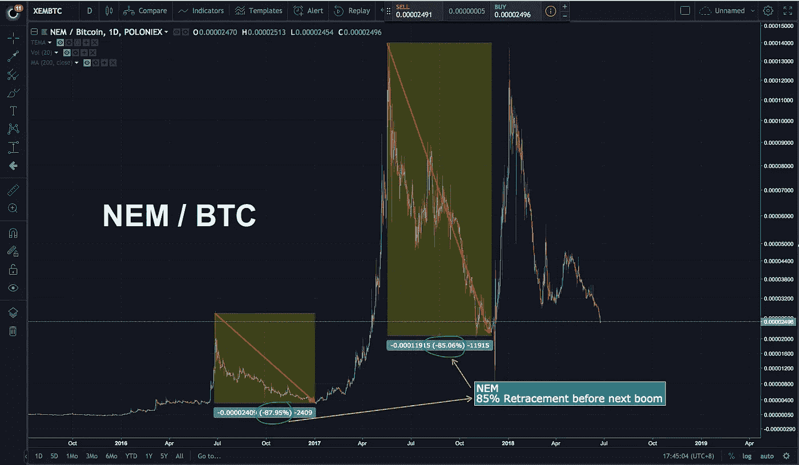

# 加密货币:散户投资者应该知道的(第二部分)

> 原文：<https://medium.com/hackernoon/cryptocurrencies-what-retail-investors-should-know-part-2-3bd6e8631952>

*免责声明:本文分享的观点基于我个人对加密货币领域的理解，以及我与* [*【区块链】*](https://hackernoon.com/tagged/blockchain) *开发者和风投的对话。它们不是财务建议，也不应被视为当前市场环境的具体证据。*

## 本文继续讨论第五点。要阅读第 1 部分:

 [## 加密货币:散户投资者应该知道的(第一部分)

### 声明:本文中分享的观点是基于我个人对加密货币领域的理解…

hackernoon.com](https://hackernoon.com/cryptocurrencies-what-retail-investors-should-know-part-1-f81738d5b8) 

# 第 5 点——估值过高的加密公司

是的，马后炮队长在房子里，但让我们花时间反思发生了什么。

称之为市场操纵，称之为鲸鱼扰乱市场，但自从 SegwitX2 实施失败以来，加密货币经历了不可持续的疯狂增长，引起了世界各界的关注。监管清晰是机构进入市场前最需要的。

**规定**

明确的政策和法律将明确定义任何特定情况下与加密货币相关的行为准则。

首先，保护散户投资者免受潜在的改变人生的损失。第二，允许大型机构资金安全地进入市场交易。

有些人手头有数百万美元可以投资，但由于政府机构的政策和法律不明确，他们仍在观望。

 [## 加密货币法规更新(2018 年 5 月)

### 本文是涵盖加密货币相关监管更新的每月系列文章的一部分(以下是 1 月……

hackernoon.com](https://hackernoon.com/cryptocurrency-regulation-update-may-2018-4a16a189f2ba) 

比特币和以太坊是否是一种安全产品备受关注。可以肯定的是，大多数散户投资者并不理解这一澄清的重要性，我也是如此。但知道比特币和以太坊是否是证券将极大地影响监管者如何出台立法和法律。无论是对散户投资者，还是更重要的机构投资者。

接下来，机构实际上有一个‘幻数’可循。阅读下文。

**巨大的价格**

机构投资者和风险投资者对产品/资产使用 85%规则。他们只会在一项资产从最近的历史高点回落 80-85%后才会考虑投资。

我想知道这是不是真的，所以我看了图表，自己去看。下面我给你看一些图表，这样你可以看得很清楚。

# 第 5.1 点——85%规则

该规则适用于 BTC 价值和美元价值。*图表截至 2018 年 6 月 29 日。*

**BITCOIN**

**ETH / BTC**

**NEO / BTC**

**NEM / BTC**

**XRP / BTC**

XRP / USD

比特币会跌到 3000 美元吗？没人知道。但是我们可以利用技术分析来调查之前的价格行为，并据此准备我们的投资组合。

此外，我不认为比特币会一路跌至 3000 美元，因为目前有太多积极的消息。下面还有这个:

***万一它可能就在那里下跌，把你的资本或不在比特币或加密中的资金存起来，只有当它低于 3500 美元时才进入市场。***

— — — — — — — — — — — — — — — — — — — — — — — — — — — — — —

# 第六点——我们是营销和炒作的受害者。

市场受到来自沃伦·巴菲特、雷伊·达里奥等大型投资公司的 FUD 新闻的打击，这些新闻称“加密货币没有内在价值”在某种程度上，我相信他们是对的。大多数加密公司甚至没有产品，但他们的价值超过了应有的水平。

他们中的一些人甚至有一个不稳定的产品，有缺陷和不可预测的，但散户投资者，有影响力的人称他们为高潜力的硬币。90%的加密公司将会消失，因为它们不可能与比特币和以太坊的发展速度以及开发人员的专业知识相匹敌。

现在，从这一点上的提示只是让你意识到你是纯粹基于投机而投资。虽然有相似之处，但我并不是说这些公司不好或者是骗局。只是要格外小心你的下一个硬币投资，尤其是 ico 和低上限硬币。

**真实产品 VS 承诺产品**

从我和一些开发人员的交谈中，一些加密公司被开发人员避开，因为很明显，他们不能用真正的代码和编程来支持他们的主网络或平台。一些开发者甚至称之为——**“从一个地方到另一个地方，你不需要兰博基尼，但你想拥有它，因为它很酷，每个人都在谈论/拥有它。”**

你有没有注意到有些 CEO 经常在 Coinmarketcap 上吹嘘自己的排名？或者“知道”他们会升一两级？此外，也有一些首席执行官声称要在 1 月份牛市高峰时出售所持股份。

想想 Bitconnect 吧..这是一个骗局，但他们设法从营销和炒作创作中筹集了数十亿美元。现在我不是说其他加密货币是骗局。我是说，它们确实被高估了。当他们最终拥有一个伟大的产品时，他们可能会做得很好。

我的朋友们需要考虑的事情。😊

— — — — — — — — — — — — — — — — — — — — — — — — — — — — — —

# 第 7 点—菲亚特作为一项资产

**销售是取胜之道** 与 HODL 的马克思主义者相反，取胜之道不是 HODL，而是销售和再平衡。我相信去年投资加密货币的每个人都会知道这一点。截至今日，持有比特币的风险大于持有现金的风险。看看股票市场—

 [## 自金融危机以来，股市从未出现过如此大的波动

### 投资者预计 2018 年将更加动荡，但很少有人预计到…

www.cnbc.com](https://www.cnbc.com/2018/04/11/stocks-havent-seen-this-much-volatility-since-the-financial-crisis.html) 

资金在流动，很难找到被低估的投资。股票市场(终于)下跌了，那么今天最好的玩法是什么？持有现金，对冲商品。加密货币怎么样？可能..如果加密被认为被严重低估，那么是的，我们可以期待看到一些钱被转移到这个领域

加密货币被吹捧为取代当前的金融系统，但现实是，在我们可以用比特币支付服务之前，**菲亚特仍然是当今无可争议的国王**。有些人可能会说，有些人从 2014 年 HODL，今天他们是百万富翁。但早期用户持有当时购买的 100%比特币的可能性非常低。在此期间，他们卖掉了投资，买了房子，尽情享受生活。

**菲亚特才是真正的王者，而不是比特币**

幸运的是，让菲亚特成为投资组合中的一项资产是可能的。

在你的投资组合中有一个固定部分可以极大地降低风险，并迫使你获利。当然，你应该长期保存一些比特币，所以永远不要卖掉所有东西。**同样，关键的事情是出售和再平衡。**

我创造了一种资产配置，可以帮助你安然度过任何波动。

这个主题将在另一篇文章中进一步讨论。

正如它看起来简单，大多数加密投资者有 100%的加密，我们现在都知道这是非常危险的，因为年初。使用这种分配和战略再平衡，你将度过比特币和/或替代币的任何崩溃。

我编了一个故事来恰当地解释拥有扁平部分的好处:

**例子**

> 杰克和汤姆只有一万美元可以投资。
> 
> 杰克用 10000 美元买了 1 个比特币，剩下 10000 美元可以投资。
> 
> Tom 希望保持 60/40 的加密与加密比率，因此:
> 
> 他用 10000 美元买了 0.6 个比特币，还有 4000 美元的资本。
> 
> ***如果比特币从 1 万美元涨到 1.5 万美元，上涨 50%，会发生什么？***
> 
> 杰克有 1 BTC，现在价值 15000 美元(+50%)
> 他的总投资组合上涨了 5 **0%或 5000 美元**，现在价值 15000 美元
> 
> **汤姆有 0.6 BTC，现在价值 9000 美元(+50%)
> 还剩 4000 美元资本，他的总投资组合只增加了 30%或 3000 美元，现在价值 13000 美元**

****在这个例子中，杰克会比汤姆多赚 2000 美元。但是最终，这两种方法都有所收获。****

******现在让我们看看当市场不好的时候会发生什么******

> ****同样的场景:杰克和汤姆只有 10，000 美元可以投资。****
> 
> ****杰克用 10，000 美元和**、10，000 美元和**
> 买了 1 辆 BTC，没有资本投资。****
> 
> ****汤姆用 10000 美元买了 0.6 BTC，剩下 4000 美元资本。****
> 
> *******如果比特币从 10000 美元跌到 5000 美元下跌 50%，会发生什么？*******
> 
> ****杰克拥有 1 辆 BTC，现在价值 5000 美元，用 0 美元买了这辆车，他的总投资组合下跌了 5%或 5000 美元，现在价值 5000 美元****
> 
> ****汤姆有 0.6 BTC，现在价值 3，000 美元 T21，但由于有 4，000 美元在场外，他的总投资组合只下降了 30%或 3，000 美元，现在价值 7，000 美元****

****在这个例子中，汤姆比杰克多存了 2000 美元。****

****这里有一些额外的东西****

> ****行情不好:**比特币从 10000 美元跌到 5000 美元跌 50%？******
> 
> ****汤姆拥有 0.6 BTC，现在价值 3000 美元，还剩 4000 美元资本，他的总投资组合只下降了 30%，即 3000 美元，现在价值 7000 美元****
> 
> ****请记住，杰克没有剩余的资本来购买或做任何事情。但汤姆决定重新平衡他的投资组合，以保持 60/40 的加密与法定比率，比特币的价格为 5000 美元。****
> 
> ****汤姆将拥有 0.84 美元的 BTC，现在价值 4200 美元，T42 还有 2800 美元的资本。****
> 
> ****如果杰克想要收支平衡，**比特币必须从 5000 美元翻一番(2 倍)或增加 100%** 到 10000 美元，才能使他的 10000 美元投资收支平衡。****
> 
> ****对汤姆来说，比特币只需上涨 40%至 7000 美元，就能实现 10000 美元投资的盈亏平衡。****

****换句话说，与杰克相比，汤姆在市场上不需要太多的努力就能达到盈亏平衡。从长远来看，这就是我们如何使用防守战术来最终取得胜利。****

****当杰克收支平衡时，比特币回到 10，000 美元，汤姆将看到他的投资组合增长到 11，200 美元或增加 12%(1，200 美元)。****

****当然，预测这一点并不容易，这也是为什么有时候我们只需要去除情感因素，在适当的时候重新平衡。****

****出售资产的一个有缺陷的观点是“为利润而出售”。看待“销售”的更好方式是“消除损失风险”。一旦你把这种哲学融入你的投资游戏，你就会开始像大玩家一样思考。大玩家绝对崇拜这句话——千万不要亏钱。许多加密货币的早期投资者在 12 月/1 月卖回了自己的股份，因为他们主要根据宏观趋势进行交易。他们知道 12 月份的增长是人为的，是卖出的好时机。他们做到了，现在正等待下一个点的进入。****

****通过消除部分风险，他们暴露的投资更少，但仍有足够的资金来利用“你永远不知道市场上会发生什么”的概念，以及从他们出售的地方进一步投机。记住第 5 点，他们比我们更了解市场周期，所以他们有足够的时间等待一个好价格。****

****— — — — — — — — — — — — — — — — — — — — — — — — — — — — — —****

******结局注解******

****其中一些观点是事后诸葛亮。但这并不意味着我们不能从中吸取教训。****

****从今天起，我对 DYOR 和投资的策略将是:****

1.  ****听听开发者的意见。调查这家公司的[技术](https://hackernoon.com/tagged/technology)，这样我就知道他们的技术很扎实****
2.  ****找出营销团队是否比他们的产品更强大****
3.  ****风险资本家和天使投资者友好****
4.  ****停止把我的资本暴露在市场上，除非硬币已经回落到 BTC 或美元价值的 85%。****
5.  ****时机成熟时卖出。到时候再进去。****

****最后但同样重要的是，请不要把这篇文章看作是财务建议，永远按照你觉得舒服的方式行事。这些只是我在与大玩家和开发者交谈时学到的东西。通常情况下，散户投资者接触不到这些人，所以我希望你能在这里学到一两件事！！****

****朋友们，祝你们投资旅途愉快。❤****

****— — — — — — — — — — — — — — — — — — — — — — — — — — — — — —****

****在这里你可以读到我对 7 月份比特币的价格分析。****

**** [## 比特币价格分析——7 月展望

### 让我首先说，这些仅仅是我自己的研究和观察。我的研究不是财务建议，只是…

hackernoon.com](https://hackernoon.com/bitcoin-price-analysis-july-month-outlook-a27d9e71cd08) 

在其他社交媒体平台关注我:
[Twitter](https://twitter.com/IZCrypto)
[Youtube](https://www.youtube.com/channel/UCrq04Mv5pAhKCilZROQ2jjg?)

— — — — — — — — — — — — — — — — — — — — — — — — — — — — — — —

Iliya Zaki 是 Moonwhale Ventures 的营销和社区经理。

Moonwhale Ventures 是一家咨询公司，为公司、中小企业或上市公司提供区块链应用，以提高价值链的效率，并通过 ICCO STO(令牌化)为业务扩张提供新的创新融资方式。

*   更多信息请访问我们的网站—[http://moonwhale.io/](http://moonwhale.io/)
*   在我们的各种社交媒体平台上关注我们。—
    [insta gram](https://www.instagram.com/moonwhalebv/)
    [Twitter](https://twitter.com/MoonwhaleBV)
    [LinkedIn](https://www.linkedin.com/company/moonwhalebv)
*   加入我们的电报全球集团—[**https://t.me/moonwhaler**](https://t.me/moonwhaler)****