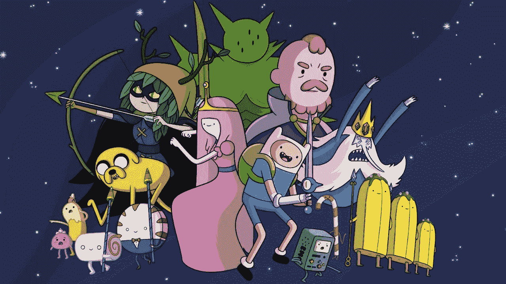

# 加密货币:冒险时代

> 原文：<https://medium.com/hackernoon/cryptocurrency-adventure-time-ffe2fec6f0f7>

## **大概，2017 年你听说过加密货币。但是几个月过去了，你已经厌倦了这个话题。我也不能保持沉默。；)**

> 你想成为奇妙旅程的一部分吗？——“跟我来”！

Finn is one of the few cartoon characters who walked between the bars of the grill.

## 不是无聊的介绍。

最近，十年来最荒谬和最受欢迎的电视剧之一“冒险时间”在成功播出十季后关闭。该系列的大结局“跟我来”体现了冒险时间如此受人喜爱的所有品质——它的心，它的幽默，以及它打破期望的意愿。**我们明白是什么让加密货币看起来像漫画《冒险时光》。**

## 这篇文章是关于什么的？

仔细看标题！这篇小文章的识别、主题、思想、主体、形象:加密货币是一个全新的世界，我们都是这个世界的“英雄”。对我来说，它是“美丽的东西”。

## 关于什么的？

《冒险时间》是关于男孩芬恩和他的神奇狗杰克在一个疯狂的粉红色和糖果世界中的冒险系列。杰克可以随心所欲地改变他身体的大小；芬恩有着像雷神一样的长发，还拥有军用工艺品。英雄与游戏主机 BiMo 的 bi+性别控制器是朋友，并与各种各样的怪物战斗。如此迷幻的旅行。；)

## 谁在看这个？

极客，同时呼吁年轻人解释说，目标受众是 20-30 岁的人。“冒险时间”不仅仅指年轻人；这是任何年龄的娱乐。一方面，这是一个关于男孩芬恩成长的经典故事，他向公主们靠拢，变成了一个年轻人。另一方面——隐藏在关于社会状态的漫画面具下的背景，几乎是剪辑格式的柏拉图的“状态”,是 21 世纪可以理解的。

## 加密货币动画系列？

把 Cryptoeconomics 看做一个漫画系列。这是一种存在方式，也是一种看待世界的方式！

密码经济学总有一天会成为(有些事情已经发生了)主要的“英雄”，它将决定该组织未来应用、协议和系统的发展。

成功的历史，失败的历史，大泡沫，总的来说很多事件。比特币真的管用！这本身就是一个技术奇迹。很明显，这是一场杰出的“秀”，不清楚接下来的系列会发生什么！)*你可以合著以下系列。*

## 英雄，动画系列，我们

如果你是密码学新手，你可能会想:如何交易加密货币，以及它是否有必要？你想知道:屏幕的另一边是什么？你可以成为“芬恩和杰克”… *你可以成为下一个系列的英雄。*

你可以直接或间接参与技术的开发和建立。例如，成为任何项目的团队和/或社区的一部分。或者做研究员公关。或者花时间学习交易，了解技术交易和你需要知道的成功知识。建立你的交易策略，不要盲目相信某人的天气预报。

## 为什么重要？

越来越多的开发商、政治家、经济学家和公民意识到分散经济可能带来的积极后果。这导致了新的密码资源、新的创业公司和新的研究人员的大规模发展，这将有助于解释当前和建设未来。

> 还有人研究新的领域，寻找答案，试图打开一个新的。[知识在你面前！](https://hackernoon.com/)

## 会如何收场？

没有人知道历史会如何演变，但你可以成为这个故事的一部分。经济激励和密码学将支持新领域的真实人类行为。

让我们认识一下。👋如果你喜欢这篇文章，给它一些“掌声”来帮助人们发现它！