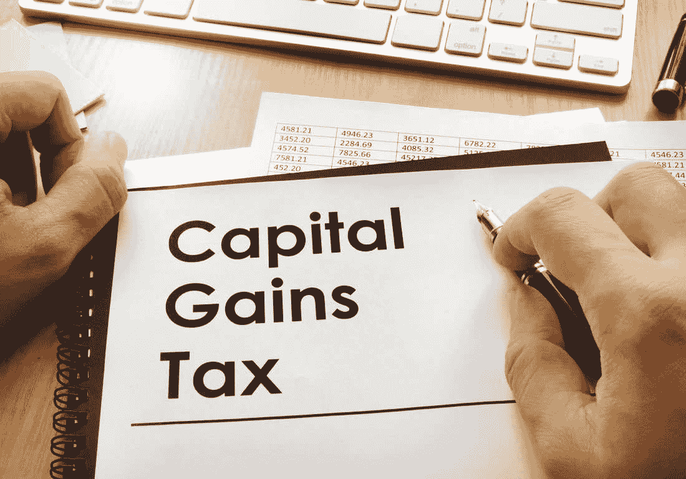

# 加密货币资本收益税——分解问题

> 原文：<https://medium.com/hackernoon/cryptocurrency-capital-gains-taxes-breaking-down-the-problem-a2e0db0d26af>

[资本](https://hackernoon.com/tagged/capital)在[加密](https://hackernoon.com/tagged/crypto)交易中的收益很容易追踪，一次一笔。有几千个的时候呢？

加密货币资本利得税正成为政府的兴趣点。2017 年，可能会成为加密成为主流的一年，所有加密货币的总市值从 150 亿美元飙升至 6000 亿美元以上。这种增长很难被忽视——不仅是对短线交易者和区块链福音传道者，对政府也是如此。这篇文章关注美国是如何具体处理加密税收的。

[国税局刑事调查部门的负责人唐·福特(Don Fort](https://www.linkedin.com/in/don-fort-4a656435/) )在最近的一次税务会议上详细讨论了“加密货币如何成为他的一个新的执法领域”其他事件如[国税局比特币基地传票](https://www.forbes.com/sites/kellyphillipserb/2017/11/29/irs-nabs-big-win-over-coinbase-in-bid-for-bitcoin-customer-data/#66ef4cc2259a)和[国税局发给报税人的警告](https://www.irs.gov/newsroom/irs-reminds-taxpayers-to-report-virtual-currency-transactions)显示了美国政府的明确意图。

因为[加密货币被视为财产](https://www.irs.gov/pub/irs-drop/n-14-21.pdf)(而非货币)，所以要缴纳资本利得税——就像股票、债券、房地产和其他形式的个人财产一样。简而言之，只要你以高于买入价的价格出售房产，你就会获得资本利得。然后你报告你每年的税收，这就是它的结束。加密货币也是如此。

虽然政府的意图很明确，他们希望你报告你的加密收益，但活跃的加密交易员知道，交易加密带来的巨大数量会给纳税申报带来一系列挑战和难题。在面对这些挑战之前，我们应该分解一下资本收益。

## 如何计算我的加密货币资本收益？

***公允市场价值—成本基础=资本利得***

步骤 1 —确定您的成本基础

[成本基础](https://www.investopedia.com/terms/c/costbasis.asp)是一项资产的原始价值，或者说，本质上是你投入了多少钱来获得这项资产。对于加密资产，它包括购买价格加上与购买加密货币相关的所有其他成本。其他费用通常包括交易费和你购买密码的交易所的经纪佣金。因此，要计算您的成本基础，您需要执行以下操作:

***(密码买价+其他费用)/持有数量=成本基础***

步骤 2-确定交易时的公平市场价值

公平市场价值是你计算资本收益需要的第二个数据点。公平市场价值是您出售/交易加密货币时的价值。

一个例子应该是这样的:你在 2017 年 6 月用 100 美元购买了 0.05 比特币。您向您购买的交易所支付了 1.49 美元的交易费。你的成本基础是 0.05 比特币 101.49 美元。2017 年 11 月，你以当时 500 美元的公平市价出售了同样的 0.05 比特币。基于这个简单的例子，你有 398.51 美元(500–101.49)的资本收益。

硬币对硬币交易

对于日内交易者来说，这是事情变得更加困难的地方。美国国税局称[硬币对硬币交易](https://www.irs.gov/pub/irs-drop/n-14-21.pdf)也是应税事件。这意味着，当你用 BTC 兑换任何其他替代硬币时，你会产生资本利得或资本损失，你必须在纳税时申报。我想再举一个例子来说明硬币对硬币的交易场景是如何进行的。

假设你购买了价值 100 美元的比特币，包括交易和经纪费。目前，100 美元大约可以买到 0.01 BTC。现在，假设两个月后，你用你所有的 0.1 BTC 换了 0.16 ETH。你如何计算这种硬币对硬币交易的资本收益？

这取决于交易时比特币的公平市场价值。假设在交易时，0.01 BTC 值 160 美元。这将使 0.01 BTC 的公平市场价值为 160 美元。然后，您可以根据这些信息计算您的资本收益:

**$ 160–100 = 60.00 美元资本收益**

对于加密到加密的交易，你将欠政府 60 美元收益的一个百分比。

## 巨大的问题和房间里的大象

众所周知，有些人在大量交易密码。许多人只是通过利用[加密机器人](https://www.cryptotrader.tax/blog/best-crypto-trading-bots)代表他们进行交易来实现交易策略的自动化。有些人每个月都会做成千上万笔交易。如此庞大的交易量使得为了税收目的而报告和计算每一笔交易几乎是不可能的。试想一下:你需要追溯你所做的每一笔交易，并确定交易时美元的公平市场价值，然后用它来计算你的盈亏。难怪极少数活跃交易员在 2017 年为他们的秘密活动缴税。

然而，任何问题都伴随着提供解决方案的机会，一些公司和服务正在涌现以解决这个问题。

## 我该如何举报呢？

就[如何在美国纳税](https://www.cryptotrader.tax/trading/how-to-report-cryptocurrency-on-taxes/)申报加密货币而言，你需要两个具体的表格。首先，你需要填写 IRS [表格 8949](https://www.irs.gov/pub/irs-pdf/f8949.pdf) ，它将详细说明你在日历年中进行的每一笔秘密交易，以及出售日期、收购日期、成本基础和资本收益。然后你需要合计所有这些项目，得出你的总收益，并在你的 1040 [计划 D](https://www.irs.gov/forms-pubs/about-schedule-d-form-1040-capital-gains-and-losses) 中报告这个数字。

像往常一样，当有疑问时，请咨询熟悉并与加密货币打过交道的税务专业人士。

## 未来是什么样子的？

当我说 crypto 不会很快消失时，我想我是在向唱诗班布道。这是一项将会以我们目前甚至无法理解的方式改变世界的技术。另一方面，其背后的税收影响也不会消失。当你面对这个现实时，就很容易为未来做好准备。想出一个计划，对目前市场上的所有解决方案进行研究，现在就做好准备。一旦明年四月来临，这会节省你的时间和焦虑。

撇开税收不谈，我对加密货币和区块链技术的未来感到无比兴奋。我们生活在极其激动人心的时代；机会就在眼前。

*使用*[***CryptoTrader***](https://www.cryptotrader.tax)***轻松申报您的加密货币资本收益。*税**。