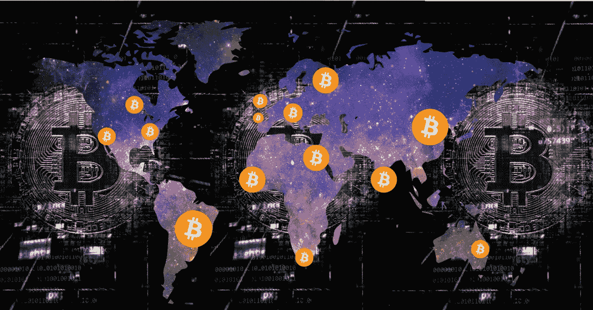
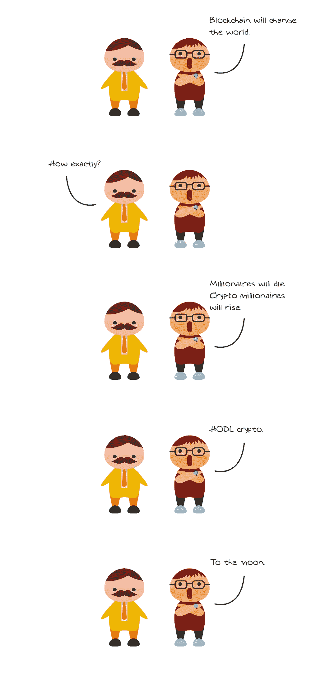
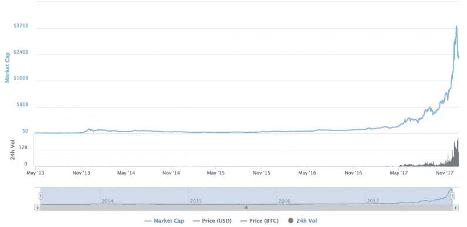

# 不同国家的加密货币价格不同，原因如下

> 原文：<https://medium.com/hackernoon/cryptocurrency-doesnt-have-the-same-price-between-countries-here-s-why-2c0b44f57a14>

## 它们不应该是全球统一货币吗？

在过去的六个月里，我一直在积极撰写关于区块链和 cryptos 的文章,有一个问题人们一直问我“为什么不同国家的比特币价格不同？这是不是意味着我可以从套利中赚钱？”

对这个问题的简短回答是，“是的。”当然，要向你所在国家的税务部门正确申报你的交易，需要做大量的工作。但除此之外，套利是可能的，因为不同的国家以不同的价格买卖比特币。但这是为什么呢？

因为比特币没有国际价格。

原因是什么？对于比特币到底是什么，人们似乎没有达成共识。

# 比特币的目的

> “当你跳舞的时候，你的目的不是为了到达地板上的某个地方。而是享受这一路上的每一步。”—韦恩·戴尔

**据说，“价值总是被感知的”**——对于比特币来说，这比以往任何时候都更正确。由于没有被广泛接受的用例可用，每个人都有自己的理由购买比特币。对一些人来说，原因是他们相信驱动比特币的区块链技术有一天会蓬勃发展。对其他人来说，原因是他们现在购买的比特币将在日常使用中的某个时间点变得可用。对于另一个群体(也许是大多数)，原因是纯粹的贪婪；他们想买，希望以更高的价格卖出——不需要太多的工作就能赚快钱。

由于对比特币的未来有如此多样的预期，很难就比特币的实际目的达成共识，进而就其价值达成共识。

没人知道。每个人都在猜测。

市场的这种投机性质使得比特币卖家有可能以买家愿意支付的价格出售比特币。例如，在印度，比特币的平均售价比美国市场高出 20%。这还不是全部，因为通常在印度，买卖价格之间的差异超过 1000 美元。

人们仍在购买。为什么？嗯，因为如果他们想买 crypto，他们真的没有选择。

> 顺便说一下，我是 [**KnowyKnowy**](https://knowyknowy.com) 的编辑，在那里我用简单的英语教授困难的科目。

# 工作中的基础经济学

> "一项经济学研究通常会揭示，购买任何东西的最佳时间是去年。"—马蒂·埃伦

**在世界的某些地方，**比特币一般是从比特币供应商那里购买的，而不是点对点的交换。P2P 交易发生在买家和卖家匹配的平台上。然后，该平台会因促成匹配而获得一小笔佣金。然而，卖方是一个拥有大量比特币储备和大量现金储备的企业。买家可以按照卖家预先设定的价格用现金购买比特币。

考虑一个市场，其中两个苹果供应商正在销售苹果。他们每个人都有自己的苹果储备和自己的市场需求。假设两个卖主都有 100 个苹果，但是有 100 个人排队等着从第一个卖主那里买，只有 30 个人排队等着从第二个卖主那里买，第一个卖主可以卖更高的价格。

在这种情况下，排队购买第一个供应商的 100 个人最终会了解市场上的第二个供应商，而不是排队等待，一些人会转向第二个供应商购买苹果。随着需求的增加，第二个供应商将提高价格，最终两个供应商的业务将达到平衡。

这样做的原因是两个供应商在同一个市场上相互竞争，他们有相似的需求和相似的价格。如果第三个供应商出现，但在不同的国家，他/她将不会受到前两个供应商的市场条件的影响。

由于地理和银行的限制，要从任何国家的供应商那里购买比特币，你必须在该国拥有一个银行账户和一个 ID。例如，由于印度人不能从比特币基地购买比特币，他们只能从当地供应商那里购买。因此，本地供应商的价格与国际供应商无关。

# 孤立的本地供应商的均衡

> "现在平衡是无序的对立面."鲁道夫·阿恩海姆

**供应商知道他们的买家不能**从国外的供应商那里购买；因此，他们唯一的竞争对手是当地的其他供应商。此外，对于本地供应商来说，任何时候都只有少数几家，因为获得大量的比特币储备并不是一件容易的事情。

这就是为什么在国际供应商开始在印度这样的国家交易之前，价格可能高于或低于全球价格。但这意味着价格不需要太多就能与国际供应商持平。唯一需要发生的事情是，一个供应商开始以更低的国际价格出售比特币，并从当前的本地供应商那里窃取所有需求。

整个加密市场是全新的，没有人知道比特币的目的是什么，或者未来是什么样子。每个人都有他们自己的版本，关于他们想要相信的加密的未来。这使得下面的图表，不是一个混乱的图表，而是一个贪婪的图表。

The graph of greed.

不要误会我；我不是不相信区块链。我是区块链、加密和去中心化世界的忠实拥护者。我只是说，并不是这个市场看到的所有资金都是“聪明钱”。很多都是贪婪的钱，当人们获得他们想要的利润时，这些钱总有一天会消失。当这种情况发生时，理性的需求将使世界各地的价格大致相同。

在那一天到来之前，让我们在混乱中愉快地航行吧。

## 感谢阅读！:)如果你喜欢，请鼓掌支持👏🏻还有分享帖子。请随意发表评论💬下面。

[Mohit Mamoria](https://twitter.com/mohitmamoria)

莫希特·马莫里亚是权威资本公司***(一家加密基金)的首席执行官，也是*[***KnowyKnowy***](https://knowyknowy.com)*的编辑，我在那里用简单的英语教授困难的科目。***

***这个故事最早出现在 then next web**上* [*。有反馈？在推特上做朋友*](https://thenextweb.com/contributors/2018/01/17/cryptocurrency-doesnt-price-countries-heres/)**。*🙌🏻***