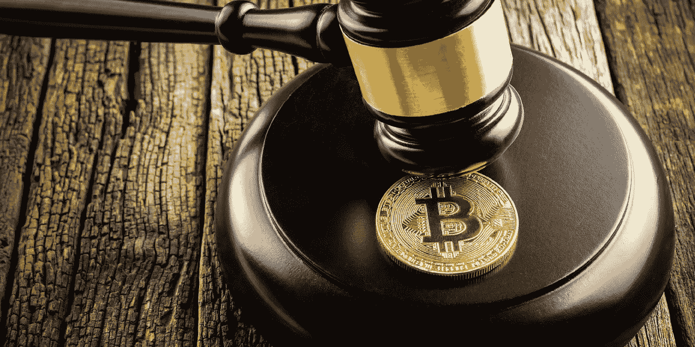

# 加密货币交易所争相获得许可

> 原文：<https://medium.com/hackernoon/cryptocurrency-exchanges-scramble-to-receive-licensing-818580d1105d>

As global cryptocurrency regulations unfold, exchanges with regulatory compliance will lead the
next wave of institutional and individual investments.

随着加密货币行业面临监管，交易所正在迅速获得许可，以维持运营。许多国家已经开始对加密货币行业实施监管措施的初始阶段，监管机构发现监管该行业最简单的方法是监管交易所。

常识性的监管对于加密货币行业的下一阶段增长至关重要，因为许多个人和机构投资者在将资金引入市场之前都在观望，等待监管的明确。

根据汤森路透(Thomson Reuters)最近进行的一项调查，其五分之一的金融服务客户正在考虑在今年的某个时候交易加密货币。目前，美国证券交易委员会等政府机构缺乏监管确定性，这给市场的安全性、交易所和托管服务的安全性带来了问题。金融机构只会使用声誉好、受监管的服务来投资。

仅在 2018 年，就有超过 7.31 亿美元的加密货币交易所被盗，包括臭名昭著的 5 亿美元 Coincheck 黑客攻击。黑客攻击发生后，Coincheck 承认，他们交易所的安全弱点很大程度上是由于公司缺乏有才华、有经验的开发人员。

Coincheck 首席执行官和田幸一郎对彭博说:

*“我们意识到，我们没有足够的人员从事内部检查、管理和系统风险工作。我们曾努力通过猎头和代理公司扩大业务，但最终却陷入了这种境地。”*

韩国加密货币交易所 [**Coinrail**](https://coinrail.co.kr/intro?region=ru) 是下一个成为黑客受害者的交易所，损失了 4000 万美元。在这些黑客攻击之后，日本和韩国政府进行了大量调查，发现交易所存在重大违规行为，这是其安全性薄弱的原因。

缺乏对交易所的监管是价值数百万美元的加密货币损失的主要因素。韩国和日本的监管机构已经迅速采取行动，像监管银行一样监管交易所，这将确保用户资金的安全。

实施的一些监管措施包括强制性 KYC 和反洗钱实践、政府对内部实践的监督以及包括冷藏在内的强制性安全措施，所有这些都将抑制盗窃。

为了进入为加密货币交易所提供友好、常识性监管措施的国家，一些世界上最受欢迎的交易所已经搬到了地中海岛屿马耳他。中国政府出台了常识性的许可制度，允许交易所在政府的监管下发展和试验。这种环境非常适合加密货币交易，这也是为什么**和 [**Okex**](https://www.okex.com/) 都将业务转移到这里的原因。**

**为了在完全安全和透明的情况下运营，**比特币基地最近在美国获得了许可，这使得许多投资者通过受监管的场所投资市场感到更加放心。****

****新的加密货币交易所也在采取措施，以完全符合监管要求。这种交换的一个例子是 [**交换**](https://covesting.io/) **。**复制交易平台在正式发布前已获得欧盟的全面运营许可，并在获得 ICO 后立即向直布罗陀当局申请了数字总账技术(DLT)许可。该交易所预计在未来几个月内获得 DLT 牌照，为 2018 年第三季度正式推出做准备。此外，获得 DLT 许可证将允许 Covesting 为其客户提供法定货币，这将允许投资者轻松购买加密货币。****

****很快，未经许可的加密货币交易所将等同于未经许可的银行，投资者使用起来根本就不实用或不安全。随着监管格局变得更加清晰，完全符合监管规定的交易所将超越其他交易所，为加密货币市场带来一个成功的新时代。****