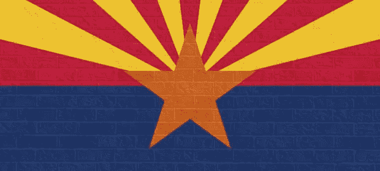

# 加密货币是合法的——美国各州政府都这么说。

> 原文：<https://medium.com/hackernoon/cryptocurrency-is-legitimate-us-state-governments-say-so-b3793e939e59>

尽管公众可能仍然对加密领域正在进行的投机热潮保持警惕，但全国各地的州参议员正在积极提出立法提案，以接受比特币和其他加密货币作为可接受的纳税形式。以下是几个积极讨论推进比特币和加密货币合法化的州。

美国亚利桑那州于 2017 年 4 月通过了 HB 2417，该法案将区块链签名合法化，并强制执行智能合同，作为消费者和企业之间的商业交易手段。不久之后，HB 2603 法案获得通过，允许公司在分布式分类账上持有和共享数据。[最近，亚利桑那州参议院](http://cryptoobase.com/adoption/bill-allowing-residents-to-pay-taxes-in-crypto-passes-arizona-house-committee/) **通过了 SB 1901 法案，允许亚利桑那州居民用加密货币**缴税。最近对 SB 1901 法案进行了修订，该法案要求州政府必须按照支付利率将加密货币转换为美元。允许支付税款的加密货币类型包括“任何加密货币”。

开放平台是面向亚利桑那州居民的用户平台，它正在与 NEO Global Capital 合作开发一个安全高效的基础设施，以持续支持使用最广泛的区块链。开放平台开发者测试版将于五月底发布。**据**[**coin speaker**](https://www.coinspeaker.com/2018/05/01/arizona-opens-another-crypto-door-right-keys/)**报道，OPEN 旨在为亚利桑那州的居民创建一个用户友好的界面，方便他们使用加密货币进行纳税。**

4 月 30 日，众议院以 43 票对 14 票通过了该法案。该措施的补充规定包括亚利桑那州税务局将进行的一项研究，以进一步评估居民的有效支付网关和加密货币兑换美元的方法。根据 [Coindesk 的消息，两院正在谈判敲定细节，以确保在推出加密支付服务之前进行尽职调查。](https://www.coindesk.com/arizonas-crypto-tax-bill-undergoes-major-changes/)

[参议院第 464 号法案(**将要求国家接受比特币和加密货币作为支付形式)**](https://www.coindesk.com/georgia-us-state-consider-bitcoin-tax-payments/) 目前正在讨论，直到 2019 年 1 月开始的下一届立法会议。不幸的是，在 3 月 29 日乔治亚州参议院休会之前，该法案没有得到委员会的听证。

**佐治亚州参议员迈克·威廉姆斯**

> “我们与立法者和公众交谈得越多，我们就越能了解区块链有益的方面。”

参议员 Mike Williams 是该法案的发起人之一(他也恰好在 11 月竞选州长)，他可能会在明年利用这个机会向立法者宣传区块链技术的好处。

根据 Gordon Law Limited 的说法，伊利诺伊州的州代表 Michael Zalewski 最近提出了一项法案，允许该州接受加密货币作为一种纳税形式。该法案需要通过伊利诺伊州议会两院，然后由州长签署才能生效。拟议中的法案包含类似亚利桑那州的规定，并呼吁州政府在收到 24 小时内将密码转换成美元。截至 3 月 5 日，伊利诺伊州众议院收入和财政委员会正在审议该法案，以敲定细节。

加密猫已经被泄露，州政府官员正在进行讨论(无论多么初步)，以适当监管加密货币如何用于商业或税收支付。**亚利桑那州通过了 SB 1901 法案，使加密货币作为一种可接受的支付形式合法化。参议员迈克·威廉姆斯表示，尽管佐治亚州将该法案提交给 2019 年 1 月的下一届立法会议，但毫无疑问，州参议员将花更多时间教育他们的州政府官员，并完善最初的提案。**

如果你喜欢这个内容，请点击订阅[我们的邮件列表。您将获得 Lunar Labs 的早期测试版，这是一套优化您的加密货币交易体验的工具，以及直接发送到您电子邮件的最新加密新闻和市场更新。您也可以通过](http://bit.ly/2ozZ20H)[点击此处](http://bit.ly/2GUSqRl)访问我们的网站，了解更多我们的工作！

*原载于 2018 年 5 月 5 日*[*lunardigitalassets.com*](https://lunardigitalassets.com/news/regulatory/2018/cryptocurrency-legitimate-us-state-governments-say/)*。*