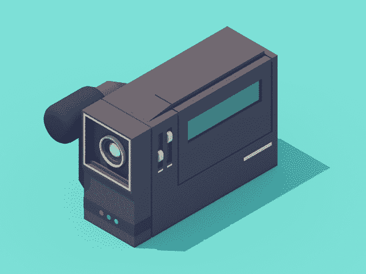
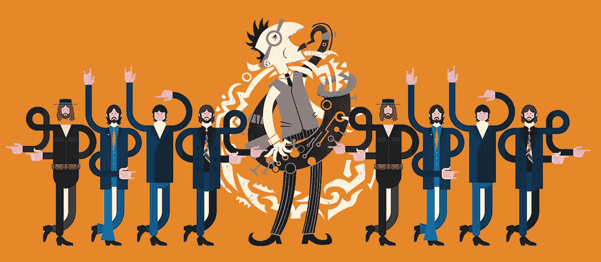
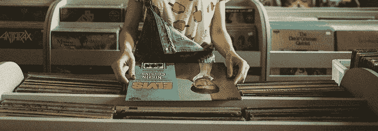
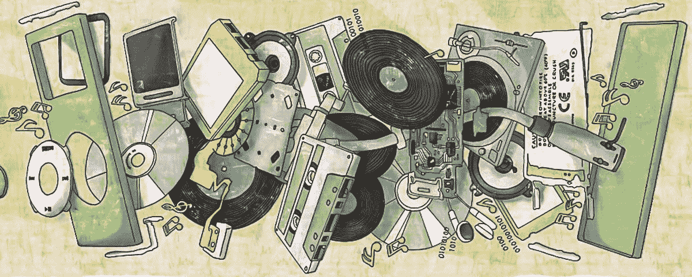
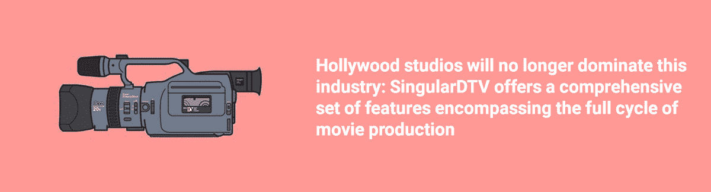

# 加密货币是娱乐业数字化的下一块砖

> 原文：<https://medium.com/hackernoon/cryptocurrency-is-the-next-brick-in-the-digitalization-of-the-entertainment-industry-c5237055fa5b>

娱乐业已经开始从实体销售转向流媒体服务。但这种数字化并不完全，除非我们通过智能合约和加密货币支付消除了不必要的中间人。在本文中，我们展示了音乐和电影行业的发展和新机遇，并给出了分散项目的真实例子。

最近，人们对与区块链有关的一切都产生了极大的兴趣。虽然它主要是由比特币的利率波动引起的，但区块链技术已经让公众意识到了它在金融领域以外的许多其他行业的实施潜力，音乐和娱乐业就是其中之一。根据米德尔塞克斯大学发表的一份 r [报告，区块链可以成为各种改进的垫脚石，这些改进涉及版权、版税支付、透明度、替代资金来源，甚至是取消中间商。](https://www.mdx.ac.uk/__data/assets/pdf_file/0026/230696/Music-On-The-Blockchain.pdf)

# 音乐产业的演变:从黑胶唱片到流媒体服务

新的录音技术和发行方法的发明推动了音乐产业的发展。从黑胶唱片开始，它转向磁带，然后是激光唱片，这在业内统治了几十年。然后，MP3 格式出现了，并使得在互联网上分享音乐成为可能。1999 年，Napster([第一个点对点共享资源](https://en.wikipedia.org/wiki/Napster))推出，引发了艺术家方面的许多负面反应([多起](https://en.wikipedia.org/wiki/Metallica_v._Napster,_Inc.#Outcome) [诉讼](https://www.nytimes.com/2001/02/13/business/napster-decision-overview-appellate-judges-back-limitations-copying-music.html?pagewanted=all)最终导致其不到三年后关闭)。然而，这是音乐消费新时代的开始:你不需要为了听你最喜欢的音乐而购买一张专辑的实体拷贝。此外，新的文件共享网站出现得太快，无法控制所有这些网站。在 2001 年， [BitTorrent 协议](https://www.privateinternetaccess.com/blog/2016/07/bittorrent-fifteen-years-old-file-sharing-technology-developed-today-look-like/)被引入，使得文件共享更快。这可能是一个巧合，但是在 2000 年音乐产业的总收入开始稳步下降。然后在 2015 年停止了。

2003 年，数字下载的合法变种出现了；苹果开始通过 iTunes 销售音乐。iPods 的流行导致了收入模式的转变:唱片公司无需制造实体拷贝和支付运费就能赚钱。下一步发生在 2005 年，当时公众的注意力被吸引到 Pandora——一种音乐流媒体服务，它也根据用户的偏好推荐新音乐。很快，流媒体技术被其他音乐点播和视频点播服务所实现，并迅速成为内容消费的主导工具。2014 年，音乐行业通过流媒体服务产生的收入[超过了 CD 销售额](https://www.nytimes.com/2015/03/19/business/media/sales-of-streaming-music-top-cds-in-flat-year-for-industry.html?em_pos=large&emc=edit_nn_20150319&nl=nytnow&nlid=54744788&_r=0)(分别为 18.7 亿美元和 18.5 亿美元)。

流媒体极大地改变了音乐产业，以及它的分销和收入模式。由于价格合理，音乐盗版已经减少了 50%:如果你可以在 Spotify 或 Apple Music 上以每月 10 美元[的价格获得付费订阅，为什么还要非法下载音乐并冒着感染病毒的风险呢？在 20 世纪 90 年代，你可以](https://www.macworld.co.uk/review/music/apple-music-vs-spotify-comparison-review-3615611/)[花这么少的钱买一张 CD](https://musicedmasters.kent.edu/the-digitization-of-the-music-industry/) ，但是在 2018 年，你可以无限制地使用一个巨大的音乐库。难怪 2017 年流媒体服务占全球音乐收入的 [43%。甚至有相当多的年轻音乐爱好者一生中从未买过 CD。](https://techcrunch.com/2018/04/23/43-of-music-revenues-came-from-streaming-last-year/)

# Spotify 和网飞

如今有很多流媒体服务，但 Spotify 和网飞主导了整个市场。Spotify 于 2015 年推出，是一种跨平台的音乐流媒体服务，提供付费订阅和免费广告支持的音乐。根据[统计](https://www.statista.com/topics/2075/spotify/)，Spotify 拥有全球超过三分之一的用户(其中包括[超过 7000 万用户](https://www.statista.com/statistics/244995/number-of-paying-spotify-subscribers/))，并且呈现出惊人的增长率:[每六个月就有 1000 万新会员](https://venturebeat.com/2018/01/05/spotify-gains-10-million-new-paid-members-every-5-6-months/)。

网飞在 1997 年以 DVD 租赁服务起家，在 2007 年转向视频流媒体后成长为世界领先的娱乐服务。它为来自 190 多个国家的[1.25 亿付费会员提供服务](https://media.netflix.com/en/about-netflix)，目前被认为是电影业最具颠覆性的力量。2010 年，网飞开始制作自己的独家内容:《纸牌屋》、《奇人异事》、《王冠》以及其他赢得全球人气、令好莱坞大片黯然失色的节目和电影。用户可以在 250 多种支持的设备上观看《网飞》,从游戏机到蓝光播放器。

流媒体服务在音乐和娱乐行业的普及无疑带来的优势是[可访问性水平的提高](https://musicedmasters.kent.edu/the-digitization-of-the-music-industry/):新音乐人可以发行他们的专辑，而不必费心制作和发行他们作品的实体拷贝。决策权曾经由主要唱片公司垄断，现在由消费者和艺术家自己分享。Spotify 用户的庞大数量为迟早找到乐于接受的观众提供了一个好机会。

然而，仍然存在与流服务相关的严重问题。他们拿走了收入的大部分，只支付一小部分给创作内容的人(对音乐人来说尤其如此)。花了将近 10 年时间，流媒体收入才超过 CD 销售，因为艺人们得到的版税少得可怜。歌曲作者的报酬甚至更低——一部剧大约 0.00009 美元。

幸运的是，这个问题终于可以解决了。流媒体服务曾经颠覆了音乐和视频行业，现在他们面临着被全新的、基于区块链的分散内容分发模式颠覆的前景。虽然国际注意力目前锁定在金融科技上，但娱乐科技的概念已经出现，并有可能在不久的将来传播到世界各地。

# 在流媒体服务中使用区块链有什么好处？

**更快更公平的版税支付**

首先，区块链科技可以让版税支付更快、更容易，而且没有中介机构收取的高额管理费。[智能合同](https://opensource.com/article/17/12/whats-blockchain-smart-contract)是一种计算机协议，无需任何第三方就能自动执行商定的条款。这意味着音乐人可以以透明有效的方式更快地获得版税——而不必像现在这样等待数月(例如，Spotify 的聚合器 [DistroKid](https://distrokid.com/spotify/) 每月支付版税，TuneCore — [延迟 2 个月](https://support.tunecore.com/hc/en-us/articles/115006684648)，PRS — [每季度或一年两次](https://www.prsformusic.com/royalties/royalty-payment-dates/overseas-royalty-payments))。

当一首音乐作品售出时，智能合同中的所有相关方(艺术家、制作人、工作室、流媒体服务)几乎可以立即获得预先安排的付款。此外，智能合同允许内容创作者设定合作条款，而不是接受流媒体服务向他们提供的任何内容。几个支持智能合约的分散式音乐平台已经推出。例如， [Zimrii](http://www.zimrii.com) 为音乐人提供了掌控合作的机会。另一个类似的项目是 [OPUS](https://opus-foundation.org) (目前处于测试阶段)。这些平台对智能合同条款没有任何限制或约束:拥有原创版权的艺术家完全掌控。

**版权证据**

首先，区块链可用于为内容版权创建[分布式数据库。迄今为止，还没有一个包含所有录音版权的综合数据库——只有几个由](https://abovethelaw.com/2018/02/how-blockchain-just-may-transform-online-copyright-protection/)[不同的表演权组织](http://blog.sonicbids.com/who-owns-that-song-how-to-research-copyright-ownership)(专业)运营的数据库。有了这个系统，找到一首特定歌曲的所有者并获得它的许可可能会相当困难，更不用说期望歌曲的[作曲家和作词人可能由不同的组织代表](https://www.entrepreneur.com/article/226049)。如果使用条款和联系信息被嵌入到储存在全球区块链数据库中的每一首音乐作品中，那就简单多了。

第二，音乐家和其他创作者不必在众多的国家数据库中注册他们的版权，这需要时间和精力(对于许可证持有者也是一样——他们只需要获得一个许可证，而不是许多)。此外，目前现有的版权数据库并不总是准确或一致的——一个[防篡改分布式分类账](https://techcrunch.com/2016/10/08/how-blockchain-can-change-the-music-industry/)将消除错误并快速促进版权纠纷的解决。一旦歌曲在区块链注册，没有人可以删除或修改这些信息。此外，[这种透明且易于访问的登记册将证明对第三方](/@foustry/blockchain-based-solutions-for-intellectual-property-management-2ba14b51d5f6)有用:他们将能够看到完整的所有权链(不仅是版权所有者，还包括所有被许可方和分许可方)。

为音乐版权创建一个单一的世界范围的数据库已经有过几次尝试:[国际音乐合资企业(2000 年)、全球曲目数据库(2008 年)和国际音乐注册处(2011 年)](http://www.thembj.org/2015/08/grds-failure/)。但事实证明，管理和维护这些项目的成本太高，所以尽管有明显的好处，这些项目还是被搁置了。一个分散的区块链注册中心会更有效，但关键问题是，目前有[几个独立的区块链音乐平台](http://www.mediawrites.law/how-could-the-blockchain-disrupt-the-music-industry/) ( [Zimrii](http://zimrii.com/) 、 [OPUS](https://opus-foundation.org/) 、 [Ujo](https://ujomusic.com/) 、[菌丝体](http://myceliaformusic.org/)、[缪斯](https://museblockchain.com/)等。)，而且都不够大。他们需要合作，以便成功地创建一个真正的全球数据库。或者，其中一个应该比竞争者好得多，成为事实上的标准。

**众筹**

第三，区块链代币是有效的众筹工具。Zimrii 等平台将音乐人与他们的观众直接联系起来，允许用户以相当简单的方式开展众筹活动。艺术家保留对他们音乐的控制权，而他们的支持者(投资者和粉丝)可以指望在某个项目受欢迎时获得一定的利润分成。区块链相对于传统在线众筹的另一个明显优势是其完全透明，这也增加了潜在投资者的信任。没有人能够筹集资金，也没有人能够消失悄悄地把钱花在不相关的事情上。

此外，独立艺术家可以使用他们的代币来激励推广。那些通过博客、网站或评论宣传某些音乐家的粉丝会得到奖励——他们的影响力越大，奖励越高。

**音乐会的预订**

预订现场音乐场所通常是一个复杂的过程，需要花费大量的时间和精力。音乐家或乐队应该打电话给场地代理或推广人，安排会议，提供推广包，[协商日期，财务安排，试音，设备供应，骑手等。，](https://www.thebalancecareers.com/how-to-get-a-gig-a-musician-s-guide-to-booking-concerts-2460375)并身体力行地签订一份[的纸质合同](https://www.docracy.com/5972/band-performance-contract)。然而，现场表演是促进(或维持)你的音乐事业的一个很好的方式——更不用说它们产生的收入了。

[基于区块链的平台](https://www.zimriimusic.com/livemusicperformance/)减轻了艺术家们的搜索、谈判和后勤负担，使他们能够专注于表演质量。整个演出预订过程的速度、效率和透明度在区块链的自动化合同的帮助下得到提高，这些合同不需要当事人亲自到场。结果是音乐家和现场音乐场所都获得了积极的体验(后者将受益于简化的预订流程，并通过获得稳定的表演者供应来吸引客户)。

**更简单的项目管理**

电影创作也可以借助总部位于区块链的平台，如 SingularDTV。好莱坞的电影公司将不再主宰这个行业: [SingularDTV](https://singulardtv.com/) 提供一套全面的功能，涵盖电影制作的整个周期(项目启动、令牌创建、人才管理、设备租赁、剧组搜索等)。)、营销和分销。独立的内容创作者肯定会利用这个建立在以太网上的媒体生态系统。

# 结论

在我们看来，娱乐产业的未来将由 EntTech 平台决定。虽然它们可能不会解决所有现存的问题，但它们肯定会产生深远的影响——但我们仍然需要发现区块链的流媒体平台多久会接管这个行业。在很大程度上，这取决于他们为成熟的观众提供所需的速度和便利的能力。

为了真正打破现有的流媒体格局，区块链的音乐平台需要在与音乐社区的密切合作中克服一些挑战。这可能需要一些时间，但是工作已经开始了。

## 关于作者:

基里尔·希洛夫——geek forge . io 和 Howtotoken.com 的创始人[。采访全球 10，000 名顶尖专家，他们揭示了通往技术奇点的道路上最大的问题。加入我的**# 10k QA challenge:**](http://twitter.com/kirills4ilov)[geek forge 公式](https://formula.geekforge.io/)。