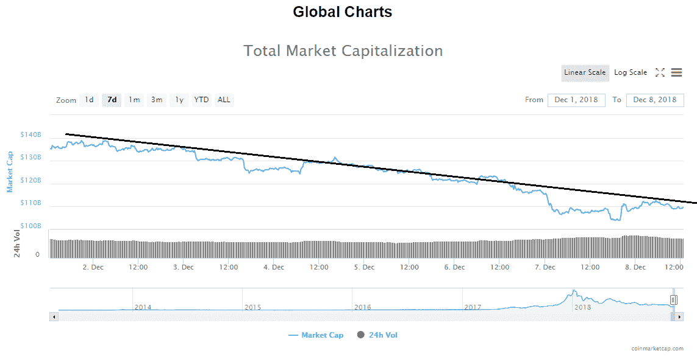
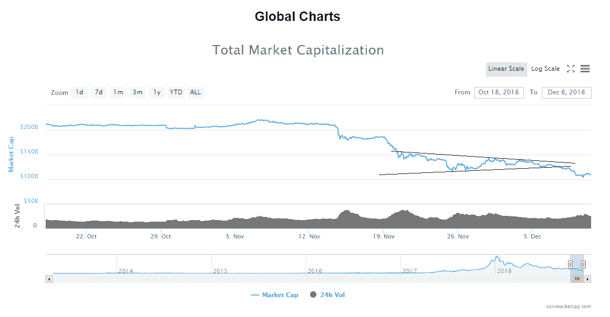
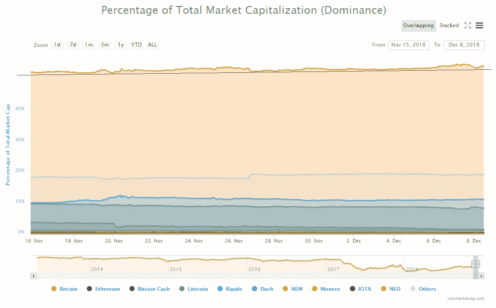
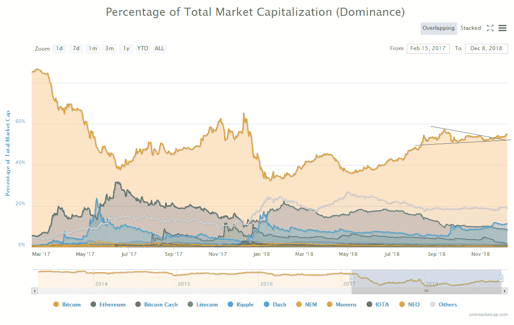
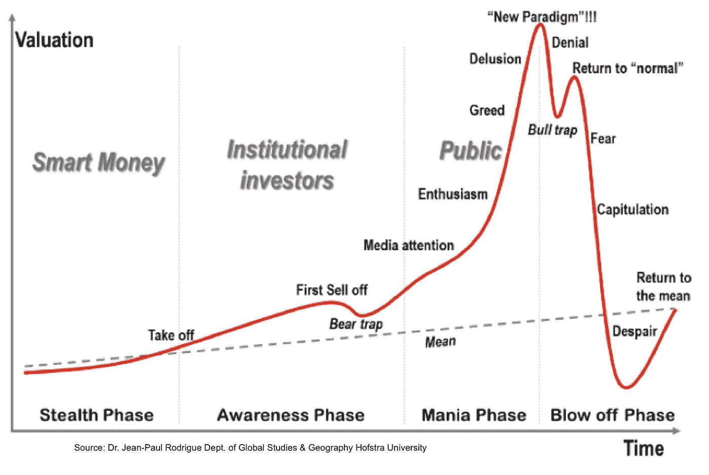

# 加密货币市场概述[2018 年 12 月]

> 原文：<https://medium.com/hackernoon/cryptocurrency-market-overview-december-2018-cbd3b6d4b1f3>

市值:109，672，007，617 美元
24 小时成交量:16，543，133，132 美元
BTC 优势:54.8%

从 12 月 3 日周一开始，加密货币市值的评估值约为 1350 亿美元，按当前水平衡量，该市场的评估值已贬值约 254 亿美元。估值甚至更低，在昨日低点的基础上为 1040 亿美元。

查看全球图表，你可以看到，评估处于一个明确的下降趋势已经确立，评估再次回到其阻力线。因为评估看起来会产生一个更低的高点，所以从这里开始，一个更低的低点是可以预期的。

进一步缩小全球图表，我们可以看到，之前的评估是在 12 月 3 日当前下跌趋势开始时，从下方的对称三角形中爆发出来的。

在评估一下子减少了超过 250 亿美元之后，一条小腿已经开始发育，这就是向下发展的每一步，一遍又一遍。

相反，对比特币市场主导地位的评估一直在稳步上升，自 12 月 3 日以来，比特币的市场主导地位为 53.67%，目前为 54.8%，上升了 1.13%。

进一步放大比特币占总市值的百分比，你可以看到这一增长意味着向上突破三角形。

既然估值已经结束了盘整，处于上升轨道，我预计在熊市结束前，估值将升至 68%，甚至可能更高。

比特币的市场主导地位评估是一个情绪指标，因为在信心时期，人们倾向于冒更大的风险，并通过替代币在加密市场上进行更多的多样化，但在恐惧、不确定性和怀疑的时期，人们出售替代币来换取比特币，并最终出售比特币来换取现金，以试图保护他们的资本。

# 新闻

从本周开始，主要新闻标题纷纷出现，其中许多都加剧了看跌情绪，可能或已经对市场产生负面影响。

头条新闻的重要性是通过其对市场的影响来衡量的，因此最重要的是关于密码行业的监管和正式框架。

最近在阿根廷举行的 20 国集团(G20)峰会上的发言暗示了有关加密市场和行业总体监管前景的最值得关注的消息。

国际政府和中央银行代表在题为“为公平和可持续发展建立共识”的全球经济可持续发展宣言和其他重要问题中谈到了加密货币。

总结一下，更多的监管即将出台，随之而来的是对整个空间的征税，以及对交易框架和交易所的概述，目的是防止洗钱和避税。

“我们将按照 FATF 标准监管用于反洗钱和打击恐怖主义融资的加密资产，并将根据需要考虑其他应对措施。”

另一方面，G20 国家将开发一个国际税收系统，将整个加密货币市场视为一个大型 IT 公司，使其有可能对国际交易和其他跨境支付征税。

据日本时事通讯社报道，根据现行法律，这是不可能的，因此宣言进一步指出:

“我们将寻求解决伴随经济数字化而来的国际税收问题，并将继续合作”。

这些措施应该在 2020 年前实施，但这一进程已经开始，因为 G20 成员国将在定于 2019 年在日本大阪举行的下一届 G20 峰会上提交关于加密税收系统的报告。

其对市场的第二个重要意义是采用，本周这一类别中最重要的头条新闻将是关于 SEC 推迟 2 月底比特币 ETF 决定的消息。人们认为，ETF 将把一些机构资金带入这个领域，并有助于为加密货币交易带来一些合法性，从而带来新的投资者。

这种新的资本流入可能会引发熊市的结束，这就是为什么这将被视为一个重大事件，然而，证券交易委员会已经推迟了决定，新的最后期限定为 27。明年二月。这样做是为了让委员会争取一些时间，并审查规则修改提案，以批准投资公司 VanEck 和区块链公司 SolidX 的 ETF 申请

“委员会认为宜指定一个较长的期限，在此期限内发布批准或不批准拟议的规则修改的命令，以便有足够的时间考虑这一拟议的规则修改。”

这意味着，在交易者中采用加密货币至少需要等待，新的资本流入不会很快注入。

关于美国证券交易委员会的另一个头条新闻是他们对加密货币数字资产基金 CoinAlpha Advisors LLC 罚款的停止令，因为它违反了“禁止通过州际商业或邮件销售证券，除非注册声明有效”的法律。

当我们正在进行诉讼时，“哈希战争”已经升级，总部位于佛罗里达州的美国联合公司(UnitedCorp)对 Bitcoin.com 比特大陆、罗杰·维尔和加密货币交易所北海巨妖提起诉讼，因为他们“计划控制比特币现金(BCH)网络”

“UnitedCorp 认为，在 2018 年 11 月 15 日计划的软件更新之后，被告合谋有效地劫持了比特币现金网络，目的是集中网络——这一切都违反了自比特币诞生以来与比特币相关的公认标准和协议。”

对于那些可能不知道的人来说，这种情况在比特币现金被安排为分成两个链比特币 ABC 和比特币 SV 的硬分叉之后升级，因此双方为了控制被建立为主链而发生了哈希权力的战争。

加密行业的情况类似于加密货币价格的当前状态——崩溃。区块链理工大学周围的矿工和公司都开始感受到这些低价的压力，并开始削减一些不必要的开支，有些甚至完全放弃。

那些完全辞职的人中有矿工。许多新闻媒体报道称，由于 cryptos 的价格已经低于一些人的盈利基准，竞争激烈、无法跟上当前成本利润比的矿商正在出售他们的设备。

与此同时，该领域的一些大公司开始裁员，如 ConsenSys，据 Coindesk 报道，该公司确认裁员 13%:

“尽管我们对 ConsenSys 2.0 感到兴奋，但我们在这个方向上迈出的第一步是艰难的:我们正在精简业务的几个部分，包括 ConsenSys 解决方案、分支和中心服务，从而导致网状成员减少 13%。”

另一方面，总部位于区块链的社交媒体平台 Steemit 正在裁员 70%。Steemit 首席执行官兼创始人内德·斯科特说:

“虽然我们在过去几个月里组建了我们的团队，但我们一直依赖于对市场更高底部的预测，因为这种预测不再存在，我们被迫裁员 70%以上，并开始重组。”

# 结论

所有这些标题为加密货币市场描绘了一幅严峻的画面。以这种方式跟踪媒体和分析市场情绪可以作为我们处于市场周期阶段的一个很好的指标。

根据目前的新闻分析，我们目前正处于投降阶段的开始

在比特币价格达到 6500 美元左右之前，我们一直否认这一点，由于价格下跌了 50%，毫无疑问，市场正在进一步下跌，绝望阶段甚至还没有到来。

对于那些有准备并能客观看待市场的人来说，这是一个在市场参与者基于恐惧做出决策时获利的好机会。