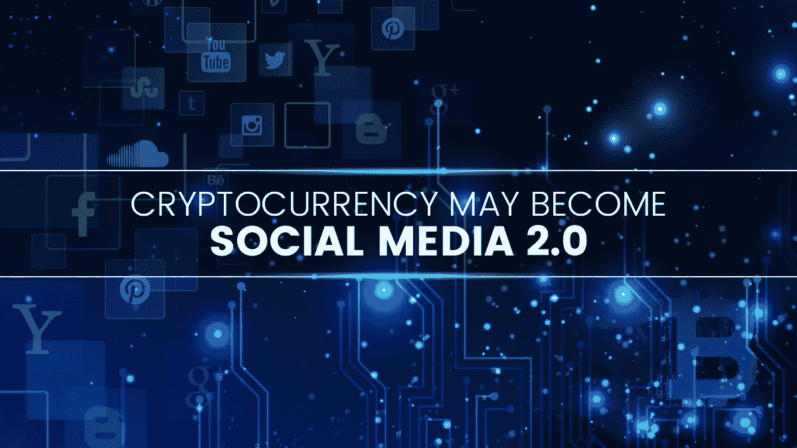

# 加密货币可能成为社交媒体 2.0

> 原文：<https://medium.com/hackernoon/cryptocurrency-may-become-social-media-2-0-64f933ab0140>

在她 1999 年名为“[碎片化的未来](http://darcyd.com/fragmented_future.pdf)”的文章中，著名 IT 架构师顾问 Darcy DiNucci 向世界介绍了 [Web 2.0](http://www.oreilly.com/pub/a/web2/archive/what-is-web-20.html) 的概念。这种新的网络架构基于用户生成的内容，将取代当时万维网的静态性质。值得注意的是，她对框架的描述与今天的描述有很大不同。然而事实是，社交媒体被认为是网络技术的进步，换句话说，是 Web 2.0。有强烈的迹象表明[加密货币](http://news.fundyourselfnow.com/2017/12/20/get-started-cryptocurrency-world/)可能很快成为新的社交媒体。

当互联网首次出现时，它是分布式计算的巅峰。它永远改变了信息技术的面貌。数据可以以惊人的速度在多个网络节点之间来回传输。在网络发展的某个时刻，用户生成内容的想法得到了发展，Web 2.0 诞生了。在 Web2.0 架构的框架内是社交媒体及其许多流行的平台，如脸书、推特、谷歌等。这些平台改变了我们分享信息和相互交流的方式。

在社交媒体出现后的几年里，数字现象吸引了几乎等量的赞扬和批评。社交媒体批评者指出，该系统存在许多缺陷，破坏了共享信息的保真度。这些问题甚至在 2016 年美国大选涉嫌操纵后被推到了前台。

> 由于隐私和可信度问题是反对社交媒体的核心，加密货币和区块链技术被认为是新的和改进的社交媒体生态系统的关键。

# 加密货币和社交媒体

如今加密货币的流行在很大程度上可以归功于社交媒体的力量。由于几乎无限的联网潜力，密码市场的利益相关者已经能够提高对其产品的认识。今天，任何严肃的 ICO 营销策略都不能忽略社交媒体整合。加密领域的最新进展通常是许多社交媒体平台上的热门话题。另一方面，社交媒体平台也从加密货币和基于区块链的应用中受益匪浅。随着无休止的对话，这些公司肯定会从其平台上的所有活动中获得大量收入。

到目前为止，可以说这种关系是共生的；两者相互受益。然而，加密货币和区块链技术很可能会破坏主流社交媒体的结构。加密货币也彻底改变了许多业务流程，从支付处理到合同履行等等。理论上，区块链为人类已知的每一个商业过程提供了几乎无限潜力的可能性。表面上看，加密货币运营的许多核心方面似乎是解决社交媒体领域一些恼人问题的灵丹妙药。

# 潜在的基于加密的社交媒体 2.0 的关键特征

## 分散内容控制

一个基于密码的社交媒体平台将被分散化；没有中央服务器，整个平台将在区块链上运行。因此，这将对用户生成的内容的控制从平台管理的手中返回到发起用户。整个网络将负责监测和控制，从而使平台真正民主。

## 增强的安全性

主流社交媒体因充当国家支持的监视公民隐私的代理人而臭名昭著。基于加密的社交媒体有可能提供一个强大的安全框架，确保用户的隐私。这在那些被政府压制、很少有或没有言论自由的国家尤其有用。总部位于区块链的安全消息平台黑曜石是解决这一问题的加密货币初创公司的一个值得注意的例子。

## 改进的支付协议

尽管在所有社交媒体平台上每天都有大量的经济活动发生，但利益仍然局限于少数玩家。广告和内容推广成本的上升使得没有多少普通用户能够将他们的社交媒体账户货币化。在线支付处理也吸引了高额费用。通过基于加密货币的社交媒体平台，用户将能够使用该平台的原生硬币轻松进行支付。参与者还将能够创建和执行智能合同，而无需第三方参与。最后一个好处有可能让数字网络的赌注更高。

# 最后的话

这些仅仅是加密社交媒体 2.0 的出现可能带来的一些潜在的改进和好处。如果说在这个数字时代有什么是不变的，那就是改进和进步永远不会远离。加密货币和区块链技术每天都在扰乱越来越多的领域。不难想象，它有能力推动下一阶段的社交媒体革命；一个更加分散的。

_______

渴望了解更多关于 FundYourselfNow 的信息吗？在我们的 [*电报*](https://t.me/fundyourselfnow) *群上加入我们的众筹革命对话，或者在* [*推特上关注我们。*](https://twitter.com/fundyourselfnow)