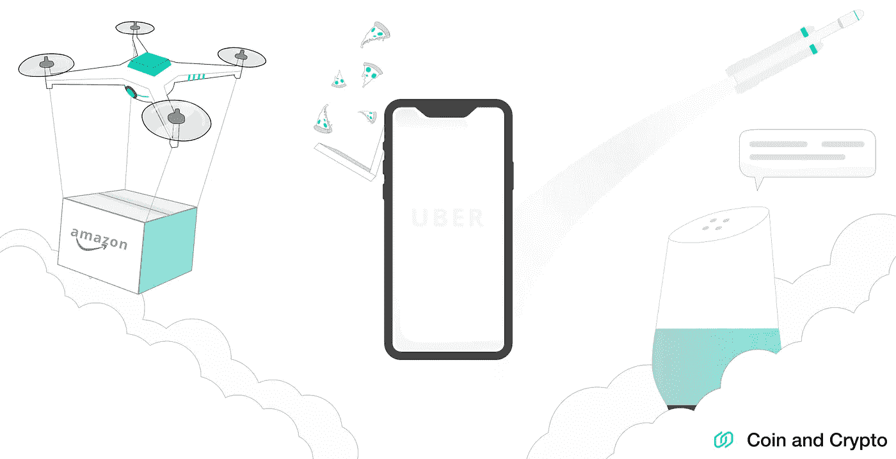
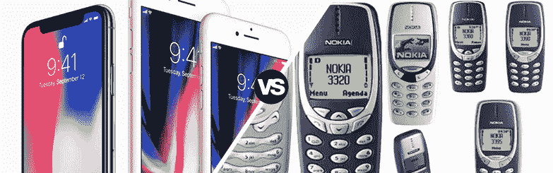
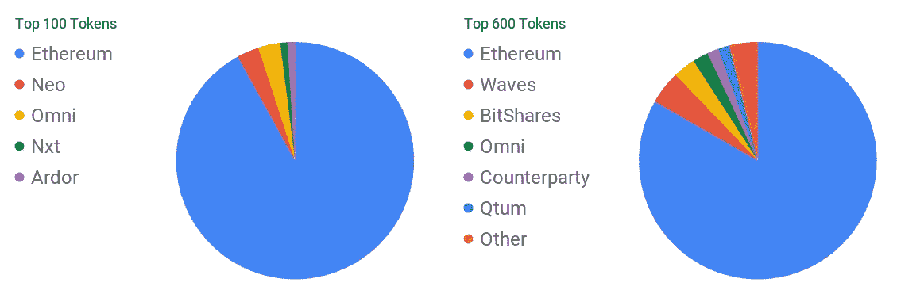
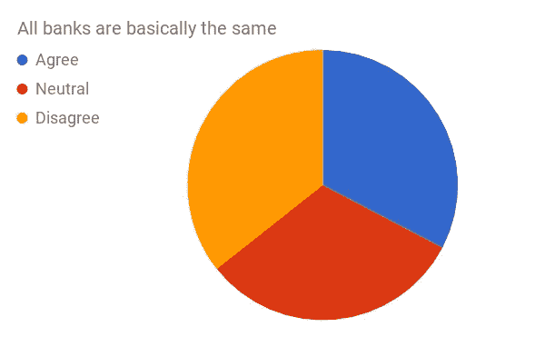
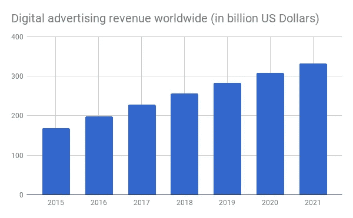

# 密码大规模创新的关键

> 原文：<https://medium.com/hackernoon/cryptocurrency-platforms-the-key-to-disruptive-innovation-ddb5bcf8c5c7>

现在是一个激动人心的活着的时刻。技术一直呈指数级发展，解决着生活各个领域的问题。你能相信第一台个人电脑就在 40 年前吗？现在我们在这里:我可以在我的手机上点击，让鞋子、比萨饼或搭车出现在我的门口。我的扬声器可以告诉我关于天气和流行文化的琐事。无人机在天空中飞行，汽车可以真正自动驾驶。

我们生活在未来——事物正以指数级的速度发展。

在现有的众多产品中，有一种产品往往会带来颠覆性创新。平台。

# 平台>产品

在互联网出现之前，事情要简单得多。公司制造产品，然后卖给顾客赚钱。简单。

然后互联网出现了，事情变得很疯狂。突然间，人们之间的联系比以往任何时候都更加紧密。这导致了一个全新的产品类别的形成。这些产品使他们的用户能够**为彼此创造价值**。这就是平台的崛起。

为什么平台这么好？因为它赋予了大批人权力。成百上千，甚至数百万人运用他们的才能解决问题，创造价值。这让产品超越公司，成为社区。

为了强调这一点，我们来看一些例子。

## **苹果 vs 诺基亚**

用户遇到了问题。他们想要一部功能适合他们需求的新手机。产品制造商诺基亚为其营销团队确定的每一批人生产了大量手机。另一方面，苹果发布了 iPhone。他们创建了应用商店，并为开发者提供了制作应用的工具。每个应用程序都以创造性的新方式扩展了手机的功能。220 万个应用之后——苹果摧毁了诺基亚。

## **万豪酒店 vs Airbnb**

用户在旅行时需要一个住宿的地方。万豪酒店看到了不断增长的需求，建造了更多的酒店。Airbnb 通过创建一个平台来重新定义住宿，使人们能够出租多余的房间和公寓。几年后，Airbnb 已经有超过 400 万个房源。这比全球前五大连锁酒店的客房总数还要多。突然之间，万豪、希尔顿和其他近 100 年的老企业被一个平台的颠覆性力量所推翻。

## 纽约时报 vs 推特

用户想要新闻。《纽约时报》是一份大型出版物，有 1300 名特约撰稿人负责撰写内容。但是推特的出现重新定义了新闻业。让每个有手机的人都能创造和传播新闻。《纽约时报》可以雇佣更多的作家，但他们永远也抓不住 3.28 亿使用 Twitter 的人。

平台公司不仅大，而且有价值。现在，世界上最有价值的公司中有六分之五是平台公司。苹果、Alphabet(谷歌)、微软、亚马逊和脸书。平台只是制造好的商业模式。

# 区块链平台

互联网让一波科技平台加速发展，区块链可能会迎来下一波。引入寻求解决更困难问题的公司，并颠覆具有强大竞争优势的行业。

市值排名前 10 的加密货币中，有 7 个是平台。

*   以太坊——世界计算机
*   Ripple —国际银行支付
*   卡尔达诺—更科学的以太坊
*   stellar——智能合约货币
*   新中国以太坊
*   EOS——以太坊杀手
*   IOTA —物联网支付

显然，平台已经有了一个良好的开端。如果我们继续往下看，我们可以看到广泛的模式开始出现。让我们深入一些加密平台正准备颠覆的关键行业。

# 分散计算

计算机是现代生活的重要组成部分。但是，虽然技术很好，但要将一切正确连接起来，还需要做大量的幕后工作。

在这方面，以太坊、Cardano、NEO 和 EOS 都在竞争成为分散化应用的基础设施级别。这些平台就像互联网。他们把一切都连接起来，这样其他公司就可以在他们的基础上发布应用程序。

[https://coinmarketcap.com/tokens/](https://coinmarketcap.com/tokens/)

现在，比赛开始了。每个组织和技术都有优势和劣势。到目前为止，首选的平台是以太坊。如上图——排名前 100 和前 600 的代币，绝大多数都是在以太坊平台上打造的。其次是尼奥，泛光灯，海浪，和其他。

## [以太坊](https://www.ethereum.org/)

[以太坊](https://www.ethereum.org/)使用区块链运行去中心化应用的编程代码。以太坊做这件事的主要方式是通过**智能合约**。智能合同是一种代码(类似于真实的合同),它执行货币、内容、财产、股份或任何可以数字连接的有价值的东西的交换。这个**消除了对中间人**的需要，促进了交易。使用以太坊区块链，事情完全由代码自动完成。到目前为止，以太坊作为一个平台已经取得了巨大的早期成功，绝大多数分散式应用程序都选择了它，而不是它的竞争对手。按流通市值计算，它目前是第二大最有价值的硬币。

## [近地天体(近地天体，气体)](https://neo.org/)

NEO 类似于以太坊，但有一些显著的区别。就是**更快**(每秒 10000 笔交易)更**灵活**(可以用 C#和 Java 写)。此外，NEO **使用利害关系证明**就区块链达成共识。这意味着，与矿工燃烧电力来保持系统运行不同，NEO 系统只是通过人们抓住他们的硬币来保持运行。此外，他们还可以获得奖励气体(新区块链号上的一个标志),这些气体可以在交易所出售。最后，NEO 也得到了中国更大的支持。它的创始公司 OnChain 与中国政府有交易，并得到阿里巴巴等公司的支持。

# 银行业务

Forrester.com

银行业很大，很慢，真的很难改变。从银行的商品化可以看出这一点——三分之一的客户表示所有银行基本上都一样。考虑到银行业务是我们经常做的事情，这就很说明问题了。

## [四十七(FSBT)](https://www.fortyseven.io/)

四十七家银行正在为银行业创造一个平台。传统上，开设一家银行要花费数百万美元，创建应用程序也很困难。官僚主义和监管的数量使其进展缓慢，成本高昂。FortySeven 的目标是通过**创建基础设施层**来解决这个问题。他们目前正与英国的 FCA 合作，为开发者构建应用程序和颠覆银行业打下基础。他们正在开发的早期产品是“多资产账户”，它在欧盟工作，将所有银行账户、加密钱包和投资集中到一个方便的地方。启动应用程序和智能合约需要 FSBT 令牌，随着该平台越来越受欢迎，这就产生了对令牌的需求。

## [涟漪(XRP)](https://ripple.com/)

使用 Ripple 区块链，银行可以在国际上汇款，并使用 XRP 币几乎立即结清余额。通常需要几天的过程现在可以在 4 秒钟内完成。迄今为止，Ripple 已经与 100 多家银行建立了合作关系，还有 75 家正在筹备中。通过开放他们的协议，Ripple 鼓励开发者在他们的平台上构建，并利用他们的区块链(T3)。此外，专门专注于使用 Ripple 协议的产品的加速器，如 [CrossCoin](http://www.crosscoinventures.com/) ，已经出现[来进一步加速这一过程](https://ripple.com/insights/jumpstarting-the-future-crosscoins-cryptocurrency-startup-accelerator/)。按流通市值计算，Ripple 目前是第三大最有价值的硬币。

# 广告

Statista Digital Marketing Outlook

数字广告业一直在蓬勃发展，预计今年将达到 2560 亿美元。不幸的是，Pivotal 的一份报告估计，谷歌和脸书占美国所有数字广告的 73%,高于 2015 年的 63%。这是一个快速增长的行业，由两个主要参与者主导。区块链可能是前进的方向。

## [基本注意力令牌(BAT)](https://basicattentiontoken.org/)

[BAT](https://basicattentiontoken.org/) 是一个连接用户、广告商和出版商的数字广告平台。他们的目标是为那些将宝贵的数据和电池寿命花费在观看广告上的用户减少开支。帮助出版商**停止亏钱给脸书和谷歌**。并阻止机器人和欺诈网站诈骗广告商。英美烟草通过测量用户的注意力，然后根据用户实际观看的内容向出版商分配代币来实现这一点。用户可以选择观看广告，并通过代币获得补偿。也就是说他们看广告会得到报酬。BAT 是由 JavaScript 的创造者、Mozilla 和 Firefox 的联合创始人创办的。

## [斯蒂姆(STEEM)](https://steem.io/)

Steem 希望改变内容创作者获得报酬的方式。不再依赖广告和代言，**的创作者可以从社区本身获得奖励**。任何发布网站都可以在 Steem 上开发自己的令牌，并使用它来奖励在社区内创建和参与的人。已经在使用 STEEM 的一个流行应用程序是 Steemit，用户可以在其中创建类似于 Medium 的长格式内容。到目前为止，已通过 Steem 平台支付了近 2300 万美元。

# 结论

回过头来看，平台已经被证明是很好的商业模式。他们推动了创新，造就了一些世界顶级公司。互联网在技术、酒店和新闻等领域带来了一波平台浪潮。现在，区块链正在创造一个更加互联的世界。这为平台在分散计算机、银行和内容货币化等领域颠覆现有公司带来了新的机会。这是一个激动人心的时刻——5 年后我们的世界会是什么样子？

## 喜欢这篇文章吗？我们现在有电报信号组了！

我们发布**简单有效的交易信号**。所以你可以花更少的时间做技术分析，花更多的时间**得到结果。**
👉[https://t.me/coinandcrypto](http://telegram.coinandcrypto.com/medium)

