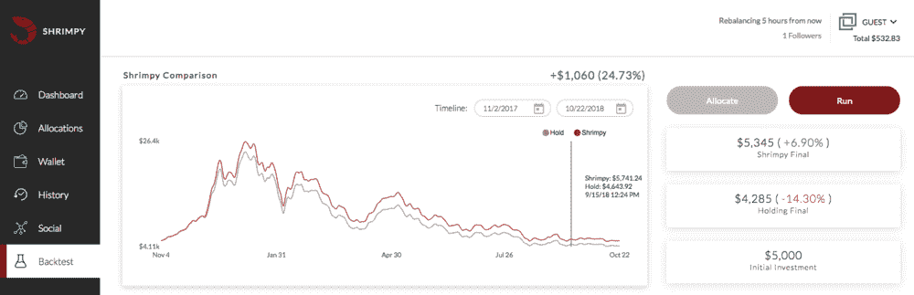
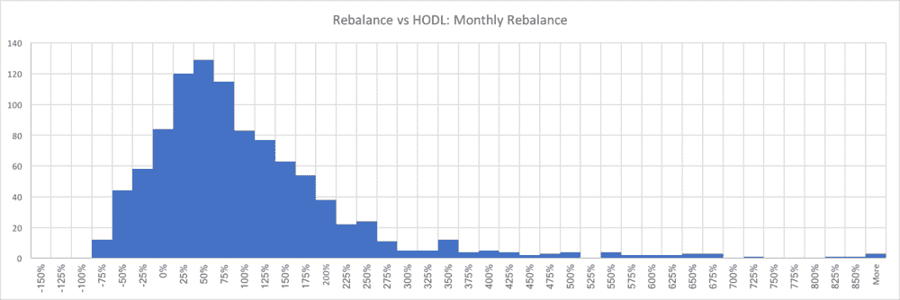
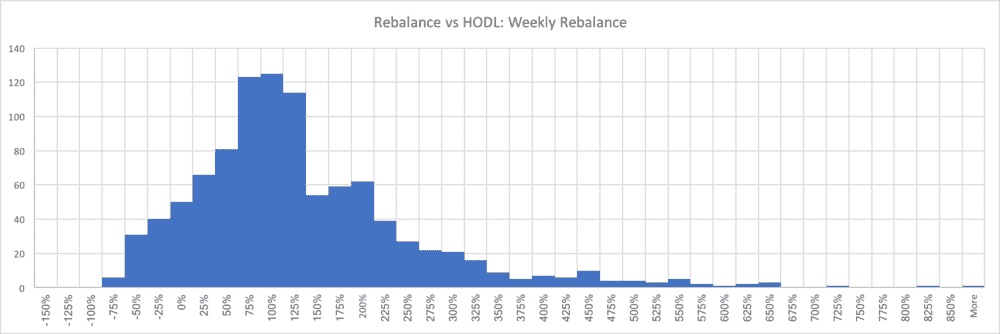
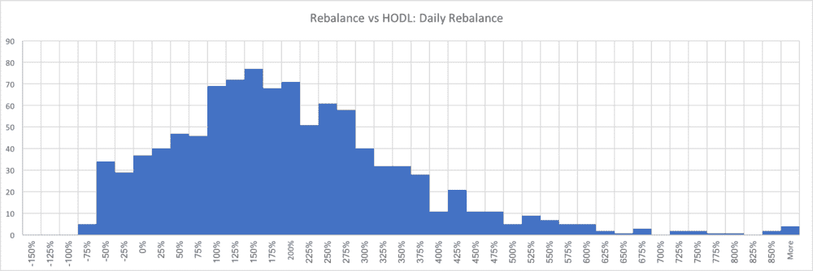
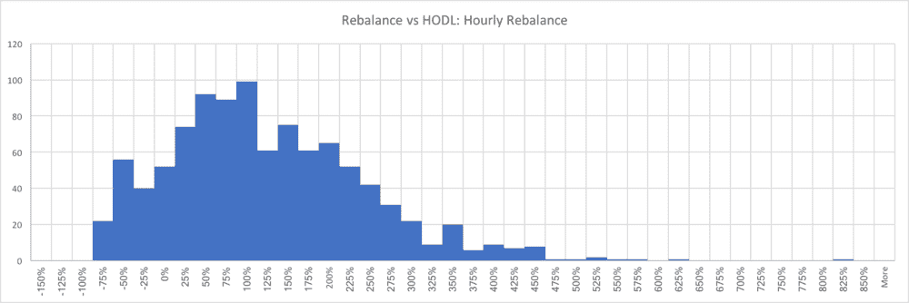
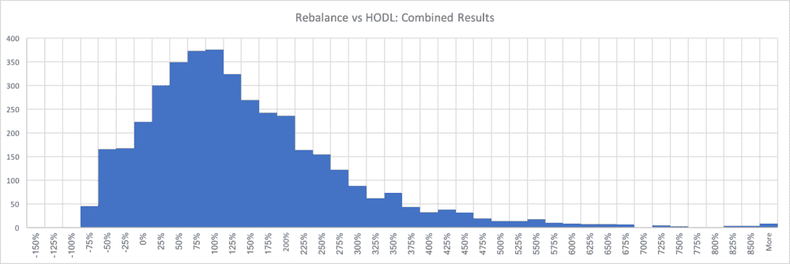
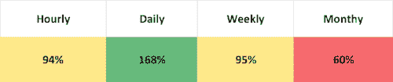

# 加密货币投资组合再平衡:Bittrex 分析

> 原文：<https://medium.com/hackernoon/cryptocurrency-portfolio-rebalancing-bittrex-analysis-b2dd46aa0874>

以下研究将评估定期重新平衡和保持之间的性能差异。通过检查不同的时间间隔，我们可以确定哪些重新平衡频率比简单的保持有最大的性能提升。该研究使用以下约束条件进行设置。

## 贸易和数据

从 2017 年 3 月 15 日开始到 2018 年 10 月 20 日结束，从 Bittrex 收集数据。所有数据点都是作为每项资产的确切买价和卖价收集的。这提供了每次交易实际执行时所使用的精确价格。此外，所有交易都包括 0.25%的费用，这是 Bittrex 的标准费用。因此，从 LTC 到 XRP 的交易将首先从 LTC 到 BTC(产生 0.25%的交易费)，然后从 BTC 到 XRP(产生 0.25%的交易费)。结果是一个尽可能精确的费用模型。

## 再平衡期

这项研究的主要变量是再平衡期。重新平衡期是指每次重新平衡之间的具体时间。因此，1 天的时间将导致每天在完全相同的时间进行重新平衡。在本研究中，将测试的重新平衡周期为 1 小时、1 天、1 周和 1 个月。 [**了解有关加密货币再平衡的更多信息。**](https://blog.shrimpy.io/blog/portfolio-rebalancing-for-cryptocurrency)

## 投资组合规模

本研究的投资组合规模固定为每个投资组合 10 项资产。 [**了解投资组合中的资产数量如何影响业绩。**](https://blog.shrimpy.io/blog/crypto-users-who-diversify-perform-better)

## 资产选择

构建每个投资组合都是随机进行的。所有在 2017 年 3 月 15 日至 2018 年 10 月 20 日期间在 Bittrex 上可用的资产都包含在选择过程中。这相当于总共 110 种不同的资产。通过导航到 Shrimpy 应用程序中的 backtest 选项卡，然后选择与上述时间段相同的时间段，可以找到本研究中包含的资产列表。 [**了解如何建立强大的投资组合。**](https://blog.shrimpy.io/blog/10-tips-for-creating-a-killer-cryptocurrency-portfolio)

## 回溯测试

回溯测试是使用来自交易所的交易数据来模拟一个策略在给定时间段内的表现的过程。这通常用于通过运行大型数据集来测试策略的可行性。在这项研究中，我们使用回溯测试来比较再平衡和买入并持有的结果。我们为每个投资组合规模和再平衡期对运行的回溯测试的数量被设置为 1000。阅读更多关于回溯测试的内容，或者自己运行。

# 表演

每次回溯测试的表现是通过获取最终的再平衡值并将其与最终的买入并持有值进行比较来确定的。这是通过以下等式实现的:(Rf — Hf) / Hf，其中 Rf 是最终再平衡值，Hf 是最终买入并持有值。

## 每月重新平衡

The x-axis is the performance increase that is experienced for each portfolio due to rebalancing on a monthly basis. The y-axis is the number of portfolios which falls into each performance bucket. This means if a backtest was run and the result was a performance increase of 115% when compared to buy-and-hold, we would add a “1” to the 100% — 125% bucket.

每月一次的再平衡是本研究中要考察的最长的再平衡期。每月一次的再平衡使得投资组合的业绩中值比买入并持有高出 60%。80.2%使用月度再平衡的投资组合表现优于买入并持有。

## 每周重新平衡

The x-axis is the performance increase that is experienced for each portfolio due to rebalancing on a monthly basis. The y-axis is the number of portfolios which falls into each performance bucket. This means if a backtest was run and the result was a performance increase of 115% when compared to buy-and-hold, we would add a “1” to the 100% — 125% bucket.

每周一次的再平衡导致投资组合业绩中值比买入并持有高出 95%。87.3%采用每周再平衡的投资组合表现优于买入并持有。

## 每日重新平衡

The x-axis is the performance increase that is experienced for each portfolio due to rebalancing on a monthly basis. The y-axis is the number of portfolios which falls into each performance bucket. This means if a backtest was run and the result was a performance increase of 115% when compared to buy-and-hold, we would add a “1” to the 100% — 125% bucket.

每天进行一次再平衡，投资组合的业绩中值比买入并持有高出 168%。89.5%采用每日再平衡的投资组合表现优于买入并持有。

## 每小时重新平衡

The x-axis is the performance increase that is experienced for each portfolio due to rebalancing on a monthly basis. The y-axis is the number of portfolios which falls into each performance bucket. This means if a backtest was run and the result was a performance increase of 115% when compared to buy-and-hold, we would add a “1” to the 100% — 125% bucket.

每小时重新平衡一次导致投资组合业绩中值比买入并持有高出 94%。83.0%使用小时再平衡的投资组合表现优于买入并持有。

## 综合结果

The x-axis is the performance increase that is experienced for each portfolio due to rebalancing on a monthly basis. The y-axis is the number of portfolios which falls into each performance bucket. This means if a backtest was run and the result was a performance increase of 105% when compared to buy-and-hold, we would add a “1” to the 100% — 125% bucket.

在任何时间段进行再平衡都会导致投资组合业绩中值比买入并持有高出 100%。85.0%的再平衡投资组合表现优于买入并持有。

Each cell in the table is the median portfolio performance of 1,000 randomly selected portfolios over the period of March 2017 to October 2018.

将 4 个重新平衡期相互比较，每日重新平衡在经过回溯测试的时间段内表现出最高的性能。

# 结论

与买入并持有相比，再平衡回溯测试显示了投资组合表现方面令人兴奋的结果。无需耗时的参与、复杂的设置或昂贵的工具，重新平衡已经成为加密货币用户的一种强大策略。简单地建立一个投资组合，然后用一个像 Shrimpy 这样的应用程序忘记它，就可以在所有的再平衡频率上提供 100%的中值性能提升。

由于再平衡频率的分辨率较低，因此，未来应对每个可能的再平衡周期进行详细分析，以找到最佳的再平衡周期。

## 用 SHRIMPY 重新平衡

Shrimpy 是一个免费的应用程序，可以自动执行再平衡策略。我们用于资产分配、回溯测试和指数化市场的专用工具是业内最强大的。无论您是机构还是个人，我们的解决方案旨在解决密码领域投资组合管理面临的最紧迫问题。

点击[这里](https://www.shrimpy.io/)，立即报名。

如果您仍然不确定，请尝试演示，看看我们提供的一切！

## [Shrimpy Demo](https://www.shrimpy.io/demo)

别忘了查看一下 [Shrimpy 网站](https://www.shrimpy.io/)，在 [Twitter](https://twitter.com/ShrimpyApp) 和[脸书](https://www.facebook.com/ShrimpyApp)上关注我们的更新，并在[Telegram](https://t.me/ShrimpyGroup)&[Discord](https://discord.gg/gXyy95y)上向我们令人惊叹的活跃社区提问。

留下你的评论，让我们知道你的平衡经验！

*捕虾队*

*原载于*[*blog . shrimpy . io*](https://blog.shrimpy.io/blog/cryptocurrency-portfolio-rebalancing-bittrex-analysis)*。*