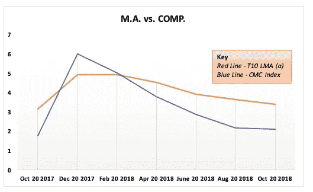
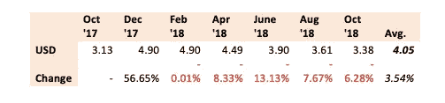

# 加密货币定价算法

> 原文：<https://medium.com/hackernoon/cryptocurrency-pricing-algorithms-73ef9dfefd58>

## 对数标度导致指数回报

在最近的一次练习中，我们着手寻找一种新资产的安全定价算法，我们在一个时间萎缩的对数移动平均数据集中发现了一些非常有趣的东西，我们用从现在到一年前点的平均偏差对其进行了处理。

通过绘制相隔两个月的数据点，并向一年前的时间点移动累计较短的移动平均计算(最短的“平均”是一年前的单个第一次输入价格点，最长的平均是包括所有之前 6 个数据点的当前价格点)，我们能够创建一个更稳健的 CoinMarketCap 价格指数的 alpha 系数变化，变化幅度相当大:

我们具体做的是，我们每两个月比较一次年度*综合*货币市场资本(CMC)指数和年度*对数**CMC 十大货币的移动平均数*，我们发现 CMC 综合指数的平均波动性比对数移动平均数高 70%。就绝对表现而言，对数移动平均数每两个月平均上涨 3.5%，而综合回报每两个月平均上涨 5.4%。一旦你考虑到波动性对综合数据的拖累，对数移动平均线比未调整的每月时间线的指数多了一个百分点。

这一结果似乎与对数移动平均线相比更相关，因为前 10 名指数的 Beta(波动性测量)甚至更高，前 10 名指数与整个指数的绝对值(alpha)相比，整体表现每月(平均)下降 20%。因此，我们的结论是，对于任何种类的[加密货币](https://hackernoon.com/tagged/cryptocurrency)资产来说，最优惠和最稳健的(波动率中立的)定价机制之一是**年度对数移动平均前 10 名 CMC 价格指数。**如果一项资产按照年化 T10 L.M.A .以美元平均价格进行定价，则该资产的定价指导原则如下所示:

换句话说，这就像是一个稳定货币中最好的一部分，其中还加入了一些最好的市场动力。在整体市场价格下跌约 75%的一年中，这样一个稳定的平均变化导致每月 1.5%的平均总*增长*(年增长率为 21%)是一个令人眼花缭乱的结果，特别是当这些回报 100%的波动性被中和时(即，相对于整体市场的风险，将所有风险都分解掉)。

这表明，当涉及到[区块链](https://hackernoon.com/tagged/blockchain)资产时，我们仍然倾向于标准化太多的交易和定价算法，这基本上意味着，鉴于该领域的相对创新轨迹，我们忘记了计算一个相当重要的变量。我们忘记考虑的变量正是*市场增长*本身。