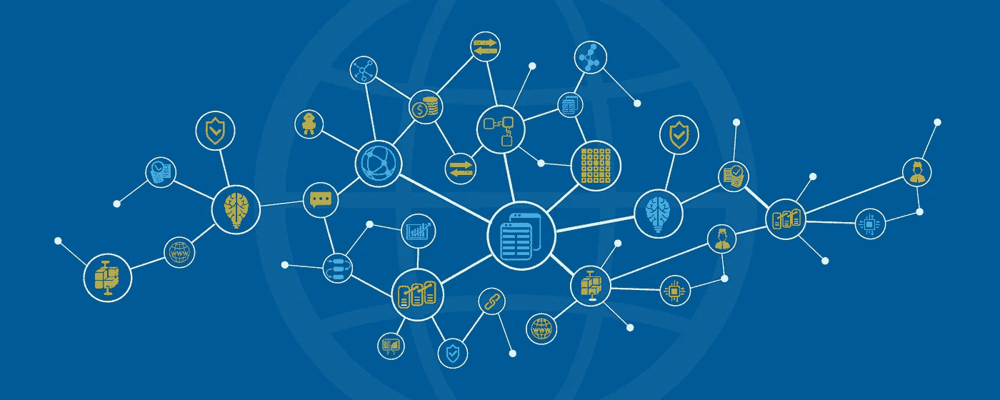

# Noobs 的加密货币阅读列表

> 原文：<https://medium.com/hackernoon/cryptocurrency-reading-list-for-noobs-226518cbbe14>

## 区块链和加密货币入门终极指南

嗨，智人，

这是我一直想写给那些希望开始接触[区块链](https://hackernoon.com/tagged/blockchain)、[比特币](https://hackernoon.com/tagged/bitcoin)和加密货币的人的东西。在过去，已经有数百人来找我，问他们如何才能入门加密货币和区块链。事实上，他们中的两个人后来自己开了公司，而且做得非常好。😀

回到主题，只是给你一个想法，所有这些链接都非常详尽，需要你的时间。准备好了吗？

## 开始了。

***从这里开始:-***

*   [**比特币** **白皮书**](https://bitcoin.org/bitcoin.pdf) *作者* **中本聪** **中本**
*   [**以太坊白皮书**](https://github.com/ethereum/wiki/wiki/White-Paper) *由* [**维塔利科**](https://medium.com/u/587a00dbce51?source=post_page-----226518cbbe14--------------------------------) *和团队*
*   [**像我这样解释比特币 5**](https://medium.freecodecamp.org/explain-bitcoin-like-im-five-73b4257ac833?source=linkShare-df6cc92ec6ec-1531040036)***by***[**Nik custo dio**](https://medium.com/u/2d6f142ff3cc?source=post_page-----226518cbbe14--------------------------------)****
*   ****[**WTF 是区块链？**](https://hackernoon.com/wtf-is-the-blockchain-1da89ba19348) 由 [**莫希特·马莫里亚**](https://medium.com/u/24f7fbc09357?source=post_page-----226518cbbe14--------------------------------)****
*   ****[**区块链术语指南**](https://blockgeeks.com/guides/blockchain-glossary-from-a-z/) *由* **区块极客******
*   ****[**比特币如何工作(非技术指南)**](https://youtu.be/t5JGQXCTe3c)****
*   ****[**智能合约**](https://perma.cc/V6AZ-7V8W) *作者* **尼克·萨博******
*   ****[**以太坊在 25 分钟内**](https://youtu.be/66SaEDzlmP4) *由* [**维塔利科** **布特林**](https://medium.com/u/587a00dbce51?source=post_page-----226518cbbe14--------------------------------)****
*   ****以太坊到底是如何运作的？ *由* [**普瑞蒂**](https://medium.com/u/d446dafbe292?source=post_page-----226518cbbe14--------------------------------)****

*******密码经济学和商业模式:-*******

*   ****[**区块链代币和去中心化商业模式的曙光**](https://blog.coinbase.com/app-coins-and-the-dawn-of-the-decentralized-business-model-8b8c951e734f) *由* [**弗雷德·厄尔萨姆**](https://medium.com/u/b947efe0a51a?source=post_page-----226518cbbe14--------------------------------)****
*   ****[**加密令牌:开放网络设计的突破**](/@cdixon/crypto-tokens-a-breakthrough-in-open-network-design-e600975be2ef) *作者* [***克里斯·狄克逊***](https://medium.com/u/a8e3741de9e2?source=post_page-----226518cbbe14--------------------------------)****
*   ****[**密码网络和令牌为什么是根本**](https://www.nickgrossman.is/2018/cryptonetworks-and-why-tokens-are-fundamental/) 作者 [**尼克·格罗斯曼**](https://medium.com/u/5a0bc0cfd9ff?source=post_page-----226518cbbe14--------------------------------)****

******理解分权:-******

*   ****[**“区块链不可信”是什么意思？**](/@preethikasireddy/eli5-what-do-we-mean-by-blockchains-are-trustless-aa420635d5f6)***by*[**Preethi Kasireddy**](https://medium.com/u/d446dafbe292?source=post_page-----226518cbbe14--------------------------------)******
*   ****[**为什么放权事关重大**](/@cdixon/why-decentralization-matters-5e3f79f7638e) *由* [**克里斯·狄克逊**](https://medium.com/u/a8e3741de9e2?source=post_page-----226518cbbe14--------------------------------)****
*   ****[**分权的含义**](/@VitalikButerin/the-meaning-of-decentralization-a0c92b76a274) *由* [**维塔利科**](https://medium.com/u/587a00dbce51?source=post_page-----226518cbbe14--------------------------------)****
*   ****[**这就是为什么分权是不可避免的…**](https://hackernoon.com/heres-why-decentralization-is-inevitable-6090a9abe813) 作者[莫希特·马莫里亚](https://medium.com/u/24f7fbc09357?source=post_page-----226518cbbe14--------------------------------)****

******新闻资源关注:-******

*   ****[**硬币电报**](https://cointelegraph.com/)****
*   ****[**CoinDesk**](https://www.coindesk.com/)****
*   ****[**密码币新闻**](http://www.cryptocoinsnews.com/)****
*   ****[**比特币杂志**](https://bitcoinmagazine.com/)****
*   ****[**黑客正午**](http://hackernoon.com)****

******保持更新的时事通讯:-******

*   ****[**令牌每日**](https://www.tokendaily.co/join-newsletter) *由* [soona amhaz](https://medium.com/u/3747a97a1606?source=post_page-----226518cbbe14--------------------------------)****
*   ****[**控制**](https://www.getrevue.co/profile/control) *通过*1 确认****
*   ****[**代币经济**](http://www.tokeneconomy.co) *由* [贝尔纳迪](https://medium.com/u/ce9b393bacac?source=post_page-----226518cbbe14--------------------------------)****
*   ****[**工作证明**](http://proofofwork.news) *作者*埃里克·梅尔策****
*   ****[**黑客午间信**](https://hackernoon.com/tagged/hackernoon-letter) 作者[大卫·斯莫克](https://medium.com/u/7f91547ce9c9?source=post_page-----226518cbbe14--------------------------------)****

****注意:如果你对什么是比特币和区块链毫无概念，这是一个非常基础的指南。一旦你完成了这里的所有内容，直接前往 Andressen Horowitz 博客的 [**Crypto Cannon，探索更多有趣的东西，如 Dapps、Lightning Network、比特币可扩展性、Trilemma 问题和许多其他很酷的东西。**](https://a16z.com/2018/02/10/crypto-readings-resources/)****

## ****我希望你在那里获得了一些价值。如果你看到了，别忘了通过分享文章和鼓掌来表达你的感激👏50👏时代周刊。****

## ******关于我:-******

****你好，我是安基特。我是一名专业人士，希望与产品、营销和内容领域的区块链初创公司合作。****

****如果你是一家区块链初创公司，正在上述领域寻求帮助，请给我发电子邮件至 kr987ankit@gmail.com。或者你可以在推特上给我发消息。😀****

******我的领英:**[https://www.linkedin.com/in/ankit-kumar-singh-170581bb](https://www.linkedin.com/in/ankit-kumar-singh-170581bb)****

****【我的推特:http://www.twitter.com/ankitkr0[T42](http://www.twitter.com/ankitkr0)****