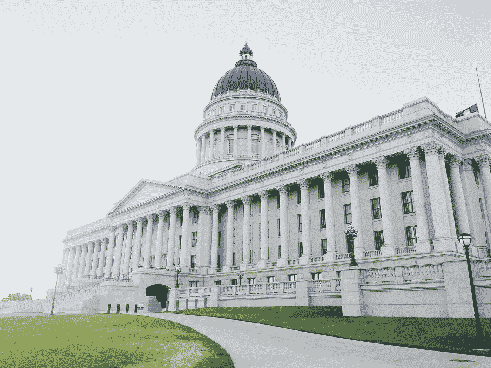

# 加密货币的监管未来

> 原文：<https://medium.com/hackernoon/cryptocurrency-s-regulatory-future-e99b5b80d09>

## 政府将讨论全球加密/ICO 法规——我们对结果的预测，以及这对您的项目意味着什么

**Lupercal Capital advises existing companies and start-ups on how to run ICOs and/or successfully apply blockchain technology to their business. We have particular expertise in designing effective tokenisation models and managing regulatory risk. To learn more, go to** [**Lupercalcapital.com**](http://Lupercalcapital.com) **or email** [**enquiries@lupercalcapital.com**](http://enquiries@lupercalcapital.com) **to discuss with our expert team.**

2018 年初，各国政府对加密货币的监管占据了中心位置，并成为今年该行业的一个决定性问题。随着监管机构争相应对 2017 年的非凡增长，他们对该技术的态度对加密货币市场以及拟议 ico 的可行性和风险状况产生了越来越大的影响。

在现阶段，ico 和密码技术的发展和未来方向似乎严重依赖于国际监管。当 2018 年 3 月晚些时候 G20 财政和央行代表开会时，我们应该对国际监管将采取何种形式(积极或消极)有更清晰的认识。

# 我们能期待什么？

有各种公告称，即将到来的 G20 会议将涉及对加密货币的影响以及如何监管加密货币的讨论(一些报道甚至暗示加密货币将成为焦点)。迄今为止，几乎没有正式迹象表明 G20 讨论的具体内容。

在这些会谈中，政府将开始正式讨论如何监管技术/行业，这将涉及什么，以及哪些法律领域是执法的“优先事项”。这些讨论的结果将有助于了解未来对这项技术的监管方法。然而，从高层会谈进展到实际可执行的监管通常是一个耗时的过程，因此实质性的监管变革可能还需要一段时间。

重要的是信息和讨论的结束。当政府在 2014-2016 年检查该行业时，方法主要是“让我们等着看会发生什么”。现在，政府开始接受设计加密货币特定监管的需要，因此这些讨论应该开始揭示主要经济体在长期内可能如何监管该行业。

以下问题的结果尤其令人感兴趣并具有重要意义:

*   政府将“单干”并关注国内法律的有效性，还是国际政府会合作(就像它们开始在监管税收和资金转移规则领域那样)？和
*   这种方法是否会引入繁重、广泛的监管(这可能会抑制行业的发展)，还是会更加平衡和周全？

# **我们对密码监管未来的预测**

我们预计，各国政府将逐渐(很可能不是在 G20 峰会后)开始认识到有必要采取更加协调的国际方法来监管加密货币/ico。考虑到加密货币在法律上被描述为“技术的治外法权性质，缺乏司法管辖关系”(换句话说，将技术转移到海外的容易性，以及它是无形的事实——它不存在于任何一个国家，这使得任何一个国家在不与其他政府合作的情况下更难有效监管它)，这并不令人惊讶。

长期的方法可能需要国际合作。这可能会对交易所、ICO 主机和其他加密货币“中介”实体提出更严格的监管要求。这是学术评论家(包括一些 Lupercal 的专家)在 2013/2014 年的学术/政策背景下发现的。

实际上，想想当前反洗钱/KYC 义务适用于交易所和 ICO 主机的方式，并假设这些要求可能会逐渐扩大，变得更加广泛，并包括金融、税务和其他法律领域的义务。此外，预计将有一个更加协调的全球方法来确保合规(例如，遵守税法、消费者法和金融法)与这一过程相结合。

从长远来看，这意味着什么？

简而言之，我们预计对 ICO 主机和加密货币交易所的监管将变得更加繁重。然而，我们也希望法律/监管要求的应用变得更加可预测、稳定和确定(因此，律师的建议基本上是“结果可能是多种多样的，但我们不能 100%确定是哪种方式”的情况将会减少)。

# **《理想的结局》**

我们希望，全球政府将借此机会，就该技术的未来监管环境提供急需的指导。需要更大的清晰度和确定性。

我们也希望(尽管是更乐观的希望)政府能够看到 ICO 融资模式“民主化”获得另类投资和启动资金的潜力。这里有一个政策权衡，一方面是保护小投资者(通常被称为“不老练的投资者”)免受政府认为他们不完全了解的投资，另一方面是允许更广泛的参与。

目前，监管倾向于保护而非参与(特别是在美国和其他司法管辖区的证券法规则中)。这是政府重新评估这些法律如何运作的机会。

这凸显了另一个问题——当前围绕 IPO 的规则很复杂，合规可能很麻烦。正是出于这个原因，希望进行公开代币销售的 ico 通常希望他们的代币避免成为证券(因此，可以说，这些规则可能不适用)。

这种复杂性的部分原因是，相关的证券规则主要集中于寻求在证券交易所上市的资金雄厚的大型实体。

ico 的迅速崛起，以及它们为无力进行 IPO 的初创企业筹集资金的能力，表明需要有一种“中途之家”，监管义务不那么复杂和重要，以便不排除较小的实体通过更广泛的自愿参与者筹集资金。

这是一个复杂而激烈的问题，但在我们看来，这是一个应该重新考虑平衡的领域，Lupercal 积极尝试为关于这些监管问题的政策辩论提供信息。

# **给加密投资者、ico 和行业的教训**

从短期来看，对该技术的监管通常被认为是“坏的”，市场会做出相应的反应。情况不一定如此。

监管方向将增加亟需的确定性，这可能(最终)有助于市场在一定程度上稳定下来，并鼓励观望但对当前风险水平感到担忧的投资者更广泛地参与。以日本为例。法规澄清了要求，增加了确定性，降低了风险。全球密码市场反应非常积极，日本交易所相对于外国交易所有溢价。

对 ico 来说，重要的是，他们面临的最重要的监管问题可能是，他们销售的每个国家都有不同的法律框架，因此可能需要单独的法律建议。这可能非常昂贵、耗时且效率低下。一种更加协调的国际方式可能有助于解决这一问题。

请关注这一空间——我们将在了解更多信息后提供分析，以帮助您的项目走在关键变化的前面。

***Lupercal Capital 及其加密货币专家团队为现有企业和初创企业提供 ico 和区块链方面的战略咨询，帮助他们释放加密技术的潜力。***

***如果你想收养一个 ICO 或区块链，我们很乐意收到你的来信——请前往***[***lupercalcapital.com***](http://lupercalcapital.com/)***，或发电子邮件至***[***enquiries@lupercalcapital.com***](mailto:enquiries@lupercalcapital.com)***。***

如果你对加密货币的监管发展感兴趣，请查看加密货币监管最全面的数据库**。**