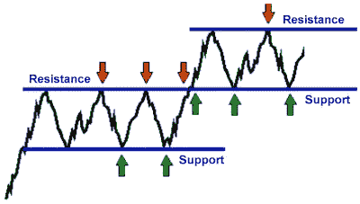
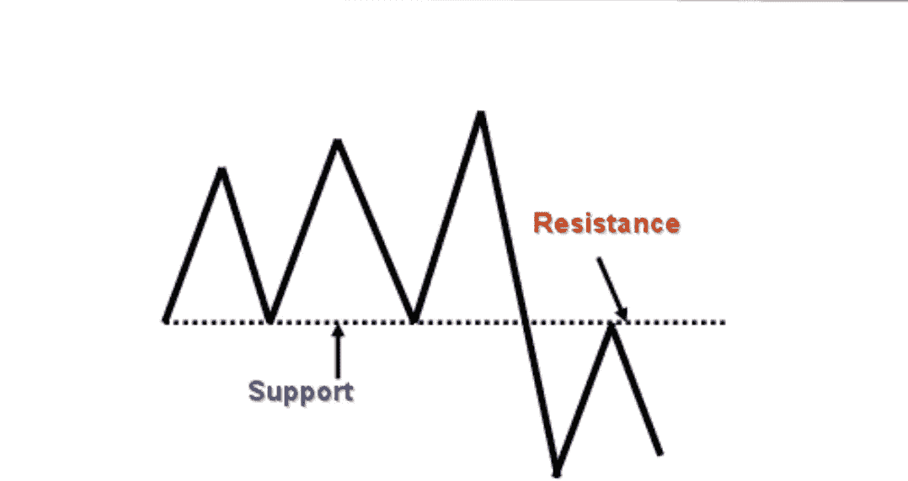
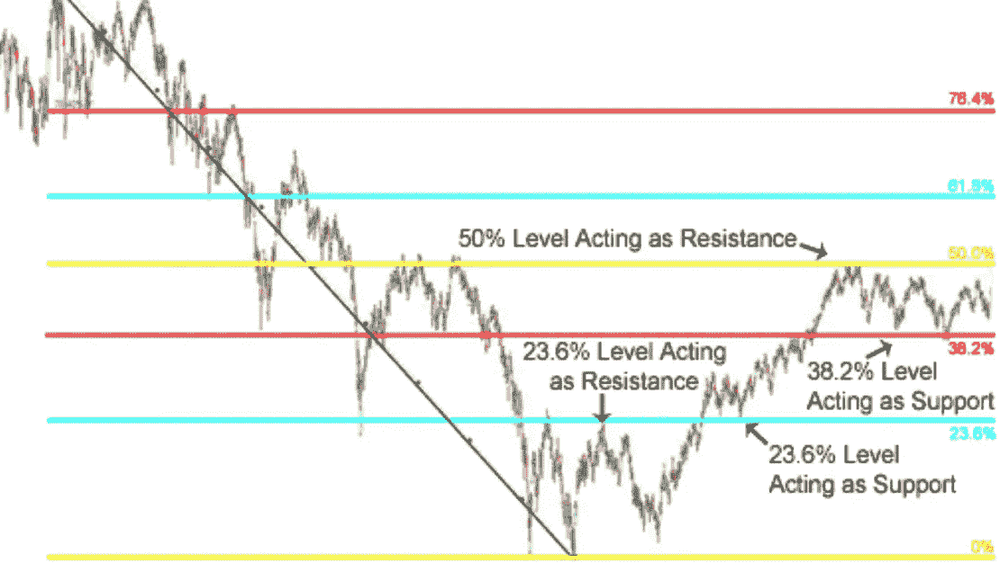

# 加密货币交易 101:支持、阻力和斐波那契数列

> 原文：<https://medium.com/hackernoon/cryptocurrency-trading-101-support-resistance-and-the-fibonacci-sequence-b26bca8f59b2>

## 用斐波纳契数列确定支撑和阻力。

## 每当加密货币经历熊市时，互联网就会变得异常安静。

Twitter 的加密影响者四处消失，交易团体正在解散，甚至 ETH 诈骗机器人也不像过去那样丰富了。虽然许多人被熊市击倒，因亏损而沮丧，但我把它们视为学习的机会。当市场没有像你希望的那样对待你时，寻求自我教育。在经历了巨大的资本损失后，你可以用来武装自己的最大武器是，你必须知道再也不会让这种事情发生了。至少降低了再次发生的几率。

每个人都经历过损失，如果你看着你的 altcoin 资产缩水到一无所有——只要知道这发生在我们最好的人身上。

我从来没有见过一个交易者在职业生涯中没有经历过几次大的亏损。这是游戏的一部分。

> 你踢球时不会认为你永远不会被擒抱。不要用密码交易，认为你永远不会亏损。

我利用这段时间来回忆一些技术分析的基础知识。我以前写过关于交易/投资最佳实践的文章。顺便看看我的个人简介，看看我整理的 [Investipedia](https://hackernoon.com/the-cryptocurrency-commandments-part-1-investment-best-practices-4ba185258511#ixzz5SiJWG82G) 将**支撑位**定义为一个价格水平，在该水平下，由于需求集中，下跌趋势有望暂停。当一项资产的价格下降时，会有越来越多的买家愿意随着价格的下降而购买该项资产。随着价格下跌，需求增加，这创造了“**支撑**”，因为购买订单是围绕较低的价格水平发出的。

相反，**阻力**是一个价格水平，由于卖单集中在该价格水平，上升趋势预计会暂停。

**支持**和**阻力**可以用许多不同的方法确定。你可以通过回溯测试来确定支撑位和阻力位——观察历史价格走势，看看价格在哪里下跌(触及阻力位)或者价格从哪里反弹(触及支撑位)。

当练习技术分析时，当趋势线碰到至少 3 个烛台时，可以画一条支撑线或阻力线(如果是阻力线，是烛台的顶部，如果是支撑线，是底部)。

支撑线和阻力线也往往沿着重要的价格点形成，例如，对于比特币，我们往往会在每 1000 美元的区间找到主要的支撑和阻力。

## **支持能变成抵抗吗？**

如果价格跌破支撑，支撑也会变成阻力。如果价格水平跌破支撑线，这意味着对该价格资产的需求不足以保持支撑完整，而下单购买的人现在处于亏损状态。

*When support becomes resistance.*

# 斐波那契回撤

斐波纳契回撤和图形是我最喜欢的加密交易工具之一。斐波纳契水平经常被用来确定支撑位和阻力位，所以这和我们上一课是一致的。我不会去探究斐波那契回撤背后的历史或数学，那本身就是一整篇文章，但是我会告诉你如何利用它们来使你的交易受益。

## 寻找支持级别

学习如何使用斐波那契水平来帮助你交易的第一步是学习如何识别一个*波动* *高点*和一个*波动低点*。

摇摆高点是上升趋势顶点的蜡烛线，它两边的蜡烛线必须有更低的低点和更低的高点，中间的蜡烛线才能被认为是摇摆高点。摇摆低点正好相反。

当你确定了图表上的高点和低点，你可以使用斐波纳契工具来连接这两个点。当你从低位波动到高位波动时，你就确定了支撑位。

两个摆动点之间的空间将显示基于斐波那契数列的支撑位。当这些数字与图表的高点和低点相关联时，往往会显示强支撑线和阻力线。

回撤线(或支撑线)是通过从高点到低点的垂直距离除以斐波纳契数列中的比率来确定的。

> 使用斐波纳契工具(可以在交易视图中找到)来绘制高点到前一个低点的波动图，将帮助你确定支撑位。

## 寻找阻力位

这个过程和你如何找到支撑位几乎是一样的，除了这次你要从最高点(摆高)到下一个最低点(摆低)作图。

Fibonacci Levels