# 加密货币交易圣经三:在横盘和熊市中取胜

> 原文：<https://medium.com/hackernoon/cryptocurrency-trading-bible-four-winning-in-sideways-and-bear-markets-f3f365ffca76>

所有的交易都是赌博。

有些人拒绝相信它，但这并不能改变它。

作为一个社会，我们已经设法用一种精致的优越感来装扮大型股票交易所。这不是一场碰运气的游戏或数字游戏。是“投资”

“像沃伦·巴菲特这样的‘真正’投资者看不起波动性更大的衍生品市场和加密货币，因为它们不够文明。他肯定是对的，纽约证券交易所与在 Poloniex 交易比特币或在拉斯维加斯玩扑克不一样？主要市场的流动性很高，有很多参与者、熔断机制和季度收益报告，所以肯定会有所不同，对吗？

投资媒体当然不希望你认为投资是赌博:

> “赌博……是一种[零和游戏](https://www.investopedia.com/terms/z/zero-sumgame.asp)。它只是从输家那里拿钱给赢家。没有价值被创造出来。通过投资，我们增加了一个经济体的总体财富。随着公司之间的竞争，他们会提高生产力，开发能让我们生活更美好的产品。不要把投资和创造财富与赌博的零和游戏混为一谈。”

真好。只不过这是错的。

市场是一个零和游戏。你赢了，别人就输了。当你输了，别人就赢了。这个市场在最大规模的零和游戏中与世界各地的人们相匹配，这个游戏是由我们称之为人类的高级猴子想象出来的。(*当然，不是每个人都同意。看我最后的笔记。*)

可以肯定地说，我们通过向企业投资，为整体经济健康发展做出了贡献，这种感觉很好，但这真的与任何事情都无关。当然，投资项目和公司比轮盘赌有更深的社会价值，但这并不能改变一个简单的事实:

当你把钱投入市场时，并不是因为你出于好心支持这家公司，也不是因为你希望看到整体经济繁荣。

你这么做是因为你希望你得到的钱比你投入的多。

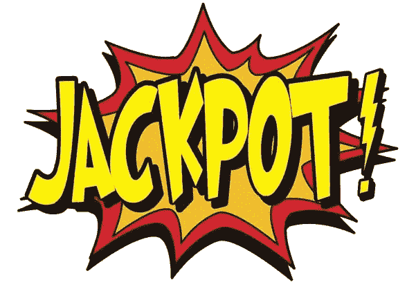

无论你是把全部赌注押在一手扑克上，还是押在下一只生物技术股上，你都是在玩一场碰运气的游戏。

你所做的是猜测你比任何人都更了解未来。你相信你投资的公司会继续创造好的产品，它会升值，把你的钱还给你。

但你并不真正了解。

不管你读了多少分析师的时事通讯或者你写了多少季度报告，都不能保证公司会继续做好。在你投资过的任何东西上，你读过多少次这样的小字？

"过去的表现并不代表未来的结果."

换句话说，过去做得好并不意味着它会一直做得好。十亿个变量会毁了那家公司，让你血本无归。无论是董事会成员之争、黑天鹅事件、市场变化、产品发布失败还是严重失误，任何事情都可能导致一家昨天赚钱的公司今天不再赚钱。

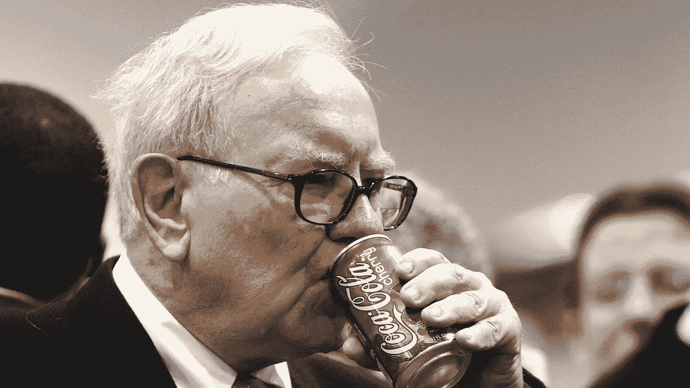

面对快速增长的健康/运动市场以及来自含糖、甜味的百事可乐的日益激烈的竞争，可口可乐的业务一落千丈，当沃伦·巴菲特选择可口可乐时，他在打赌他知道一些你不知道的事情。

他相信，无论卖出多少跑步机和耐克运动鞋，这个世界都不会失去对经典、标志性软饮料的品味。健身热潮过去后，对百事可乐的痴迷达到顶峰，他推测可口可乐业务将会复苏，他将会赚到比他投入更多的钱。

那是赌博。

我明白了。这个词有负面含义。赌博不好，投资好。

除了数学是完全一样的。

句号。

当你把钱投入任何市场，不管你喜不喜欢，你都是在和宇宙玩骰子。

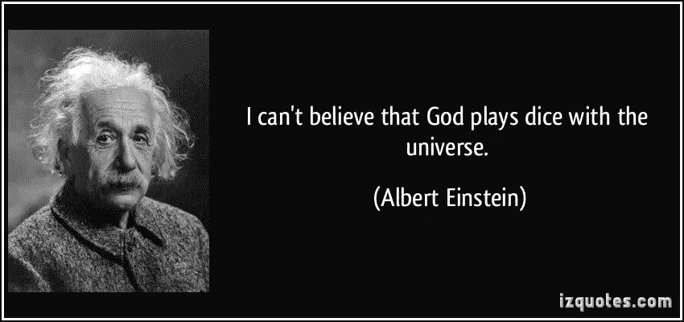

Said by Einstein when faced with the fact that at the base of all reality is nothing bur formless probability and not a deterministic clockwork God. He/She/It does play dice.

这是一个信仰问题。

大多数人不愿意相信交易和投资是碰运气的游戏(或者说生活是),但是一旦你克服了这种错觉，你就可以开始做出更好的决定。

放下与“赌博”这个词相关的负面影响，你可以开始看到你在做什么，这将使你在市场上比其他人更有优势。

当股市停止无情的攀升，转而南下数月或数年，你不会感到惊讶。当一家好公司的股票与其创造的价值不匹配时，你不会感到惊讶，而一家公司(T2)在其整个生命周期中从未盈利过(T3)却被严重高估了十年。

市场不是理性的。人们不是理性的，任何有这种想法的人一生都没有认真交易过。人们是情绪化的、非理性的、狂野的、疯狂的、愚蠢的、聪明的和愚蠢的，而市场只不过是开放市场中数十亿不稳定行为者的思想的反映，是我们恐惧和欲望的集体幻觉。

当你涉入市场的海洋，你就涉入了一场绝对混乱的风暴。

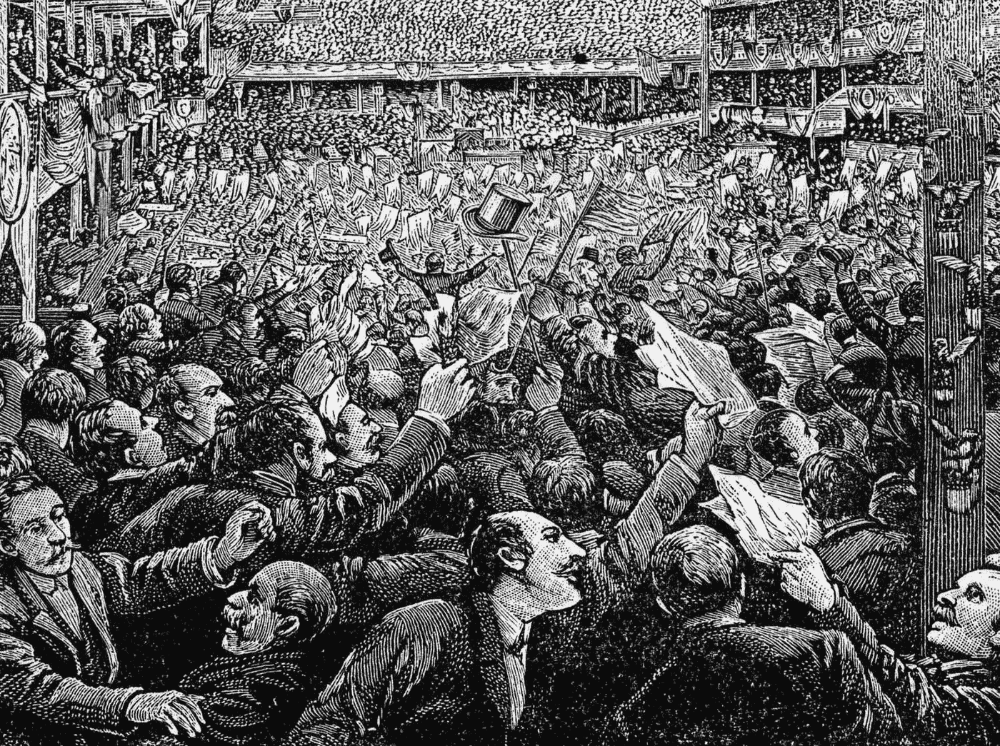

接受赌博、投资和交易是一体的这一现实，会帮助你记住在暴风雨中带上雨衣和雨伞。

你将开始研究概率游戏背后的数学，并着眼于概率、博弈论和统计学，而不是研究 CNN 和不停地看新闻。

引导你的第一步是更好的投资组合管理。

# **完善投资组合管理**

交易中最重要的一点是，你的策略没有你想的那么重要，你的风险管理比你想的重要得多。

你进入一只股票或硬币看起来肯定是获得荣耀和财富的关键，但我稍后会给你一个系统，告诉你这是多么错误，为什么你应该少关心进入，多关心退出，保护你现在拥有的。

无论你的信号有多好，或者你在选择五年后将改变世界的公司方面有多擅长，你都将是错误的。你会错得很离谱。这意味着你将不得不忍受一段时间的亏损，也就是所谓的“提款”

市场不会像薪水一样给你一个可预测的收入流，你的钱是一捆捆赚来的。它也成串地消失了。

这就是概率在起作用。

概率出现在 17 世纪，当时职业赌徒兼作家安托万·甘博(Antoine Gambaud)开始输钱，他向杰出的法国数学家布莱士·帕斯卡寻求答案。甘博喜欢称自己为[梅雷骑士](https://en.wikipedia.org/wiki/Antoine_Gombaud)，又名梅雷骑士，他过去常常打赌，在掷骰子的时候，他至少会抓到一张王牌。这让他持续赚大钱。

但他厌倦了，变得贪婪。

他认为如果成功的话，如果他下两倍的注，他可以赚更多。

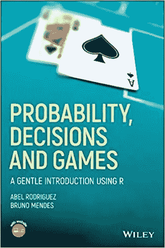

Abel Rodriguez 和 Bruno Mendezs 所著的《概率、决策和博弈:R 中的温和介绍》一书告诉我们，这种情况并不那么好:

> “突然，他在赔钱！
> 
> 德梅雷目瞪口呆。
> 
> 他推断两次掷出两张 a 的可能性是一次掷出一张 a 的 1/ 6。为了补偿这种较低的概率，两个骰子应该掷出六次。最后，为了达到四次掷骰中有一次得 a 的概率，掷骰的次数应该增加四倍。"

他们深入挖掘背后的数学原理，所以我不会在这里重复，但基本上可以归结为他加大了风险，并通过移动到两个骰子和增加掷骰数来降低获胜的几率。

就这样，一个好策略变成了一个坏策略，因为德·梅雷不明白他所玩的游戏背后的数学原理。

在《市场奇才**一书中，作者问传奇投资人保罗·都铎·琼斯:**

> **问:“你能给普通交易者的最重要的建议是什么？”**
> 
> **答:“不要把精力放在赚钱上；专注于保护你所拥有的。”**

**他说的是投资组合管理，也就是防范风险。投资组合管理实际上是应用于机会游戏的统计和概率科学。**

**想一想。**

**当有人告诉你分散你的资产，“不要把所有的鸡蛋放在一个篮子里”时，他们是在谈论如何应对这样一个事实，即你在市场上赌博时的一些猜测会对你不利。如果你冒的风险太大，你可能会血本无归。如果你把所有的投资组合都清空了，你就不能再玩这个游戏了，你会夹着尾巴回家。**

**[下面是你资产多样化背后的数学分析](http://pages.stern.nyu.edu/~jteall/arch6.pdf)来自 NYU 大学的一门课程“初级投资组合数学”**

**如果你不喜欢数学，不要担心。即使不亲自做所有的数学计算，你仍然可以很好地理解概率。暂时跳过那些有趣的小符号。**

**但是这里有一个公式给喜欢公式的人。它显示了投资组合中投资对风险的贡献:**

**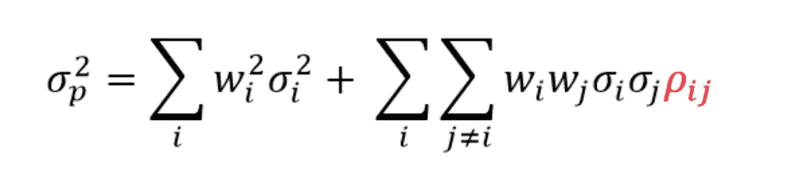**

**这个博客告诉你[，如果你愿意的话，你可以在这里读到这些有趣的小符号背后的辉煌数学。](http://swanglobalinvestments.com/the-mathematics-of-diversification/)**

**基本上，这个公式显示了单个资产的加权风险，以及它们的相关性，也就是说，类似的资产有可能烧毁你的整个房子。如果你有太多贵金属，它们很可能会同时下跌，这使得它们高度相关，而国债和贵金属在大多数时候可能是负相关的。**

**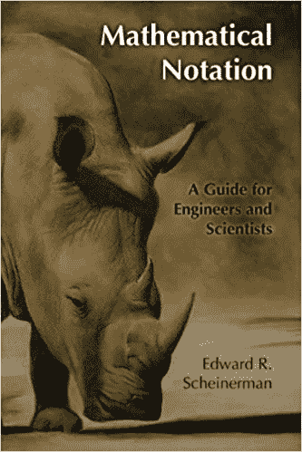**

**我不打算在这里讨论这个公式，因为它会占用大量的空间和时间，让我的大多数读者感到厌烦，但如果你想深入了解，可以查看博客或 NYU 文档的链接。如果你需要复习数学符号或者根本没学过，我推荐《数学符号:科学家和工程师指南[》这本书。](https://amzn.to/2LwyF5n)**

**不过现在，忘掉数学吧。**

**重要的是:**

**大多数交易书籍过于关注挑选资产的策略，而对真正重要的东西关注不够。**

**这些书给你一种错觉，你可以开发一个系统，持续超越绝大多数人，同时经受住黑天鹅事件和重大经济崩溃，但事实是，大多数系统在足够长的时间内表现不佳。均线、技术分析和基本面分析只能让你再一次玩骰子游戏。**

**这就是投资组合管理发挥作用的地方。**

**管理风险和分配资产的公式会变得非常复杂。有多少是相关的？多分散多少才算多分散？你应该一次拥有多少资产？**

****这里有一本** [**关于最优投资组合分配和杠杆**](https://amzn.to/2x7p0Px) **的整本书。****

**但是在去那里之前，让我们关注一个更简单的方法来降低你的风险:**

****更好的上浆。****

# ****下注****

**任何称职的交易者都会告诉你，你不应该在一次交易中承担超过 1%或 2%的风险。但是这到底意味着什么呢？**

**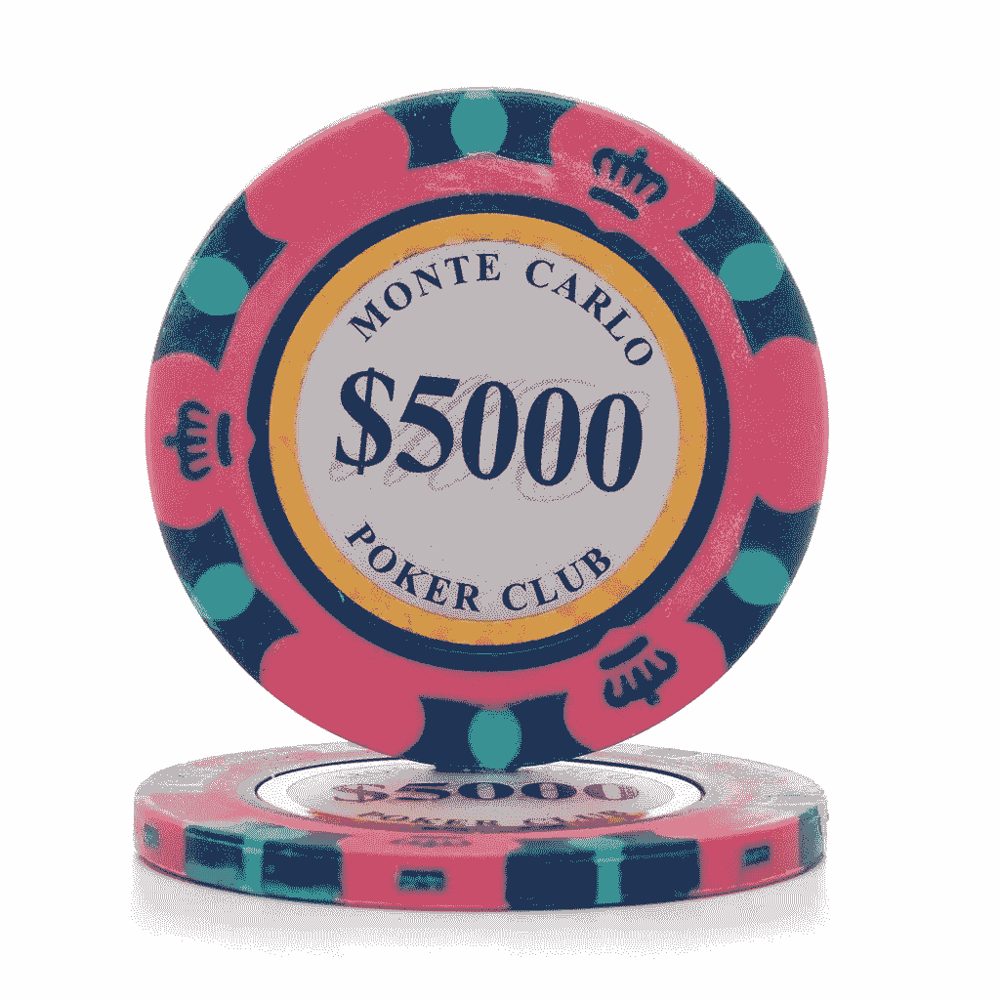**

**我们可以从多种不同的角度来看待这个问题。**

**最基本的方法是简单地把不超过 1%的总投资组合资金投入到一笔交易中。这是有效的，因为即使你在交易中彻底亏损，你也不会损失超过 1%。**

**它对长期收益也完全无效，我不相信任何交易者会使用这个公式，即使他们在 Twitter 上告诉你，这样你就不会输得精光，去责备他们。**

**原因如下。**

**如果你在交易中只能投入 1%的资金，那么 99%的资金都在场外。即使你进入了胜利的交易，也就是按照你的方式在交易中增加更多的钱，大多数系统建议单笔交易不要超过 4%。**

**这仍然是一大笔钱坐在场边无所事事。而这只是这种风险控制方法的第一个问题。**

**第二个问题是，你需要不断寻找新的资产，这样你就可以把所有的钱都投入市场，这意味着你必须找到很多赢家，而这实际上开始对你不利，因为你不会找到很多赢家，最有可能只有几个赢家。**

**如果你有几十种资产，它们将开始混在一起，形成难看的平均混乱，拖累你的赢家，即使你的输家被平均化了。他们中的一两个可能会损失惨重，另外两个可能会去月球，但他们中的大多数会位于分布曲线的中间，给你一个平均回报，这并不可怕。**

**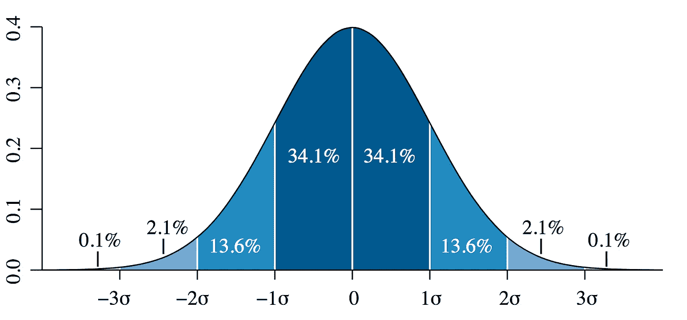**

**这意味着你降低了风险，但你也没赚到那么多钱。**

**低风险通常等同于低回报。**

**让我们看看计算 1%规则的另一种方法，它允许我们在任何给定的交易上押更大的赌注，但仍然保护我们的投资组合免受灾难性的损失。**

# **更好的 1%**

**我们要做的是下更大的赌注，通过建立止损系统让你的钱为你工作。我用了一个对海龟交易者的跟踪止损的变体，它是 T2 的 ATR 或者平均真实范围乘以乘数。所以我可能有 ATR X ^ 2。这告诉我在任何给定的交易中在哪里设置止损。**

**不过，追踪止损也有一些问题。ATR 是衡量波动性的指标，当一个硬币变得超级波动时，波动性就会变得疯狂。你可能会在当前价格和止损点之间有一个很大的差距。可能是 5%或 8%，这比 1%的损失要大得多，会让你面临更高的风险。**

**那么我们如何解决这个问题呢？**

**简单。**

**首先，我们计算当前价格和当前止损点之间的 delta。为了便于理解，我们将在示例中使用整数。**

**假设比特币价格为 8000 美元。你的止损计算将当前止损点定为 7700 美元，一个比特币的差价为 300 美元。**

**现在我们有了 delta，我们可以用它来计算如何在一次交易中只拿总交易量的 1%冒险。让我们假设你有 100，000 美元的现金去冒险。**

**10 万美元 X . 01 = 1000 美元。**

**在这笔交易中，我们最多只想冒 1000 美元的风险。所以我们用现价和我们止损的 delta 除以 1000。**

**1000 / 300 = 3.33**

**这意味着如果我们将止损设置为 7700 美元，我们可以购买最多 3.33 个比特币，因为如果交易对我们不利，我们只会在每个比特币上损失 300 美元。有了 3.33 个比特币，所有这些比特币的总损失将相当于 1000 美元或我们投资组合的 1%。**

**这样做的好处是，我们可以在每笔交易中投入更多的钱，同时还能控制自己的劣势。在这种情况下，我们将 100，000 美元中的 26，666 美元投入到这笔交易中，如果交易对我们有利，这使我们有可能实现更多的复合收益。**

**当然，每种投资组合管理策略都有不利的一面。一方面，我们增加了收益最大化的机会，但我们也增加了总风险。我们来看看为什么。**

**在前面概述的基本策略中，你只拿我们资金的 1%冒险，在 10 万美元的投资组合中，这意味着我们只在一笔比特币交易中投入 1000 美元。无论发生什么，我们都不能损失超过 1000 美元。**

**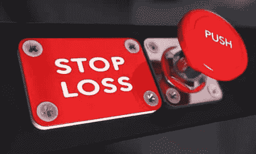**

**但在我刚刚概述的策略中，我们完全依赖于正确的止损触发。任何交易者都会告诉你，事情并不总是按照计划进行。**

**有很多方法会让你出错。让我们看看怎么做。**

**你可以设置一个[止损限价损失](https://www.capitaloneinvesting.com/main/help/topic.aspx?CategoryCode=CRTTORDTYP)，它允许你设置一个触发价格和你愿意卖出的价格。你也可以使用[市场止损](https://www.investopedia.com/ask/answers/04/022704.asp)，它在你设定的价格触发，并以现行汇率卖出。两者都有优点和缺点，都可能因为不同的原因杀死你。**

**特别是，加密货币交易中的市场止损会给你的交易生涯带来真正的打击。**

**与主要交易所相比，cypto 交易所仍然相对不成熟，它们没有内置那么多保护措施。在过去几年中，我们已经目睹了许多“闪电崩盘”。这意味着价格可能会在 5 秒钟内从 8000 美元涨到 3000 美元，然后反弹回来，无论这是因为市场上有一只巨大的鲸鱼倾销，还是交易所代码中的一个错误或其他原因。市场止损在任何当前价格下执行，所以你可以在 3000 美元时止损，这是比 1%大得多的损失。**

**止损点更容易控制，但是正确的止损点也是一门黑暗的艺术。在止损限价中，您可以在不同的级别设置“触发”价格和“止损”价格。你可以选择 7，725 美元的触发价格和 7，700 美元的止损限价。这意味着当市场触及 7，725 美元时，你将输入 7，700 美元的自动卖单，这可能会更快地得到满足，因为它低于当前价格，这给了你优势。**

**但这不能保证。**

**把你的限价设置错了，你可能一觉醒来发现你的止损价格暴跌，醒来时你的风险损失了 15%。根据我概述的策略，这可能相当于你投资组合的 5-8%(或者更糟)，不需要 8%的损失就能让你永远出局。**

**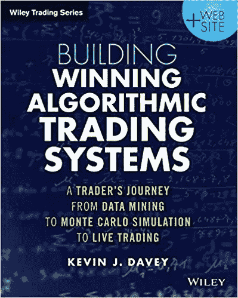**

**任何严肃的投资组合策略都必须考虑到止损有时无法触发的可能性，你可以使用[蒙特卡洛分析](https://www.youtube.com/watch?v=OgO1gpXSUzU)来告诉你这有多大可能彻底摧毁你的投资组合。我们不会在这里讨论数学，但是你可以通过阅读像凯文·j·戴维写的 [**构建成功的算法交易系统:一个交易者从数据挖掘到蒙特卡洛模拟再到实时交易的旅程**](https://amzn.to/2IFp6n3) 这样的书来解决这个问题。**

**有大量不同的投资组合和风险管理策略。现在开始研究它们，这只会让你的交易更强。**

**选一个。坚持下去。不要偏离。永远不会。**

**现在让我们看看概率帮助你在横盘或震荡市场中获胜的另一种方式。**

# ****剥头皮****

**刷单是当市场在你身上反弹时，在市场上小赢的过程。有成千上万种先进的方法可以做到这一点，但我想告诉你一个简单的方法，它会让你大吃一惊。**

**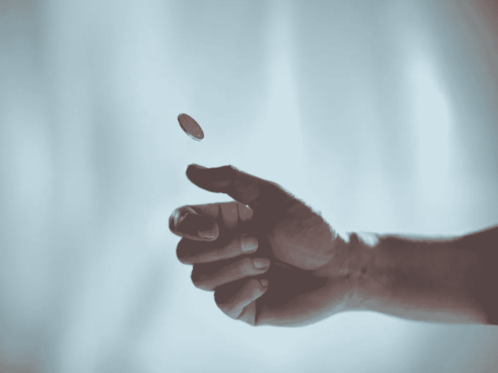**

**抛硬币。**

**没错。我们将猜测我们进入任何硬币。我们的多头或空头将完全随机。**

**也许你认为你的硬币选择策略远远优于随机机会，但随机策略在股票策略比赛中往往表现得非常好。**

**我们通常会发现有人把这个策略当成一个玩笑，但如果它根本不是一个玩笑呢？**

**在[为福布斯](https://www.forbes.com/sites/rickferri/2012/12/20/any-monkey-can-beat-the-market/#55344bde630a)撰写的一篇文章中，里克·费里讲述了一个模拟猴子扔飞镖选股的研究团队:**

> **“1973 年，普林斯顿大学教授伯顿·马尔基尔在他的畅销书《华尔街漫步》中声称，“**一只被蒙上眼睛的猴子向报纸的金融版面投掷飞镖，可以选择一个与专家精心挑选的投资组合一样好的投资组合。”****
> 
> **“马尔基尔错了，”Research Affiliates 首席执行官罗布阿诺特(Rob Arnott)本月早些时候在 IMN 全球指数和 ETFs 会议上发言时表示。“猴子比专家和股市做得都好。”**

**所以，让我们非常认真地尝试一下我们自己的抛硬币策略，作为在糟糕的横盘行情中破皮的一种方式，看看为什么它真的有效。**

**交易有两种方式，对你有利或对你不利。真的是五五开。**

**这意味着，如果你忽略其他一切，新闻，指数移动平均线，各种指标，占卜板，流体动力学，海洋潮汐周期，简单地抛硬币，你应该平均有 50%的时间是正确的。**

**当然，如果你只有 50%的机会做对，你就会输，不是吗？你的赢应该等于你的输，但实际上并不是这样。**

**在任何给定的交易期间，我们都有一些交易做错了或者做对了。再想想那条分布曲线。大多数交易会给我们一个平均的回报或损失，大约 68.2%的交易。但其中一些会给我们带来巨大的收益或巨大的损失。在我们的交易过程中，我们可能运气好，只获得一连串的大赢，或者我们可能运气很差，遭受一连串可怕的亏损，把我们都赔光了。**

**让我们回到《概率、决策和博弈:R 中的温和介绍》这本书，查看一下一枚硬币翻转 5000 次的图形。随着时间的推移，硬币的翻转应该平均达到 50%，但在较短的时间线内，它可能会变得非常不正常。注意它是如何长时间波动在平均值之外的。**

**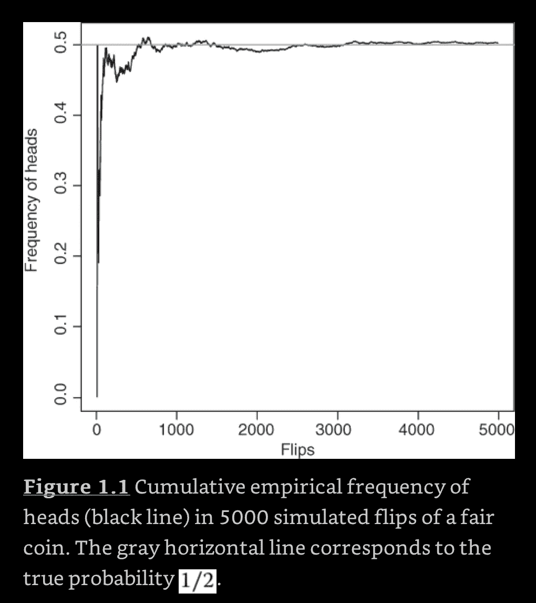**

**这意味着我们在短期甚至长期都会有波动。在我们回到平均水平之前，这些条纹可能会让我们全军覆没。**

**但是，如果我们能够在从有利的一面获益的同时控制不利的一面呢？**

**我们可以再做一次止损。让我们回到我们的策略，将止损设置为最大 1%。**

**现在，当我们掷硬币时，我们每次的损失上限是 1%。如果交易对我们不利，如果我们不放弃止损，我们应该只损失 1%左右，上下浮动。**

**但是我们的优势没有上限。**

**这就是有趣的地方。**

**我们的抛硬币策略也可以通过多种方式增强。**

**我们可以对各种硬币进行分析，找出*波动最大的硬币，并计算出它们在任何一天的平均波动幅度。我们可以让波动性为我们服务。比方说，我们发现比特币每天平均上下波动 4%。这将让我们设计我们的退出策略。***

**我们可能会决定在每天的同一时间结束交易，或者在利润达到 4%时立即结束交易，或者我们可能会让它运行，并每天增加止损，以确保我们保持盈利。**

**我们可以使用简单的试探法，比如计算出上周价格是上涨还是下跌，平均多少天，然后每次都赌下周的多头或空头，根本不用抛硬币。**

**不仅如此，我们还可以利用良好的风险管理来更有效地保护我们的资金。让我们看看怎么做。**

****

**当人们听说抛硬币会给他们 50%的正面和反面时，他们认为这种情况会一直发生，但事实并非如此。在任何一天、一周、一月或一年，我都可能连续得到五个或十个头像。我们也可能看到 10 笔交易对我们不利，2 笔交易很好，然后 10 笔交易再次对我们不利。**

**假设我们在两笔顺利的交易中赚了 10%,在每笔不利的交易中亏损了 1%。当我们从盈利中减去 10%的总损失时，我们在这些交易中损失了 20%。用不了多久，你就会因为这种结果而出局，尤其是如果你运气不好，而你的赢家只回报了 3%而不是 10%。**

**但是我们可以通过降低不利于我们的每笔交易的风险来避免这种情况。**

**比如说，如果我们运气不好，连续三次交易都对我们不利。为了减轻这种情况，我们建立了一个新的规则，每次交易的止损不到 1%，比如 0.0075%，减少我们的止损，直到交易开始对我们有利，然后我们反弹到 1%。当游戏对我们有利时，我们也可以反其道而行之，增加每笔交易的风险。**

**所有这些策略都会把你变成一个专业的市场赌徒，无论你是使用随机的抛硬币入场，还是使用一些花哨的波动率计算器，再加上你自己开发的高级量化算法，该算法考虑了太阳黑子和 Twitter 情绪。**

**但是不管你用什么策略，概率都会让你更擅长。**

# ****维加斯宝贝****

**每个人都喜欢想象，当他们把钱投入市场时，比当地赌博上瘾者在拉斯维加斯玩老虎机要高尚得多。从某种意义上说，那是真的。**

**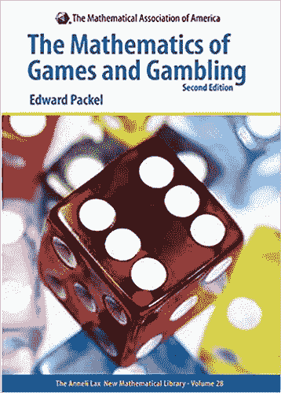**

**赌瘾摧毁生命，我不会轻视这种疾病。但这并没有改变数学告诉我们的骰子游戏和市场行为非常相似。只有你自己知道你是否有自制力去玩市场或者定期去赌城。**

**每个人都不一样。**

**就我个人而言，我讨厌一腔热血就输钱。我在拉斯维加斯输的钱从来没有超过 20 美元，因为我不能在轮盘赌或掷骰子上冒险，但我把钱投入市场没有问题。**

**这是有区别的，但只是表面上的区别。它下面的概率是完全一样的。**

**对我来说，学习概率和游戏并不是为了成为一个堕落的赌徒，而是为了增加对我有利的赔率。理解现实的本来面目有助于你的追求。相信它是别的东西会伤害你的决策。**

**如果你仔细阅读像爱德华·帕克尔的《游戏和赌博的数学》 [**和**](https://amzn.to/2Lnplki) 这样的书，当你仔细观察它们的数字基础时，你会发现有些游戏比其他游戏差得多。插槽是给笨蛋用的。老虎机完全是故意针对你的。**

**另一方面，21 点在你和房子之间平均分配。**

**还有扑克？**

**这本身就是一个完整的类别，因为虽然它有完全随机的方面，但它也有一个人的变量，因为即使牌对你不利，你也可以虚张声势。这使它脱离了完全随机的领域，给了你相对于其他游戏的优势。**

**市场游戏也是如此。**

**随着时间的推移，市场历来倾向于上涨。我们的希望、梦想和欲望也有非常人性化的一面，反映在我们称之为交换的金钱和时间的集体幻觉中。所有这些都让你比单纯的掷骰子更有优势。**

**但不多。**

**它仍然是一个游戏。**

**交易中有赢家和输家，盲目的机会，运气，技巧等等。**

**抛弃你的幻想，交易就变成了一场可以赢的机会游戏。继续假装你比概率更好，你会在掷骰子的短端结束。**

**你越快接受现实，你就能越快在华尔街立足。**

**###########################################**

**更新:2018 年 5 月 30 日下午 1 点 34 分:并非所有人都同意我的观点，即市场是零和游戏。他们称之为[正和游戏](https://www.pragcap.com/is-the-stock-market-a-zero-sum-game/),因为人们/公司可以增加总资金池，增长经济，当他们购买新股票时，没有人会在交易中损失(至少在有人后来出售/交易它们之前不会，这是一个延迟或不对称的零和游戏，本质上增加了“董事会”作为参与者。)**

**三件事:**

1.  **这并没有改变我的其他观点。**
2.  **IMHO，这真的是在玩语义游戏，把它称为正零和或常数零和，即使这个池正在增长。最终，在给定的一天，游戏的总和为零，即使行动被延迟，也称为不对称。**
3.  **不要轻信我说的任何话。你自己想想。我不是什么都知道。**

**###########################################**

****免责声明:做个大男孩或大女孩，自己决定把辛苦赚来的钱花在哪里。我不是财务顾问，这也不是财务建议，如果我真的需要告诉你这些，那么无论如何最好把你的钱藏在床垫下，因为当你失去它时，你只会因为你的错误而责怪别人，而不是你自己。****

**###########################################**

## **我有一个新的播客，[每日邮报](http://dailyposthuman.com/)，涵盖加密，人工智能，科技，未来，历史，社会等等！查看我最著名的文章和观点的扩展报道。上 RSS 频道，不要错过任何一集，请在接下来的几个月里关注一些非常特别的嘉宾！**

**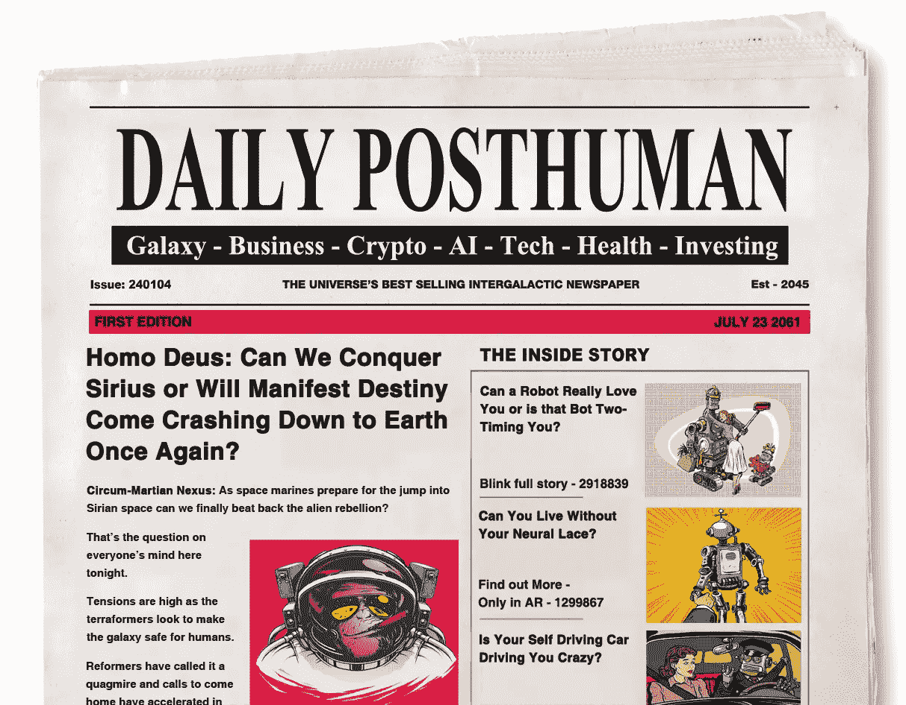**

**###########################################**

## **如果你喜欢我的作品，请[访问我的 Patreon 页面](https://www.patreon.com/danjeffries)，因为那是我与所有粉丝分享特别见解的地方。**

## **顶级赞助人可以独享这么多东西:**

*   ****每篇文章、播客和私人谈话的早期链接。你比任何人都先读和听！****
*   ****一个月月虚拟的和我见面问&一个。问我任何问题，我都会回答。我也分享我正在做的一切，并给你一个幕后看我的过程。****

## **访问传说中的硬币表 Discord，您会发现:**

*   ****市场来电**来自我和其他专业技术分析大师。**
*   ****投币者**只能**私聊**。**
*   ****私人海龟滩频道，程序员们在这里分享各种版本的** [**密码海龟操盘策略**](https://hackernoon.com/my-super-secret-crypto-turtle-strategy-revealed-ae7492fb01a6) **等信号和交易软件**。**
*   ****幕后**看看我和其他专业人士是如何解读市场的。**

**############################################**

**你也可以在 [**DecStack 停下来，这是加密货币和分散式应用项目**](http://decstack.com/) 的虚拟合作点，在这里你可以接触多个项目。永远完全免费。只是进来和社交，一起工作，分享代码和想法。通过反馈让你的想法更好。寻找新朋友。见见你的新家人。**

**############################################**

**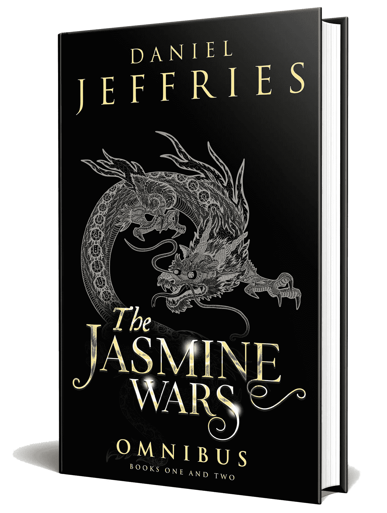**

**[Photo credit](https://extranewsfeed.com/the-winds-of-world-war-iii-8bc369584f67)**

**关于我:我是一名作家、工程师和连续创业者。在过去的二十年中，我涉及了从 Linux 到虚拟化和容器的广泛技术。**

***你可以看看我的最新小说，* [***一部史诗般的中国科幻内战传奇***](http://amzn.to/2gAg249) *在这部小说中，中国挣脱了共产主义的枷锁，成为世界上第一个直接民主国家，运行着一个高度先进、人工智能的去中心化应用平台，没有领导人。***

## **当你加入我的读者群，你可以免费得到一本我的第一部小说《蝎子游戏》。读者称之为“神经癌的第一次严重竞争”和“黑色侦探会见约翰尼记忆术。”**

**############################################**

## **最后，你可以[加入我的私人脸书小组，Nanopunk Posthuman 刺客](https://www.facebook.com/groups/1736763229929363/)，在这里我们讨论所有的科技、科幻、幻想等等。**

**############################################**