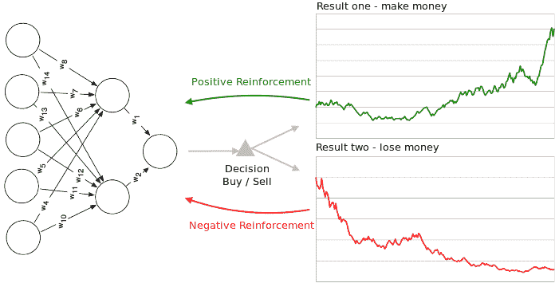
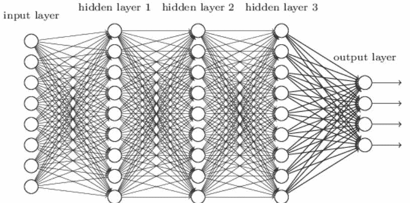
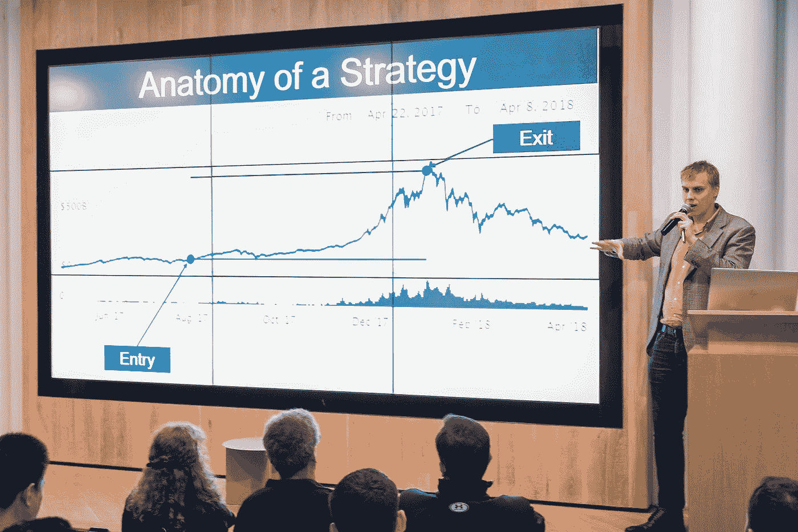

# 加密货币交易工具和信号:人工智能是下一个前沿

> 原文：<https://medium.com/hackernoon/cryptocurrency-trading-tools-and-signals-ai-is-the-next-frontier-4e66ee30b207>

每个人都在谈论加密货币市场的波动性，这既是加密交易的利弊，也使其潜在的高利润和难以置信的难以管理。

有大量的新工具，旨在反映股票交易信号的工具，依赖定量分析师洞察力的交易工具，用于计算、管理交易和投资组合的工具。随着技术增长的加速，甚至有新的人工智能交易工具正在开发中，例如今年夏天晚些时候推出的 [RoninAi](http://www.roninai.com) ，不要与算法交易或机器人混淆。

**是什么让人工智能对加密交易如此重要？**

人工智能机器学习技术的独特之处在于它的工作方式。我可以告诉它我想让它做什么，像顶级分析师一样分析和预测密码市场(输出)，给它所有的数据(输入)，它会学习如何做到这一点，以无与伦比的速度处理数据，修改自己的算法，以更好地提供所需的结果。这就是它成为一个神奇的黑匣子的地方，它提供了比其他任何工具都大得多的价值。

*^以上是人工智能神经网络如何基于数据配置众多策略以获得最佳信号或输出的简化视图。*

> “我们已经在我们生活的每个方面看到了专门的人工智能，从医疗和交通到电力分配，它有望创造一个更具生产力和效率的经济。”
> ——美国前总统巴拉克·奥巴马

将这项技术与加密交易中最小化风险和最大化回报的最佳策略相结合，重新平衡投资组合，你就拥有了一个不可思议的工具。

# **基于人工智能的加密交易工具**

这一类别中有许多即将推出的工具，其中许多是以 ico 开始的，但大多数都没有实际的发布时间。创造一个真正的人工智能工具[说起来容易做起来难，但事实上它很快就会到来，事实上是在 2018 年夏末。](https://roninai.com/new-ai-crypto-tool/)

基于人工智能的加密对冲基金 AxionV 开始开发工具 RoninAi，并宣布将于今年夏天推出。他们已经为机构投资者开发了一个交易人工智能，他们能够快速行动，创建一个全新的人工智能加密交易工具供零售使用，定期发布开发更新，不需要投资期，并有一个经验丰富的专业人员团队。这使得 RoninAi 成为首批可用的人工智能加密交易工具之一。

> 这就是像 RoninAi 这样的产品的用武之地，它是一个完整而全面的工具，可以利用人工智能给加密货币交易带来的众多优势。
> –[*BTC 主帅*](https://btcmanager.com/how-ai-can-help-traders-maximize-alpha-and-profits/)

对于那些还不知道重新平衡加密货币投资组合的重要性的人，这里有一个简单的分类。

**如果你持有加密货币，为什么你应该重新平衡你的投资组合**

随着秘密投资者“囤积”投资的趋势，再平衡提供了一个机会，通过利用价格的快速波动，有可能提高这些持有的收益。当一枚硬币经历强劲收益时，再平衡会将这些收益分配给其他资产。这意味着，即使硬币的价值回到上涨前的原始价格，再平衡也能让投资组合在此期间获得正收益。

通过重新平衡，你的投资能够利用市场的快速变化来复利，这意味着你现在实现了再投资于其他硬币的收益。

再平衡领先 HODL 64%的中间值。税后，这代表了所有可能的加密货币投资组合的 92%。

再平衡是遵守简单的“低买高卖”规则的一个极其简单的方法。让我们假设你持有的总价值停滞不前。当一枚硬币在再平衡期间升值时，它会被卖出(高价卖出)，交易给那个时期的输家(低价买入)。如果硬币继续循环，再平衡将继续利用这些波动来增加你持有的价值。

这是实现最小化风险、最大化收益目标的最佳方式。因此，想象一下，你有一个工具，它能根据所有可用的数据，自动向你展示重新平衡投资组合的最佳方式，以利用这些机会，永远不会停下来吃饭或睡觉，并以闪电般的速度处理信息。

> “人类的思维没有理由也不可能跟得上人工智能机器。”
> –全球新兴技术领导者格雷·斯科特

像往常一样，当购买和交易密码，它是一个不稳定的市场。这篇文章并不构成投资建议，仅仅是为了让读者了解最新的可用技术。