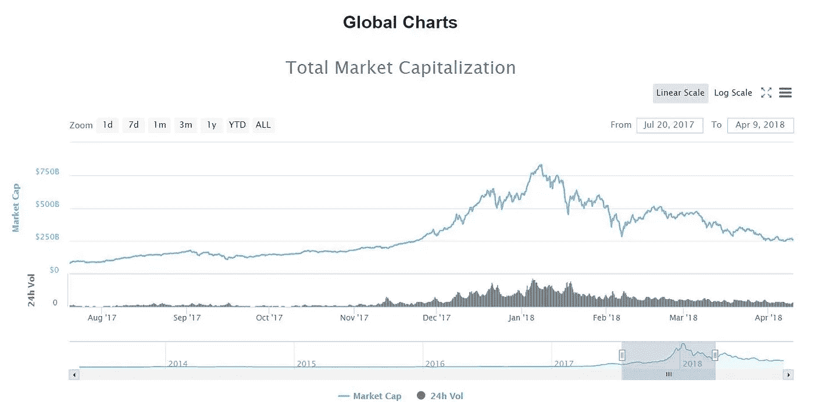
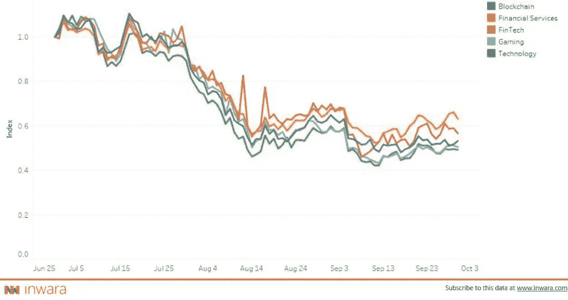
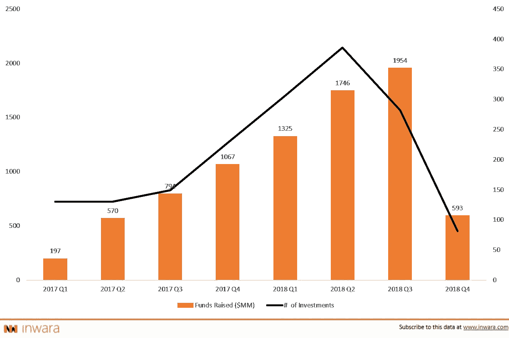
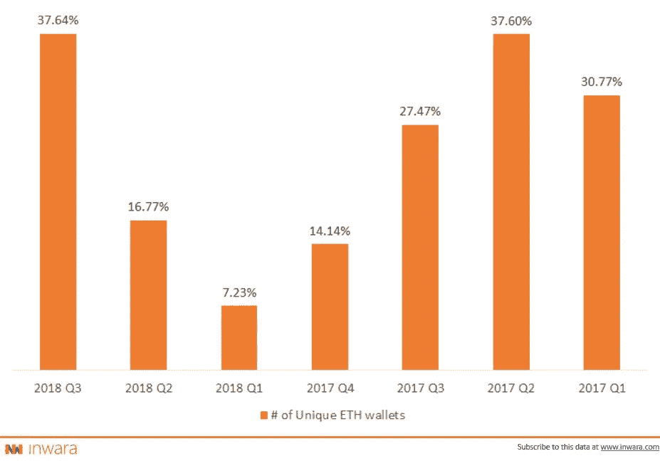
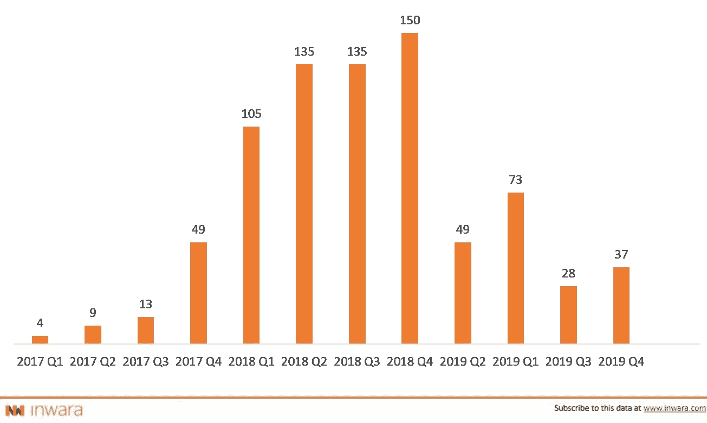

# 加密货币可行性分析 2018 年第 4 季度

> 原文：<https://medium.com/hackernoon/cryptocurrency-viability-analysis-2018-q4-eef5b5a66d20>

## 加密货币是未来，区块链将继续存在！

[*Disclaimer:*](https://www.inwara.com/disclaimer)[*Data sourced from InWara.*](http://www.inwara.com/?utm_source=viablehacker&utm_medium=viablehacker&utm_campaign=viablehacker) *This is not financial advice.*

加密货币市场继续暴跌，主要货币在短短一个月内(从 2018 年 11 月的第二周到 2018 年 12 月的第二周)失去了超过 40%的市值。比特币在市场上的主导地位不断升级，而看跌势头仍在潜伏。尽管贸易放缓，但蒂姆·德雷珀、彼得·林奇、比尔·盖茨、杰克·多西、帕特里克·伯恩等远见卓识者仍然相信加密货币将重塑未来经济。

# 2018 年有一个很好的开始，但结束时却很缓慢

在 2018 年的第一周，加密市场达到历史最高水平，24 小时内交易的加密货币超过 600 亿美元，总市值超过 8300 亿美元。在接下来的一个月里，整个市场见证了自由落体式的下跌——市值下跌了近三分之二，仅为 2770 亿美元。

Source: Coinmarketcap

对于怀疑者来说，这一调整是一个关键的机会，可以让他们齐心协力，质疑加密货币资产的价值。这种努力在部分新闻网站上随处可见。

> 由于市场对新闻和许多其他因素非常敏感，因此在加密空间中，每一个动作都有不稳定的反应。

占所有加密货币 75%的所有 ico 的指数化 ROI 图表明，在 2018 年 5 月至 6 月期间，300+ico 以正 delta 结束了 Q2。

[Indexed RoI graph of all ICOs combined (Source: InWara’s Database)](http://www.inwara.com/?utm_source=viablehacker&utm_medium=viablehacker&utm_campaign=viablehacker)

尽管 ICO 市场似乎一直处于下降趋势，但如果一个人买入了正确的 ICO，他就可以获得 5X 10 倍的利润。公平地说，随着风投投资数量的大幅增加，Cryptos 在 2018 年实现了增长。然而，贸易量和众筹出现了反弹。

# 这种熊市趋势背后的可能原因

如果认为加密市场在某种程度上不受市场机制的操纵或控制，那就太天真了，就像 super crypto 题为“[比特币操纵卡特尔](/@super.crypto1/4th-dimension-bitcoin-manipulation-cartel-can-it-be-burnt-no-way-c53de65c166a)”的文章中提到的那样。

*在 2017 年 1 月至 2017 年 12 月比特币价格上涨 1000 万至 20000 万，并在 2017 年 12 月和 2018 年 12 月暴跌 95%之后，市场趋势显然遵循循环模式，不可避免地会出现大规模繁荣和大规模爆发。*

*然而，有趣的是，机构级投资者和风险资本家在市场仍然活跃的时候买入加密股票。*

2018 年，私人融资大幅增长，融资总额比 2017 年翻了一番。

[Private Funding & Round Size By Quarter (Source: InWara’s database)](http://www.inwara.com/?utm_source=viablehacker&utm_medium=viablehacker&utm_campaign=viablehacker)

风险资本在预售和非公开销售阶段的活跃增长表明，加密市场已经超越了 FOMO 和 FUD 阶段，加密市场的暴跌可以用卡特尔理论进行合理解释。

# 加密货币和区块链的未来

区块链将拯救加密货币，因为潜在的可扩展性、照明网络、智能合同和分布式账本提供的解决方案可能会重塑未来经济。

区块链技术的潜在价值及其交易网络的去中心化具有解决集中网络中存在的广泛问题的潜力。

数字货币当前问题是，大多数人认为数字货币是一种新的货币形式，是在与现有的法定货币作战。理解这一点至关重要，这不是要取代法定货币，而是要改变资金转移的方式，重塑资产管理的方式。

## ICOs 背后的公司合法吗？

与 2018 年 Q2 相比，2018 年第三季度，产品驱动型 ico 的数量有了显著增长。由此可见 ICOs 背后的公司对其项目的认真程度。

[% of ICOs with a working prototype (Source: InWara’s database)](http://www.inwara.com/?utm_source=viablehacker&utm_medium=viablehacker&utm_campaign=viablehacker)

# 产品路线图:预计在 2018 年第 4 季度推出最多产品

[Source: InWara’s Finance sector report](http://www.inwara.com/?utm_source=viablehacker&utm_medium=viablehacker&utm_campaign=viablehacker)

> 产品路线图的方法:InWara 已经绘制了路线图事件的日期，这些事件组合了关键字“启动”、“mainnet”、“testnet”和“发布”

500 多家公司已经规划了 2018 年的路线图活动。随着投资者越来越警惕，公司已经意识到在报告其 ICO 元素时透明度的重要性。然而，目前的趋势表明，路线图的延迟使 2019 年 Q1 成为一个令人兴奋的前景。

考虑到所有这些因素，以及 SEC 原定于 2018 年 12 月举行的 ETF 批准听证会(现已推迟至 2019 年 2 月)，人们可能会说，加密市场的长期冬天可能会结束。

