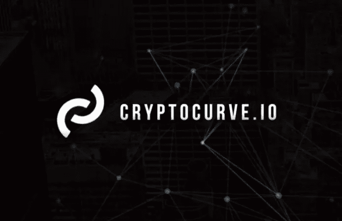
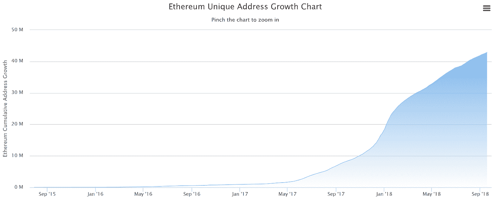

# crypto curve——大规模采用的解决方案？

> 原文：<https://medium.com/hackernoon/cryptocurve-a-solution-to-mass-adoption-c06e5b23c330>

## 为什么 CryptoCurve 会引领区块链技术的大规模应用？请继续阅读，寻找答案！

2018 年初，许多人陷入了不断增长的加密货币市场的喧嚣。2008 年[比特币从最初的不起眼涨到了将近 20，000 美元；上涨速度之快、幅度之大超出了任何人的预期。](https://hackernoon.com/tagged/bitcoin)

快速上升导致了它的最终衰落，一些人认为这是一个“泡沫”，我不会这么快就草率行事。比特币和许多阻碍其[增长](https://hackernoon.com/tagged/growth)的加密货币的一个根本问题是糟糕或不存在的“用户体验”。

对于非技术用户来说，理解和掌握如何购买、出售和持有加密资产实在是太难了。本文概述了一个平台，它将为老手和新手带来一场用户体验的革命。

这个平台就是 [**CryptoCurve**](https://cryptocurve.io/) ，一个集所有加密货币需求于一身的加密货币钱包。CryptoCurve 生态系统通过提供轻松购买、销售、发送或持有数字加密资产的能力，在用户和他们的加密钱包之间提供无缝集成。

## 你还记得你第一次买密码的时候吗？

在购买任何加密货币之前，您必须具备的一件东西是什么？

**一个钱包。**

几乎所有的加密负责人都会熟悉这个术语，因为他们在过去会以这样或那样的形式与钱包进行交互。

加密钱包是一个界面和应用程序，每个人都可以使用它来交易任何他们想使用的加密货币。

*举个例子:*当你想购买你的第一枚比特币时，你得有一个钱包来存放它。当你想花比特币的时候，你必须用你的钱包来转移比特币。如果你要购买任何其他的密码，你需要一个钱包来存放它。

> 钱包是每个人进入密码的出口和入口。

加密钱包是日常交易、使用和访问加密货币的重要工具。因此，随着越来越多的人进入这个领域，加密钱包的数量呈指数增长。

*下表显示了截至 2018 年 9 月 19 日创建的唯一以太坊地址的数量。这种相同的扩展速度可以在类似程度上在整个加密领域中看到。*

Source: EtherScan

# **问题:钱包生态系统的互操作性、UI、安全性和信任度**

虽然我想说加密钱包目前很棒，我的祖父母也可以使用它们，但实际上，情况远非如此。由于互操作性、UI、安全性和信任问题，加密生态系统的未来正受到围攻。

## **解决方案:CryptoCurve 的钱包生态系统**

Curve Wallet 因其在钱包中的互操作性和易用性而脱颖而出。Curve Wallet(以及整个 CryptoCurve 生态系统)建立在跨链解决方案的基础上，特别是通过他们与 Wanchain 的[官方合作伙伴关系。](/@Cryptocurve/cryptocurve-partners-with-wanchain-to-become-the-front-end-of-wanchain-c0eeb9d94932)

对互操作性的关注允许用户在一个位置管理他们的加密货币，并允许 CryptoCurve 将其技术与任何新的区块链快速集成。

由于与其他区块链的集成，互操作性使用户体验变得更加轻松——将用户从任何给定区块链的约束中解放出来，从而使管理加密货币资产的整个体验更加直观。

**我相信，这将是推动区块链技术被更新的受众接受的关键。**

安全性对于加密货币钱包的成功至关重要，这也是为什么它是 CryptoCurve 团队的主要关注点。值得一提的是 Curve Wallet 中的五个关键安全特性，包括:

## **A .密钥存储灵活性**

Curve Wallet 密钥库库在多个分布式密钥库实例之间加密、分片和复制密钥。更有经验的用户可以自己存储他们的密钥库文件(像其他钱包一样),或者通过同时将密钥存储在个人和 Curve 钱包上来利用双存储。

## **B .受益人**

Curve Wallet 的受益人系统有助于确保您的交易流向正确的人。例如，未收到任何交易的帐户将具有未初始化(或低)分数，因此将向进行转账的用户显示警告。

## **C .多签名能力**

标准钱包只要求一个用户在交易发送到区块链之前确认交易。在多签名钱包中，多个用户必须批准一项交易。当多个不同的用户拥有并访问更大的汇集资金钱包时，这提供了更大的安全性。

## **D .多因素认证/移动 OTP**

多因素身份认证是保护任何敏感数据的推荐最佳做法。通过提供额外的身份验证层，这超越了简单的用户名和密码的安全措施。随着移动应用的发布，OTP 将强制执行应用内转账验证。

## **E .生物特征数据**

Curve Wallet 用户将能够集成目前在许多银行和信用卡移动应用程序上使用的功能，如指纹或面部识别，而不是传统的密码。

*要更深入地了解独立的安全特性，我建议查看 [CryptoCurve 白皮书。](https://cryptocurve.io/documents/cryptocurve-whitepaper.pdf)

## **隐曲线令牌(CURV)**

CURV 令牌是 CryptoCurve 生态系统的燃料，允许:

*   低费用实时转账
*   支付集成商的低费用加密支付；和
*   使开发人员能够从他们正在构建的工具中抽象出底层基础设施。

**令牌的其他应用包括:**

*   治理:决定曲线钱包的未来发展
*   跑马圈地:积极投资 ico
*   池化:创建和运行您自己的池化智能合同
*   折扣:交易费折扣
*   刻录:CryptoCurve 回购计划
*   核武器:把你的全部投资转移到 BTC

## **代币出售**

CryptoCurve 的目标是筹集 37.000 ETH 和 600 万美元的资金。最初将总共铸造 4.15 亿 CURV，其中 2.075 亿 CURV，即 50%出售给投资者。

CryptoCurve 团队的目标是以 1 CURV = 0.20 美元+ 25%奖金的比率销售全部曲线代币。代币授予机制如下:最初将发放 25%的代币，然后在接下来的五个月中每月发放 20%。

## **团队**

CryptoCurve 团队是一个庞大的团队，涵盖合作伙伴关系、销售、UI/UX 设计和营销。团队成员拥有令人印象深刻的背景，包括惠普企业、美国海军陆战队、亚马逊和 Wanchain。

CryptoCurve 得到了 WanLabs (Wanchain 的项目孵化器)的支持，并在技术和管理领域提供了各种咨询支持。

该团队最近在世界区块链峰会上获得了迪拜最佳 ICO 奖。值得注意的团队成员包括:

**首席执行官约书亚·哈尔弗蒂。Halferty 先生是一位专家，在成功维持时间表和预算要求的同时，领导大型的、地理上分散的开发团队完成项目交付的所有阶段。在过去的两年里，Halferty 先生在惠普企业公司的产品和项目管理岗位上担任领导职务。在此之前，Halferty 先生为美国海军陆战队领导了数百万美元的软件开发项目。他拥有弗吉尼亚理工大学工业和系统工程学士学位。**

**易，首席财务官** &古铁雷斯易律师事务所创始人兼合伙人。
易先生拥有丰富的法律经验，为公司带来了宝贵的领导能力以及法律、业务和财务方面的专业知识。易先生毕业于亚利桑那州立大学，获法学博士学位，曾担任亚利桑那州总检察长办公室的办事员。他之前还成功地开展了电子商务业务。

**Andre Cronje，区块链基础设施工程师。**
cron je 先生在核心技术领导岗位上拥有超过 13 年的经验，作为讲师、首席技术官、技术主管和技术团队领导，他将自己的专业知识传授给了各种实体。他拥有多年的区块链经验，包括在 CryptoBriefing 担任首席密码审查官，以及在 Freedom 担任技术主管，该公司致力于创新金融服务领域的技术。在这些职位上，Cronje 先生拓展并创新了金融服务技术，包括神经网络、深度学习和大数据。

安全部门的塞恩·麦古克。麦古克先生在高级系统操作、网络威胁情报和信息系统安全领域拥有超过 37 年的经验。他的经历包括多个高级领导职位，如国土安全部国家网络安全和通信集成中心主任和亚马逊网络服务公司网络运营首席安全官。

**顾问**

*   达斯汀·宾顿
*   马克·阿什福德
*   拉杰什·戈皮
*   埃迪森·休格尔
*   莫·莱文
*   蒂姆·布克赫

## **合伙企业**

**万链(WanLabs)**

万实验室是万链生态系统的区块链孵化器。

WanLabs 专注于区块链项目，通过利用 Wanchain 独特的隐私和跨链功能以及构建互联的区块链生态系统来解决现实世界的问题

**脉冲实验室**

Pulse lab 是一家专注于区块链的加速器，为范式转换项目提供法律结构、金融、技术和记号经济学方面的专家咨询。

**1 号图标**

ICO №1 是一家总部位于首尔的区块链技术媒体和咨询公司，为区块链和加密货币社区提供韩语 ICO 信息和新闻。

**Freedium**

由商品支持的稳定货币驱动的金融平台。

Freedium 正在建立一个区块链生态系统，为商品所有者提供稳定的货币、流动性和金融包容性解决方案。

**Netki**

数字经济的全球身份验证。

我们正在利用先进的生物识别技术、全自动、可扩展的解决方案和深厚的行业知识构建信任的未来，以确保您所有数字交易的合规性。

**无线**

AirWire 的平台允许任何人通过文本、电子邮件、二维码或社交媒体传输加密货币。AirWire 会为用户收到的每一种不同的加密货币自动填充一个钱包，从而提供业内最佳的登机体验。企业和个人可以利用我们的下一代 airdrop 和 bounty 技术来分发或积累加密货币。AirWire 消除了技术障碍，使大规模采用触手可及！

## **关于 CryptoCurve 的更多细节:**

**CryptoCurve 的网址:**[https://crypto curve . io](https://cryptocurve.io)

**CryptoCurve 的白皮书:**[https://cryptocurve.io/documents/cryptocurve-whitepaper.pdf](https://cryptocurve.io/documents/cryptocurve-whitepaper.pdf)

**电报社区(主):**[https://t.me/cryptocurve](https://t.me/cryptocurve)

**电报社区(韩语):**[https://t.me/CryptoCurve_Korean](https://t.me/CryptoCurve_Korean)

**推特:**https://twitter.com/crypto_curve

**insta gram:**[https://www.instagram.com/crypto_curve/](https://www.instagram.com/crypto_curve/)

**https://www.facebook.com/CryptoCurve**[脸书](https://www.facebook.com/CryptoCurve)

**免责声明:**作者不持有任何 CURV 代币，也不隶属于 CryptoCurve。