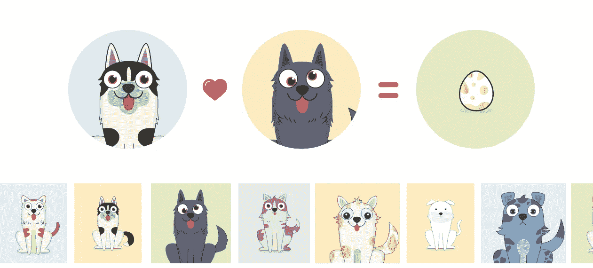
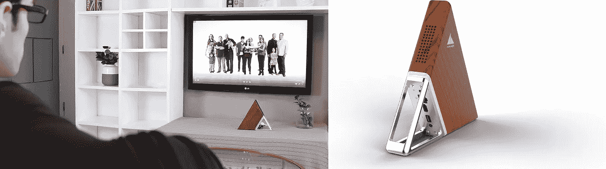
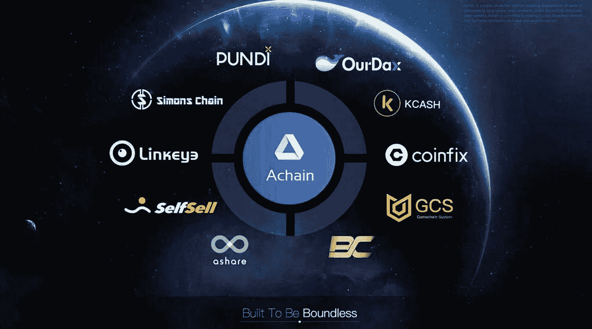

# 隐狗:对阿切因的叉子理论的思考

> 原文：<https://medium.com/hackernoon/cryptodogs-proving-achains-fork-theory-882d0d06281d>

CryptoDogs 是一款基于区块链的虚拟游戏。它允许玩家收养、饲养和交易虚拟狗，它代表了将[区块链](https://hackernoon.com/tagged/blockchain)技术用于娱乐和休闲目的的最早尝试之一。这是以太坊的 [CryptoKitties](https://www.cryptokitties.co/) 在社区开发的 Achain 平台上的重访。

但是为什么它必须证明关于一个[分叉](https://hackernoon.com/tagged/fork)理论的某些东西呢？亚该隐首先是什么？

[**Achain**](https://www.achain.com/home.html) 是一个公共的区块链平台，支持各种经验水平的开发者**发行令牌、智能合约、创建应用和区块链系统**。但真正提升 Achain 的是他们的 fork 理论:2017 年 11 月 23 日，Achain 创始人 Tony Cui [在 BitcoinTalk 论坛上发布了](https://bitcointalk.org/index.php?topic=2448399.0)，公布了新设计的 chain-split Fork 理论的基本框架。基本上，不是在主链上创建代币和服务(例如:以太坊)，而是分叉 Achain 主链(例如:比特币现金)，这样新平台就有了自己的区块链，增加了速度、可扩展性、安全性和灵活性。
从 Achain，用户可以很容易的分叉多个新的区块链，用户甚至可以不断的分叉新创建的区块链。**所有分叉的区块链都是平等的，这意味着从技术或经济角度看，它们没有等级之分。**

当 CryptoKitties 第一次出现在以太坊时，所有人都疯了。几个星期以来，每个人都在谈论小猫，原因如下:
1)有了加密小猫，向人们解释什么是区块链和加密货币真的很容易；人们花了 200 多万美元与 ETH 一起购买这些小猫，使其成为网络上最受欢迎的智能合同；
3)以太坊第一次显示了它的局限性:网络已经拥堵了几周，你可以在这里看看那几周的[以太坊待处理事务队列](https://etherscan.io/chart/pendingtx)；

网络拥塞引发了许多争论，并表明需要进一步提高速度和可伸缩性。

**有了 Achain，我们看到的拥塞将永远不会发生**，原因如下:
1) Achain 与以太坊不同，它能够以 10 秒的块生成时间戳预先处理 **1000 tx/s** (而不是以太坊的 12 tx/s):它真的很快，试试吧；通过分流 Achain **CryptoDogs 拥有自己的区块链**，这意味着即使有数百万人购买狗，所有的交易都将由他们自己的区块链和他们自己的矿工管理，而不经过主链。

通过分叉和运行你自己的区块链，你不仅使你的服务更快更稳定，还增加了整个生态系统的安全性。
还有一种跨链通信协议，称为**价值交换协议** (VEP)。在 Achain 的白皮书中提到“连接的分叉区块链越多，创造的价值就越多。VEP 支持两种主要的用户场景:**跨链通信和跨链智能契约调用**所以所有基于 Achain 或者分叉在 Achain 上的资产都将有可能通过 [**原子互换**](https://coinsutra.com/atomic-swap/) 相互通信，而不经过交易所:看一下 [kcash](http://www.kcash.com) 的路线图，已经在发生了。

Achain 的另一个非常有趣的方面是**推荐的委托利益证明** (RDPoS)共识机制。这意味着，从现在开始，你把你的钱押在赌注上，这样你就不需要高处理能力，只需要一个简单的笔记本电脑，甚至你的手机。
当像 DPoS 一样安全地运行时，RDPoS 可以增加阻塞响应，提高网络的稳定性和安全性。但是有趣的是，当您分叉主链**时，您可以设置自己的共识机制** (PoS、DPoS 或 RDPoS)来更好地适应您的用例。因此，Achain 与另一家公司合作，制造并销售一台小巧精致的电脑，你可以用它来存储密码、挖掘和运行 Dapp 的节点(你也可以像普通电脑一样使用它)，这并不奇怪。

Acute Angle PC

锐角电脑网站上写着他们的电脑“每天电费不到 0.08 美元”。所以你可以让它 24/7 全天候工作，继续采矿，而不会消耗大量能源。很明显，Achain 团队知道他们在做什么，而且他们做得很对。

很明显，分叉理论实际上是有意义的，这是区块链的自然进化:它开始就像一个非常强大的计算器，然后变成计算机，最后演变成一个真正的实体。

Achain 已经有了它的第一个分支(ABTC)并正在准备下一个分支(应该是 [BitcoinOS](http://www.bitcoinos.io/) )，仔细观察这些分支并看看这个叫做 Achain 的实体将如何成长和进化将是非常有趣的。
对未来大肆宣传！

Some of the services based or partnering with Achain

参考资料和资源:

 [## Achain 智能合约平台

### 编辑描述

www.achain.com](https://www.achain.com)  [## 密码狗

### 密码狗

CryptoDogswww.acdog.hk](http://www.acdog.hk/)  [## CryptoKitties |收集和繁殖数码猫！

### 在世界上第一个区块链游戏中收集和交易密码猫。繁殖你最稀有的猫来创造…

www.cryptokitties.co](https://www.cryptokitties.co/)  [## BlockShow 之后:Achain 的 Fork 理论如何在现实生活中发挥作用

### 距离 Achain 在 BlockShow Asia 2017 上介绍其 Fork 理论还不到一个月。该项目最近…

cointelegraph.com](https://cointelegraph.com/news/after-blockshow-how-achains-fork-theory-has-worked-in-real-life)  [## Achain 的叉子理论-你怎么看？

### Achain 的叉子理论-你怎么看？

Achain 的叉子理论-你怎么看？bitcointalk.org](https://bitcointalk.org/index.php?topic=2448399.0)  [## 锐角硬币采矿机

### 这是一个基于区块链技术和 PC 硬件的 IPFS 项目。。

www.acuteangle.com](https://www.acuteangle.com/product_en.html)