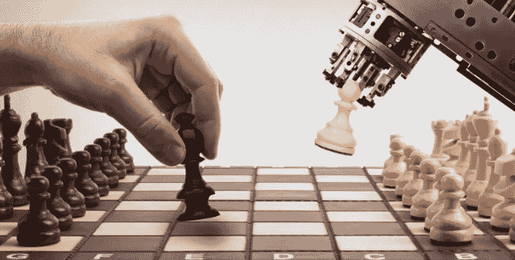
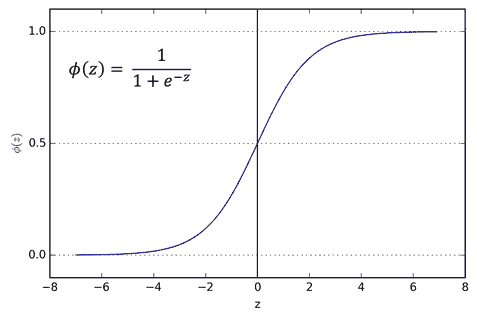
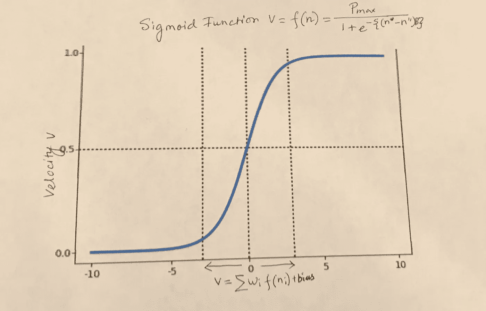
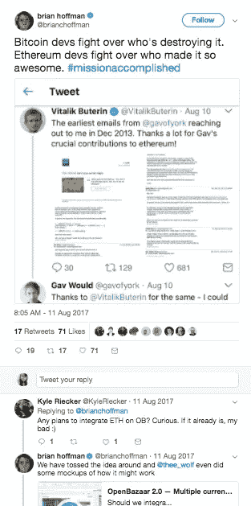

# 密码经济学 102

> 原文：<https://medium.com/hackernoon/cryptoeconomics-102-a87d000e3938>

在我之前，[交换方程 MV=PQ](https://medium.com/u/882245aa5d8e#Equation of Exchange (MV=PQ) / Quantity Theory of Money) 问题。克里斯·伯恩斯克在量化混合速度方面做了令人难以置信的工作。他选择混合速度作为加权线性方程。我认为我们需要在方程中包括偏差，以得到速度的完整值。(我试图弄清楚一个简单的博弈论是否能满足这一点)

我们将使用梅特卡夫网络效应中的三个关键假设来定义加密货币网络效应:

I)每个额外的节点增加了网络的价值

ii)网络内的通信能力成比例地受到节点数量增加的影响。

iii)存在一个阈值，超过该阈值，节点数量的增加会导致网络价值由于噪声而下降。

sigmoid 函数具有 S 曲线，通常在人工神经网络中用于在模型中引入非线性。

简单的 sigmoid 函数

S 曲线由泡沫和破裂组成，但我们需要平滑它以得出资产的实际价值。

*我将加密资产的速度定义为完全运行的节点数量的函数，该节点在具有加密货币的完全区块链的机器实例上具有核心客户端和轻量级节点的功能。如果节点变弱(节点数量减少)，将会削弱交易，从而降低加密资产的速度。类似地，如果完整节点的数量增加超过阈值速度，加密资产速度将像 s 形曲线一样变平，并最终崩溃。*

完整节点验证事务和块，并将它们转发给其他节点。

挖掘器是一个完整的节点，它通过使用从其他节点转发的新事务创建新块来扩展区块链。

网络的速度是 sigmoid 函数，其中速度是节点的函数，v=f(n)

f(n)= Pmax/[1+e^{-(n*-n")B}]，其中 n =节点的事务

其中 B(β)是 S 曲线的陡度，当 S 曲线变陡时，β较大，当变化平缓时，β较小。

n*是某一时刻 t *的速度，n”是阈值速度，在 n*=n”时达到阈值速度，所以 n *-n”= 0，这意味着当网络中没有交易时，硬币是 e⁰=1

把这个估值 f(n)= P/1+1，

所以 f(n)=P/2，那么速度是 0.5，两条垂直的网格虚线输出。

假设 Pmax 速度为 1，Pmin 速度为 0

为了以更简单的形式表达这个方程，我们认为 B(β)太小了，因为网络还处于初期阶段。

n"-n*=n

为了简化速度方程，这里忽略β。

因此，加密资产的速度是 v= 1/ (1+e^n)，其中 n 是网络中节点的交易

对于 hodlers n=1，因为除了占据节点之外没有其他事务，但是速度不等于零，因为通过占据一些位置，他们为网络增加了价值。

Sigmoid Function = f(n)= Pmax/[1+e^{-(n*-n”)B}]

虚线竖线给出了有偏差的加权平均公式的等式。

我们需要考虑偏差以获得完整的值。

利用[克里斯·伯恩斯克](https://medium.com/u/2a8f9285c9aa?source=post_page-----a87d000e3938--------------------------------)的问题——54%的比特币基地用户把比特币“严格地当作一种投资”，就像霍德勒一样

46%的人实际上使用比特币作为“交易媒介”，这导致了一些我们不得不推断的速度。

以下是用于求解该方程的假设

假设事务媒介的节点是轻量级客户机的 n′

假设投资媒介的节点是 n 个全节点客户

使用由[克里斯·伯恩斯克](https://medium.com/u/2a8f9285c9aa?source=post_page-----a87d000e3938--------------------------------)给出的数据在硬币基础代币经济模型中取方程，

v = 0.54 { 1/(1+e)}+0.46 {1/(1+e^n')}其中 e = 2.71828

v = 0.54 { 1/3.718 }+0.46 {1/(1+e^n')}

v= 0.14523 +0.46 {1/(1+e^n')}

现在，如果我们试图解决这个加权平均公式，以达到 v=0.5

0.5 - 0.14523= 0.46 {1/(1+e^n')}

0.35477/ 0.46= {1/(1+e^n')}

1+e^n'= 1/0.7712

e^n'= 0.2966

n'= -1.215

该值位于 0 <n>-5 之间的垂直虚线之间</n>

虽然我尝试使用 coinbase 数据，但我认为我们应该通过设计一个小游戏来解决小代币经济的这个问题。钱包和交易所不是节点，因此不应考虑它们的影响。

现在，我没有足够的数据来解 MV=PQ 方程，我正在写技术论文。

在我的等式中，全节点 hodler 的速度高于轻量级事务节点网络的速度，因为系统中添加的全节点越多，我们到达阈值的速度就越快。但是轻量级节点的速度更小，因此增加了网络效应

这个等式有许多缺点。虽然它在值为 0 和 1 的神经网络中有效，但在多人多游戏的代币经济中，它太简单了。我也无法量化节点事务的单位以及如何量化节点事务的负值。它确实质疑了区块链的一些基本面。

*节点和块-‘每个节点在将块中继到任何其他节点之前，验证它通过每个块接收的每个事务。如果事务/块无效，则它被忽略并且不与其他节点共享。如果事务/块是有效的(达成共识)，则它被节点存储并中继到连接到它的所有其他节点。因此，每个节点都强制执行一组规则，以达成共识，并防止任何人(无论是节点、用户、钱包还是矿工)在网络上发送任何不符合共识的内容。*

虽然我试图通过 sigmoid 函数来建立速度，但在大规模代币经济中考虑代币动态可互操作的方程将非常困难。

**混合策略游戏**

这种网络效应反映了各种加密货币群体之间的人类偏见、启发和博弈论。多种加密货币之间的价格动态是不对称混合策略设计博弈的必然结果。(游戏设计不在本文讨论范围之内)。

市场不是零和游戏，它是关于聪明的理性决策者之间的冲突与合作。比特币是作为一种解药诞生的，更像是一种平行货币，将与中央机构竞争，甚至可能试图摧毁它。比特币的非官方口头禅是“在我们信任的密码学中”。现在，我们看到 R3、enterprise ethereum alliance 等财团如何在金融机构中形成，开发新一代的基础设施以及许可分类账和零知识证明协议。我们正处于一个混合策略的合作博弈中，在这个博弈中，我们不是废除银行，而是分析最佳策略，通过这些策略，我们可以执行加密集团和银行之间的协议。

**禀赋效应**

[热爱葡萄酒的经济学家的故事](https://www.princeton.edu/~kahneman/docs/Publications/Anomalies_DK_JLK_RHT_1991.pdf)——“我们认识的一位热爱葡萄酒的经济学家几年前以低价购买了一些上好的波尔多葡萄酒。这些葡萄酒已经大幅升值，以至于一瓶购买时只值 10 美元的葡萄酒现在在拍卖会上可以卖到 200 美元。这位经济学家现在偶尔会喝一些这种酒，但他既不会愿意以拍卖价格出售这种酒，也不会以这个价格再买一瓶。泰勒(1980)将这种模式称之为- ***禀赋效应——人们放弃一件物品的要求往往比他们愿意支付的价格高得多。这个例子也说明了萨缪尔森和泽克豪泽(1988)所说的现状偏见，一种对当前状态的偏好，这种偏好使经济学家反对买卖他的葡萄酒。这些异常是卡尼曼和特沃斯基(1984)称之为损失厌恶的价值不对称的表现——放弃一件物品的负效用大于获得它的相关效用。本专栏记录了支持禀赋效应和现状偏差的证据，并讨论了它们与损失厌恶的关系。厌恶损失的一个含义是，个人有保持现状的强烈倾向，因为保持现状的缺点远大于优点。Samuelson 和 Zeckhauser (1988)已经证明了这种效应，他们称之为现状偏差…[风险选择研究的一个中心结论是](https://www.princeton.edu/~kahneman/docs/Publications/Anomalies_DK_JLK_RHT_1991.pdf)假设效用的重要载体不是财富或福利状态，而是相对于中性参考点的变化，这种选择可以得到最好的解释。另一个主要结果是，让事情变得更糟(损失)的变化比改善或收益更大。”***

散户投资者在密码市场也表现出了类似的行为，他们持有硬币。一个(喝醉的)reddit 用户首先提出了“hodling-hold for dear life”这个词:-)

霍德林是否将市场行为偏向作为交换单位或价值储存手段的估价，一直存在许多争议。我不让这个讨论超出本文的范围。但是 coindesk 的主席迈克尔·J·凯西就此写了一篇文章。反对意见可以看[这个](http://nakamotoinstitute.org/mempool/bitcoin-as-a-store-of-value-unit-of-account-and-medium-of-exchange/)。

霍德林的另一个风险选择是将硬币储存在加密交易所，这种投资容易受到基础设施变化、黑客攻击、未保险硬币交易费用等风险的影响。hodl 有一门艺术，你可以在这里阅读详情[。](https://hackernoon.com/the-art-of-hodling-crypto-cant-make-this-sh-t-up-713149eb9a21)心理所有权通过对信息进行不同的权衡和处理来调节霍德勒的禀赋状况。这种例子在 twitter、reddit、github 中的加密口水战中显而易见，通过信息处理的偏见，在社交媒体内外形成了类似方法的邪教。

构成偏见处理的原因和故事的集合有时会将理性行为限制在各种事件和理解上。这篇[文章涵盖了这样一个大胆的先例。每个代币经济中的这种异常在它们的市场价格和回报中起着重要的作用，并且例证了代币社区对风险容忍度的不对称态度。尽管本质上是理性的代理人，但这些经济行为者对他们的密码赋予了更高的价值，因此出现了 hodl。](https://hackernoon.com/iota-why-the-fud-makes-sense-82a2f1dc38d5)

本文试图通过各种经济学遗产来理解新技术。

与我们的遗留系统相比，市场不应该将像区块链这样的新技术置于不切实际的完美的严格标准之下。完美的未来不是解决方案，我们的重点应该是灵活、敏捷和包容的技术。这项技术将推动金融经济模式的根本重组，而不是人工智能对人类社会的重组。