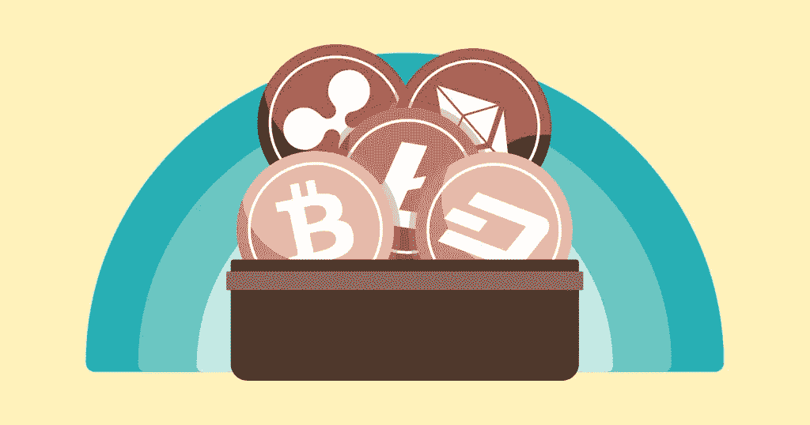
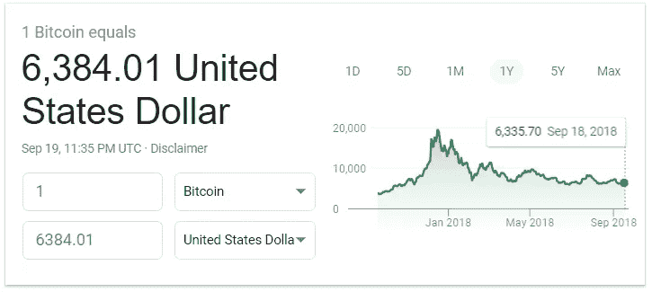
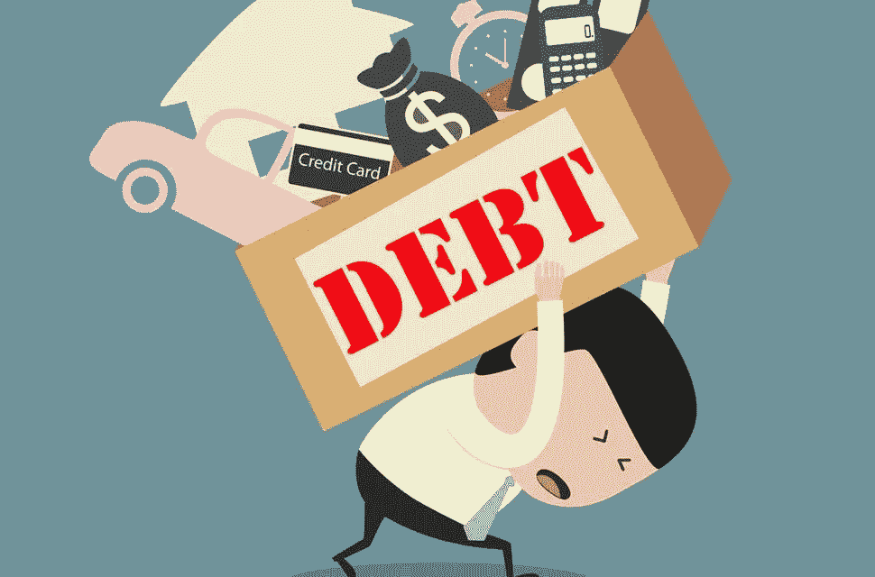
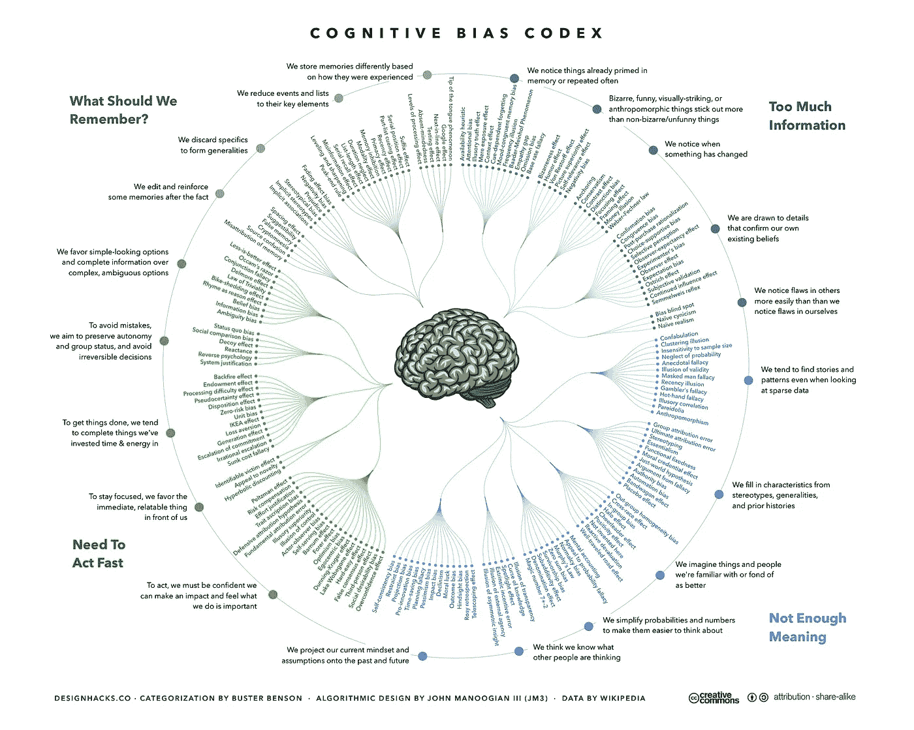

# 密码经济学与机制设计

> 原文：<https://medium.com/hackernoon/cryptoeconomics-and-mechanism-design-85508310e931>

## 人类与加密货币互动的 5 种方式将不同于法定货币。

Source: [https://flyerdiaries.com/](https://flyerdiaries.com/)

心理学家将需要花更多的时间来评估统治着密码经济学领域的独特认知怪癖。诚然，催生行为经济学的思维启发同样适用于数字货币。尽管如此，忽视行为密码经济学作为一个分支学科的有用性将是愚蠢的。我已经概述了数字货币的五个重要方面，它们代表了人类可能如何与法定货币互动的出发点。

# 1.私有化的公用事业代币将会很普遍。

许多人认为今天的数字货币是一种投机资产。富人冒险“投资”这些东西，希望获得长期收益。然而，一般来说，外行人是厌恶风险的，比起长期收益，他们更喜欢小的、即时的满足感。

> [风险规避:](https://dictionary.apa.org/risk-aversion)当在两种选择中做出选择时，倾向于避免可能带来损失风险的选择，即使这种风险相对较小。
> 
> [时间折扣:](https://dictionary.apa.org/behavioral-economics)倾向于更喜欢早收到的小奖励，而不是晚收到的大奖励

正因为如此，可用于与特定数字商品零售商进行即时价值交换的硬币可能会在早期蓬勃发展。具体来说，这些数字商品必须无处不在，这样代币购买者才不会觉得需求会大幅下降。我预测，适合令牌化的稳定的数字产品包括带宽、存储、计算和推动需求的媒体。

我们已经看到很多这样的事情正在发生。比特币的第二个开发者，马尔蒂“小天狼星”马尔米正在[开发一种新的加密货币，AXE，](https://www.coindesk.com/bitcoins-second-developer-returning-crypto/)，它将带宽令牌化。FileCoin 正在对存储进行令牌化。甚至连盗版者都在为电影奖金做准备。这些种类的公用令牌可能会定期交互，而通用硬币，如比特币，将被用作公用令牌之间的交换媒介。

**行为加密经济学家将需要研究风险厌恶和时间贴现在采用投机性加密货币以及非投机性效用令牌中的影响。这些现象在多大程度上预示了对这些不同类型货币的不同采用？**

# 2.从目前的角度来看，债务将会过时。

由区块链支持的加密货币做了解决双重支出问题的艰苦工作。然而，副作用是不能产生债务。**人们将如何与不再支持机构债务的数字货币互动？**这可能会将贷款推向菲亚特的利润率。具有讽刺意味的是，如果菲亚特成为债务的垃圾场，情况可能会发生变化，菲亚特可能会像比特币一样变得不稳定，充满魔力，毫无基础。然而，在可编程货币的背景下，人们可能会被推动做出更负责任的财务决策。自我意识是改变行为的有力工具，公共账本和私人钱包上的金融交易的即时性是一个好方法。人们可能会实时检查他们的数字钱包，以确保他们的交易不会在结账时被尴尬的拒绝。

但是，比这更深一层的是，它消除了延迟贴现的影响和复利的心理体操，而复利目前困扰着大多数不懂金融的美国人。如果通货膨胀不是问题，关于退休和储蓄的决策就简单多了。这些机制意味着，在财富分配方面，富人和穷人处于平等的竞争环境中，经济阶层的流动性超过了平面经济目前所允许的水平。**免除债务在多大程度上影响了穷人对经济刻板印象的感受？**

> 刻板印象威胁:一个人对他或她的成员群体的负面刻板印象会对他人对他或她的表现的判断产生负面影响的预期，以及糟糕的表现会给成员群体带来不良影响的预期。这种期望可能会破坏个人表现良好的实际能力。

# 3.数字货币可以包含纯加法分类账。

我之前预测过，加密货币将催生纯加法经济。我的意思是，交易看起来像是商品经销商的货币增加，而商品消费者的货币没有减少。你去一家商店买牛奶，商店会给你货币点数，然后你带着和以前一样多的货币点数出去，另外你还有牛奶。这听起来可能还很遥远，但是你可能已经在处理这种经济的形成了。

假设你在 Reddit 上发了很多帖子。随着时间的推移，你的贡献会给你带来一定的声誉。这种声誉力量代表了一种价值储存，可以在网络中无限利用。在 StackOverflow 上，如果你贡献足够多，你就可以获得可以重复使用的向上投票权，而不会被扣除信誉点数。或者，如果你经常乘坐嘉年华游轮旅行，你可以成为白金旅行俱乐部会员，让你每次旅行都能优先使用船只和免费的水瓶。你不会因为“兑现”而失去优先权。

考虑一下这里涉及的双赢激励。未来的数字货币知道，当它们的网络很大时，它们的价值最高。所以，他们希望你进入并留在他们的网络中。通过给你累积的货币积分，他们鼓励你留下来享受你的参与所带来的所有好处。留在货币网络中并在其中活跃的人越多，货币网络对其他人的吸引力也就越大。

这消除了传统意义上的损失厌恶。行为密码经济学家需要探索财富的向上社会比较是否代表消费者的任何失落感。如果我让某人变得更富有，我会不会觉得我们两人之间相对财富的转移是一种损失？或者说，当稀缺和损失不再相关时，人类的交换是什么样子的？人类是否迷信后稀缺交换？**人们会因为纯加法经济给他们的互惠感带来过重的道德负担而避免这种经济吗？**或者说，搭便车会困扰系统吗？**交换和礼物之间有界限吗？这条模糊的界限会如何影响心理账户？**

> 互惠:帮助他人的人将从他人那里获得同等回报的社会标准。
> 
> 心理会计:人们通过将收入和支出归类来跟踪他们的收入和支出，这些归类会影响人们对他们经济活动的看法。例如，一个人在排队购买一张 10 美元的电影票时发现一张 10 美元的钞票不见了，他很可能还是会买这张票，而同一个人可能不愿意再花 10 美元去重新购买一张丢失的电影票。

# 4.数字货币将关注品牌忠诚度和网络效应。

过去，(除非你是专业的货币交易员)人们真的只在旅行时才兑换货币。货币网络效应被认为是理所当然的，因为政府要求每个人都以法定货币纳税。不管某人在这个国家的哪个地方，你知道他们每年四月或十月都需要美元。在政府接受以其他形式的货币支付税款之前，对纸币的需求将会继续存在。

> [网络效应:](https://en.wikipedia.org/wiki/Network_effect)当存在时，产品或服务的价值随着使用它的其他人的数量而增加。

因为私有化的公用事业代币不会有政府享有的那种垄断，这些货币将需要相互竞争来接纳和维持用户。不过，一种货币的价值取决于它所在网络的饱和度。如前所述，我预测建立在最普遍的商品上的代币将会是最好的。[亚马逊硬币](https://www.amazon.com/gp/help/customer/display.html?nodeId=201357530)可能不得不与假设的未来沃尔玛硬币竞争，而在一个没有沃尔玛的城镇，沃尔玛硬币的需求将会减少。由于这些问题，用不了多久，货币本身就会被这些货币的最大股东所宣传。

商品和金钱之间的界限将再次模糊。目前，行为经济学家正在思考哪些框架技术可以增加产品的销量。但是，行为密码经济学家也必须考虑货币本身的框架。**单纯曝光效应和捐赠效应(针对特定硬币，而非特定产品)如何影响交易？最成功的硬币是如何利用潮流效应的？**

> [单纯暴露效应:](https://dictionary.apa.org/mere-exposure-effect)作为重复暴露于某事物的结果，个体表现出对该事物的偏好(或喜欢)增加。
> 
> 禀赋效应:人们一旦拥有某样物品，就会赋予它更高的价值。
> 
> [从众效应:](https://dictionary.apa.org/bandwagon-effect)在社交场合中，人们可能会认同大多数人的观点，做或相信一些事情，因为许多其他人似乎也在做或相信同样的事情。

# 5.消费者将成为前消费者。

> [Prosumer:](https://en.wikipedia.org/wiki/Prosumer) 消费和生产产品的人。

因为公用事业令牌代表了私人公司中的直接价值存储，所以消费者通过加入他们的网络，将虚拟地拥有公司的一部分。与上面的观点类似，从一个饱和的网络中掉下一个人就代表着指数级的损失。目前，如果我所服务的公司出现丑闻，我很生气并离开了，公司就会失去我自己。然而，如果公司的价值主要来自一个私有的公用事业令牌网络，而我离开了(实际上是说“我不再接受劣质公司硬币作为报酬”)，这对他们来说就意味着巨大的损失。除了你的背叛之外，不能再与你交换坏公司硬币的朋友需要转换成其他货币，这也降低了坏公司网络的价值。在分散的代币经济中，用你的钱投票比用美元投票更真实。

消费者将如何利用货币期权进行社会活动？人类做了许多非理性的事情——甚至是遭受资源打击——为了让坏人受到惩罚。虽然美国公民今天不能完全抵制美元，但如果事情变糟，他们肯定可以抵制劣质公司硬币。

> [幸灾乐祸:](https://dictionary.apa.org/schadenfreude)从他人的不幸中获得快感或满足感。

尽管导致行为经济学产生的思维启发会保持不变，但我们与之互动的货币不会。随着货币的变化，我们的经济决策也会发生变化。如果我们要积极地将未来塑造成令人满意和民主化的东西，我们需要识别和适应不可避免的变化，我们需要仔细考虑数字货币基础架构的道德和行为结果。

披露:我在 AXE 的母公司[时代](https://era.eco/#step1)工作。我们正在建立去中心化的网络，因为我们相信所有人都欢迎使用互联网，只有你拥有你的身份。如果你喜欢这篇文章，请鼓掌并在 Medium 和 [Twitter](https://twitter.com/ambercazzell) 上关注我！

