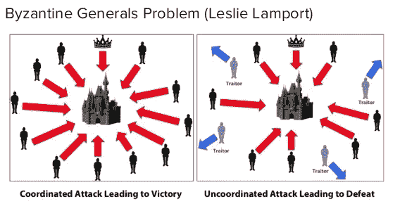
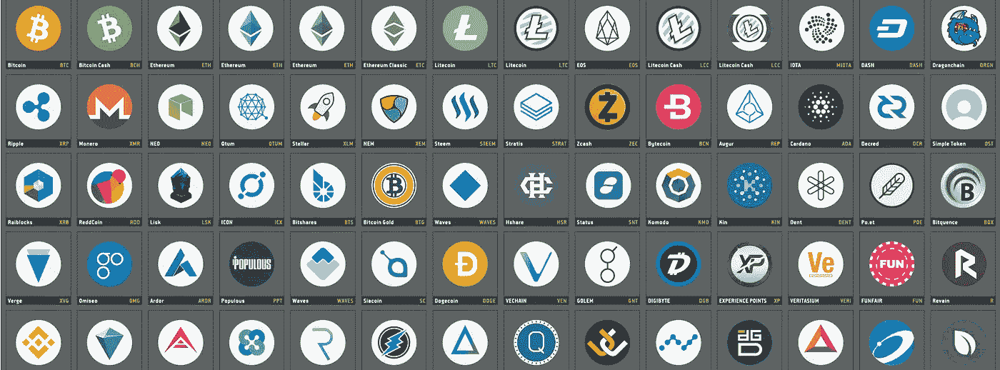

# 加密经济学是一场革命！

> 原文：<https://medium.com/hackernoon/cryptoeconomics-is-the-revolution-6fd7de8e7da0>

区块链网络中使用的大多数机制在 Satoshi 的白皮书之前就存在了。例如，对等网络、密码散列法、非对称密钥加密、Merkle 树等早已众所周知。2009 年比特币带来的真正革命是加密经济学，如果你想理解区块链革命的真正价值，理解它是至关重要的。

密码经济学的目的是建立强大的协议，能够管理和安全地开发对等分散网络。

对等网络已经存在一段时间了。例如，许多人用来在线共享文件夹的“种子”是对等网络。然而，他们缺乏效率，因为成员们乐于下载内容，却没有兴趣分享他们的内容。区块链，通过密码经济学，将给予成员共享文件夹的激励，例如，通过给予代币作为交换。

换句话说，区块链网络可以比作一个激励机器，它将在分散的网络中注入市场结构。

Cryptoeconomics

**密码经济学是如何工作的？**

像比特币这样的对等网络是一个分散的、自治的经济体，需要由其成员来实现，因为这一功能不再委托给第三方。但是这些成员像任何人类一样，是理性的，不会花时间为一个网络免费工作。这就是为什么他们需要奖励的原因，而这正是 Satoshi 所发明的。

密码经济学指的是“加密”和“经济学”，前者是分散网络的技术机制，后者是组织这些机制以激励网络成员采取行动或开发网络的方式。用最基本的术语来说，密码经济学就是用金钱来保护和发展一个分散的网络。

安全性意味着分散式网络必须在更新共享数据库(即区块链)的方式上达成共识，即使其一定数量的成员是不可信的(拜占庭攻击)。

发展意味着网络成员被激励更新共享数据库，即使用由协议和网络提供的服务。我们现在将描述这两点。

**拜占庭将军的进攻**

这个概念对于理解网络中的流氓成员如何攻击分散式网络至关重要。重要的是要注意，攻击只能来自内部，即来自已经下载了协议并决定用它来攻击网络其余部分的人。如果几个成员同时违反协议的规则或利用它们，网络就受到攻击，因为不可能更新共享数据库，因此不可能监视网络成员之间的额外交易。

Byzantine generals

拜占庭将军的例子被用来说明这个概念。你只需要想象 5 个将军准备攻击一个城镇。它们都被放置在城市的周围，它们只需要相互协调就可以发动攻击。如果至少有 2/3 的军队不同时进攻，他们就会寡不敌众，输掉战斗。领头的将军派一名信使给旁边的将军传达进攻的时间，并要求这位将军将信息传递给下一位将军。但是如果这个将军是个叛徒并且决定在不同的时间交流呢？

根据我们指的是私有还是公共区块链，分布式网络用来解决拜占庭攻击问题的加密机制是不同的。对于公共区块链来说，最著名的是工作证明，这种证明因比特币而普及。其他机制，如股权证明或委托股权证明每天都在增加。随着私人区块链机制，如实用拜占庭容错(例如由 Hyperledger 使用)和联邦拜占庭协议(由 Stellar 和 Ripple 使用)更加发达。

**比特币的例子**

一方面，比特币协议使用多种密码机制来确保用户安全地扣留他们的比特币([非对称密钥加密](https://www.blockchains-expert.com/en/asymmetric-key-encryption-how-your-public-and-private-keys-are-created/))，交易被安全地添加到区块链(用于链接每个区块和交易的密码哈希)中，并且所有网络交易的历史都不可能被更改(Merkle Tree)。

另一方面，通过工作证明的密码经济学被用于保护系统，因为它使得攻击对于理性攻击者来说过于昂贵。

比特币协议为了避免“51%攻击”，使得开采比特币变得极其昂贵，这意味着一个矿工聚集了超过 50%的网络哈希能力。越过此限制将使该矿工有可能阻止其他矿工向区块链添加区块并撤销先前的区块。但是据估计，收集 51%的散列能力将需要 60 亿美元的硬件，并且每天消耗 400 万美元(https://gobitcoin . io/tools/cost-51-attack/)，这显然不能仅仅通过从区块链移除一个块来盈利。这也是我们提到挖矿成本高保证网络安全的原因。这也是为什么这些成本随着在网络上活动的矿工数量成比例增加的原因。值得注意的是,“51%攻击”不仅仅是理论上的，因为 2014 年采矿池将达到这一阈值。

最后，工作证明机制专门用于奖励未成年人参与共识过程。每个成功为区块链增加一个区块的矿工将获得 12.5 比特币。通过这种方式，未成年人可以偿还他们在采矿材料、电力和带宽方面的投资。

根据 Elad Verbin 的说法，“中本聪找到了一个聪明的博弈论解决传统拜占庭将军问题的方法，只要他们诚实行事，就给将军们发工资，但如果他们被发现试图作弊，就扣发工资。"

**几个激励系统已经存在**

正如我们刚才解释的，在区块链上组织的每个分散网络是一个自治的生态系统，它使用不同的机制来诱导其成员参与网络的开发和/或安全。成员通常会得到协议颁发的令牌作为奖励。

这些收入可能非常不同，并且取决于试图解决协议的问题。我们可以看到模式的出现，我们将在另一篇文章中描述已经被确认的加密经济学的原始数据。然而，在本文中，我们将确定三种经常性薪酬模式:

-股息

-回购

-价值增加

Cryptocurrencies 2018

**1 —股息**

当网络成员因参与网络而获得报酬时，代币产生红利。这种参与可以采取几种形式:

- **资源的提供**:网络用户因借出属于他们的网络资源而获得报酬。这些资源可能非常多样:

它可能是一个计算机装置的计算能力:采矿是最常见的例子。如上所述，网络的挖掘者(例如比特币)向网络提供他们自己的计算机安装计算能力(散列能力)，以完成共识机制(例如工作证明)并在区块链上添加网络的交易。因此，未成年人因其对网络的贡献而获得报酬，即该协议创造的比特币(以及交易附带的成本)。挖矿也是比特币产生的唯一机制。

它也可以是内存空间:在 SIA、Storj、Filcoin、Madsafe 的例子中，用户被付费让网络的其他成员处理他们计算机设备的一部分内存。

- **按内容生产** : Steemit 就是一个很好的例子。这是第一个会员通过发表文章和评论获得报酬的社交媒体。Steemit 的每个成员为他阅读的文章投票，并根据作者在网络中的参与程度为其产生报酬。所以只要你投了一篇文章，协议就会自动给予报酬。您拥有的 Steem 令牌(由协议 Steemit 发行的令牌)越多，您的投票将为文章作者带来越多的报酬。

为你的文章投票的人数很重要，因为你得到的投票越多，你得到的钱就越多。作家为他们的文章获得 500 美元报酬的情况并不少见。

Steemit 是未来几年互联网发展方式的一个很好的例子。目前，我们免费向我们使用的几个平台(脸书、Twitter、Intagram……)提供我们所有的内容和个人数据。但是这个时期很快就会结束。有了分散的协议和新的社交媒体平台，你不再需要提供你的个人数据，你添加的内容会得到报酬。这个公式将很快适用于所有希望在区块链生存下来的平台。

例如，当我看到 Tripadvisor 等网站向用户提供旅行代币作为对你所去过的酒店的任何评论的补偿时，我不会感到惊讶。这些代币可以让你在其他酒店免费住宿。

**2 —代币兑换**:

在加密资产领域，代币赎回与我们目前经历的证券赎回形式不同。兑换是通过销毁代币以间接方式进行的。

在令牌数量有限的网络中，销毁一定数量的令牌会增加剩余令牌的价值，理解这一点的确很重要。

例如，Bitshares 共识机制(委托的利害关系证明)允许希望当选的"证人"向" burn" ("burn ")网络成员提议他们将从协议中获得的一部分令牌，作为他们"铸币"工作的报酬(我们谈论"铸币"是为了证明利害关系机制，而不是"采矿"，但意思是一样的)。因此，他们没有变得更富有，而是建议从网络中移除这些代币，从而增加其他代币的价值。

**3 —数值的增加**

这是任何投资的常见组成部分，但理解代币如何以及为什么获得价值是很重要的。

如果你喜欢这篇文章，并发现它有用，请不要犹豫，喜欢它，并分享它！谢谢你