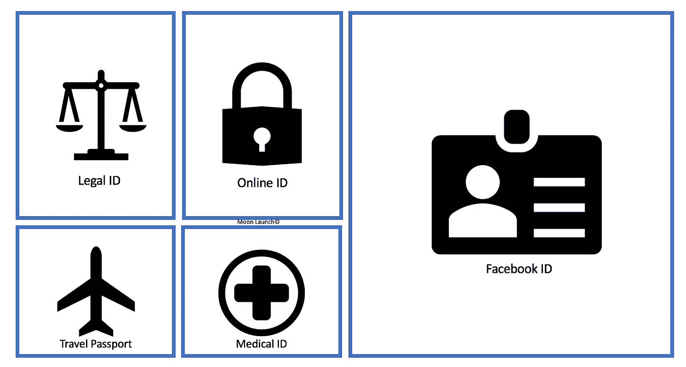

# CryptoFacebook？

> 原文：<https://medium.com/hackernoon/cryptofacebook-db6f9ab76616>

2018 年 7 月 26 日对马克·扎克伯格来说是一个非常难忘的日子，原因有二。

原因 1 众所周知。他的个人财产减少了一点。就当今大多数最富有的亿万富翁的个人财富而言，这是账面损失。

相对于他剩余的全部财富而言，扎克伯格的“一点点”是相对而言的。对于我们这些凡人来说，这是一个不小的下降。

按实际价值计算，这比梅西百货等一些老牌机构的总市值还要高！

Source : MoonLaunch Capital

这也是历史上市值单日最大跌幅。脸书损失了 1240 亿美元，相当于其早期价值的 20%。这一损失超过了英特尔在 2000 年 9 月的 910 亿美元的损失。

20%的损失并不是微不足道的&除了脸书，任何一家公司都会经历更严重的对其稳定性的质疑。

但脸书是一家消费者互联网公司，每天有数十亿人使用。它的健康证明在每个人的智能手机上。因此，股价稳定下来，生活继续。

然而，这对扎克伯格来说是一个不和谐的教训。这让他深感不安&一天结束时，他给两名高级主管打了一个非常重要的电话。电话本身非常简短。有人说最多持续一分钟。

扎克伯格决定，如果拥有一个无处不在的集中式社交媒体平台不能防止他的公司被股票持有人抛售，他将别无选择，只能在一个可以导致革命性增长的特定措施上加倍努力。

扎克伯格毫不怀疑有一种特殊的统一技术可以带来他的股票持有人渴望的多年非凡增长。

股市崩盘对脸书继续以过去的速度增加收入的能力提出了严重质疑。

尽管我们喜欢认为脸书是全球性的，但它主要是一个西方企业。它的大部分收入来自西方。大约 30%的用户和 73%的收入来自北美和欧洲。西方用户的月平均收入为 3.33 美元，而世界其他地区为 53 美分。它的收入增长也在放缓。它几乎达到了市场渗透的极限。在北美，脸书的月活跃用户(MAU)占 14 岁以上人口的 80%。那里没有太多的选择。

脸书试图收购& bully snapchat，但没有按计划进行。Instagram 是剩下的立即发展的可能性之一&通过积极复制 Snapchat 来带来收入。**在脸书看来，WhatsApp 是一个不确定的生态系统，尤其是在《剑桥分析》之后的隐私泥潭中。**

剑桥分析公司丑闻导致 2018 年 3 月股价下跌。所以扎克伯格在 WhatsApp 上小心翼翼。

脸书曾公开承认，在不影响用户保留率的情况下，它还能展示多少广告，这一点已经接近饱和。就在谷歌和苹果宣布他们禁止在他们的平台上使用自动播放声音的格式，因为这是不可接受的用户体验之后，谷歌已经尝试在视频上实现自动播放声音(UX)。

# 那么，脸书可以从哪里获得巨额收入呢？

脸书就像其他名副其实的科技公司一样，有一个庞大的研发团队，致力于许多想法。天赋每天都在增加。研究新的想法。他们的实验室有一些世界上最好的工程师和梦想家全天候工作。

R&D 分部由 CTO 和 sub 领导，具体分工如下:

*AR/VR:创造个人的未来&共享现实*

*计算摄影&智能相机:移动视觉处理理解，增强&增强共享&连接。(或者换句话说，可以看到特定照片的东西&明白你看起来比其他照片更吸引你的关系)*

*计算机视觉:理解我们周围的视觉世界*

*连接:连接未连接的设备*

*数据科学:获得洞察，实现有意义的社交互动*

*经济学&计算:探索经济学的交集&计算*

*脸书人工智能研究:推进机器智能领域*

*人机交互& UX:理解&改善社交体验*

*机器学习:将机器学习科学应用于脸书产品*

*自然语言处理&演讲:打破语言障碍*

安全&隐私:保证脸书社区的安全&安全

*系统&网络:建立系统让世界更加紧密*

这些部门有许多亮点，但除了 Instagram 和 Messenger，在接下来的 4 至 6 个公开报告周期中，收入方面没有太大希望。因此，扎克伯格把目光放得更远。[区块链](https://hackernoon.com/tagged/blockchain) **！一定是这样！**

扎克伯格打给了他的首席技术官迈克·斯科洛普夫和副总裁大卫·马库斯。实质上，扎克伯格告诉他的两位高管，他们有权“不惜一切代价”利用区块链让脸书成为世界银行。

多年来，脸书的分销平台变得非常庞大。这是一个广告投放平台。但这取决于作为一个中间人。广告商提供不属于脸书的广告&当穿插着其他用户产生/分享的感兴趣的内容时，消费者会观看这些广告。它已经建立了一个分销网络，最大限度地为第三方广告服务。尽管它是平台的所有者，但在广告界并没有一个统一的身份**‘脸书风格’**。在假新闻丑闻的余波中，这是一个没有简单解决办法的脱节&更重要的是，这种模式开始显示收入放缓。

另一方面，区块链很有前途。脸书可以把每个用户放在区块链上&给他们一个身份。他们已经提供用户使用他们的脸书 ID 登录第三方网站。

但这只是脸书巨大影响力的一小部分。脸书的目标是提供全球护照。区块链上的全球唯一身份，可用于与任何合作伙伴或第三方客户互动&获得比脸书追踪像素更多的价值。再加上内部支付令牌，这个想法看起来确实非常强大。

Where do you use your Online Identity? (Moon Launch)

对脸书用户来说，它可以提供一个无缝的解决方案，在脸书生态系统内处理身份、安全和支付&永远不要留下一次性密码，登录脸书合作伙伴/商家的用户 id 等。

对脸书来说，这意味着用户参与、用户忠诚度和成为 2025 年及以后的世界银行的长期高速公路。

Online Identity is a single thread that runs through our day to day lives (Moon Launch)

在脸书实现扎克伯格的加密愿景所需的工具和基础设施还不可扩展。但如果脸书今天不开始建设，扎克伯格认为谷歌或亚马逊可能会先到达那里。在这场规模游戏中，第一至关重要。尤其是当有传言称同样有能力的竞争对手已经在从事区块链项目时。

为了让它在一开始就发挥作用，脸书最有可能发行一种支付令牌来推动采用。为了好玩，让我们称之为 FaceCoin！

这可以在 Facebook Messenger 中使用，也可以与脸书商业商家一起使用。让人们开始使用它是很容易的。许多区块链 ICO 已经使用这种技术来推动大规模采用:空投！

Here’s your 10$ worth of FaceCoin airdropped to your wallet!

第一阶段可能是一个惊喜的钱包信使推出，价值 10 美元的 FaceCoin 免费发送或小费给脸书的任何其他朋友或人。想要一个很酷的表情包吗？当然可以！只要 0.99 美元，但你只能用 FaceCoin 支付！

在第二阶段，脸书将不得不与商家合作，让他们的钱包也能使用起来！但是，如果第一阶段显示大规模采用，说服商家基础可能会更容易。

当然，还有比我们在这里读到的更困难的挑战。KYC/反洗钱合规，原料药只是其中的一部分。

# 这是要去哪里？一场身份战争？

为什么要为了一枚加密硬币走这么远？脸书希望你的身份推动其发展。身份之战即将降临硅谷。2018 年到目前为止，我们很快就会对在线隐私感到担忧，这只是慢慢向我们方向发展的冰山一角。GDPR 于 2018 年 5 月实施。隐私领域将会出现比我们迄今所见更多的激进主义。更多的数据泄露丑闻&更多的用户要求重新控制他们的在线身份。脸书期待区块链来解决这些棘手的问题。

The Grand Vision of Project FaceCoin — Facebook ID adopted by every user of the internet

区块链将为用户提供更多对自己身份的控制。用户可以投票决定与谁共享他们的脸书 ID。从短期来看，脸书似乎正在把控制权交给用户。它确实将权力移交给了用户，但作为回报，用户将采用脸书 ID 平台，因为它具有纯粹的网络效应。通过向脸书用户空投 FaceCoin 获得了网络效应。

Facebook before the flip

在角色互换之后，脸书看起来更像是一个内置了 KYC 和身份管理功能的通用加密钱包

Facebook after the flip — A Crypto wallet with user ID

# 脸书将如何打造品牌？

脸书可能会将此作为宣传和逻辑的一部分卖给公众。由于在线隐私是一个如此敏感的话题，这很容易让人觉得你认输了&把身份所有权交给了用户，但在 Facebooks 区块链解决方案上。

How the new system could work

# 这对企业有什么好处？

伤害脸书的数据隐私刀同样适用于所有在线业务。GDPR 的推出是随意的、混乱的和不规则的。企业不得不花费宝贵的工作时间和金钱聘请顾问来理解 GDPR 的含义，并在其网站上推出合规的隐私政策。更不用说，持续合规性的证据永远取决于企业。所有这一切都耗费了宝贵的金钱，并让高管们的注意力从核心业务上移开。

借助脸书 ID 解决方案，一些挑战可能会外包给脸书！这为企业腾出了宝贵的时间，让他们专注于提升客户的核心业务价值。这可能会导致收入倍增，而身份是由用户安全处理&脸书！

所有人的双赢？大概吧！！