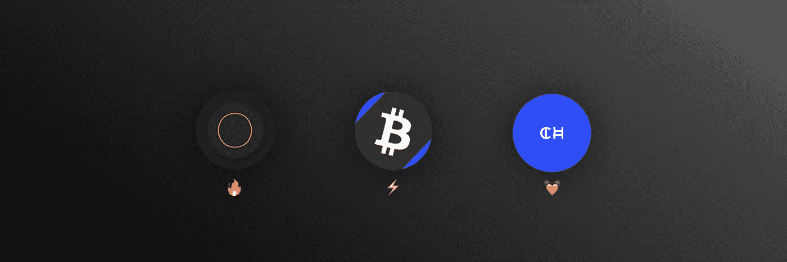
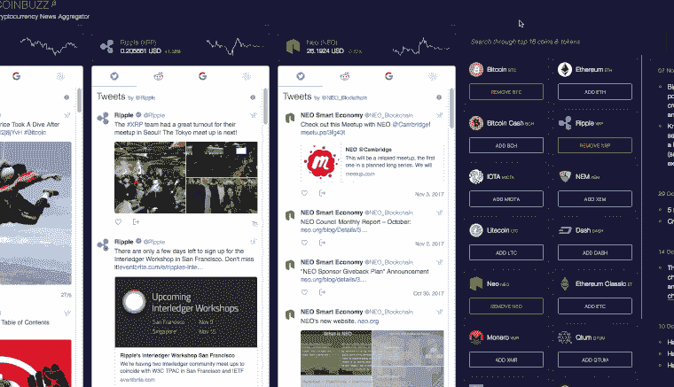
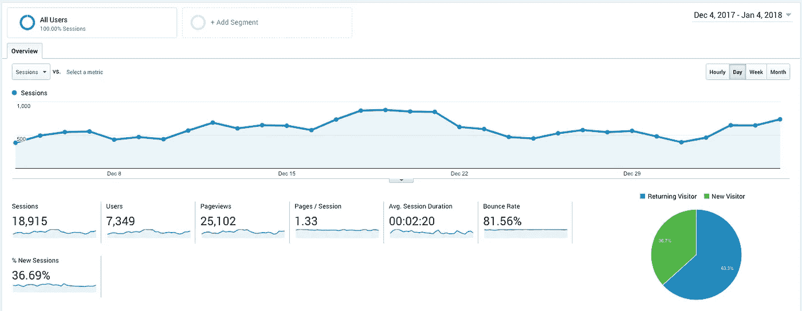
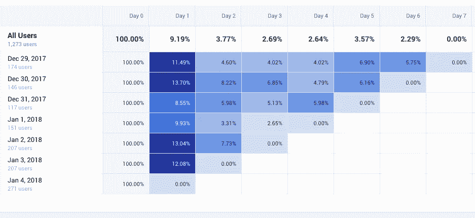
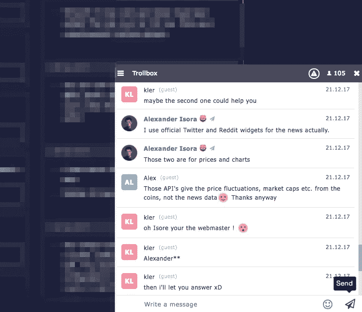
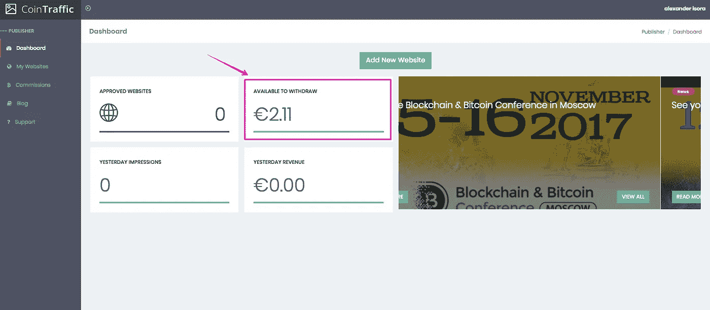
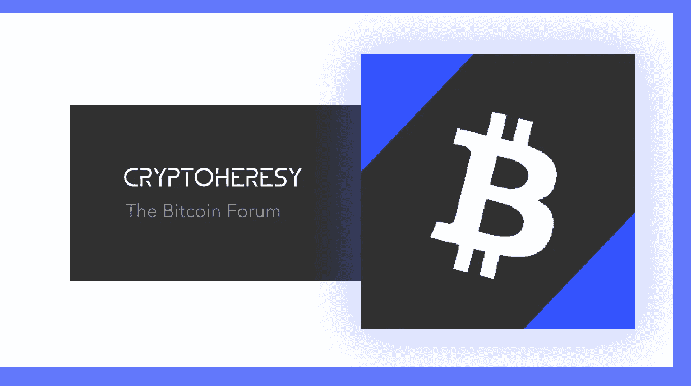
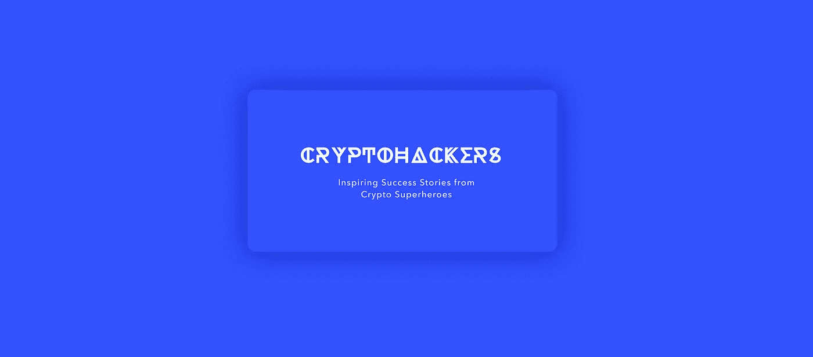
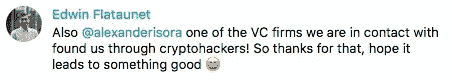

# 隐热:4 个月后🦁

> 原文：<https://medium.com/hackernoon/cryptofever-4-months-later-81d8e224eb22>

## 创建多个加密货币辅助项目的鼓舞人心的进展

The projects I focus on the most: [CoinBuzz](https://coinbuzz.stream), [CryptoHeresy](https://cryptoheresy.com) and [CryptoHackers](https://cryptohackers.party/).

你好陌生人，我叫亚历山大·伊索拉。

我满脑子都是以前从未实现过的很酷的副业项目、概念和想法。每当我开始在我的主要工作之外做一个网络项目时，邪恶的拖延症就控制了我，什么也没发生！
思想进化得非常缓慢。它们已经变成了原型和设计草图，甚至更糟——我头脑中的梦想。

一种非常令人沮丧的感觉！

2017 年的夏天为我打开了[比特币](https://hackernoon.com/tagged/bitcoin)世界，不可逆转地改变了我的想法。

作为一名好奇的网络开发者，我做了一项研究，发现[加密货币](https://hackernoon.com/tagged/cryptocurrency)生态系统缺少*许多*网络项目，许多利基市场实际上是空的。现有的解决方案远非完美，可以进行显著的改进。

这种在空地上战斗的想法让我充满了强烈的信心，相信我的项目会受到关注和需求。幸运的是，这种自信帮助我消除了拖延症🙂

我开始做我最擅长的事情:创建网络应用和网站。开始狂怒。我把这种效应称为“隐热”。

*你可以阅读之前的故事来了解更多关于* [*我隐热的开始*](https://hackernoon.com/surviving-cryptofever-d7579ecce83e)) *。*

在这个故事中，我想分享我的加密货币项目持续开发和改进 4 个月的成果，并揭示一些营销策略。

开始了。🚀️

# 1. [CoinBuzz.stream](https://coinbuzz.stream/) —新闻聚合器

CoinBuzz.stream in action

我决定专注于 3 个主要项目。 [CoinBuzz.stream](https://coinbuzz.stream) 是第一个也是最酷的一个。

这是一个强大的加密货币新闻聚合器，从多个来源收集数据，并以友好的 Trello 格式显示。

一开始，这项服务只覆盖 10 枚顶级硬币。在[产品搜索](https://www.producthunt.com/posts/coinbuzz-stream)上，Ben Tossell 曾称其为“*crypto oooo*的不错的小新闻聚合器”。

今天， [CoinBuzz.stream](https://coinbuzz.stream/) 追踪 110+顶级硬币&代币，4 种法定货币，并允许跟随你选择的硬币(无需注册——我尊重你的隐私)。

> "我花在这个网站上的时间比花在 coinmarketcap 上的时间还多，太棒了！"——**杰拉邦贝拉**

## 用户流量

我喜欢高比例的回头客。很高兴知道人们需要这项服务并每天使用 CoinBuzz.stream。

群组分析证实了这一需求:

## 在匈牙利的成功

有趣的事实:CoinBuzz.stream 曾被匈牙利杂志 Heti Világgazdaság (Hvg)的[报道过](http://hvg.hu/tudomany/20171014_kriptovaluta_arfolyam_hirek_informaciok_bitcoin_ethereum_litecoin_dash_rippple_neo_monero_nem_iota_bitcoin_dash)。Hvg 的月浏览量达到 2000 万——令人印象深刻！

唉，你不是第一个，[连线](https://medium.com/u/ecdcb63e1a76?source=post_page-----81d8e224eb22--------------------------------)😂

## 聊天框

在网站上放置角落聊天框是一个绝妙的主意。

一开始我以为它是用来讨论新闻和谣言的。但事实证明，聊天室给了*方式*更多的好处。

人们更倾向于在聊天室中给出反馈，而不是在一对一的对讲窗口中。这很简单:当你向 200 名在线用户大声说出你的信息时，你确信你的声音肯定会被听到。这是真的。

访问者不断给出有价值的建议，这些建议后来被转化为实现的功能。此外，赞美和温暖的话语会增强信心，给开发人员继续工作的能量。

谢谢大家帮我创建了一个最好的加密货币新闻聚合器！

## CoinTraffic.io 体验

我对 [Cointraffic](https://cointraffic.io) 有过小小的体验。他们为桌面用户提供 1.2 美元的 CPM。对于密码行业来说这是非常低的价格。如果你让他们相信这是你应得的，你可以增加这个数字，但就我个人而言，我不喜欢这种方式😶

My balance in CoinTraffic.io after using the banner for a few days.

他们的横幅一丝不苟，看起来很好，放在网站上并不丢人👍
然而，我最终在 CoinBuzz.stream 上没有任何横幅。

**前往**[**coin buzz . stream**](https://coinbuzz.stream/)**追踪加密货币消息。**

# 2.[密码异端](https://cryptoheresy.com) —经典论坛

[crypto 异端](https://cryptoheresy.com/)是一个经典的互联网论坛。与聊天相比，论坛有一个强大的优势:它可以永久保存内容。将来新成员可以很容易地找到并看到(甚至加入)讨论。

知道了这一点，人们会更谨慎地交谈，并留下深思熟虑的宝贵意见= >平台的整体价值会增加。

目前，有 4 个主要的加密论坛:

*   [BitcoinTalk](https://bitcointalk.org)
*   【Forum.bitocoin.com 
*   [比特币花园论坛](https://bitcoingarden.org/forum/)
*   [CryptocurrencyTalk](https://cryptocurrencytalk.com)

所有这些都有一个伟大的老社区，这里的人们无疑是它的主要财富。

然而，所有这些项目都有两个缺点:

1.  **可怕的结构。**个个笨手笨脚，容易迷路。
2.  **垃圾&毫无价值的评论。**到处都是推荐链接，询问新工具或服务。人们也经常发垃圾邮件链接到他们的不和谐和电报聊天。

我认为这几点很关键，应该引起重视。

1.  **一个结构**不应该是教条的，而是灵活的。如果你作为管理员一直注意到用户在错误的论坛上创建话题，假设这是一个红色警报。一个信号，你在结构上犯了错误，它需要改变！
2.  **垃圾信息**无法消除。然而，这是可控的。我为那些想炫耀自己网站、推荐链接或聊天的人创建了专门的版块。因此，休息论坛将保持干净。我们将和野兔一起奔跑，和猎狗一起打猎。

我的目标是创建一个无垃圾讨论的地方，并创建一个完美的论坛结构供我们使用。

Prove your expertise and earn one of the premium badges.

我将为任何形式的深思熟虑的加密货币会谈建立一个常青和宽敞的家:从新手讨论“BTC 是什么”到开发者谈论编码智能合约💫

crypto 异端将成为全球比特币爱好者最大的、最舒适的和最有价值的社区。

[**加入我们的开始吧！**](https://cryptoheresy.com)

(如果你对自己在加密方面的专业知识有信心，并想成为论坛志愿者之一，请发[电子邮件给我](mailto:alexander@isora.me))。

# 3.[密码黑客](https://cryptohackers.party/) —访谈

CryptoHackers 是加密货币行业领导者发言的地方。我采访最有趣的项目的创始人和著名的影响者，并帮助他们传播他们的理念和想法。

密码黑客的使命是帮助领导者和他们的观众之间建立一种强烈的情感联系。为了实现这一点，我要求每个受访者都要开诚布公。

到目前为止，我很荣幸能采访到这些很酷的人:

*   [詹姆森·洛普](https://medium.com/u/efbe66f7cec8?source=post_page-----81d8e224eb22--------------------------------)(比特戈)→ ️️️ [🛡](https://cryptohackers.party/jameson-lopp/)
*   [乔希·佩蒂](https://medium.com/u/98d0fc26f98e?source=post_page-----81d8e224eb22--------------------------------)(coin index&cryptoaquarium)️→[🐟](https://cryptohackers.party/coindex-crypto-aquarium/)
*   哈瑞·克里希纳·杜利普迪(埃及语)→ ️ [😎](https://cryptohackers.party/acrypto/)
*   奥雷连恩(Gatecoin exchange) → [🔥](https://cryptohackers.party/gatecoin/)

…还有一些更优秀的人。

如果你是创始人，想要接受采访，不要害羞，到这里来:[https://cryptohackers.party/contribute](https://cryptohackers.party/contribute/)。

CryptoHackers has already helped Edwin from [Altpocket](https://cryptohackers.party/altpocket-io/).

## 产品搜索

CryptoHackers 已经成为产品搜索的特色，并得到了许多积极的反馈！

感谢所有支持这个项目的人！密码黑客将会带来更多精彩的故事！

**访问** [**密码黑客**](https://cryptohackers.party) **获取灵感或者** [**提交你的项目**](https://cryptohackers.party/contribute) **。**

# 结论

我希望你，中等陌生人，找到你的内心之火，帮助战胜恐惧和拖延症🙆‍

很明显，拖延症只是存在于我们的头脑中。但是，唉，仅仅认识到这个事实是不够的。有时候你需要一点外界的推动来启动内在改变的过程。

我熬过了我的秘密热，并收到了一份珍贵的礼物:一种强烈的信心，认为我创造的东西会受欢迎，对成千上万的人有价值。

比特币给了你什么礼物？👇