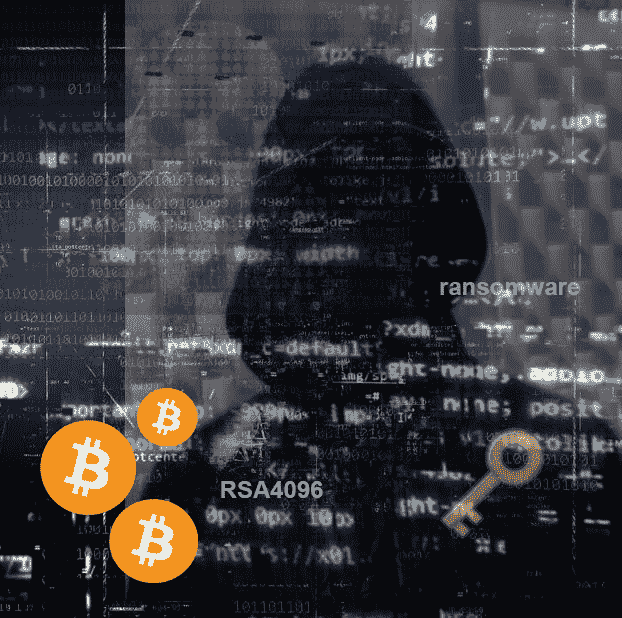
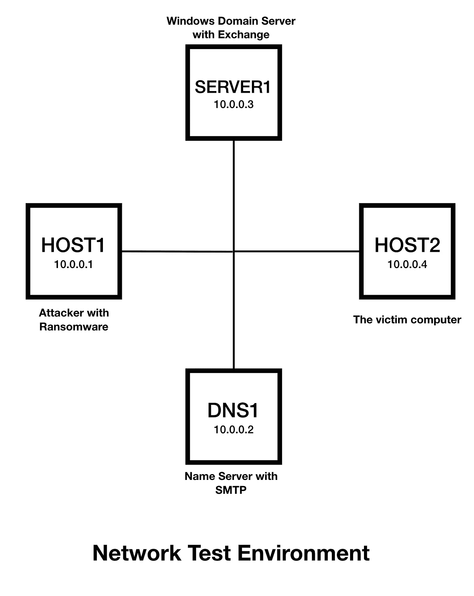
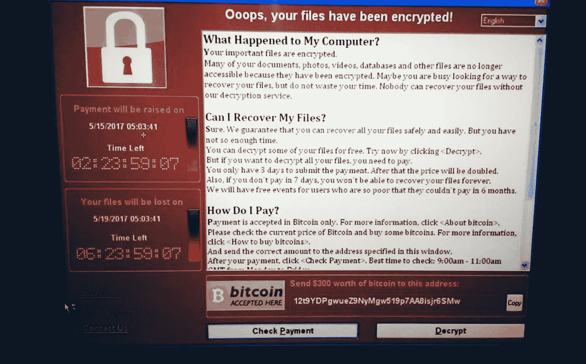
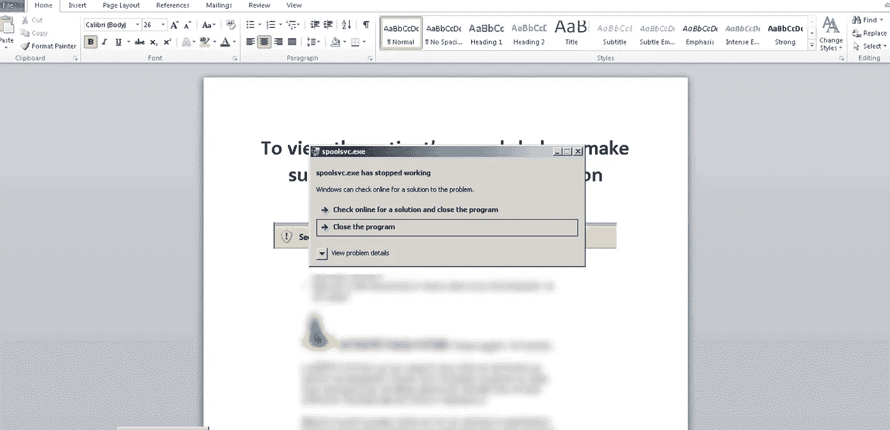
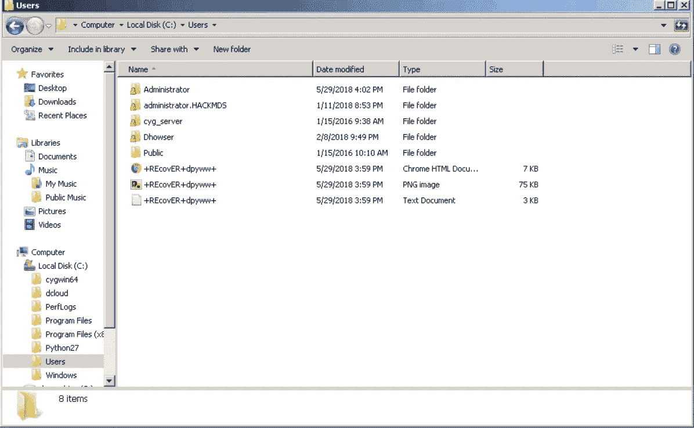
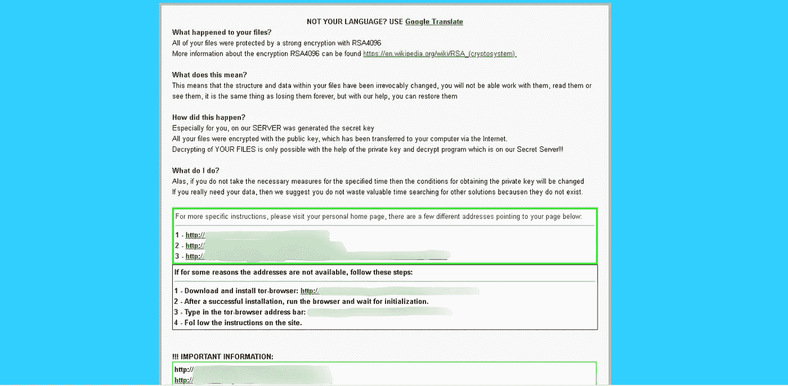
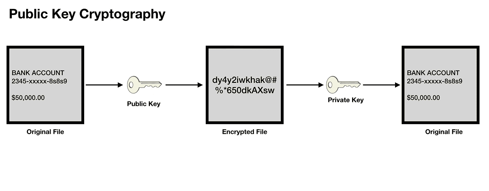
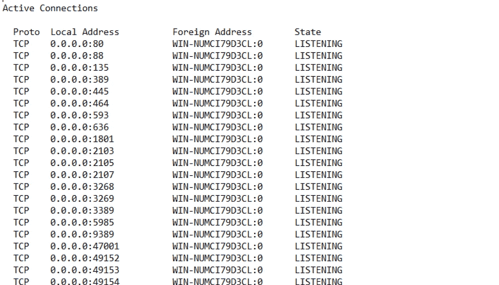

# 密码学+恶意软件=勒索软件

> 原文：<https://medium.com/hackernoon/cryptography-malware-ransomware-36a8ae9eb0b9>

Cybersecurity must deal with Ransomware

当你把密码学和恶意软件结合在一起时，你会遇到一系列非常危险的问题。这是一种计算机病毒，又被称为“勒索软件”。这种类型的病毒是一个名为“隐病毒学”的研究领域的一部分。通过使用称为网络钓鱼的技术，威胁参与者将勒索文件发送给不知情的受害者。如果文件被打开，它将执行病毒负载，这是恶意代码。勒索软件在受感染的计算机或主机上运行加密用户数据的代码。这些数据是用户文件，如文档、电子表格、照片、多媒体文件甚至机密记录。勒索软件的目标是你的个人电脑文件，并应用加密算法，如 RSA，使文件不可访问。访问它们的唯一方法是，如果用户按照编码在加密文件中的指令向威胁者支付赎金。因此，它被称为勒索软件，因为需要一种支付形式来解决问题。

要求的支付也必须是加密货币，大多数情况下是比特币。一种更邪恶的勒索软件有时会给用户一个完成付款的最后期限，否则文件可能会永远丢失。当文件被加密时，唯一可以恢复的方法是使用解密密钥或功能强大的计算机。对于大多数用户来说，后者并不是真正可用的，所以这使得像这样的攻击成为一个非常严重的威胁。该勒索软件还会试图感染受感染主机所连接的网络上的其他计算机，因此它也具有类似蠕虫的属性。它也被称为“隐虫”。已知最早出现的勒索软件之一是 Cryptolocker，它在 2013 年 9 月至 2014 年 5 月下旬之间造成了混乱。勒索软件被归类为一种网络犯罪，当用于勒索金钱时，有时会在“犯罪即服务”下提及。

# **勒索软件的工作原理**

根据 1996 年 IEEE 安全和隐私会议的介绍(亚当·扬和默蒂·杨)，勒索软件是这样工作的:

1.  [攻击者 **→** 受害者]攻击者生成一个密钥对，并将相应的公钥放入恶意软件中。恶意软件被释放。
2.  【受害者 **→** 攻击者】为了实施 cryptoviral 敲诈攻击，恶意软件会生成一个随机的对称密钥，并用它来加密受害者的数据。它使用恶意软件中的公钥来加密对称密钥。这被称为[混合加密](https://en.wikipedia.org/wiki/Hybrid_encryption)，它会产生一个小的不对称密文以及受害者数据的对称密文。它将对称密钥和原始明文数据归零以防止恢复。它向用户发布一条消息，其中包括不对称密文和如何支付赎金。受害者将非对称密文和电子货币发送给攻击者。
3.  【攻击者 **→** 受害者】攻击者收到付款，用攻击者的私钥解密非对称密文，将对称密钥发送给受害者。受害者用所需的对称密钥解密加密数据，从而完成密码病毒学攻击。

# 测试环境

当威胁参与者领先一步时，能够防止这些攻击并找到减轻它们的方法就变得非常重要。现在有许多变种，试图跟上最新的变得越来越难，因为这些可能是零日攻击。为了更好地理解勒索软件的工作原理，我最近在一个实验室做了自己的分析。我将提供演示仅供参考，这不应该在家里尝试，除非你知道你在做什么。这些都有严重的后果，如果你被发现传播真正的计算机病毒，那将受到法律的惩罚。我创建了一个沙箱，它没有连接到生产网络，而是隔离在自己的环境中。然后，我使用了一个经过修改(恶意程度较低)的勒索软件版本进行分析。

我在这个实验室有 4 台计算机，在局域网设置中使用 TCP/IP 协议。运行 Kali Linux 的 HOST1 被配置为针对另一台运行 Windows 7 的名为 HOST2 的计算机执行攻击。我还添加了一个运行 Windows Server 2012 的 AD 域邮件服务器 SERVER1。主机 1 连接到服务器 1，而主机 1 是一台不属于域的独立计算机。最后，还有一个名为 DNS1 的简单 DNS 服务器，它为虚拟环境的网络提供名称服务和 SMTP。

我在所有计算机上使用静态 IP，并创建了静态 DNS 名称条目来简化该网络，在主机 1 和主机 2 之间没有防火墙或路由器。这些计算机运行在它们自己的网络中，没有连接到任何生产环境。我不会对设置进行太多的技术细节，但我在下面提供了一个网络图。还有其他不需要服务器的方式来完成这种设置。你可以直接在电脑上打开被感染的邮件。我设置网络的原因是为了观察勒索软件试图如何传播。(注意:本演示没有应用任何补丁，也没有安装任何防病毒或第三方安全产品)

Simple non-routed test environment. HOST1 will be the attacker and HOST2 is the victim computer.

# **举例:WannaCry**

在开始之前，我先讨论一个名为 wanna cry aka WCry(2017 年 5 月)的勒索软件，以给出一个真实的勒索软件攻击的例子。当这成为新闻时，我想这可能也是许多人第一次听说比特币，即勒索软件所需的加密货币支付。这肯定给比特币带来了一些不好的影响，因为人们会认为这是犯罪分子用来支付的。对于不知道如何使用加密货币的受感染用户来说，这需要一个速成班。用户必须使用比特币进行支付，比特币使用 BTC 令牌。这将要求用户进行数字交易，然后购买一定数量的比特币。然后，他们必须向勒索软件提供的公共地址付款。从那一刻起，这就是一个等待的游戏，因为焦虑的用户在等待接下来会发生什么。最坏的情况是威胁参与者不发送任何解密密钥，因此数据可能会永远丢失。

威胁行为者使用加密货币进行支付的原因是为了建立一些匿名性，尽管从设计上讲，比特币不是为隐私而设计的。它是假名，这意味着当试图兑现时，它仍然可以被追踪到数字交易所的银行账户或用户。问题是，在调查过程中有许多层要揭开，因为比特币可以从一个地址传递到另一个地址，然后转换成另一种加密货币。这使得追踪勒索软件付款变得更加困难。这就是为什么防止勒索软件是非常重要的考虑。

The WannaCry ransomware message.

WannaCry 利用了 Windows 操作系统上的一个已知漏洞。微软针对此漏洞提供了一个名为[MS17–010](https://docs.microsoft.com/en-us/security-updates/securitybulletins/2017/ms17-010)(影响微软服务器消息块 1.0 SMBv1 的微软安全漏洞)的补丁，可以从他们的网站下载。此漏洞利用了服务器消息块(SMB)协议的 Microsoft 实现。如果不应用修补程序，运行 SMB 的 Windows 计算机上开放的入站连接端口 139 和 445 将被感染。NSA 知道这一点，但并没有立即与微软分享信息，直到一个受威胁的 NSA 服务器泄露后，该服务器包含了这一勒索软件的源代码，这是影子经纪人的好意。

终止开关原来是一个未注册的域名，被发现是代码中的一个缺陷，本应释放一个可以造成更多破坏的有效载荷。一位名叫“MalwareTech”的研究人员正在调查此事，他以 10.69 美元的价格注册了这个域名，从而阻止了恶意软件的传播。它是如何开始的还不知道，但它似乎是被故意放置的。一旦恶意软件被植入，当执行时，它就像蠕虫一样通过在未打补丁的 Windows 计算机(从 2017 年 4 月开始)和自 2014 年 4 月以来没有补丁的旧版本 Windows(如 XP 和 Server 2003)上的易受攻击端口传播(Linux、Ubuntu、macOS 和其他 Unix 变种没有受到该漏洞的太大影响)。

恶意软件通过探测同一网络上运行 Windows 的其他计算机进行传播。然后它会像野火一样蔓延，直到系统管理员注意到并立即关闭防火墙，甚至关闭路由器来阻止它的传播。现在，受感染的系统升级到了另一个级别。这是因为 WCry 对硬盘和存储的所有数据进行加密，并要求用比特币支付 300 美元的赎金。现在，这不会更容易缓解用户的焦虑，因为如果在一定时间内没有支付赎金，赎金就会增加。用比特币支付也增加了焦虑程度，因为大多数用户对加密货币了解不多。据网络风险公司 [Cyence](https://www.cyence.net/) 称，估计有 150 个国家的 20 万台电脑被感染，造成的损失从数亿美元到 40 亿美元不等。

# **模拟勒索软件攻击**

我从 HOST1 开始，通过发送包含受感染文件的电子邮件来执行网络钓鱼攻击。受感染的文件将采用 Word 格式(DOCX 文件),并通过 DNS1 中的 SMTP 中继，作为伪造电子邮件的附件从 HOST1 发送到 HOST2 所在域中的 SERVER1 Exchange 电子邮件服务器。为了工作，我没有为这个测试配置任何反中继或反垃圾邮件措施。我希望 HOST2 通过从 Exchange 服务器提取邮件，在其 Outlook 客户端接收电子邮件。所以发送的消息模拟了网络钓鱼攻击。该邮件的主题是:

"紧急:请打开附件以修复您的帐户"

该消息应该来自受害者的医院医疗记录部门，我们可以在消息正文中编写如下内容:

========================================

亲爱的病人:

我们最近检测到您的帐户有奇怪的活动。请打开并阅读附件以解决您的帐户问题。

谢谢，
客户支持

========================================

使消息看起来很紧急，需要用户立即采取行动。威胁者或黑客会希望受害者打开邮件，因此他们会尝试不同的技巧来打开邮件。像这样的邮件通常会被公司的反垃圾邮件过滤器作为垃圾邮件阻止，甚至会因为可疑的附件而被防病毒软件隔离。在这个测试中，所有这些都被禁用，以模拟在安全有时没有正确实现的真实世界中可能发生的情况。在没有任何反病毒软件或其他安全产品保护的情况下，受害者计算机打开邮件并双击 Outlook 中的电子邮件附件。然后，它尝试在 Microsoft Word 中打开附件。

The victim will get an error message trying to open the Word document that executes the ransomware code.

出现错误信息，受害者会认为程序已经崩溃。这里实际发生的是，修改后的勒索软件已经执行代码来释放其有效载荷，这就是乐趣所在。

此时，受害者可能会认为文件附件已损坏，并继续他们的日常工作。在后台，勒索软件开始释放其代码，并开始加密受害者的个人文件，首先是“用户”文件夹，然后是“我的文档”中的内容。原始文件没有改变，但是加密的副本是与原始文件完全不同的文件，原始文件被删除。

Files are encrypted by the ransomware with a “+” sign enclosing a new file name.

受害者将尝试打开他们文件夹中的一个文件，突然发现名字已经改变。所有文件都以相同的名称“+REcovER+dpiyww+”加密，但保留了它们的文件类型，如屏幕截图所示。出于研究的目的，这种命名约定实际上是对原始样式的修改。您还会注意到，加密文件的修改日期是相同的。在这种情况下，您可以看到有 3 个文件名相同的文件在 2018 年 5 月 29 日下午 3:59 被修改。时间确实有所不同，取决于勒索软件枚举和加密文件的速度和数量。修改的日期将是一致的。操作系统和程序文件不加密。当受害者打开文件时，他们将看到以下消息(见下文)。

The ransomware leaves a message for the infected victim. DISCLAIMER: DO NOT ATTEMPT to access the URL from the ransomware message. They are not trusted or verified safe. The links have been blurred for public safety.

如你所见，这个勒索软件是基于“TeslaCrypt”的。无论受害者打开什么文件，它都将被重命名为“+REcovER+dpiyww+”，并且它们都打开相同的消息。在一次真实的攻击中，你可以在电脑的不同文件夹中找到几封勒索信。这些笔记的标题是*恢复【随机符号】。txt* 、 *Howto_Restore_FILES.txt* 或 *How_Recover+(随机符号)。txt* 。它们也可能是 HTML 和 PNG 文件格式。该勒索软件对受害者的文件使用了 RSA 加密算法。恢复文件的方法需要来自生成它的服务器的私钥。服务器还持有从私钥生成的公钥。这实际上保护了机密系统上的数据，但在勒索软件中应用时，这是相当阴险的，因为这是一种勒索形式，迫使受害者付费以恢复他们的数据。受害者将需要私钥来解密文件，如果他们支付赎金，就会提供私钥。

# 分析消息

我们来分析一下从勒索软件中得到的信息。你会在“你的文件怎么了？”下面读到这一行：

“您的所有文件都受到 RSA-4096 高度加密的保护”

这告诉受害者，他们的文件已经使用我们简单讨论过的 RSA 加密算法加密了。4096 是指加密中使用的位数，也称为密钥长度。这总共给出了 1，234 个 2⁴⁰⁹⁶独特数字，因此这是一种非常强大的加密技术。然后你被告知你将不能“与他们一起工作，阅读他们或看到他们”。这就像永远失去他们，所以这确实使受害者不顾一切地试图恢复文件。然后，消息继续通知受害者，有一个服务器有一个秘密密钥，即私钥，可以解密文件。这意味着勒索软件使用了公钥来加密计算机上的文件。现在，为了恢复这些文件，受害者将需要所谓的“秘密密钥”，它实际上是用于解密用公共密钥加密的文件的私人密钥。

Ransomware uses a form of asymmetric Public Key Cryptography by encrypting a victim’s files using a public key generated from another computer. That computer holds the private key which is needed to decrypt the encrypted files, and it can only be easily decrypted using that private key.

RSA 算法包括 4 个步骤:

1.  密钥生成
2.  密钥分发
3.  加密
4.  [通信]解密

威胁参与者有一个保存私钥的密钥生成和分发服务器。问题是服务器的位置很难追踪，因为它可能在另一个国家，除非有线索，否则它的物理位置仍然是一个谜。

然后，这些说明会将链接指向某些网站。我没有这样做，因为我没有互联网连接，但为了做到这一点，有另一个要求。由于黑客想让事情更加隐蔽，他们要求受害者安装带有超链接的 TOR 浏览器以供下载。TOR 浏览器支持更私密的连接，黑客需要这种连接来避免被轻易跟踪。在邮件的底部有更多的说明。

========================================

加密完成后，服务器将在 48 小时内销毁密钥。

**取回私钥，你需要支付 2 个比特币重要的是你只有 48 小时，如果你不支付你所有的文件将被删除！**

**比特币要寄到这个地址:(比特币地址)**

**付款后，请发送电子邮件至:<黑客的电子邮件地址>主题:DECRYPT-ID- < xxxxx >**

========================================

当受害者试图找到解决方案时，很容易被这些信息所吸引。然而，另一种类型的动作可能在后台发生。某些勒索软件试图传播感染，它通过探测连接到网络的其他 Windows 计算机上的端口来实现这一目的。这个变种甚至是原版都没有那种行为。对服务器 1 上入站端口 139 和 445 的监控显示没有攻击迹象，服务器上也没有感染文件。有一个报告说 TeslaCrypt 确实攻击网络驱动器，但是我在这个测试中无法创建一个网络驱动器。因此，最好的做法仍然是尽快从网络中删除并隔离任何受感染的系统。

Port connections on SERVER1(WIN-NUMCI79D3CL) show no established connection from the victim HOST2.

# 勒索软件提示

对抗任何勒索软件的最佳方法是安装防病毒或安全软件。保留操作系统(Windows、Linux、macOS 等)也是最佳实践。)使用供应商提供的最新软件补丁和更新进行了更新。微软允许用户在其系统上运行自动更新。也许最好的方法是预防。

请记住以下内容(来源:[趋势科技](https://trendmicro.com)):

*   避免打开未经核实的电子邮件或点击其中嵌入的链接。
*   使用[3–2–1 规则](http://blog.trendmicro.com/trendlabs-security-intelligence/world-backup-day-the-3-2-1-rule/)备份重要文件——在两个不同的介质上创建 3 个备份副本，其中一个备份位于不同的位置。
*   定期更新软件、程序和应用程序，以防范最新的漏洞。

另一个要考虑的非常重要的事情，也是在生产网络上要做的正确的事情，就是移除运行 Windows XP 的计算机。微软不再支持这些传统系统，建议升级或淘汰这些系统。这是勒索软件传播如此之快的主要原因之一。这些系统已经过时，非常容易受到勒索软件和其他漏洞的攻击，包括零日漏洞。如果因为它们运行的是传统软件而仍然需要它们，那么它们必须尽可能地与互联网隔离，或者通过防火墙设置进行保护，阻止易受攻击的端口进入 Windows XP 系统的子网。即使是微软不再支持的 Windows 7 系统也应该考虑升级。不能保证在较旧的 Windows 系统上能够抵御较新的勒索软件变种。

对于具有企业运营的企业网络，勒索软件的传播可能会产生破坏性的结果。一些银行已经发生了这种情况，例如乌克兰的银行。威胁行为者可能是国家支持的，目的是勒索金钱，或者在某些情况下只是加密文件以防止访问数据(无赎金)。系统管理员必须通过使用 IPS/IDS 加固端口和异常报告监控来防御勒索软件攻击，并在检测到任何异常时发出警报。病毒定义现在可以阻止安装了防病毒产品的勒索软件，还有其他安全解决方案可以在网络层检测勒索软件。其他策略包括分割网络以防止受感染系统的传播。这是一种隔离勒索软件进一步攻击网络的方法。

像模拟攻击中使用的示例这样的网络钓鱼技术可以通过合理的 IT 策略来防止，该策略通知用户不要打开来自不可信来源的无法验证的附件。有时，假冒公司经理的电子邮件地址似乎是合法的。为了进一步防止这些攻击，带有病毒定义的垃圾邮件过滤器可以在电子邮件服务器上实现时阻止邮件。公司的电子邮件服务器也可以配置为使用反中继设置来阻止使用域地址，该设置不允许其他用户使用他们的系统发送电子邮件，除非他们是该组织的一部分。如果消息确实是从更高层发出的，一些公司可能还需要数字签名。每个公司都有不同的政策，这取决于他们的业务规则。

被勒索软件感染与典型的病毒或恶意软件有很大不同。被感染计算机的文件是加密的，受害者会被要求支付赎金以恢复文件。许多人犯了支付赎金的错误，但在某些情况下，他们没有得到解密文件的私钥。这也可能是黑客为了获得加密货币而进行的骗局。在某些情况下，私钥已经被网络安全公司恢复并提供给受感染的计算机。

我不讨论清理受感染系统的方法，但是从 [No More Ransom Project](https://www.nomoreransom.org/en/index.html) 中可以获得很好的信息。谷歌当然是开始寻找反勒索工具和实用程序的最佳位置，但对于更严重的感染，联系专业的计算机服务提供商是解决问题的最佳方式。

参考资料:

1.  勒索软件的定义【https://en.wikipedia.org/wiki/Ransomware T3
2.  隐病毒学
    [https://ieeexplore.ieee.org/document/502676/](https://ieeexplore.ieee.org/document/502676/)
3.  WannaCry 勒索软件 [https://en.wikipedia.org/wiki/WannaCry_ransomware_attack](https://en.wikipedia.org/wiki/WannaCry_ransomware_attack)
4.  勒索软件中使用的加密方法
    [https://resources . infosec institute . com/a-brief-summary-of-encryption-method-Used-in-distributed-Ransomware/# gref](https://resources.infosecinstitute.com/a-brief-summary-of-encryption-method-used-in-widespread-ransomware/#gref)
5.  没有更多的赎金项目
    [https://www.nomoreransom.org/en/index.html](https://www.nomoreransom.org/en/index.html)
6.  犯罪即服务，威胁业务
    [https://www.entrepreneur.com/article/298727](https://www.entrepreneur.com/article/298727)