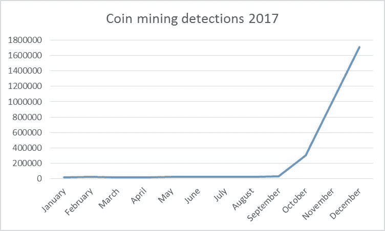
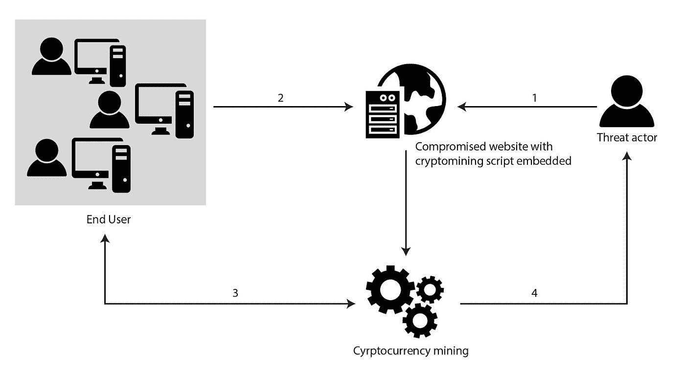
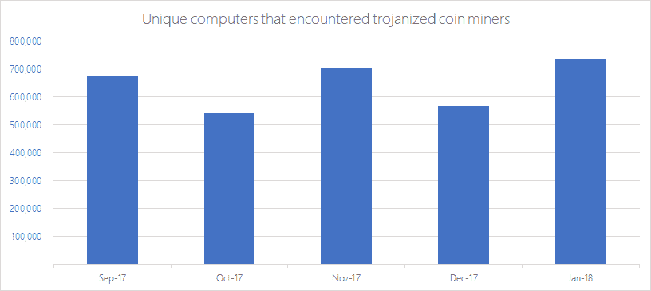

# 密码劫持？

> 原文：<https://medium.com/hackernoon/cryptojacking-59a5b65d61fe>

密码劫持是最近网络安全领域的热门词汇。它自 2017 年 8 月以来一直在雷达上，到 2017 年 12 月以 8500%的惊人速度增长。

这种明显的增长主要是由于加密劫持是从受害者的机器中获取金钱的最容易和最隐蔽的方式。它远比勒索软件谨慎，在勒索软件中，作为攻击的一部分，对受害者文件的访问被阻止或加密，然后攻击者要求赎金来解密文件。在密码劫持的情况下，攻击者只需感染一台机器，它就会在受害者不知情的情况下产生金钱。密码劫持和密码挖掘非常相似，事实上，当密码挖掘未经授权安装或运行在受害者的机器上时，它就会演变为密码劫持。

加密劫持是指在未经用户事先同意或授权的情况下，利用计算机能力来挖掘加密货币。这只能通过恶意活动或其他欺骗手段来实现，例如在浏览器中隐藏未被检测到的代码。

浏览器加密劫持比恶意软件更受网络犯罪分子的欢迎，主要是因为浏览器内加密劫持不需要安装即可运行，这使得它非常容易感染用户机器并进行操作。

它是如何工作的？

第一种方法是欺骗用户打开链接或下载文件(通常通过社会工程)，然后脚本在受害者未知的背景下运行。

另一种方法是浏览器内密码劫持，当特定网站被访问时，它会在浏览器中运行代码。JavaScript 用于运行通常隐藏在广告中的加密劫持脚本，这有助于浏览器内加密劫持的静默特性。

一些攻击者会结合这两种方法，从每个受害者身上获取最大利润。

加密劫持脚本无意损害受感染机器的文件，但是它们会导致机器运行速度变慢。

**步骤:**

1.  威胁者危及网站安全
2.  用户连接到受损网站，加密挖掘脚本执行
3.  用户在不知情的情况下开始代表威胁参与者挖掘加密货币
4.  在成功地向区块链添加新的区块后，威胁行动者收到加密货币硬币的奖励

**亏损**

2018 年 1 月:一个加密挖掘僵尸网络感染了俄罗斯、印度和台湾的计算机。据估计，有 50 万台电脑被感染，被挖掘的加密货币价值 360 万美元。

2018 年 2 月:一家在西班牙运营的网络安全公司成为加密劫持的受害者。WannaMine 是用于感染用于挖掘加密货币“Monero”的机器的脚本。

2018 年 2 月:美国和英国政府的网站被用于浏览器内密码劫持。英国信息专员办公室网站正在运行密码劫持脚本，这也感染了网站的任何访问者。此外，美国法院系统网站有相同的密码劫持脚本。

2018 年 2 月:特斯拉公司(Tesla Inc .)在其亚马逊网络服务软件容器被入侵时受到了密码劫持的影响。据报道，自 2017 年 10 月以来，其他公司和组织也发生过此类攻击。

**检测方法**

第一个迹象是，就其处理能力而言，计算机的运行速度异常缓慢，因此，如果计算机的性能突然下降，这是一个危险信号，可能是密码劫持的一个指标。

另一个指标是由于 CPU 功率的使用导致的系统过热，特别是在移动设备上。还要检查 PC 或大型机的 CPU 高使用率峰值，高 CPU 使用率也可能是密码劫持活动的一个指标。

特定的网络监控工具也有助于公司检测密码劫持，许多人认为这是大型公司的最佳检测方法。

**预防方法**

*   在用户中传播有关加密劫持的意识，使他们对恶意网站和链接更加警惕。
*   使用扩展来阻止与密码劫持脚本相关联的域，并限制未经授权的浏览器扩展获得访问权限或执行进程。
*   使用移动设备管理解决方案来更好地控制用户可以访问或在其设备上拥有的内容。
*   限制提供脚本的网站，以防止浏览加密劫持，这样员工就无法访问它们。

**如何缓解检测到的密码劫持事件**

*   禁用任何检测到的密码劫持网站/脚本的网络权限，因为密码挖掘需要发送数据作为工作证明，并隔离和扫描这些恶意文件的机器并删除它们。
*   如果机器性能下降，则确定使用最多内存的进程，并验证它是否与挖掘进程有任何联系。如果有，停止它并把进程列入黑名单，这样它就不能再被执行了。
*   常见的反恶意软件检测方法以及声誉良好的互联网安全产品可以有效地抵御密码劫持脚本文件，并结合反恶意软件方法来查找和删除恶意文件。

**结论**

密码劫持是一种新的赚钱计划，已经接管了威胁景观。用户必须知道这种新的有利可图的方法，这样他们就可以防止任何密码劫持发生在他们的机器上。此外，用户应遵循上述建议，以防止密码劫持事件。

有些人会争辩说，密码劫持是一种没有受害者的犯罪，这一论点的基础是，密码劫持没有窃取目标的机密信息，也没有损害他们的文件，这一论点是站不住脚的；加密采矿可以伤害你的机器，在某些情况下，据报道，有物理损坏的一些受害者的机器，由于高使用率的处理能力。除此之外，该设备将表现不佳，并且剩余处理能力明显较低。