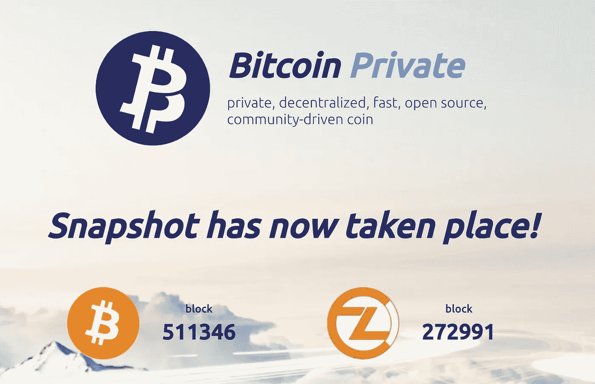
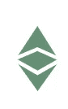

# 导航 ZCL 和 BTCP 邮政叉等空投即将到来！中国交换量又回来了！+ 2 ICOs！

> 原文：<https://medium.com/hackernoon/cryptoking-report-for-march-2nd-2018-a-special-on-navigating-zcl-and-btcp-post-fork-etc-airdrop-953d1c37ffd2>

3 月 2 日的加密报告:导航 ZCL 和 BTCP 邮政叉等空投即将到来！中国交换量又回来了！3 个 ico

本周发生了一些非常重要的事件！BTC 再次突破 11，000 美元大关，表明它肯定已经摆脱了 12 月的低迷。我完全期待它能在三月中旬的主要会议(旧金山的象征性峰会)前表现良好。这得益于不断到来的中国春节。在中国新年庆祝活动的前一周，中国几乎完全关闭。自 CNY 以来，大部分硬币的交易量和价格都在持续上涨。

**比特币私人(BTCP)和 ZClassic (ZCL)**

ZCL 有了他们的叉子，不出所料，ZCL 的价格暴跌。我个人认为，ZCL 是一个长期持有，因为它现在已经产生了 ZCash 和 BTCP。我确实认为 ZCL 会再次分叉，谁知道呢，我可能会在团队中处理它；).如果您在受支持的交易所持有 ZCL，您将在未来的某个时间收到 BTCP。如果您将 ZCL 或 BTC 放在桌面钱包(Electrum、Coinomi 或 Jaxx)中，您将能够在接下来的几天内使用您的私人密钥访问您的 BTCP 来获得您的 BTCP。

一旦 mainnet 上线，将有一个可下载的 BTCP 钱包，允许您输入您的私人密钥，并获得您的 BTCP！这是一个非常激动人心的时刻，请确保继续支持将这个分叉放在一起的社区。开发团队异常活跃，计划未来的活动来支持 BTCP 网络和社区。当输入您的私人密钥以获得您的 BTCP 时，要非常小心，您使用的是正确的网站，这样您就不会被钓鱼！祝贺团队取得了巨大的成功！

**以太坊经典(ETC)**

ETC 的空投高度为 5，500，000 米，目前他们在 5，480，000 米以上，每个街区大约需要 10 秒钟。这次空投将在未来几天内进行。确保您将 ETC 放在支持的交易所或钱包中(否则您将错过 CLO)。ETC 最后创造了 ETH(是的，我们都知道的以太坊)，如果 CLO 是 ETH 的 1%,这将支付超过 ETC 价值 25%的股息。这不是一个值得错过的空投！在接下来的 72 小时内抓取 ETC 并转移到支持的钱包中！

**中国交易所:**

过去几个月，中国的交易所真的增长了。在过去的六个月里，中国让 FUD 流出了所有的孔，但这并没有阻止中国交易所蔓延到全球所有地区的迅猛增长。Huobi 已经将他们的重点转移到国外市场，同时也专注于分散的交易所。币安位于 mainland China 之外，地理位置优越。OKEx 与 Huobi 类似，在全球交易量排名前五位。关于[中国外汇增长的完整概要和一篇精彩文章可在此处阅读](https://btcmanager.com/chinese-exchanges-thriving-post-chinese-fud-2018-year-dogor-bull/?utm_source=onesignal&utm_medium=push)。

[新来的币安**？加入这里！**](https://www.binance.com/?ref=15316928)

**三月 ICOs、2 更来啦！)**

好消息是，当我从我的列表中去掉一个 ICO 时，这意味着代币销售完成了，绝大多数人都达到了他们的上限！Debitum 成功地完成了代币销售，替换代币需要长时间的研究。哪个行业尚未进入区块链但会真正受益于区块链的透明度和好处(除了每一家公司！)?车辆。

[**VINCHAIN**](https://vinchain.io/?aid=5a91d4c3c10da)**(接近软帽，软帽时奖金减少)**

了解哪家工厂、哪辆车是哪一年制造的，以及每一位开过这辆车的车主，是一项非常有价值的功能。通过区块链上的车辆识别号，可以在公共账本上追溯汽车的历史。英里将无法被操纵，业主将无法欺骗。

在软封顶之前，VINCHAIN 目前每季度提供 24，000 瓶葡萄酒。硬性上限是 23,250 ETH(约 2000 万美元)。VIN 从非常微薄的奖金开始，并且在达到软上限后只会继续减少。

[**在此购买长春花**](/hackernoon/Purchase Vinchain’s ICO here: https:/vinchain.io?aid=5a91d4c3c10da)

[**KYC 法律**](https://bookbuild.kyc.legal/?ref=23734776ffa2051a83eb8bc1) **(仅剩 12%奖金)**

超过其硬上限的一半，它有能力解决区块链和 ICOs 的最大问题之一。《了解你的客户》(可怕的 KYC 表格)。如果你最近完成了一个 ICO，你就会知道我所说的形式。KYC 称他们的概念是区块链“个人身份的通用替代品”。他们的 ICO 很快就要结束了，比最终的 ICO 价格低 12%。

[**在这里买 KYC**](https://bookbuild.kyc.legal/?ref=23734776ffa2051a83eb8bc1)

我感谢我所有的忠实追随者！我正在努力建立一个社交媒体形象，希望你也能在 Instagram 和 Twitter 上关注我！在被发布到留言板前几个小时，关注**insta gram:JaketheCryptoKing**和 **Twitter: JbtheCryptoKing** 获取提示和策略。而现在上**不和谐:**[**https://discord.gg/qTjQp8W**](https://discord.gg/qTjQp8W)(入群直接找我)。